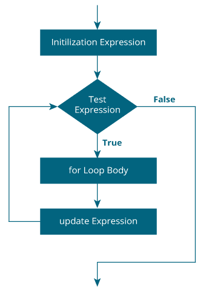

# C for 循环

> 原文： [https://www.programiz.com/c-programming/c-for-loop](https://www.programiz.com/c-programming/c-for-loop)

#### 在本教程中，您将借助示例学习在 C 编程中创建 for 循环。

在编程中，循环用于重复代码块，直到满足指定条件为止。

C 编程具有三种循环类型：

1.  for 循环
2.  while 循环
3.  做... while 循环

在本教程中，我们将学习`for`循环。 在下一个教程中，我们将学习`while`和`do...while`循环。

* * *

## 用于循环

`for`循环的语法为：

```c
for (initializationStatement; testExpression; updateStatement)
{
    // statements inside the body of loop
}
```

* * *

### for 循环如何工作？

*   初始化语句仅执行一次。
*   然后，求值测试表达式。 如果测试表达式的计算结果为 false，则`for`循环终止。
*   但是，如果测试表达式的计算结果为 true，则将执行`for`循环体内的语句，并更新更新表达式。
*   再次求值测试表达式。

这个过程一直进行到测试表达式为假。 当测试表达式为 false 时，循环终止。

要了解有关测试表达式的更多信息（将测试表达式求值为真和假时），请查看[关系式](/c-programming/c-operators#relational "C Relational operators")和[逻辑运算符](/c-programming/c-operators#logical "C logical operators")。

* * *

### for 循环流程图



* * *

### 示例 1：for 循环

```c
// Print numbers from 1 to 10
#include <stdio.h>

int main() {
  int i;

  for (i = 1; i < 11; ++i)
  {
    printf("%d ", i);
  }
  return 0;
} 
```

**输出**

```c
1 2 3 4 5 6 7 8 9 10
```

1.  `i`初始化为 1。
2.  计算测试表达式`i < 11`。 由于 1 小于 11 为真，因此执行`for`循环的主体。 这将在屏幕上打印 **1** （`i`的值）。
3.  执行更新语句`++i`。 现在，`i`的值为 2。再次，将测试表达式求值为 true，并执行 for 循环的主体。 这将在屏幕上打印 **2** （`i`的值）。
4.  同样，执行更新语句`++i`，并求值测试表达式`i < 11`。 这个过程一直进行到`i`变为 11 为止。
5.  当`i`变为 11 时，`i < 11`将为假，并且`for`循环终止。

* * *

### 示例 2：for 循环

```c
// Program to calculate the sum of first n natural numbers
// Positive integers 1,2,3...n are known as natural numbers

#include <stdio.h>
int main()
{
    int num, count, sum = 0;

    printf("Enter a positive integer: ");
    scanf("%d", &num);

    // for loop terminates when num is less than count
    for(count = 1; count <= num; ++count)
    {
        sum += count;
    }

    printf("Sum = %d", sum);

    return 0;
}
```

**Output**

```c
Enter a positive integer: 10
Sum = 55
```

用户输入的值存储在变量`num`中。 假设用户输入了 10。

`计数`初始化为 1，并求值测试表达式。 由于测试表达式`count<=num`（小于或等于 10 的 1）为真，因此将执行`for`循环的主体，并且`和`的值将等于 1。

然后，执行更新语句`++count`，计数将等于 2。再次，对测试表达式进行求值。 由于 2 也小于 10，因此将测试表达式求值为 true，并执行`for`循环的主体。 现在，`和`等于 3。

继续进行此过程，并计算总和，直到`计数`达到 11。

当`计数`为 11 时，测试表达式的计算结果为 0（假），并且循环终止。

然后，`sum`的值打印在屏幕上。

* * *

在下一个教程中，我们将学习`while`循环和`do...while`循环。