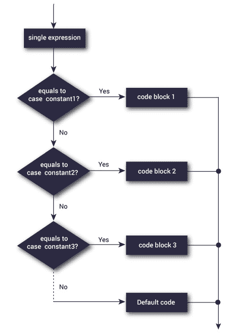

# C 开关声明

> 原文： [https://www.programiz.com/c-programming/c-switch-case-statement](https://www.programiz.com/c-programming/c-switch-case-statement)

#### 在本教程中，您将通过一个示例学习在 C 编程中创建 switch 语句。

switch 语句使我们可以执行许多替代方案中的一个代码块。

您可以使用`if...else..if`梯形图执行相同的操作。 但是，`switch`语句的语法更容易读写。

* * *

## switch ... case 的语法

```c
switch (expression)
​{
    case constant1:
      // statements
      break;

    case constant2:
      // statements
      break;
    .
    .
    .
    default:
      // default statements
}
```

**switch 语句如何工作？**

对`表达式`进行一次评估，并与每个`案例`标签的值进行比较。

*   如果匹配，则执行匹配标签后的相应语句。 例如，如果表达式的值等于 `constant2` ，则执行`case constant2:`之后的语句，直到遇到`break`。
*   如果不匹配，则执行默认语句。

如果我们不使用`break`，则执行匹配标签之后的所有语句。

顺便说一下，`switch`语句内的`default`子句是可选的。

* * *

### 切换语句流程图



* * *

### 示例：简单计算器

```c
// Program to create a simple calculator
#include <stdio.h>

int main() {
    char operator;
    double n1, n2;

    printf("Enter an operator (+, -, *, /): ");
    scanf("%c", &operator);
    printf("Enter two operands: ");
    scanf("%lf %lf",&n1, &n2);

    switch(operator)
    {
        case '+':
            printf("%.1lf + %.1lf = %.1lf",n1, n2, n1+n2);
            break;

        case '-':
            printf("%.1lf - %.1lf = %.1lf",n1, n2, n1-n2);
            break;

        case '*':
            printf("%.1lf * %.1lf = %.1lf",n1, n2, n1*n2);
            break;

        case '/':
            printf("%.1lf / %.1lf = %.1lf",n1, n2, n1/n2);
            break;

        // operator doesn't match any case constant +, -, *, /
        default:
            printf("Error! operator is not correct");
    }

    return 0;
} 
```

**输出**

```c
Enter an operator (+, -, *,): -
Enter two operands: 32.5
12.4
32.5 - 12.4 = 20.1
```

用户输入的`-`运算符存储在`运算符`变量中。 并且，两个操作数 `32.5` 和 `12.4` 分别存储在变量 `n1` 和 `n2` 中。

由于`运算符`为`-`，因此程序控制跳至

```c
printf("%.1lf - %.1lf = %.1lf", n1, n2, n1-n2);
```

最后， [break 语句](/c-programming/c-break-continue-statement)终止`switch`语句。