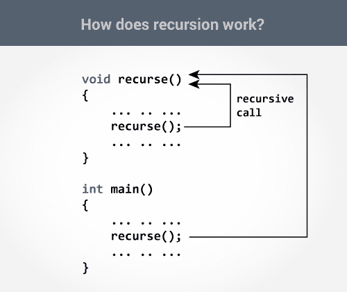
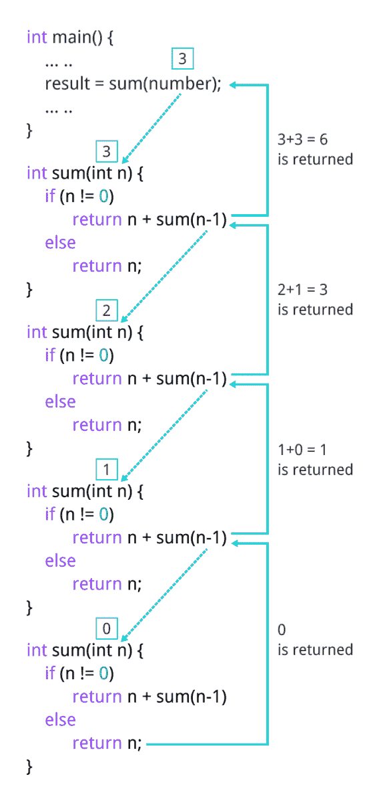

# C 递归

> 原文： [https://www.programiz.com/c-programming/c-recursion](https://www.programiz.com/c-programming/c-recursion)

#### 在本教程中，您将借助示例学习使用 C 编程编写递归函数。

调用自身的函数称为递归函数。 并且，这种技术称为递归。

* * *

### 递归如何工作？

```c
void recurse()
{
    ... .. ...
    recurse();
    ... .. ...
}

int main()
{
    ... .. ...
    recurse();
    ... .. ...
}
```



递归继续进行，直到满足某些条件以防止递归为止。

为了防止无限递归，可以在一个分支进行递归调用而另一分支不递归的情况下使用[`if ... else`语句](/c-programming/c-if-else-statement "C if...else")（或类似方法）。

* * *

### 示例：使用递归的自然数之和

```c
#include <stdio.h>
int sum(int n);

int main() {
    int number, result;

    printf("Enter a positive integer: ");
    scanf("%d", &number);

    result = sum(number);

    printf("sum = %d", result);
    return 0;
}

int sum(int n) {
    if (n != 0)
        // sum() function calls itself
        return n + sum(n-1); 
    else
        return n;
} 
```

**输出**

```c
Enter a positive integer:3
sum = 6
```

* * *

最初，从`main()`函数调用`sum()`，并以`数字`作为参数传递。

假设`sum()`内的`n`的值最初为 3。 在下一个函数调用期间，将 2 传递给`sum()`函数。 该过程一直持续到`n`等于 0。

当`n`等于 0 时，`if`条件失败，并且执行`else`部分，最终将整数和返回给`main()`函数。



* * *

### 递归的优缺点

递归使程序优雅。 但是，如果性能至关重要，请使用循环代替，因为递归通常要慢得多。

话虽如此，递归是一个重要的概念。 它经常用于[数据结构和算法](/dsa "Data Structure and Algorithms")中。 例如，在诸如树遍历的问题中通常使用递归。