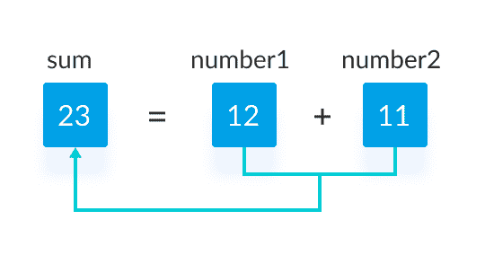

# C 程序添加两个整数

> 原文： [https://www.programiz.com/c-programming/examples/add-numbers](https://www.programiz.com/c-programming/examples/add-numbers)

#### 在此示例中，要求用户输入两个整数。 然后，计算这两个整数的总和并显示在屏幕上。

要理解此示例，您应该了解以下 [C 编程](/c-programming "C tutorial")主题：

*   [C 数据类型](/c-programming/c-data-types)
*   [C 变量，常量和字面值](/c-programming/c-variables-constants)
*   [C 输入输出（I/O）](/c-programming/c-input-output)
*   [C 编程运算符](/c-programming/c-operators)

* * *

## 程序添加两个整数

```c
#include <stdio.h>
int main() {    

    int number1, number2, sum;

    printf("Enter two integers: ");
    scanf("%d %d", &number1, &number2);

    // calculating sum
    sum = number1 + number2;      

    printf("%d + %d = %d", number1, number2, sum);
    return 0;
} 
```

**输出**

```c
Enter two integers: 12
11
12 + 11 = 23 
```

* * *

在此程序中，要求用户输入两个整数。 这两个整数分别存储在变量`number1`和`number2`中。

```c
printf("Enter two integers: ");
scanf("%d %d", &number1, &number2); 
```

然后，使用`+`运算符将这两个数字相加，结果存储在`和`变量中。

```c
sum = number1 + number2; 
```



最后，`printf()`函数用于显示数字总和。

```c
printf("%d + %d = %d", number1, number2, sum); 
```