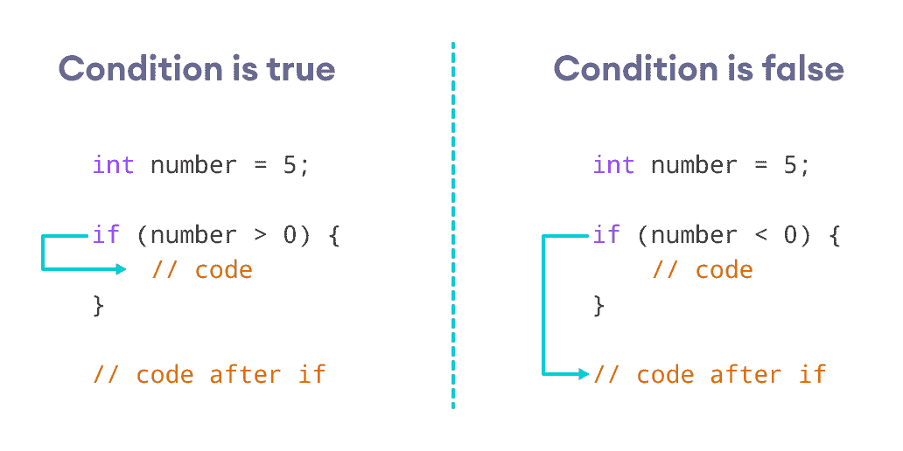
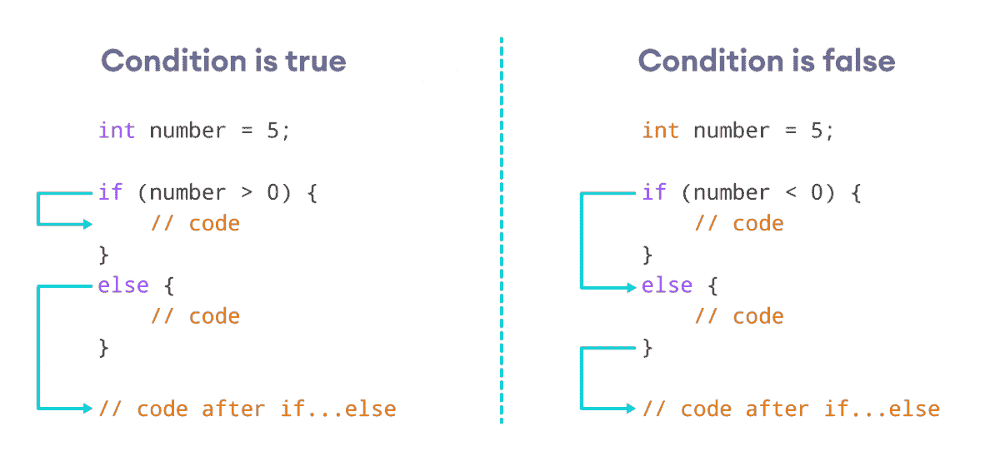
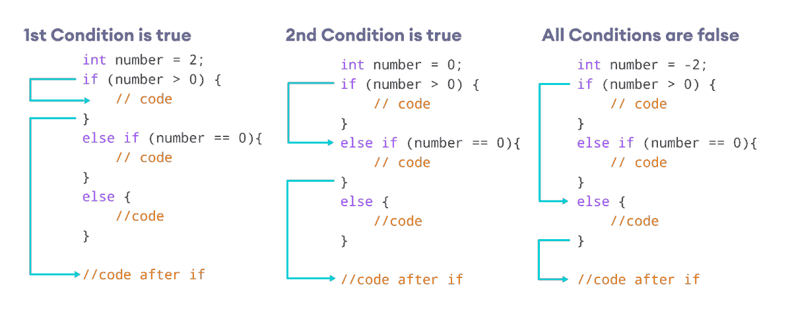

# C++  if，if ... else 和嵌套 if ... else

> 原文： [https://www.programiz.com/cpp-programming/if-else](https://www.programiz.com/cpp-programming/if-else)

#### 在本文中，您将学习使用不同形式的 if..else 语句在 C++ 程序中创建决策语句。

在计算机编程中，仅当满足特定条件时，才使用`if`语句运行块代码。

例如，根据学生获得的分数分配成绩（A，B，C）。

*   如果百分比高于 **90** ，则将等级**分配为 A**
*   如果百分比高于 **75** ，则指定等级 **B**
*   如果百分比高于 **65** ，请指定等级 **C**

* * *

C++ 中有`if...else`语句的三种形式。

1.  `if`声明
2.  `if...else`声明
3.  `if...else if...else`声明

* * *

## C++  if 语句

`if`语句的语法为：

```cpp
if (condition) {
   // body of if statement
}
```

`if`语句评估括号`( )`内的`condition`。

*   如果`condition`评估为`true`，则将执行`if`主体内部的代码。
*   如果`condition`评估为`false`，则将跳过`if`主体内部的代码。

**注意：** `{ }`内的代码是`if`语句的主体。



Working of C++ if Statement


* * *

### 示例 1：C++  if 语句

```cpp
// Program to print positive number entered by the user
// If the user enters a negative number, it is skipped

#include <iostream>
using namespace std;

int main() {
    int number;

    cout << "Enter an integer: ";
    cin >> number;

    // checks if the number is positive
    if (number > 0) {
        cout << "You entered a positive integer: " << number << endl;
    }
    cout << "This statement is always executed.";
    return 0;
}
```

**输出 1**

```cpp
Enter an integer: 5
You entered a positive number: 5
This statement is always executed.
```

当用户输入`5`时，条件`number > 0`被评估为`true`，并且执行了`if`主体内部的语句。

**输出 2**

```cpp
Enter a number: -5
This statement is always executed.
```

当用户输入`-5`时，条件`number > 0`被评估为`false`，并且`if`主体内部的语句不被执行。

* * *

## C++ 如果...否则

`if`语句可以具有可选的`else`子句。 其语法为：

```cpp
if (condition) {
    // block of code if condition is true
}
else {
    // block of code if condition is false
}
```

`if..else`语句评估括号内的`condition`。



Working of C++ if...else


如果`condition`评估为`true`，

*   `if`体内的代码被执行
*   `else`正文中的代码从执行中跳过

如果`condition`评估为`false`，

*   `else`体内的代码被执行
*   `if`正文中的代码从执行中跳过

* * *

### 示例 2：C++  if ... else 语句

```cpp
// Program to check whether an integer is positive or negative
// This program considers 0 as a positive number

#include <iostream>
using namespace std;

int main() {
     int number;

    cout << "Enter an integer: ";
    cin >> number;
    if (number >= 0) {
        cout << "You entered a positive integer: " << number << endl;
    }
    else {
        cout << "You entered a negative integer: " << number << endl;
    }
    cout << "This line is always printed.";
    return 0;
}
```

**Output 1**

```cpp
Enter an integer: 4
You entered a positive integer: 4.
This line is always printed.
```

在上面的程序中，我们具有条件`number >= 0`。 如果我们输入大于或等于 `0` 的数字，则条件为`true`。

在这里，我们输入 `4` 。 因此，条件为`true`。 因此，将执行`if`主体内部的语句。

**Output 2**

```cpp
Enter an integer: -4
You entered a negative integer: -4.
This line is always printed.
```

在这里，我们输入 `-4` 。 因此，条件为`false`。 因此，将执行`else`主体内部的语句。

* * *

## C++  if ... else ... else if 语句

`if...else`语句用于在两个替代方案之间执行代码块。 但是，如果需要在两个以上的选择之间进行选择，则可以使用`if...else if...else`语句。

`if...else if...else`语句的语法为：

```cpp
if (condition1) {
    // code block 1
} else if (condition2){
    // code block 2
} else {
    // code block 3
}
```

这里，

*   如果`condition1`评估为`true`，则执行`code block 1`。
*   如果`condition1`评估为`false`，则评估`condition2`。
*   如果`condition2`为`true`，则执行`code block 2`。
*   如果`condition2`为`false`，则执行`code block 3`。



How if...else if...else Statement Works


**注意：**可以有多个`else if`语句，但只有一个`if`和`else`语句。

* * *

### 示例 3：C++  if ... else ... else if

```cpp
// Program to check whether an integer is positive, negative or zero

#include <iostream>
using namespace std;

int main() {
     int number;

    cout << "Enter an integer: ";
    cin >> number;
    if (number > 0) {
        cout << "You entered a positive integer: " << number << endl;
    } 
else if (number < 0) {
      cout << "You entered a negative integer: " << number << endl;
     } 
else {
        cout << "You entered 0." << endl;
    }
     cout << "This line is always printed.";
    return 0;
}
```

**Output 1**

```cpp
Enter an integer: 1
You entered a positive integer: 1.
This line is always printed.
```

**Output 2**

```cpp
Enter an integer: -2
You entered a negative integer: -2.
This line is always printed.
```

**输出 3**

```cpp
Enter an integer: 0
You entered 0.
This line is always printed.
```

在此程序中，我们从用户那里获取一个号码。 然后，我们使用`if...else if...else`梯形图检查数字是正数，负数还是零。

如果该数字大于`0`，则执行`if`块内的代码。 如果该数字小于`0`，则执行`else if`块内的代码。 否则，将执行`else`块中的代码。

* * *

## C++ 如果...则嵌套

有时，我们需要在另一个`if`语句内使用`if`语句。 这称为嵌套`if`语句。

将其视为`if`语句的多层。 有第一个外部`if`语句，在内部是另一个内部`if`语句。 其语法为：

```cpp
// outer if statement
if (condition1) {
    // statements

    // inner if statement
    if (condition2) {
        // statements
    }
}
```

**注意：**

*   我们可以根据需要将`else`和`else if`语句添加到内部`if`语句中。
*   内部`if`语句也可以插入外部`else`或`else if`语句（如果存在）中。
*   我们可以嵌套`if`语句的多层。

* * *

### 示例 4：C++ 嵌套 if

```cpp
// C++ program to find if an integer is even or odd or neither (0)
// using nested if statements

#include <iostream>
using namespace std;

int main() {
    int num;

    cout << "Enter an integer: ";  
     cin >> num;    

    // outer if condition
    if (num != 0) {

        // inner if condition
        if ((num % 2) == 0) {
            cout << "The number is even." << endl;
        }
         // inner else condition
        else {
            cout << "The number is odd." << endl;
        }  
    }
    // outer else condition
    else {
        cout << "The number is 0 and it is neither even nor odd." << endl;
    }
    cout << "This line is always printed." << endl;
}
```

**Output 1**

```cpp
Enter an integer: 34
The number is even.
This line is always printed.
```

**Output 2**

```cpp
Enter an integer: 35
The number is odd.
This line is always printed.
```

**Output 3**

```cpp
Enter an integer: 0
The number is 0 and it is neither even nor odd.
This line is always printed.
```

在上面的示例中，

*   我们将一个整数作为用户的输入，并将其存储在变量 `num` 中。
*   然后，我们使用`if...else`语句检查 num 是否不等于`0`。
    *   如果为`true`，则执行**内部** `if...else`语句。
    *   如果为`false`，则执行**外部** `else`条件内部的代码，其显示“该数字为 0，且既不是偶数也不是奇数”。
*   **内部** `if...else`语句检查输入的数字是否可被`2`整除。
    *   如果为`true`，那么我们将打印一条声明该数字为偶数的语句。
    *   如果`false`，我们打印该数字为奇数。

请注意，`0`也可被`2`整除，但实际上不是偶数。 这就是为什么我们首先要确保在`if`外部条件下输入的数字不是`0`。

**注意：**如您所见，嵌套的`if...else`使您的逻辑变得复杂。 如果可能，您应始终避免嵌套`if...else`。

* * *

## if ... else 的主体，只有一个语句

如果`if...else`的主体只有一个语句，则可以在程序中省略`{ }`。 例如，您可以替换

```cpp
int number = 5;

    if (number > 0) {
        cout << "The number is positive." << endl;
    }
    else {
        cout << "The number is negative." << endl;
    }
```

与

```cpp
int number = 5;

    if (number > 0)
        cout << "The number is positive." << endl;
    else
        cout << "The number is negative." << endl;
```

两个程序的输出将相同。

**注意：**尽管如果`if...else`的主体只有一个语句，则不必使用`{ }`，但使用`{ }`可使代码更具可读性。

* * *

## 有关决策的更多信息

在某些情况下，**三元运算符**可以替换`if...else`语句。 要了解更多信息，请访问 [C++ 三元运算符](/cpp-programming//cpp-programming/ternary-operator/)。

如果我们需要根据给定的测试条件在多个选项之间进行选择，则可以使用`switch`语句。 要了解更多信息，请访问 [C++ 开关](/cpp-programming/switch/)。

* * *

查看以下示例以了解更多信息：

[用于检查数字是偶数还是奇数的 C++ 程序](/cpp-programming/examples/even-odd)

[用于检查字符是元音还是辅音的 C++ 程序。](/cpp-programming/examples/vowel-consonant)

[C++ 程序查找三个数字中最大的数字](/cpp-programming/examples/largest-number-among-three)