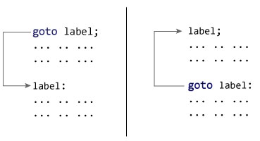

# C++ `goto`语句

> 原文： [https://www.programiz.com/cpp-programming/goto](https://www.programiz.com/cpp-programming/goto)

#### 在本文中，您将了解`goto`语句，它如何工作以及为什么应该避免它。

在 C++ 编程中，`goto`语句用于通过将控制权转移到程序的其他部分来更改程序执行的正常顺序。

## `goto`语句的语法

```cpp
goto label;
... .. ...
... .. ...
... .. ...
label: 
statement;
... .. ...
```

在以上语法中，`label`是标识符。 遇到`goto label;`时，程序控制跳至`label:`并执行其下面的代码。



### 示例：`goto`语句

```cpp
// This program calculates the average of numbers entered by user.
// If user enters negative number, it ignores the number and 
// calculates the average of number entered before it.

# include <iostream>
using namespace std;

int main()
{
    float num, average, sum = 0.0;
    int i, n;

    cout << "Maximum number of inputs: ";
    cin >> n;

    for(i = 1; i <= n; ++i)
    {
        cout << "Enter n" << i << ": ";
        cin >> num;

        if(num < 0.0)
        {
           // Control of the program move to jump:
            goto jump;
        } 
        sum += num;
    }

jump:
    average = sum / (i - 1);
    cout << "\nAverage = " << average;
    return 0;
}
```

**输出**

```cpp
Maximum number of inputs: 10
Enter n1: 2.3
Enter n2: 5.6
Enter n3: -5.6

Average = 3.95
```

您可以在不使用`goto`语句的情况下编写任何 C++ 程序，通常认为最好不要使用它们。

### 避免使用`goto`语句的原因

`goto`语句可以跳转到程序的任何部分，但会使程序的逻辑变得复杂而混乱。

在现代编程中，`goto`语句被认为是有害的构造和不良的编程习惯。

在大多数 C++ 程序中，可以使用[`break`和`continue`语句](/cpp-programming/break-continue "C++ break and continue statement")替换`goto`语句。