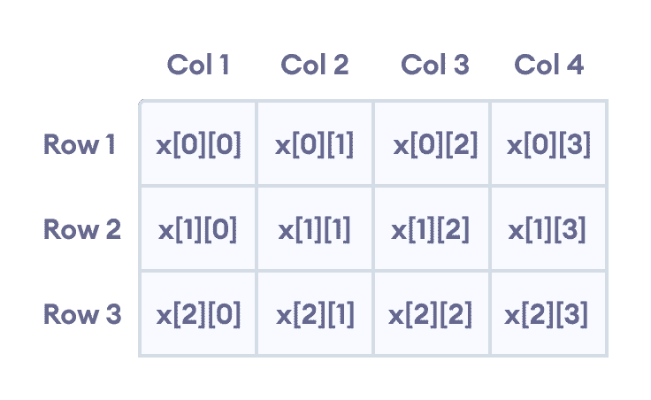
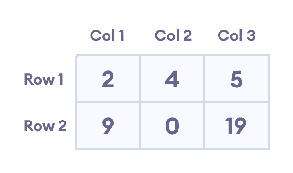

# C++ 多维数组

> 原文： [https://www.programiz.com/cpp-programming/multidimensional-arrays](https://www.programiz.com/cpp-programming/multidimensional-arrays)

#### 在本教程中，我们将学习 C++ 中的多维数组。 更具体地说，如何在我们的程序中声明它们，访问它们以及有效使用它们。

在 C++ 中，我们可以创建数组的[数组](/cpp-programming/arrays)，称为多维数组。 例如：

```cpp
int x[3][4];
```

在此，`×`是二维数组。 它最多可容纳 12 个元​​素。

我们可以将此数组视为具有 3 行的表，每行有 4 列，如下所示。



C++ 编程中的二维数组中的元素


三维数组也以类似的方式工作。 例如：

```cpp
float x[2][4][3];
```

此数组`x`最多可容纳 24 个元素。

我们可以简单地乘以数组的维数来找出数组中元素的总数：

```cpp
2 x 4 x 3 = 24
```

* * *

## 多维数组初始化

像普通数组一样，我们可以通过多种方式初始化多维数组。

### 1.二维数组的初始化

```cpp
int test[2][3] = {2, 4, 5, 9, 0, 19};
```

上述方法不是优选的。 下面给出了使用相同的数组元素初始化此数组的更好方法：

```cpp
int  test[2][3] = { {2, 4, 5}, {9, 0, 19}};
```

该数组有 2 行 3 列，这就是为什么我们有两行元素，每行 3 个元素的原因。



在 C++ 中初始化二维数组


* * *

### 2.三维数组的初始化

```cpp
int test[2][3][4] = {3, 4, 2, 3, 0, -3, 9, 11, 23, 12, 23, 
                 2, 13, 4, 56, 3, 5, 9, 3, 5, 5, 1, 4, 9};
```

这不是初始化三维数组的好方法。 初始化此数组的更好方法是：

```cpp
int test[2][3][4] = { 
                     { {3, 4, 2, 3}, {0, -3, 9, 11}, {23, 12, 23, 2} },
                     { {13, 4, 56, 3}, {5, 9, 3, 5}, {3, 1, 4, 9} }
                 };
```

* * *

## 示例 1：二维数组

```cpp
// C++ Program to display all elements
// of an initialised two dimensional array

#include <iostream>
using namespace std;

int main() {
    int test[3][2] = {{2, -5},
                      {4, 0},
                      {9, 1}};

    // use of nested for loop
    // access rows of the array
    for (int i = 0; i < 3; ++i) {

        // access columns of the array
        for (int j = 0; j < 2; ++j) {
            cout << "test[" << i << "][" << j << "] = " << test[i][j] << endl;
        }
    }

    return 0;
}
```

**输出**

```cpp
test[0][0] = 2
test[0][1] = -5
test[1][0] = 4
test[1][1] = 0
test[2][0] = 9
test[2][1] = 1
```

在上面的示例中，我们初始化了一个名为`test`的二维`int`数组，该数组具有 3 个“行”和 2 个“列”。

在这里，我们使用了嵌套的`for`循环来显示数组元素。

*   从`i = 0`到`i = 2`的外部循环访问数组的行
*   从`j = 0`到`j = 1`的内部循环访问数组的列

最后，我们在每次迭代中打印数组元素。

* * *

## 示例 2：获取二维数组的输入

```cpp
#include <iostream>
using namespace std;

int main() {
    int numbers[2][3];

    cout << "Enter 6 numbers: " << endl;

    // Storing user input in the array
    for (int i = 0; i < 2; ++i) {
        for (int j = 0; j < 3; ++j) {
            cin >> numbers[i][j];
        }
    }

    cout << "The numbers are: " << endl;

    //  Printing array elements
    for (int i = 0; i < 2; ++i) {
        for (int j = 0; j < 3; ++j) {
            cout << "numbers[" << i << "][" << j << "]: " << numbers[i][j] << endl;
        }
    }

    return 0;
}
```

**输出**

```cpp
Enter 6 numbers: 
1
2
3
4
5
6
The numbers are:
numbers[0][0]: 1
numbers[0][1]: 2
numbers[0][2]: 3
numbers[1][0]: 4
numbers[1][1]: 5
numbers[1][2]: 6
```

在这里，我们使用了嵌套的`for`循环来获取 2d 数组的输入。 取完所有输入后，我们使用了另一个嵌套的`for`循环来打印数组成员。

* * *

## 示例 3：三维数组

```cpp
// C++ Program to Store value entered by user in
// three dimensional array and display it.

#include <iostream>
using namespace std;

int main() {
    // This array can store upto 12 elements (2x3x2)
    int test[2][3][2] = {
                            {
                                {1, 2},
                                {3, 4},
                                {5, 6}
                            }, 
                            {
                                {7, 8}, 
                                {9, 10}, 
                                {11, 12}
                            }
                        };

    // Displaying the values with proper index.
    for (int i = 0; i < 2; ++i) {
        for (int j = 0; j < 3; ++j) {
            for (int k = 0; k < 2; ++k) {
                cout << "test[" << i << "][" << j << "][" << k << "] = " << test[i][j][k] << endl;
            }
        }
    }

    return 0;
}
```

**输出**

```cpp
test[0][0][0] = 1
test[0][0][1] = 2
test[0][1][0] = 3
test[0][1][1] = 4
test[0][2][0] = 5
test[0][2][1] = 6
test[1][0][0] = 7
test[1][0][1] = 8
test[1][1][0] = 9
test[1][1][1] = 10
test[1][2][0] = 11
test[1][2][1] = 12
```

3d 数组的打印元素的基本概念类似于 2d 数组的打印概念。

但是，由于我们要处理 3 个维度，因此我们使用了一个嵌套的`for`循环，其中包含 3 个循环，而不仅仅是 2 个循环。

如我们所见，数组的复杂度随尺寸的增加而呈指数增长。