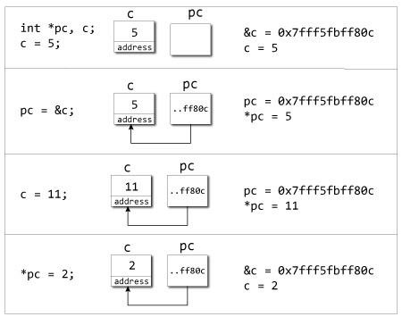

# C++ 指针

> 原文： [https://www.programiz.com/cpp-programming/pointers](https://www.programiz.com/cpp-programming/pointers)

#### 在本文中，您将学习有关指针的所有知识。 您将学习如何将值存储在计算机中以及如何使用指针访问它们。

指针是 C++ 的强大功能，可将其与其他编程语言（如 Java 和 Python）区分开来。

指针在 C++ 程序中用于访问内存和操纵地址。

* * *

## C++ 地址

要了解指针，您首先应该知道如何在计算机上存储数据。

您在程序中创建的每个变量都会在计算机的内存中分配一个位置。 变量存储的值实际上存储在分配的位置。

要知道数据存储在哪里，C++ 有一个`&`运算符。 `&`（引用）运算符为您提供变量占用的地址。

如果`var`是变量，则`&var`给出该变量的地址。

## 示例 1：C++ 中的地址

```cpp
#include <iostream>
using namespace std;

int main()
{
    int var1 = 3;
    int var2 = 24;
    int var3 = 17;
    cout << &var1 << endl;
    cout << &var2 << endl;
    cout << &var3 << endl;
}
```

**输出**

```cpp
0x7fff5fbff8ac
0x7fff5fbff8a8
0x7fff5fbff8a4 
```

**注意**：您的系统上可能不会得到相同的结果。

开头的 **0x** 表示地址为十六进制格式。

请注意，第一个地址与第二个地址相差 4 个字节，第二个地址与第三个地址相差 4 个字节。

这是因为在 64 位系统中，整数（类型为`int`的变量）的大小为 4 个字节。

* * *

## 指针变量

C++ 使您可以直接操作计算机内存中的数据。 您可以根据需要分配和取消分配内存中的任何空间。 这是使用指针变量完成的。

指针变量是指向另一个变量所指向的内存中特定地址的变量。

* * *

### 如何声明一个指针？

```cpp
int *p;
      OR,
int* p;

```

上面的语句定义了一个指针变量`p`。 它保存内存地址

星号是解引用运算符，表示**指向** **的指针。**

此处，指针`p`是指向`int`的**指针，即它指向内存地址中的整数值。**

* * *

### 引用运算符（`&`）和引用运算符（`*`）

如上所述的引用运算符（`&`）给出变量的地址。

要获取存储在内存地址中的值，我们使用解引用运算符（`*`）。

**例如**：如果`num`变量存储在内存地址`0x123`中，并且它包含值 **5** 。

**引用（`&`）**运算符给出值`0x123`，而**取消引用（`*`）**运算符给出值 **5** 。

**注意**：在 C++ 指针的声明中使用的（`*`）符号不是取消引用指针。 只是创建指针的类似符号。

* * *

## 示例 2：C++ 指针

**C++ 程序演示指针的工作。**

```cpp
#include <iostream>
using namespace std;
int main() {
    int *pc, c;

    c = 5;
    cout << "Address of c (&c): " << &c << endl;
    cout << "Value of c (c): " << c << endl << endl;

    pc = &c;    // Pointer pc holds the memory address of variable c
    cout << "Address that pointer pc holds (pc): "<< pc << endl;
    cout << "Content of the address pointer pc holds (*pc): " << *pc << endl << endl;

    c = 11;    // The content inside memory address &c is changed from 5 to 11.
    cout << "Address pointer pc holds (pc): " << pc << endl;
    cout << "Content of the address pointer pc holds (*pc): " << *pc << endl << endl;

    *pc = 2; 
    cout << "Address of c (&c): " << &c << endl;
    cout << "Value of c (c): " << c << endl << endl;

    return 0;
}
```

**输出**

```cpp
Address of c (&c): 0x7fff5fbff80c
Value of c (c): 5

Address that pointer pc holds (pc): 0x7fff5fbff80c
Content of the address pointer pc holds (*pc): 5

Address pointer pc holds (pc): 0x7fff5fbff80c
Content of the address pointer pc holds (*pc): 11

Address of c (&c): 0x7fff5fbff80c
Value of c (c): 2
```



**程序**的说明

*   当`c = 5;`时，值 5 存储在变量`c` - `0x7fff5fbff8c`的地址中。
*   当`pc = &c;`指针`pc`保持`c` - `0x7fff5fbff8c`的地址时，表达式（取消引用运算符）`*pc`输出该地址中存储的值，5。
*   当由于地址指针`pc`保持为`c = 11;`与`c` - `0x7fff5fbff8c`相同时，执行表达式`*pc`时也会反映`c`的值变化 输出 11。
*   当`*pc = 2;`时，它将更改`pc` - `0x7fff5fbff8c`存储的地址的内容。 这从 11 更改为 2。因此，当我们打印`c`的值时，该值也为 2。

## 使用指针时的常见错误

假设您希望指针`pc`指向`c`的地址。 然后，

```cpp
int c, *pc;
pc=c;  /* Wrong! pc is address whereas, c is not an address. */
*pc=&c; /* Wrong! *pc is the value pointed by address whereas, %amp;c is an address. */
pc=&c; /* Correct! pc is an address and, %amp;pc is also an address. */
*pc=c; /* Correct! *pc is the value pointed by address and, c is also a value. */
```

在这两种情况下，指针`pc`均不指向`c`的地址。

* * *

您还应该查看这些与指针相关的教程：

*   [如何使用`void`指针使用通用数据类型指针？](/cpp-programming/pointer-void "C++ pointer to void")
*   [如何使用指针表示数组？](/cpp-programming/pointers-arrays "Represent array using pointer")
*   [如何在函数中使用指针？](/cpp-programming/pointers-function "Use pointers with functions")
*   [如何在结构中使用指针？](/cpp-programming/structure-pointer "C++ use pointers with structures")