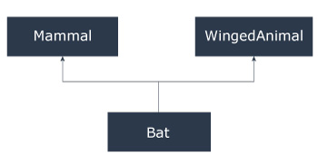

# C++ 多重，多层和层次继承

> 原文： [https://www.programiz.com/cpp-programming/multilevel-multiple-inheritance](https://www.programiz.com/cpp-programming/multilevel-multiple-inheritance)

#### 在本文中，您将学习 C++ 编程中的不同继承模型：带有示例的多继承，多层次和分层继承。

[继承](/cpp-programming/inheritance "C++ Inheritance")是面向对象编程语言的核心功能之一。 它允许软件开发人员从现有的类派生一个新的类。 派生类继承基类（现有类）的功能。

C++ 编程中有多种继承模型。

* * *

## C++ 多层次继承

在 C++ 编程中，不仅可以从基类派生一个类，还可以从派生类派生一个类。 这种继承形式称为多级继承。

```cpp
class A
{ 
... .. ... 
};
class B: public A
{
... .. ...
};
class C: public B
{
... ... ...
};
```

这里，类别`B`从基础类别`A`派生，类别`C`从派生类别`B`派生。

* * *

## 示例 1：C++ 多级继承

```cpp
#include <iostream>
using namespace std;

class A
{
    public:
      void display()
      {
          cout<<"Base class content.";
      }
};

class B : public A
{

};

class C : public B
{

};

int main()
{
    C obj;
    obj.display();
    return 0;
}
```

**输出**

```cpp
Base class content.
```

在此程序中，类别`C`源自类别`B`（源自基础类别`A`）。

在`main()`函数中定义了`C`类的`obj`对象。

当调用`display()`函数时，将执行`类`中的`display()`。 这是因为在`C`类和`B`类中没有`display()`函数。

编译器首先在类`C`中寻找`display()`函数。 由于该函数不存在，因此将在`B`类中查找该函数（因为`C`源自`B`）。

该函数在`B`类中也不存在，因此编译器在`A`类中查找它（因为`B`是从`A`派生的）。

如果`C`中存在`display()`函数，则编译器将覆盖类`A`的`display()`（因为[成员函数将覆盖](/cpp-programming/function-overriding "Function Overriding in C++ programming")）。

* * *

## C++ 多重继承

在 C++ 编程中，一个类可以从多个父类派生。 例如：类`Bat`源自基类`Mammal`和`WingedAnimal`。 这很有意义，因为蝙蝠既是哺乳动物又是有翅膀的动物。



## 示例 2：C++ 编程中的多重继承

```cpp
#include <iostream>
using namespace std;

class Mammal {
  public:
    Mammal()
    {
      cout << "Mammals can give direct birth." << endl;
    }
};

class WingedAnimal {
  public:
    WingedAnimal()
    {
      cout << "Winged animal can flap." << endl;
    }
};

class Bat: public Mammal, public WingedAnimal {

};

int main()
{
    Bat b1;
    return 0;
} 
```

**Output**

```cpp
Mammals can give direct birth.
Winged animal can flap.
```

* * *

### 多重继承中的歧义

多重继承最明显的问题发生在函数覆盖期间。

假设两个基类具有相同的功能，但在派生类中未覆盖该功能。

如果尝试使用派生类的对象调用该函数，则编译器将显示错误。 这是因为编译器不知道要调用哪个函数。 例如，

```cpp
class base1
{
  public:
     void someFunction( )
     { .... ... .... }  
};
class base2
{
    void someFunction( )
     { .... ... .... } 
};
class derived : public base1, public base2
{

};

int main()
{
    derived obj;

    obj.someFunction() // Error!  
} 

```

可以通过使用范围解析函数指定将`base1`或`base2`分类的函数来解决此问题。

```cpp
int main()
{
    obj.base1::someFunction( );  // Function of base1 class is called
    obj.base2::someFunction();   // Function of base2 class is called.
}
```

* * *

## C++ 层次继承

如果从基类继承多个类，则称为[层次继承](http://www.programtopia.net/cplusplus/docs/hierarchical-inheritance-c-programming?utm_source=programiz&utm_campaign=display)。 在分层继承中，子类中共有的所有功能都包括在基类中。

例如：物理，化学，生物学均来自科学课。

* * *

### 层次继承的语法

```cpp
class base_class {
     ... .. ...
}

class first_derived_class: public base_class {
     ... .. ...
}

class second_derived_class: public base_class {
     ... .. ...
}

class third_derived_class: public base_class {
     ... .. ...
}
```