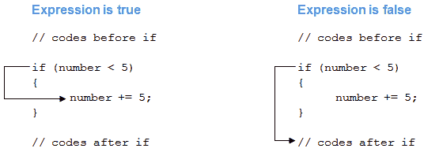
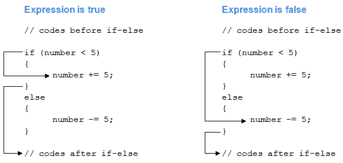

# C# `if`，`if...else`，`if...else if`和嵌套`if`语句

> 原文： [https://www.programiz.com/csharp-programming/if-else-statement](https://www.programiz.com/csharp-programming/if-else-statement)

#### 在本文中，我们将学习如何使用 C# 中的`if`，`if...else`，`if...else if`语句来控制程序执行的流程。

在编程中不可避免地要测试条件。 我们经常会遇到需要测试条件（无论是`true`还是`false`）来控制程序流程的情况。 这些条件可能会受到用户输入，时间因素，程序正在运行的当前环境等的影响。

在本文中，我们将学习在 C# 中使用`if`语句测试条件。

* * *

## C# `if`语句

如果给定条件为真，则 C# `if-then`语句将执行代码块。 C# 中`if-then`语句的语法为：

```cs
if (boolean-expression)
{
	// statements executed if boolean-expression is true
}

```

*   布尔表达式将返回`true`或`false`。
*   如果`boolean-expression`返回`true`，则将执行`if`（在`{...}`内部）内的语句。
*   如果`boolean-expression`返回`false`，则`if`体内的语句将被忽略。

例如，

```cs
if (number < 5)
{
	number += 5;
}

```

在此示例中，语句

```cs
number += 5;
```

仅当`number`的值小于 5 时才会执行。

还记得[`+=`运算符](/csharp-programming/operators#compound-assignment "C# operators")吗？

### `if`语句如何工作？



### 示例 1：C# `if`语句

```cs
using System;

namespace Conditional
{
	class IfStatement
	{
		public static void Main(string[] args)
		{
			int number = 2;
			if (number < 5)
			{
				Console.WriteLine("{0} is less than 5", number);
			}

			Console.WriteLine("This statement is always executed.");
		}
	}
} 
```

当我们运行程序时，输出将是：

```cs
2 is less than 5
This statement is always executed.
```

`number`的值被初始化为 2。因此，表达式`number < 5`的计算结果为`true`。 因此，将执行`if`块内部的代码。`if`语句之后的代码将始终与表达式无关地执行。

现在，将`number`的值更改为大于`5`的值，例如`10`。 当我们运行程序时，输出将是：

```cs
This statement is always executed.
```

表达式`number < 5`将返回`false`，因此`if`块中的代码将不会执行。

* * *

## C# `if...else`语句

C# 中的`if`语句可能具有可选的`else`语句。 如果将表达式计算为`false`，则将执行`else`语句中的代码块。

C# 中`if...else`语句的语法为：

```cs
if (boolean-expression)
{
	// statements executed if boolean-expression is true
}
else
{
	// statements executed if boolean-expression is false
}

```

For example,

```cs
if (number < 5)
{
	number += 5;
}
else
{
	number -= 5;
}

```

In this example, the statement

```cs
number += 5;
```

仅当`number`的值小于`5`时，才会执行。

该声明

```cs
number -= 5;
```

如果`number`的值大于或等于`5`，将执行。

### `if...else`语句如何工作？



### 示例 2：C# `if...else`语句

```cs
using System;

namespace Conditional
{
	class IfElseStatement
	{
		public static void Main(string[] args)
		{
			int number = 12;

			if (number < 5)
			{
				Console.WriteLine("{0} is less than 5", number);
			}
			else
			{
				Console.WriteLine("{0} is greater than or equal to 5", number);
			}

			Console.WriteLine("This statement is always executed.");
		}
	}
} 
```

When we run the program, the output will be:

```cs
12 is greater than or equal to 5
This statement is always executed.
```

在此，将`number`的值初始化为`12`。 因此，表达式`number < 5`被求值为`false`。 因此，执行`else`块内的代码。`if..else`语句之后的代码将始终与表达式无关地执行。

现在，将`number`的值更改为小于`5`的值，例如`2`。 当我们运行程序时，输出将是：

```cs
2 is less than 5
This statement is always executed.
```

表达式`number < 5`将返回`true`，因此`if`块中的代码将被执行。

[C# 中的三元运算符](/csharp-programming/ternary-operator "C# Ternary operator")为`if...else`语句提供 C# 的快捷方式。

* * *

## C# `if...else if`语句

当我们只有一个条件要测试时，`if-then`和`if-then-else`语句可以正常工作。 但是，如果我们有多个条件来测试和执行众多代码块之一，该怎么办？

对于这种情况，我们可以在 C# 中使用`if..else if`语句。`if...else if`语句的语法是：

```cs
if (boolean-expression-1)
{
	// statements executed if boolean-expression-1 is true
}
else if (boolean-expression-2)
{
	// statements executed if boolean-expression-2 is true
}
else if (boolean-expression-3)
{
	// statements executed if boolean-expression-3 is true
}
.
.
.
else
{
	// statements executed if all above expressions are false
}

```

`if...else if`语句从**顶部**到**底部**执行。 一旦测试表达式为`true`，就会执行`if`（或者`else if`）块内部的代码。 然后控件跳出`if...else if`块。

如果表达式都不是`true`，则执行`else`块内的代码。

或者，我们可以在这种情况下使用[`switch`语句](/csharp-programming/switch-statement "C# switch statement")。

### 示例 3：C# `if...else if`语句

```cs
using System;

namespace Conditional
{
	class IfElseIfStatement
	{
		public static void Main(string[] args)
		{
			int number = 12;

			if (number < 5)
			{
				Console.WriteLine("{0} is less than 5", number);
			}
			else if (number > 5)
			{
				Console.WriteLine("{0} is greater than 5", number);
			}
			else
			{
				Console.WriteLine("{0} is equal to 5");
			}
		}
	}
} 
```

When we run the program, the output will be:

```cs
12 is greater than 5
```

`number`的值初始化为`12`。 第一个测试表达式`number < 5`是`false`，因此控件将移至`else if`块。 测试表达式`number > 5`为`true`，因此将执行`else`内部的代码块。

同样，我们可以更改`number`的值以更改执行流程。

* * *

## 嵌套`if...else`语句

一个`if...else`语句可以存在于另一个`if...else`语句中。 此类语句称为嵌套`if...else`语句。

嵌套`if...else`语句的一般结构为：

```cs
if (boolean-expression)
{
	if (nested-expression-1)
	{
		// code to be executed
	}
	else
	{
	// code to be executed
	}
}
else
{
	if (nested-expression-2)
	{
		// code to be executed
	}
	else
	{
		// code to be executed
	}
}

```

当我们必须先测试一个条件然后再测试另一个条件时，通常会使用嵌套的`if`语句。 在嵌套的`if`语句中，如果外部`if`语句返回`true`，它将进入主体以检查内部`if`语句。

### 示例 4：嵌套`if...else`语句

以下程序使用嵌套的`if...else`语句计算 3 个数字中的最大数字。

```cs
using System;

namespace Conditional
{
	class Nested
	{
		public static void Main(string[] args)
		{
			int first = 7, second = -23, third = 13;
			if (first > second)
			{
				if (firstNumber > third)
				{
					Console.WriteLine("{0} is the largest", first);
				}
				else
				{
					Console.WriteLine("{0} is the largest", third);
				}
			}
			else
			{
				if (second > third)
				{
					Console.WriteLine("{0} is the largest", second);
				}
				else
				{
					Console.WriteLine("{0} is the largest", third);
				}
			}
		}
	}
} 
```

When we run the program, the output will be:

```cs
13 is the largest
```