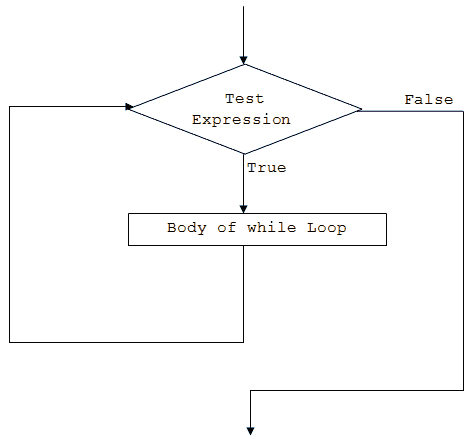
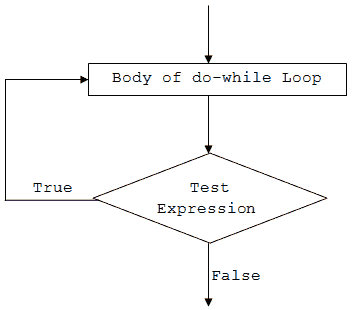

# C# while 和 do ... while 循环

> 原文： [https://www.programiz.com/csharp-programming/do-while-loop](https://www.programiz.com/csharp-programming/do-while-loop)

#### 在本文中，我们将学习 C# 中的 while 和 do ... while 循环，如何使用它们以及它们之间的区别。

在编程中，通常需要执行特定次数的语句块。 一种可能的解决方案是键入所需次数的语句。 但是，重复的次数可能事先未知（在编译时），或者可能不够大（例如 10000）。

此类问题的最佳解决方案是循环。 循环在编程中用于重复执行某个语句块，直到满足某些条件为止。

在本文中，我们将学习在 C# 中使用 while 循环。

* * *

## C# while 循环

**while** 关键字用于在 C# 中创建 while 循环。 while 循环的语法为：

```cs
while (test-expression)
{
	// body of while
}

```

### while 循环如何工作？

1.  C# while 循环由`test-expression`组成。
2.  如果将`test-expression`求值为`true`，
    1.  while 循环内的语句被执行。
    2.  执行后，再次求值`test-expression`。
3.  如果将`test-expression`求值为`false`，则 while 循环终止。

### while 循环流程图



### 示例 1：while 循环

```cs
using System;

namespace Loop
{
	class WhileLoop
	{
		public static void Main(string[] args)
		{
			int i=1;
			while (i<=5)
			{
				Console.WriteLine("C# For Loop: Iteration {0}", i);
				i++;
			}
		}
	}
} 
```

当我们运行程序时，输出将是：

```cs
C# For Loop: Iteration 1
C# For Loop: Iteration 2
C# For Loop: Iteration 3
C# For Loop: Iteration 4
C# For Loop: Iteration 5
```

最初 `i` 的值为 1。

当程序到达 while 循环语句时，

*   测试表达式`i <=5`被求值。 由于 `i` 为 1 而`1 <= 5`为`true`，因此它执行 while 循环的主体。 在此，以迭代 1 将行打印在屏幕上， `i` 的值增加 1 变为 2。
*   现在，再次求值测试表达式（`i <=5`）。 同样，这次表达式也返回`true`（2 < = 5），因此该行将打印在屏幕上，并且 `i` 的值现在增加到 3。
*   这样下去，while 循环将执行到 `i` 变为 6。此时，test-expression 的计算结果为`false`，因此循环终止。

### 示例 2：while 循环，用于计算前 5 个自然数的和

```cs
using System;

namespace Loop
{
	class WhileLoop
	{
		public static void Main(string[] args)
		{
			int i=1, sum=0;

			while (i<=5)
			{
				sum += i;
				i++;
			}
			Console.WriteLine("Sum = {0}", sum);
		}
	}
} 
```

When we run the program, the output will be:

```cs
Sum = 15
```

该程序计算前 5 个自然数的总和。

*   最初，`和`的值初始化为 0。
*   在每次迭代中，`和`的值更新为`sum+i`， `i` 的值增加 1。
*   当 `i` 的值达到 6 时，测试表达式`i<=5`将返回 false，并且循环终止。

让我们看看给定程序在每次迭代中会发生什么。

最初， `i` = 1，`总和` = 0

While loop execution steps

| 迭代 | 我的价值 | 我< = 5 | 总和的值 |
| --- | --- | --- | --- |
| 1 | 1 | 真正 | 0+1 = 1 |
| 2 | 2 | true | 1+2 = 3 |
| 3 | 3 | true | 3+3 = 6 |
| 4 | 4 | true | 6+4 = 10 |
| 5 | 5 | true | 10+5 = 15 |
| 6 | 6 | 假 | 循环终止 |

因此，`和`的最终值为 15。

* * *

## C# 执行... while 循环

**执行**和**，而**关键字用于创建 do ... while 循环。 它类似于 while 循环，但是它们之间有很大的不同。

在 while 循环中，在执行主体之前检查条件。 与 do ... while 循环完全相反，即在执行主体之后检查条件。

这就是为什么 do ... while 循环的主体将至少执行一次，而与 test-expression 无关。

do ... while 循环的语法为：

```cs
do
{
	// body of do while loop
} while (test-expression);

```

### ... while 循环如何工作？

1.  首先执行 do ... while 循环的主体。
2.  然后求值`test-expression`。
3.  如果`test-expression`为`true`，则执行循环主体。
4.  当`test-expression`为`false`时，do ... while 循环终止。

### 执行... while 循环流程图



### 示例 3：do ... while 循环

```cs
using System;

namespace Loop
{
	class DoWhileLoop
	{
		public static void Main(string[] args)
		{
			int i = 1, n = 5, product;

			do
			{
				product = n * i;
				Console.WriteLine("{0} * {1} = {2}", n, i, product);
				i++;
			} while (i <= 10);
		}
	}
} 
```

When we run the program, the output will be:

```cs
5 * 1 = 5
5 * 2 = 10
5 * 3 = 15
5 * 4 = 20
5 * 5 = 25
5 * 6 = 30
5 * 7 = 35
5 * 8 = 40
5 * 9 = 45
5 * 10 = 50
```

如我们所见，上面的程序打印出一个数字（5）的乘法表。

*   最初， `i` 的值为 1。程序然后进入 do..while 循环的主体，而不检查任何条件（与 while 循环相对）。
*   在体内，将计算`乘积`并将其打印在屏幕上。 `i` 的值然后增加到 2。
*   执行完循环的主体后，将求值测试表达式`i <= 10`。 总共，do ... while 循环将运行 10 次。
*   最后，当 `i` 的值为 11 时，test-expression 计算为`false`，因此终止循环。

* * *

## 无限 while 和 do ... while 循环

如果 while 和 do ... while 循环中的测试表达式从不求值为`false`，则循环主体将永远运行。 这样的循环称为无限循环。

例如：

### 无限 while 循环

```cs
while (true)
{
	// body of while loop
}

```

### 无限做... while 循环

```cs
do
{
	// body of while loop
} while (true);

```

只要我们需要程序运行，无限循环就很有用。

例如，如果您的程序是动画，则需要不断运行它，直到停止为止。 在这种情况下，无限循环是必要的，以使动画不断重复运行。