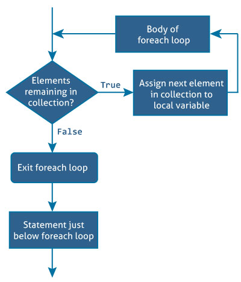

# C# `foreach`循环

> 原文： [https://www.programiz.com/csharp-programming/foreach-loop](https://www.programiz.com/csharp-programming/foreach-loop)

#### 在本文中，我们将学习`foreach`循环（`for`循环的替代方法）以及如何将其与数组和集合一起使用。

C# 提供了一种易于使用且可读性强的替代方法`for`循环，即在处理数组和集合以遍历数组/集合项时使用的`foreach`循环。`foreach`循环遍历每个项目，因此称为`foreach`循环。

在继续进行`foreach`循环之前，请访问：

*   [C# `for`循环](/csharp-programming/for-loop "C# for loop")
*   *C# 数组*
*   *C# 集合*

* * *

## `foreach`循环的语法

```cs
foreach (element in iterable-item)
{
    // body of foreach loop
}

```

这里的`iterable-item`可以是数组或集合类。

* * *

## `foreach`循环如何工作？



与`foreach`循环一起使用的`in`关键字用于对`iterable-item`进行迭代。`in`关键字在每次迭代时从`iterable-item`中选择一个项目，并将其存储在变量`element`中。

在第一次迭代中，`iterable-item`的第一项存储在`element`中。 在第二次迭代中，选择了第二个元素，依此类推。

`foreach`循环将执行的次数等于数组或集合中的元素数。

这是使用`for`循环遍历数组的示例：

* * *

## 示例 1：使用`for`循环打印数组

```cs
using System;

namespace Loop
{
    class ForLoop
    {
        public static void Main(string[] args)
        {
            char[] myArray = {'H','e','l','l','o'};

            for(int i = 0; i < myArray.Length; i++)
            {
                Console.WriteLine(myArray[i]);
            }
        }
    }
} 
```

使用`foreach`循环可以完成相同的任务。

## 示例 2：使用`foreach`循环打印数组

```cs
using System;

namespace Loop
{
    class ForEachLoop
    {
        public static void Main(string[] args)
        {
            char[] myArray = {'H','e','l','l','o'};

            foreach(char ch in myArray)
            {
                Console.WriteLine(ch);
            }
        }
    }
} 
```

当我们运行两个程序时，输出将是：

```cs
H
e
l
l
o 
```

在上面的程序中，`foreach`循环遍历数组`myArray`。 在第一次迭代中，选择第一个元素，即`myArray [0]`并将其存储在`ch`中。

同样，在最后一次迭代中，选择了最后一个元素，即`myArray [4]`。 在循环体内，打印`ch`的值。

当我们同时看这两个程序时，使用`foreach`循环的程序更易读和易于理解。 这是因为其简单而富有表现力的语法。

因此，在处理数组和集合时，`foreach`循环优于`for`循环。

* * *

## 示例 3：使用`foreach`循环遍历性别数组

该程序计算男性和女性候选人的人数。

```cs
using System;

namespace Loop
{
    class ForEachLoop
    {
        public static void Main(string[] args)
        {
            char[] gender = {'m','f','m','m','m','f','f','m','m','f'};
            int male = 0, female = 0;
            foreach (char g in gender)  
            {
                if (g == 'm')
                        male++;
                else if (g =='f')
                        female++;
            }
            Console.WriteLine("Number of male = {0}", male);
            Console.WriteLine("Number of female = {0}", female);
        }
    }
} 
```

当我们运行程序时，输出将是：

```cs
Number of male = 6
Number of female = 4 
```

* * *

## 示例 4：带有列表（集合）的`foreach`循环

该程序计算*列表*中元素的总和。

```cs
using System;
using System.Collections.Generic;

namespace Loop
{
    class ForEachLoop
    {
        public static void Main(string[] args)
        {
            var numbers = new List<int>() {5,-8,3,14,9,17,0,4};
            int sum = 0;

            foreach(int number in numbers)
            {
                sum += number;
            }
            Console.WriteLine("Sum = {0}", sum);
        }
    }
}</int> 
```

When we run the program, the output will be:

```cs
Sum = 44
```

在此程序中，`foreach`循环用于遍历一个集合。 遍历一个集合类似于遍历一个数组。

在第一次迭代中选择集合的第一个元素，在第二次迭代中选择第二个元素，依此类推，直到最后一个元素。