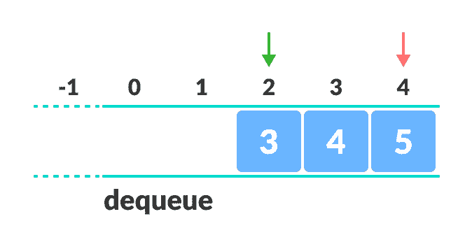

# 队列

> 原文： [https://www.programiz.com/dsa/queue](https://www.programiz.com/dsa/queue)

#### 在本教程中，您将学习什么是队列。 此外，您还将发现使用 C，C++ ，Java 和 Python 实现队列的实现。

队列是编程中有用的数据结构。 它类似于电影院大厅外面的售票队列，在该队列中，第一个进入队列的人是第一个获得票的人。

队列遵循**先进先出（FIFO）**规则-先进入的项目也是先出来的项目。


FIFO representation


在上图中，由于 1 在 2 之前保留在队列中，因此它也是第一个从队列中删除的队列。 它遵循 **FIFO** 规则。

用编程术语来说，将项目放入队列称为“入队”，而将项目从队列中删除则称为“出队”。

我们可以使用任何编程语言（例如 C，C++ ，Java，Python 或 C＃）来实现队列，但是规范几乎是相同的。

* * *

## 队列规格

队列是一个对象，或更具体地说，是一个允许执行以下操作的抽象数据结构（ADT）：

*   **排队**：将元素添加到队列的末尾
*   **出队**：从队列的开头删除元素
*   **IsEmpty** ：检查队列是否为空
*   **IsFull** ：检查队列是否已满
*   **偷看**：获取队列前面的值而不删除它

* * *

## 队列如何工作

队列操作如下：

1.  两个称为`FRONT`和`REAR`的指针用于跟踪队列中的第一个和最后一个元素。
2.  初始化队列时，我们将`FRONT`和`REAR`的值设置为-1。
3.  排队元素时，我们增加`REAR`索引的值，并将新元素放置在`REAR`指向的位置。
4.  在元素出队时，我们返回`FRONT`指向的值，并增加`FRONT`索引。
5.  在排队之前，我们检查队列是否已满。
6.  在出队之前，我们检查队列是否已经为空。
7.  当对第一个元素进行排队时，我们将`FRONT`的值设置为 0。
8.  使最后一个元素出队时，我们将`FRONT`和`REAR`的值重置为-1。


Working of queue operations


* * *

## Python，Java 和 C / C++ 示例

最常见的队列实现是使用数组，但是也可以使用列表来实现。

[Python](#python-code)[Java](#java-code)[C](#c-code)[C+](#cpp-code)

```
# Queue implementation in Python

class Queue:

    def __init__(self):
        self.queue = []

    # Add an element
    def enqueue(self, item):
        self.queue.append(item)

    # Remove an element
    def dequeue(self):
        if len(self.queue) < 1:
            return None
        return self.queue.pop(0)

    # Display  the queue
    def display(self):
        print(self.queue)

    def size(self):
        return len(self.queue)

q = Queue()
q.enqueue(1)
q.enqueue(2)
q.enqueue(3)
q.enqueue(4)
q.enqueue(5)

q.display()

q.dequeue()

print("After removing an element")
q.display() 
```

```
// Queue implementation in Java

public class Queue {
  int SIZE = 5;
  int items[] = new int[SIZE];
  int front, rear;

  Queue() {
    front = -1;
    rear = -1;
  }

  boolean isFull() {
    if (front == 0 && rear == SIZE - 1) {
      return true;
    }
    return false;
  }

  boolean isEmpty() {
    if (front == -1)
      return true;
    else
      return false;
  }

  void enQueue(int element) {
    if (isFull()) {
      System.out.println("Queue is full");
    } else {
      if (front == -1)
        front = 0;
      rear++;
      items[rear] = element;
      System.out.println("Inserted " + element);
    }
  }

  int deQueue() {
    int element;
    if (isEmpty()) {
      System.out.println("Queue is empty");
      return (-1);
    } else {
      element = items[front];
      if (front >= rear) {
        front = -1;
        rear = -1;
      } /* Q has only one element, so we reset the queue after deleting it. */
      else {
        front++;
      }
      System.out.println("Deleted -> " + element);
      return (element);
    }
  }

  void display() {
    /* Function to display elements of Queue */
    int i;
    if (isEmpty()) {
      System.out.println("Empty Queue");
    } else {
      System.out.println("\nFront index-> " + front);
      System.out.println("Items -> ");
      for (i = front; i <= rear; i++)
        System.out.print(items[i] + "  ");

      System.out.println("\nRear index-> " + rear);
    }
  }

  public static void main(String[] args) {
    Queue q = new Queue();

    // deQueue is not possible on empty queue
    q.deQueue();

    // enQueue 5 elements
    q.enQueue(1);
    q.enQueue(2);
    q.enQueue(3);
    q.enQueue(4);
    q.enQueue(5);

    // 6th element can't be added to queue because queue is full
    q.enQueue(6);

    q.display();

    // deQueue removes element entered first i.e. 1
    q.deQueue();

    // Now we have just 4 elements
    q.display();

  }
}
```

```
// Queue implementation in C

#include <stdio.h>
#define SIZE 5

void enQueue(int);
void deQueue();
void display();

int items[SIZE], front = -1, rear = -1;

int main() {
  //deQueue is not possible on empty queue
  deQueue();

  //enQueue 5 elements
  enQueue(1);
  enQueue(2);
  enQueue(3);
  enQueue(4);
  enQueue(5);

  //6th element can't be added to queue because queue is full
  enQueue(6);

  display();

  //deQueue removes element entered first i.e. 1
  deQueue();

  //Now we have just 4 elements
  display();

  return 0;
}

void enQueue(int value) {
  if (rear == SIZE - 1)
    printf("\nQueue is Full!!");
  else {
    if (front == -1)
      front = 0;
    rear++;
    items[rear] = value;
    printf("\nInserted -> %d", value);
  }
}

void deQueue() {
  if (front == -1)
    printf("\nQueue is Empty!!");
  else {
    printf("\nDeleted : %d", items[front]);
    front++;
    if (front > rear)
      front = rear = -1;
  }
}

// Function to print the queue
void display() {
  if (rear == -1)
    printf("\nQueue is Empty!!!");
  else {
    int i;
    printf("\nQueue elements are:\n");
    for (i = front; i <= rear; i++)
      printf("%d  ", items[i]);
  }
  printf("\n");
}
```

```
// Queue implementation in C++

#include <iostream>
#define SIZE 5

using namespace std;

class Queue {
   private:
  int items[SIZE], front, rear;

   public:
  Queue() {
    front = -1;
    rear = -1;
  }

  bool isFull() {
    if (front == 0 && rear == SIZE - 1) {
      return true;
    }
    return false;
  }

  bool isEmpty() {
    if (front == -1)
      return true;
    else
      return false;
  }

  void enQueue(int element) {
    if (isFull()) {
      cout << "Queue is full";
    } else {
      if (front == -1) front = 0;
      rear++;
      items[rear] = element;
      cout << endl
         << "Inserted " << element << endl;
    }
  }

  int deQueue() {
    int element;
    if (isEmpty()) {
      cout << "Queue is empty" << endl;
      return (-1);
    } else {
      element = items[front];
      if (front >= rear) {
        front = -1;
        rear = -1;
      } /* Q has only one element, so we reset the queue after deleting it. */
      else {
        front++;
      }
      cout << endl
         << "Deleted -> " << element << endl;
      return (element);
    }
  }

  void display() {
    /* Function to display elements of Queue */
    int i;
    if (isEmpty()) {
      cout << endl
         << "Empty Queue" << endl;
    } else {
      cout << endl
         << "Front index-> " << front;
      cout << endl
         << "Items -> ";
      for (i = front; i <= rear; i++)
        cout << items[i] << "  ";
      cout << endl
         << "Rear index-> " << rear << endl;
    }
  }
};

int main() {
  Queue q;

  //deQueue is not possible on empty queue
  q.deQueue();

  //enQueue 5 elements
  q.enQueue(1);
  q.enQueue(2);
  q.enQueue(3);
  q.enQueue(4);
  q.enQueue(5);

  //6th element can't be added to queue because queue is full
  q.enQueue(6);

  q.display();

  //deQueue removes element entered first i.e. 1
  q.deQueue();

  //Now we have just 4 elements
  q.display();

  return 0;
}
```

* * *

## 此实现的局限性

如您在下图中所看到的，经过一些入队和出队后，队列的大小已减小。



Limitation of a queue


只有当所有元素都已出队后，才能在重置队列后使用索引 0 和 1。

在`REAR`到达最后一个索引之后，如果我们可以在空白空间（0 和 1）中存储额外的元素，则可以利用这些空白空间。 这通过称为[循环队列](/data-structures/circular-queue)的修改队列来实现。

* * *

## 队列复杂度

使用数组的队列中入队和出队操作的复杂度为`O(1)`。

* * *

## 队列申请

*   CPU 调度，磁盘调度
*   在两个进程之间异步传输数据时，使用 Queue 进行同步。 例如：IO 缓冲区，管道，文件 IO 等
*   实时系统中的中断处理。
*   呼叫中心电话系统使用队列来保持人们按顺序呼叫他们