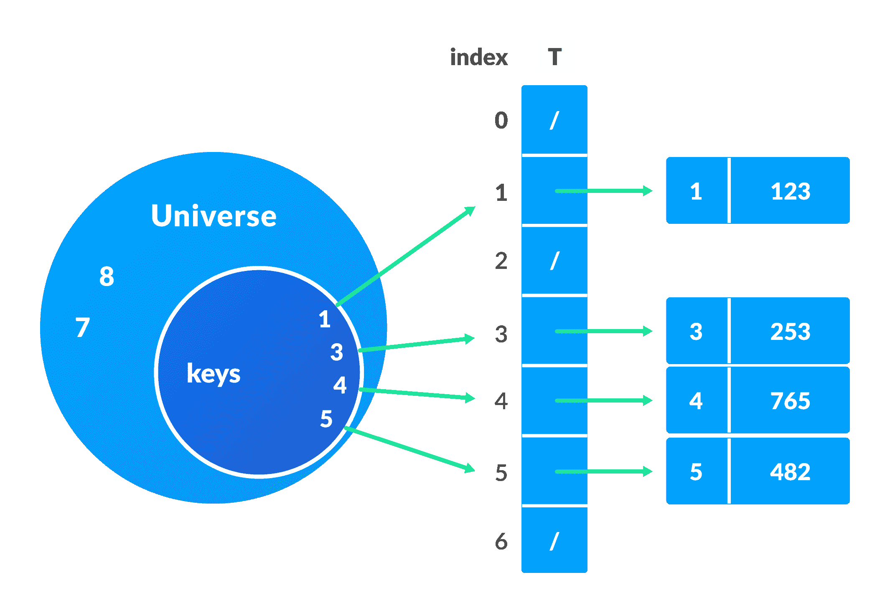
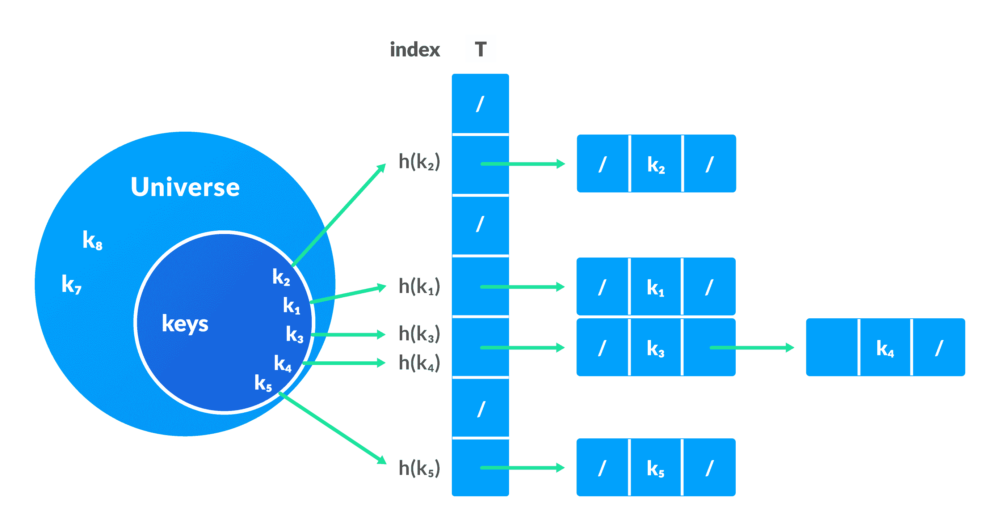

# 哈希表

> 原文： [https://www.programiz.com/dsa/hash-table](https://www.programiz.com/dsa/hash-table)

#### 在本教程中，您将学习什么是哈希表。 此外，您还将找到 C，C++ ，Java 和 Python 中哈希表操作的工作示例。

哈希表是一种数据结构，以**键值**对的形式表示数据。 每个键都映射到哈希表中的一个值。 这些键用于索引值/数据。 关联数组也采用了类似的方法。

* * *

数据通过键在键值对中表示，如下图所示。 每个数据都与一个键相关联。 键是指向数据的整数。


* * *

## 1.直接地址表

当程序使用的表空间量不是问题时，将使用直接地址表。 在这里，我们假设

*   键是小整数
*   键的数量不是太大，并且
*   没有两个数据具有相同的键

采用整数池称为总体`U = {0, 1, ……., n-1}`。

直接地址表`T[0...n-1]`的每个插槽都包含一个指向与数据相对应的元素的指针。

数组`T`的索引是键本身，`T`的内容是指向集合`[key, element]`的指针。 如果没有键的元素，则保留为`NULL`。

有时，键本身就是数据。

**操作的伪代码**

```
directAddressSearch(T, k)
  return T[k]
directAddressInsert(T, x)
  T[x.key] = x
directAddressDelete(T, x)
  T[x.key] = NIL 
```

**直接地址表的限制**

*   键的值应该很小。
*   键的数量必须足够小，以使其不超过数组的大小限制。

* * *

## 2.哈希表

在哈希表中，键被处理以生成映射到所需元素的新索引。 此过程称为哈希。

假设`h(x)`为哈希函数，`k`为键。 计算
`h(k)`，并将其用作元素的索引。


**哈希表的限制**

*   如果散列函数为多个键产生相同的索引，则会发生冲突。 这种情况称为碰撞。

    为避免这种情况，选择了合适的哈希函数。 但是，由于`|U|>m`，不可能产生所有唯一的键。 因此，良好的哈希函数可能无法完全防止冲突，但是可以减少冲突次数。

但是，我们还有其他解决冲突的技术。

* * *

**哈希表优于直接地址表的优点**：

直接地址表的主要问题是数组的大小和键的可能很大的值。 哈希函数减小了索引的范围，因此数组的大小也减小了。
例如，如果`k = 9845648451321`，则为`h(k) = 11`（通过使用某些哈希函数）。 这有助于节省浪费的内存，同时为数组提供`9845648451321`的索引

* * *

### 链接解决冲突

在此技术中，如果哈希函数为多个元素生成相同的索引，则使用双向链表将这些元素存储在相同的索引中。

如果`j`是多个元素的插槽，则它包含一个指向元素列表开头的指针。 如果不存在任何元素，则`j`包含`NIL`。


**操作的伪代码**

```
chainedHashSearch(T, k)
  return T[h(k)]
chainedHashInsert(T, x)
  T[h(x.key)] = x //insert at the head
chainedHashDelete(T, x)
  T[h(x.key)] = NIL 
```

* * *

## Python，Java，C 和 C++ 实现

[Python](#python-code)[Java](#java-code)[C](#c-code)[C++](#cpp-code)

```
# Python program to demonstrate working of HashTable 

hashTable = [[],] * 10

def checkPrime(n):
    if n == 1 or n == 0:
        return 0

    for i in range(2, n//2):
        if n % i == 0:
            return 0

    return 1

def getPrime(n):
    if n % 2 == 0:
        n = n + 1

    while not checkPrime(n):
        n += 2

    return n

def hashFunction(key):
    capacity = getPrime(10)
    return key % capacity

def insertData(key, data):
    index = hashFunction(key)
    hashTable[index] = [key, data]

def removeData(key):
    index = hashFunction(key)
    hashTable[index] = 0

insertData(123, "apple")
insertData(432, "mango")
insertData(213, "banana")
insertData(654, "guava")

print(hashTable)

removeData(123)

print(hashTable) 
```

```
// Java program to demonstrate working of HashTable 

import java.util.*; 

class HashTable { 
  public static void main(String args[]) 
  {
    Hashtable<Integer, Integer> 
      ht = new Hashtable<Integer, Integer>(); 

    ht.put(123, 432); 
    ht.put(12, 2345);
    ht.put(15, 5643); 
    ht.put(3, 321);

    ht.remove(12);

    System.out.println(ht); 
  } 
} 
```

```
// Implementing hash table in C

#include <stdio.h>
#include <stdlib.h>

struct set
{
  int key;
  int data;
};
struct set *array;
int capacity = 10;
int size = 0;

int hashFunction(int key)
{
  return (key % capacity);
}
int checkPrime(int n)
{
  int i;
  if (n == 1 || n == 0)
  {
    return 0;
  }
  for (i = 2; i < n / 2; i++)
  {
    if (n % i == 0)
    {
      return 0;
    }
  }
  return 1;
}
int getPrime(int n)
{
  if (n % 2 == 0)
  {
    n++;
  }
  while (!checkPrime(n))
  {
    n += 2;
  }
  return n;
}
void init_array()
{
  capacity = getPrime(capacity);
  array = (struct set *)malloc(capacity * sizeof(struct set));
  for (int i = 0; i < capacity; i++)
  {
    array[i].key = 0;
    array[i].data = 0;
  }
}

void insert(int key, int data)
{
  int index = hashFunction(key);
  if (array[index].data == 0)
  {
    array[index].key = key;
    array[index].data = data;
    size++;
    printf("\n Key (%d) has been inserted \n", key);
  }
  else if (array[index].key == key)
  {
    array[index].data = data;
  }
  else
  {
    printf("\n Collision occured  \n");
  }
}

void remove_element(int key)
{
  int index = hashFunction(key);
  if (array[index].data == 0)
  {
    printf("\n This key does not exist \n");
  }
  else
  {
    array[index].key = 0;
    array[index].data = 0;
    size--;
    printf("\n Key (%d) has been removed \n", key);
  }
}
void display()
{
  int i;
  for (i = 0; i < capacity; i++)
  {
    if (array[i].data == 0)
    {
      printf("\n array[%d]: / ", i);
    }
    else
    {
      printf("\n key: %d array[%d]: %d \t", array[i].key, i, array[i].data);
    }
  }
}

int size_of_hashtable()
{
  return size;
}

int main()
{
  int choice, key, data, n;
  int c = 0;
  init_array();

  do
  {
    printf("1.Insert item in the Hash Table"
         "\n2.Remove item from the Hash Table"
         "\n3.Check the size of Hash Table"
         "\n4.Display a Hash Table"
         "\n\n Please enter your choice: ");

    scanf("%d", &choice);
    switch (choice)
    {
    case 1:

      printf("Enter key -:\t");
      scanf("%d", &key);
      printf("Enter data -:\t");
      scanf("%d", &data);
      insert(key, data);

      break;

    case 2:

      printf("Enter the key to delete-:");
      scanf("%d", &key);
      remove_element(key);

      break;

    case 3:

      n = size_of_hashtable();
      printf("Size of Hash Table is-:%d\n", n);

      break;

    case 4:

      display();

      break;

    default:

      printf("Invalid Input\n");
    }

    printf("\nDo you want to continue (press 1 for yes): ");
    scanf("%d", &c);

  } while (c == 1);
}
```

```
// Implementing hash table in C++

#include <iostream>
#include <list>
using namespace std;

class HashTable
{
  int capacity;
  list<int> *table;

public:
  HashTable(int V);
  void insertItem(int key, int data);
  void deleteItem(int key);

  int checkPrime(int n)
  {
    int i;
    if (n == 1 || n == 0)
    {
      return 0;
    }
    for (i = 2; i < n / 2; i++)
    {
      if (n % i == 0)
      {
        return 0;
      }
    }
    return 1;
  }
  int getPrime(int n)
  {
    if (n % 2 == 0)
    {
      n++;
    }
    while (!checkPrime(n))
    {
      n += 2;
    }
    return n;
  }

  int hashFunction(int key)
  {
    return (key % capacity);
  }
  void displayHash();
};
HashTable::HashTable(int c)
{
  int size = getPrime(c);
  this->capacity = size;
  table = new list<int>[capacity];
}
void HashTable::insertItem(int key, int data)
{
  int index = hashFunction(key);
  table[index].push_back(data);
}

void HashTable::deleteItem(int key)
{
  int index = hashFunction(key);

  list<int>::iterator i;
  for (i = table[index].begin();
     i != table[index].end(); i++)
  {
    if (*i == key)
      break;
  }

  if (i != table[index].end())
    table[index].erase(i);
}

void HashTable::displayHash()
{
  for (int i = 0; i < capacity; i++)
  {
    cout << "table[" << i << "]";
    for (auto x : table[i])
      cout << " --> " << x;
    cout << endl;
  }
}

int main()
{
  int key[] = {231, 321, 212, 321, 433, 262};
  int data[] = {123, 432, 523, 43, 423, 111};
  int size = sizeof(key) / sizeof(key[0]);

  HashTable h(size);

  for (int i = 0; i < n; i++)
    h.insertItem(key[i], data[i]);

  h.deleteItem(12);
  h.displayHash();
} 
```

* * *

## 良好的哈希函数

良好的哈希函数具有以下特征。

1.  它不应生成太大且存储桶空间小的键。 空间被浪费了。
2.  生成的键的范围不能太近，也不能太远。
3.  必须尽可能减少碰撞。

用于散列的一些方法是：

### 除法

如果`k`是键，并且`m`是哈希表的大小，则哈希函数`h()`的计算公式为：

`h(k) = k mod m`

例如，如果哈希表的大小为`10`和`k = 112`，则`h(k) = 112 % 10 = 2`。`m`的值不得为`2`的幂。 这是因为`2`的二进制格式的功率为`10, 100, 1000, …`。 当我们找到`k mod m`时，我们将始终获得较低阶的`p`位。

```
if m = 22, k = 17, then h(k) = 17 mod 22 = 10001 mod 100 = 01
if m = 23, k = 17, then h(k) = 17 mod 22 = 10001 mod 100 = 001
if m = 24, k = 17, then h(k) = 17 mod 22 = 10001 mod 100 = 0001
if m = 2p, then h(k) = p lower bits of m

```

### 乘法

`h(k) = ⌊m(kA mod 1)⌋`
其中，

*   `kA mod 1`给出小数部分`kA`，
*   `⌊ ⌋`给出底值
*   `A`是任何常数。`A`的值在 0 到 1 之间。但是，最佳选择是 Knuth 建议的`≈ (√5-1)/2`。

### 通用哈希

在通用哈希中，哈希函数是独立于键随机选择的。

* * *

## 开放式寻址

多个值可以存储在普通哈希表的单个插槽中。

通过使用开放式寻址，每个插槽要么用单个键填充，要么向左`NIL`填充。 所有元素都存储在哈希表本身中。

与链接不同，不能将多个元素放入同一插槽。

开放式寻址基本上是一种冲突解决技术。 开放式寻址使用的一些方法是：

### 线性探测

在线性探测中，通过检查下一个插槽来解决冲突。
`h(k, i) = (h′(k) + i) mod m`
其中，

*   `i = {0, 1, ….}`
*   `h'(k)`是新的哈希函数

如果在`h(k, 0)`发生碰撞，则检查`h(k, 1)`。 这样，`i`的值线性增加。
线性探测的问题是相邻槽的簇被填充。 插入新元素时，必须遍历整个集群。 这增加了对哈希表执行操作所需的时间。

### 二次探测

在二次探测中，通过使用以下关系，可以增大槽之间的间距（大于 1）。
`h(k, i) = (h′(k) + c1 i + c2 i^2) mod m`
其中，

*   `c1`和`c2`是正辅助常数，
*   `i = {0, 1, ….}`

### 双重哈希

如果在应用哈希函数`h(k)`之后发生冲突，则将计算另一个哈希函数以查找下一个时隙。
`h(k, i) = (h1(k) + i h2(k)) mod m`

* * *

## 哈希表应用

哈希表在以下位置实现

*   需要常数时间的查找和插入
*   密码学应用
*   需要索引数据