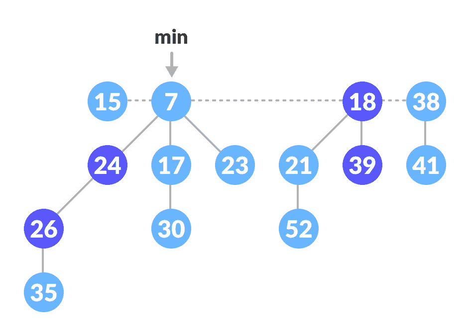
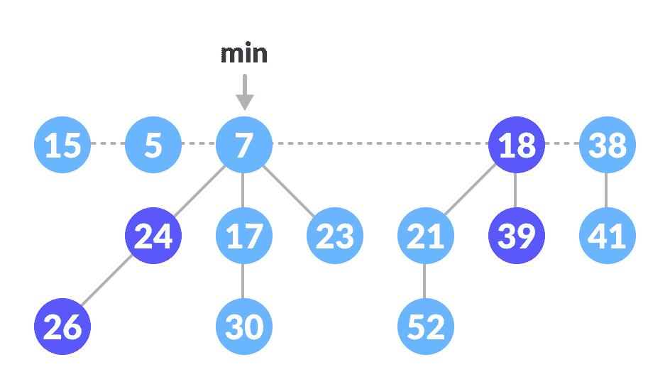
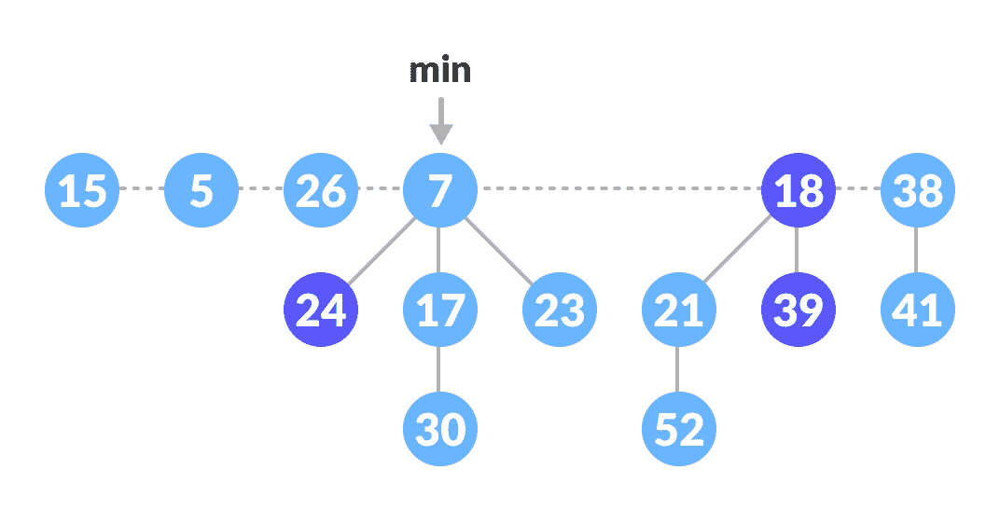
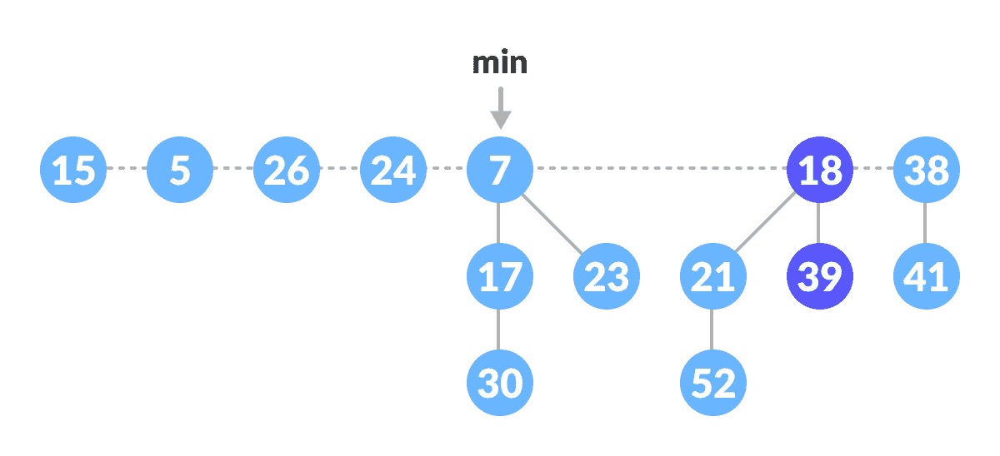
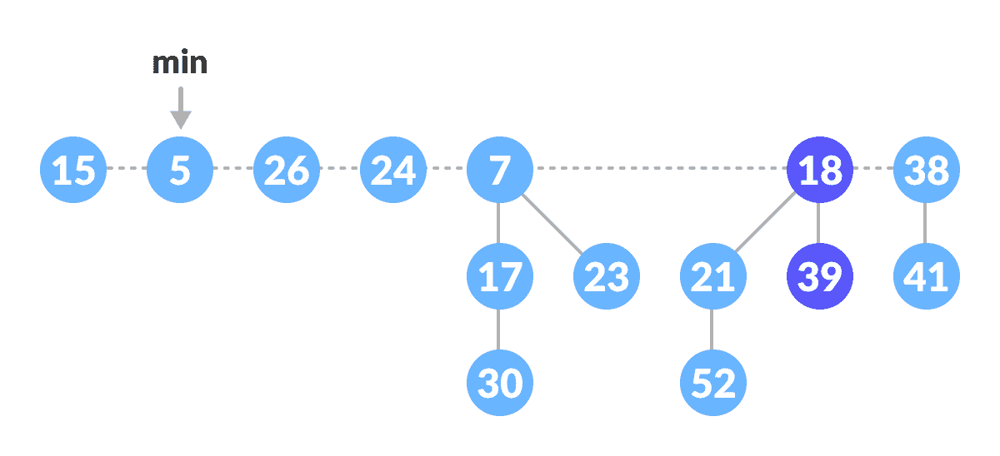

# 减小斐波那契堆上的键和删除节点的操作

> 原文： [https://www.programiz.com/dsa/decrease-key-and-delete-node-from-a-fibonacci-heap](https://www.programiz.com/dsa/decrease-key-and-delete-node-from-a-fibonacci-heap)

#### 在本教程中，您将学习减小键和删除节点操作的工作方式。 此外，您还将在 C，C++ ，Java 和 Python 的斐波那契堆上找到这些操作的工作示例。

在斐波那契堆中，减小键和删除节点是重要的操作。 这些操作将在下面讨论。

* * *

## 减小键

在减小键操作中，键的值被减小到较低的值。

以下功能用于减小按键。

### 减小键

1.  选择要减小的节点`x`，并将其值更改为新值`k`。
2.  如果`x`的父级`y`不为空，并且父级的键大于`k`的键，则调用`C ut(x)`和`C ascading- C ut(y)`随后。
3.  如果`x`的键小于`min`的键，则将`x`标记为`min`。

### 剪裁

1.  从当前位置删除`x`并将其添加到根列表中。
2.  如果标记了`x`，则将其标记为`false`。

### 级联剪裁

1.  如果`y`的父级不为空，请执行以下步骤。
2.  如果未标记`y`，则标记`y`。
3.  否则，调用`Cut(y)`和`Cascading-Cut(parent of y)`。

* * *

## 减小键示例

在以下示例中可以理解上述操作。

### 示例：将 46 减小到 15。

1.  将值减小 46 到 15。
2.  **剪裁部分**：由于`24 ≠ nill`和`15 < its parent`，将其剪裁并将其添加到根列表中。 **级联剪裁部分**：标记为 24。

    

    在根列表中添加 15 并标记为 24

    

### 示例：将 35 减小到 5

1.  将值减小 35 到 5。

    

    将值 35 减小到 5

    

2.  剪裁部分：由于`26 ≠ nill`和`5<its parent`，将其剪裁并将其添加到根列表中。

    

    剪裁 5 并将其添加到根列表

    

3.  级联剪裁部分：由于标记为 26，因此流程进入`Cut`和`Cascading-Cut`。
    `Cut(26)`：剪裁 26 并将其添加到根列表中，并将其标记为`false`。

    

    剪裁 26 并将其添加到根列表中。 呼叫`Cut(24)`和`Cascading-Cut(7)`。 这些操作将导致下面的树。

    

    削减 24 并将其添加到根列表中

    

    

    

4.  从`5 < 7`开始，将 5 标记为分钟。

    

    将 5 标记为最小值

    

* * *

## 删除节点

此过程使用[减小键](None)和[最小提取](https://www.programiz.com/dsa/fibonacci-heap)操作。 请按照以下步骤删除节点。

1.  令`k`为要删除的节点。
2.  应用减小键操作将`k`的值减小到可能的最低值（即-∞）。
3.  应用`extract-min`操作删除该节点。

* * *

## Python，Java 和 C/C++ 示例


```
# Fibonacci Heap in python

import math

class FibonacciTree:
    def __init__(self, key):
        self.key = key
        self.children = []
        self.order = 0

    def add_at_end(self, t):
        self.children.append(t)
        self.order = self.order + 1

class FibonacciHeap:
    def __init__(self):
        self.trees = []
        self.least = None
        self.count = 0

    def insert(self, key):
        new_tree = FibonacciTree(key)
        self.trees.append(new_tree)
        if (self.least is None or key < self.least.key):
            self.least = new_tree
        self.count = self.count + 1

    def get_min(self):
        if self.least is None:
            return None
        return self.least.key

    def extract_min(self):
        smallest = self.least
        if smallest is not None:
            for child in smallest.children:
                self.trees.append(child)
            self.trees.remove(smallest)
            if self.trees == []:
                self.least = None
            else:
                self.least = self.trees[0]
                self.consolidate()
            self.count = self.count - 1
            return smallest.key

    def consolidate(self):
        aux = (floor_log2(self.count) + 1) * [None]

        while self.trees != []:
            x = self.trees[0]
            order = x.order
            self.trees.remove(x)
            while aux[order] is not None:
                y = aux[order]
                if x.key > y.key:
                    x, y = y, x
                x.add_at_end(y)
                aux[order] = None
                order = order + 1
            aux[order] = x

        self.least = None
        for k in aux:
            if k is not None:
                self.trees.append(k)
                if (self.least is None
                        or k.key < self.least.key):
                    self.least = k

def floor_log2(x):
    return math.frexp(x)[1] - 1

fheap = FibonacciHeap()

fheap.insert(11)
fheap.insert(10)
fheap.insert(39)
fheap.insert(26)
fheap.insert(24)

print('Minimum value: {}'.format(fheap.get_min()))

print('Minimum value removed: {}'.format(fheap.extract_min()))
```

```
// Operations on Fibonacci Heap in Java

class node {
  node parent;
  node left;
  node right;
  node child;
  int degree;
  boolean mark;
  int key;

  public node() {
    this.degree = 0;
    this.mark = false;
    this.parent = null;
    this.left = this;
    this.right = this;
    this.child = null;
    this.key = Integer.MAX_VALUE;
  }

  node(int x) {
    this();
    this.key = x;
  }

  void set_parent(node x) {
    this.parent = x;
  }

  node get_parent() {
    return this.parent;
  }

  void set_left(node x) {
    this.left = x;
  }

  node get_left() {
    return this.left;
  }

  void set_right(node x) {
    this.right = x;
  }

  node get_right() {
    return this.right;
  }

  void set_child(node x) {
    this.child = x;
  }

  node get_child() {
    return this.child;
  }

  void set_degree(int x) {
    this.degree = x;
  }

  int get_degree() {
    return this.degree;
  }

  void set_mark(boolean m) {
    this.mark = m;
  }

  boolean get_mark() {
    return this.mark;
  }

  void set_key(int x) {
    this.key = x;
  }

  int get_key() {
    return this.key;
  }
}

public class fibHeap {
  node min;
  int n;
  boolean trace;
  node found;

  public boolean get_trace() {
    return trace;
  }

  public void set_trace(boolean t) {
    this.trace = t;
  }

  public static fibHeap create_heap() {
    return new fibHeap();
  }

  fibHeap() {
    min = null;
    n = 0;
    trace = false;
  }

  private void insert(node x) {
    if (min == null) {
      min = x;
      x.set_left(min);
      x.set_right(min);
    } else {
      x.set_right(min);
      x.set_left(min.get_left());
      min.get_left().set_right(x);
      min.set_left(x);
      if (x.get_key() < min.get_key())
        min = x;
    }
    n += 1;
  }

  public void insert(int key) {
    insert(new node(key));
  }

  public void display() {
    display(min);
    System.out.println();
  }

  private void display(node c) {
    System.out.print("(");
    if (c == null) {
      System.out.print(")");
      return;
    } else {
      node temp = c;
      do {
        System.out.print(temp.get_key());
        node k = temp.get_child();
        display(k);
        System.out.print("->");
        temp = temp.get_right();
      } while (temp != c);
      System.out.print(")");
    }
  }

  public static void merge_heap(fibHeap H1, fibHeap H2, fibHeap H3) {
    H3.min = H1.min;

    if (H1.min != null && H2.min != null) {
      node t1 = H1.min.get_left();
      node t2 = H2.min.get_left();
      H1.min.set_left(t2);
      t1.set_right(H2.min);
      H2.min.set_left(t1);
      t2.set_right(H1.min);
    }
    if (H1.min == null || (H2.min != null && H2.min.get_key() < H1.min.get_key()))
      H3.min = H2.min;
    H3.n = H1.n + H2.n;
  }

  public int find_min() {
    return this.min.get_key();
  }

  private void display_node(node z) {
    System.out.println("right: " + ((z.get_right() == null) ? "-1" : z.get_right().get_key()));
    System.out.println("left: " + ((z.get_left() == null) ? "-1" : z.get_left().get_key()));
    System.out.println("child: " + ((z.get_child() == null) ? "-1" : z.get_child().get_key()));
    System.out.println("degree " + z.get_degree());
  }

  public int extract_min() {
    node z = this.min;
    if (z != null) {
      node c = z.get_child();
      node k = c, p;
      if (c != null) {
        do {
          p = c.get_right();
          insert(c);
          c.set_parent(null);
          c = p;
        } while (c != null && c != k);
      }
      z.get_left().set_right(z.get_right());
      z.get_right().set_left(z.get_left());
      z.set_child(null);
      if (z == z.get_right())
        this.min = null;
      else {
        this.min = z.get_right();
        this.consolidate();
      }
      this.n -= 1;
      return z.get_key();
    }
    return Integer.MAX_VALUE;
  }

  public void consolidate() {
    double phi = (1 + Math.sqrt(5)) / 2;
    int Dofn = (int) (Math.log(this.n) / Math.log(phi));
    node[] A = new node[Dofn + 1];
    for (int i = 0; i <= Dofn; ++i)
      A[i] = null;
    node w = min;
    if (w != null) {
      node check = min;
      do {
        node x = w;
        int d = x.get_degree();
        while (A[d] != null) {
          node y = A[d];
          if (x.get_key() > y.get_key()) {
            node temp = x;
            x = y;
            y = temp;
            w = x;
          }
          fib_heap_link(y, x);
          check = x;
          A[d] = null;
          d += 1;
        }
        A[d] = x;
        w = w.get_right();
      } while (w != null && w != check);
      this.min = null;
      for (int i = 0; i <= Dofn; ++i) {
        if (A[i] != null) {
          insert(A[i]);
        }
      }
    }
  }

  private void fib_heap_link(node y, node x) {
    y.get_left().set_right(y.get_right());
    y.get_right().set_left(y.get_left());

    node p = x.get_child();
    if (p == null) {
      y.set_right(y);
      y.set_left(y);
    } else {
      y.set_right(p);
      y.set_left(p.get_left());
      p.get_left().set_right(y);
      p.set_left(y);
    }
    y.set_parent(x);
    x.set_child(y);
    x.set_degree(x.get_degree() + 1);
    y.set_mark(false);
  }

  private void find(int key, node c) {
    if (found != null || c == null)
      return;
    else {
      node temp = c;
      do {
        if (key == temp.get_key())
          found = temp;
        else {
          node k = temp.get_child();
          find(key, k);
          temp = temp.get_right();
        }
      } while (temp != c && found == null);
    }
  }

  public node find(int k) {
    found = null;
    find(k, this.min);
    return found;
  }

  public void decrease_key(int key, int nval) {
    node x = find(key);
    decrease_key(x, nval);
  }

  private void decrease_key(node x, int k) {
    if (k > x.get_key())
      return;
    x.set_key(k);
    node y = x.get_parent();
    if (y != null && x.get_key() < y.get_key()) {
      cut(x, y);
      cascading_cut(y);
    }
    if (x.get_key() < min.get_key())
      min = x;
  }

  private void cut(node x, node y) {
    x.get_right().set_left(x.get_left());
    x.get_left().set_right(x.get_right());

    y.set_degree(y.get_degree() - 1);

    x.set_right(null);
    x.set_left(null);
    insert(x);
    x.set_parent(null);
    x.set_mark(false);
  }

  private void cascading_cut(node y) {
    node z = y.get_parent();
    if (z != null) {
      if (y.get_mark() == false)
        y.set_mark(true);
      else {
        cut(y, z);
        cascading_cut(z);
      }
    }
  }

  public void delete(node x) {
    decrease_key(x, Integer.MIN_VALUE);
    int p = extract_min();
  }

  public static void main(String[] args) {
    fibHeap obj = create_heap();
    obj.insert(7);
    obj.insert(26);
    obj.insert(30);
    obj.insert(39);
    obj.insert(10);
    obj.display();

    System.out.println(obj.extract_min());
    obj.display();
    System.out.println(obj.extract_min());
    obj.display();
    System.out.println(obj.extract_min());
    obj.display();
    System.out.println(obj.extract_min());
    obj.display();
    System.out.println(obj.extract_min());
    obj.display();
  }
}
```

```
// Operations on a Fibonacci heap in C

#include <stdio.h>
#include <stdlib.h>
#include <stdbool.h>
#include <math.h>

typedef struct _NODE
{
  int key;
  int degree;
  struct _NODE *left_sibling;
  struct _NODE *right_sibling;
  struct _NODE *parent;
  struct _NODE *child;
  bool mark;
  bool visited;
} NODE;

typedef struct fibanocci_heap
{
  int n;
  NODE *min;
  int phi;
  int degree;
} FIB_HEAP;

FIB_HEAP *make_fib_heap();
void insertion(FIB_HEAP *H, NODE *new, int val);
NODE *extract_min(FIB_HEAP *H);
void consolidate(FIB_HEAP *H);
void fib_heap_link(FIB_HEAP *H, NODE *y, NODE *x);
NODE *find_min_node(FIB_HEAP *H);
void decrease_key(FIB_HEAP *H, NODE *node, int key);
void cut(FIB_HEAP *H, NODE *node_to_be_decrease, NODE *parent_node);
void cascading_cut(FIB_HEAP *H, NODE *parent_node);
void Delete_Node(FIB_HEAP *H, int dec_key);

FIB_HEAP *make_fib_heap()
{
  FIB_HEAP *H;
  H = (FIB_HEAP *)malloc(sizeof(FIB_HEAP));
  H->n = 0;
  H->min = NULL;
  H->phi = 0;
  H->degree = 0;
  return H;
}
void new_print_heap(NODE *n)
{
  NODE *x;
  for (x = n;; x = x->right_sibling)
  {

    if (x->child == NULL)
    {
      printf("node with no child (%d) \n", x->key);
    }
    else
    {

      printf("NODE(%d) with child (%d)\n", x->key, x->child->key);
      new_print_heap(x->child);
    }
    if (x->right_sibling == n)
    {
      break;
    }
  }
}

void insertion(FIB_HEAP *H, NODE *new, int val)
{
  new = (NODE *)malloc(sizeof(NODE));
  new->key = val;
  new->degree = 0;
  new->mark = false;
  new->parent = NULL;
  new->child = NULL;
  new->visited = false;
  new->left_sibling = new;
  new->right_sibling = new;
  if (H->min == NULL)
  {
    H->min = new;
  }
  else
  {
    H->min->left_sibling->right_sibling = new;
    new->right_sibling = H->min;
    new->left_sibling = H->min->left_sibling;
    H->min->left_sibling = new;
    if (new->key < H->min->key)
    {
      H->min = new;
    }
  }
  (H->n)++;
}

NODE *find_min_node(FIB_HEAP *H)
{
  if (H == NULL)
  {
    printf(" \n Fibonacci heap not yet created \n");
    return NULL;
  }
  else
    return H->min;
}

FIB_HEAP *unionHeap(FIB_HEAP *H1, FIB_HEAP *H2)
{
  FIB_HEAP *Hnew;
  Hnew = make_fib_heap();
  Hnew->min = H1->min;

  NODE *temp1, *temp2;
  temp1 = Hnew->min->right_sibling;
  temp2 = H2->min->left_sibling;

  Hnew->min->right_sibling->left_sibling = H2->min->left_sibling;
  Hnew->min->right_sibling = H2->min;
  H2->min->left_sibling = Hnew->min;
  temp2->right_sibling = temp1;

  if ((H1->min == NULL) || (H2->min != NULL && H2->min->key < H1->min->key))
    Hnew->min = H2->min;
  Hnew->n = H1->n + H2->n;
  return Hnew;
}

int cal_degree(int n)
{
  int count = 0;
  while (n > 0)
  {
    n = n / 2;
    count++;
  }
  return count;
}
void consolidate(FIB_HEAP *H)
{
  int degree, i, d;
  degree = cal_degree(H->n);
  NODE *A[degree], *x, *y, *z;
  for (i = 0; i <= degree; i++)
  {
    A[i] = NULL;
  }
  x = H->min;
  do
  {
    d = x->degree;
    while (A[d] != NULL)
    {
      y = A[d];
      if (x->key > y->key)
      {
        NODE *exchange_help;
        exchange_help = x;
        x = y;
        y = exchange_help;
      }
      if (y == H->min)
        H->min = x;
      fib_heap_link(H, y, x);
      if (y->right_sibling == x)
        H->min = x;
      A[d] = NULL;
      d++;
    }
    A[d] = x;
    x = x->right_sibling;
  } while (x != H->min);

  H->min = NULL;
  for (i = 0; i < degree; i++)
  {
    if (A[i] != NULL)
    {
      A[i]->left_sibling = A[i];
      A[i]->right_sibling = A[i];
      if (H->min == NULL)
      {
        H->min = A[i];
      }
      else
      {
        H->min->left_sibling->right_sibling = A[i];
        A[i]->right_sibling = H->min;
        A[i]->left_sibling = H->min->left_sibling;
        H->min->left_sibling = A[i];
        if (A[i]->key < H->min->key)
        {
          H->min = A[i];
        }
      }
      if (H->min == NULL)
      {
        H->min = A[i];
      }
      else if (A[i]->key < H->min->key)
      {
        H->min = A[i];
      }
    }
  }
}

void fib_heap_link(FIB_HEAP *H, NODE *y, NODE *x)
{
  y->right_sibling->left_sibling = y->left_sibling;
  y->left_sibling->right_sibling = y->right_sibling;

  if (x->right_sibling == x)
    H->min = x;

  y->left_sibling = y;
  y->right_sibling = y;
  y->parent = x;

  if (x->child == NULL)
  {
    x->child = y;
  }
  y->right_sibling = x->child;
  y->left_sibling = x->child->left_sibling;
  x->child->left_sibling->right_sibling = y;
  x->child->left_sibling = y;
  if ((y->key) < (x->child->key))
    x->child = y;

  (x->degree)++;
}
NODE *extract_min(FIB_HEAP *H)
{

  if (H->min == NULL)
    printf("\n The heap is empty");
  else
  {
    NODE *temp = H->min;
    NODE *pntr;
    pntr = temp;
    NODE *x = NULL;
    if (temp->child != NULL)
    {

      x = temp->child;
      do
      {
        pntr = x->right_sibling;
        (H->min->left_sibling)->right_sibling = x;
        x->right_sibling = H->min;
        x->left_sibling = H->min->left_sibling;
        H->min->left_sibling = x;
        if (x->key < H->min->key)
          H->min = x;
        x->parent = NULL;
        x = pntr;
      } while (pntr != temp->child);
    }

    (temp->left_sibling)->right_sibling = temp->right_sibling;
    (temp->right_sibling)->left_sibling = temp->left_sibling;
    H->min = temp->right_sibling;

    if (temp == temp->right_sibling && temp->child == NULL)
      H->min = NULL;
    else
    {
      H->min = temp->right_sibling;
      consolidate(H);
    }
    H->n = H->n - 1;
    return temp;
  }
  return H->min;
}

void cut(FIB_HEAP *H, NODE *node_to_be_decrease, NODE *parent_node)
{
  NODE *temp_parent_check;

  if (node_to_be_decrease == node_to_be_decrease->right_sibling)
    parent_node->child = NULL;

  node_to_be_decrease->left_sibling->right_sibling = node_to_be_decrease->right_sibling;
  node_to_be_decrease->right_sibling->left_sibling = node_to_be_decrease->left_sibling;
  if (node_to_be_decrease == parent_node->child)
    parent_node->child = node_to_be_decrease->right_sibling;
  (parent_node->degree)--;

  node_to_be_decrease->left_sibling = node_to_be_decrease;
  node_to_be_decrease->right_sibling = node_to_be_decrease;
  H->min->left_sibling->right_sibling = node_to_be_decrease;
  node_to_be_decrease->right_sibling = H->min;
  node_to_be_decrease->left_sibling = H->min->left_sibling;
  H->min->left_sibling = node_to_be_decrease;

  node_to_be_decrease->parent = NULL;
  node_to_be_decrease->mark = false;
}

void cascading_cut(FIB_HEAP *H, NODE *parent_node)
{
  NODE *aux;
  aux = parent_node->parent;
  if (aux != NULL)
  {
    if (parent_node->mark == false)
    {
      parent_node->mark = true;
    }
    else
    {
      cut(H, parent_node, aux);
      cascading_cut(H, aux);
    }
  }
}

void decrease_key(FIB_HEAP *H, NODE *node_to_be_decrease, int new_key)
{
  NODE *parent_node;
  if (H == NULL)
  {
    printf("\n FIbonacci heap not created ");
    return;
  }
  if (node_to_be_decrease == NULL)
  {
    printf("Node is not in the heap");
  }

  else
  {
    if (node_to_be_decrease->key < new_key)
    {
      printf("\n Invalid new key for decrease key operation \n ");
    }
    else
    {
      node_to_be_decrease->key = new_key;
      parent_node = node_to_be_decrease->parent;
      if ((parent_node != NULL) && (node_to_be_decrease->key < parent_node->key))
      {
        printf("\n cut called");
        cut(H, node_to_be_decrease, parent_node);
        printf("\n cascading cut called");
        cascading_cut(H, parent_node);
      }
      if (node_to_be_decrease->key < H->min->key)
      {
        H->min = node_to_be_decrease;
      }
    }
  }
}

void *find_node(FIB_HEAP *H, NODE *n, int key, int new_key)
{
  NODE *find_use = n;
  NODE *f = NULL;
  find_use->visited = true;
  if (find_use->key == key)
  {
    find_use->visited = false;
    f = find_use;
    decrease_key(H, f, new_key);
  }
  if (find_use->child != NULL)
  {
    find_node(H, find_use->child, key, new_key);
  }
  if ((find_use->right_sibling->visited != true))
  {
    find_node(H, find_use->right_sibling, key, new_key);
  }

  find_use->visited = false;
}

FIB_HEAP *insertion_procedure()
{
  FIB_HEAP *temp;
  int no_of_nodes, ele, i;
  NODE *new_node;
  temp = (FIB_HEAP *)malloc(sizeof(FIB_HEAP));
  temp = NULL;
  if (temp == NULL)
  {
    temp = make_fib_heap();
  }
  printf(" \n enter number of nodes to be insert = ");
  scanf("%d", &no_of_nodes);
  for (i = 1; i <= no_of_nodes; i++)
  {
    printf("\n node %d and its key value = ", i);
    scanf("%d", &ele);
    insertion(temp, new_node, ele);
  }
  return temp;
}
void Delete_Node(FIB_HEAP *H, int dec_key)
{
  NODE *p = NULL;
  find_node(H, H->min, dec_key, -5000);
  p = extract_min(H);
  if (p != NULL)
    printf("\n Node deleted");
  else
    printf("\n Node not deleted:some error");
}

int main(int argc, char **argv)
{
  NODE *new_node, *min_node, *extracted_min, *node_to_be_decrease, *find_use;
  FIB_HEAP *heap, *h1, *h2;
  int operation_no, new_key, dec_key, ele, i, no_of_nodes;
  heap = (FIB_HEAP *)malloc(sizeof(FIB_HEAP));
  heap = NULL;
  while (1)
  {

    printf(" \n choose below operations \n 1\. Create Fibonacci heap \n 2\. Insert nodes into fibonacci heap \n 3\. Find min \n 4\. Union \n 5\. Extract min \n 6\. Decrease key \n 7.Delete node \n 8\. print heap \n 9\. exit \n enter operation_no = ");
    scanf("%d", &operation_no);

    switch (operation_no)
    {
    case 1:
      heap = make_fib_heap();
      break;

    case 2:
      if (heap == NULL)
      {
        heap = make_fib_heap();
      }
      printf(" enter number of nodes to be insert = ");
      scanf("%d", &no_of_nodes);
      for (i = 1; i <= no_of_nodes; i++)
      {
        printf("\n node %d and its key value = ", i);
        scanf("%d", &ele);
        insertion(heap, new_node, ele);
      }
      break;

    case 3:
      min_node = find_min_node(heap);
      if (min_node == NULL)
        printf("No minimum value");
      else
        printf("\n min value = %d", min_node->key);
      break;

    case 4:
      if (heap == NULL)
      {
        printf("\n no FIbonacci heap is created please create fibonacci heap \n ");
        break;
      }
      h1 = insertion_procedure();
      heap = unionHeap(heap, h1);
      printf("Unified Heap:\n");
      new_print_heap(heap->min);
      break;

    case 5:
      if (heap == NULL)
        printf("Fibonacci heap is empty");
      else
      {
        extracted_min = extract_min(heap);
        printf("\n min value = %d", extracted_min->key);
        printf("\n Updated heap: \n");
        new_print_heap(heap->min);
      }
      break;

    case 6:
      if (heap == NULL)
        printf("Fibonacci heap is empty");
      else
      {
        printf(" \n node to be decreased = ");
        scanf("%d", &dec_key);
        printf(" \n enter the new key = ");
        scanf("%d", &new_key);
        find_use = heap->min;
        find_node(heap, find_use, dec_key, new_key);
        printf("\n Key decreased- Corresponding heap:\n");
        new_print_heap(heap->min);
      }
      break;
    case 7:
      if (heap == NULL)
        printf("Fibonacci heap is empty");
      else
      {
        printf(" \n Enter node key to be deleted = ");
        scanf("%d", &dec_key);
        Delete_Node(heap, dec_key);
        printf("\n Node Deleted- Corresponding heap:\n");
        new_print_heap(heap->min);
        break;
      }
    case 8:
      new_print_heap(heap->min);
      break;

    case 9:
      free(new_node);
      free(heap);
      exit(0);

    default:
      printf("Invalid choice ");
    }
  }
}
```

```
// Operations on a Fibonacci heap in C++

#include <iostream>
#include <cmath>
#include <cstdlib>

using namespace std;

struct node
{
  int n;
  int degree;
  node *parent;
  node *child;
  node *left;
  node *right;
  char mark;

  char C;
};

class FibonacciHeap
{
private:
  int nH;

  node *H;

public:
  node *InitializeHeap();
  int Fibonnaci_link(node *, node *, node *);
  node *Create_node(int);
  node *Insert(node *, node *);
  node *Union(node *, node *);
  node *Extract_Min(node *);
  int Consolidate(node *);
  int Display(node *);
  node *Find(node *, int);
  int Decrease_key(node *, int, int);
  int Delete_key(node *, int);
  int Cut(node *, node *, node *);
  int Cascase_cut(node *, node *);
  FibonacciHeap() { H = InitializeHeap(); }
};

node *FibonacciHeap::InitializeHeap()
{
  node *np;
  np = NULL;
  return np;
}

node *FibonacciHeap::Create_node(int value)
{
  node *x = new node;
  x->n = value;
  return x;
}

node *FibonacciHeap::Insert(node *H, node *x)
{
  x->degree = 0;
  x->parent = NULL;
  x->child = NULL;
  x->left = x;
  x->right = x;
  x->mark = 'F';
  x->C = 'N';
  if (H != NULL)
  {
    (H->left)->right = x;
    x->right = H;
    x->left = H->left;
    H->left = x;
    if (x->n < H->n)
      H = x;
  }
  else
  {
    H = x;
  }
  nH = nH + 1;
  return H;
}

int FibonacciHeap::Fibonnaci_link(node *H1, node *y, node *z)
{
  (y->left)->right = y->right;
  (y->right)->left = y->left;
  if (z->right == z)
    H1 = z;
  y->left = y;
  y->right = y;
  y->parent = z;

  if (z->child == NULL)
    z->child = y;

  y->right = z->child;
  y->left = (z->child)->left;
  ((z->child)->left)->right = y;
  (z->child)->left = y;

  if (y->n < (z->child)->n)
    z->child = y;
  z->degree++;
}

node *FibonacciHeap::Union(node *H1, node *H2)
{
  node *np;
  node *H = InitializeHeap();
  H = H1;
  (H->left)->right = H2;
  (H2->left)->right = H;
  np = H->left;
  H->left = H2->left;
  H2->left = np;
  return H;
}

int FibonacciHeap::Display(node *H)
{
  node *p = H;
  if (p == NULL)
  {
    cout << "The Heap is Empty" << endl;
    return 0;
  }
  cout << "The root nodes of Heap are: " << endl;

  do
  {
    cout << p->n;
    p = p->right;
    if (p != H)
    {
      cout << "-->";
    }
  } while (p != H && p->right != NULL);
  cout << endl;
}

node *FibonacciHeap::Extract_Min(node *H1)
{
  node *p;
  node *ptr;
  node *z = H1;
  p = z;
  ptr = z;
  if (z == NULL)
    return z;

  node *x;
  node *np;

  x = NULL;

  if (z->child != NULL)
    x = z->child;

  if (x != NULL)
  {
    ptr = x;
    do
    {
      np = x->right;
      (H1->left)->right = x;
      x->right = H1;
      x->left = H1->left;
      H1->left = x;
      if (x->n < H1->n)
        H1 = x;

      x->parent = NULL;
      x = np;
    } while (np != ptr);
  }

  (z->left)->right = z->right;
  (z->right)->left = z->left;
  H1 = z->right;

  if (z == z->right && z->child == NULL)
    H = NULL;

  else
  {
    H1 = z->right;
    Consolidate(H1);
  }
  nH = nH - 1;
  return p;
}

int FibonacciHeap::Consolidate(node *H1)
{
  int d, i;
  float f = (log(nH)) / (log(2));
  int D = f;
  node *A[D];

  for (i = 0; i <= D; i++)
    A[i] = NULL;

  node *x = H1;
  node *y;
  node *np;
  node *pt = x;

  do
  {
    pt = pt->right;

    d = x->degree;

    while (A[d] != NULL)

    {
      y = A[d];

      if (x->n > y->n)

      {
        np = x;

        x = y;

        y = np;
      }

      if (y == H1)
        H1 = x;
      Fibonnaci_link(H1, y, x);
      if (x->right == x)
        H1 = x;
      A[d] = NULL;
      d = d + 1;
    }

    A[d] = x;
    x = x->right;

  }

  while (x != H1);
  H = NULL;
  for (int j = 0; j <= D; j++)
  {
    if (A[j] != NULL)
    {
      A[j]->left = A[j];
      A[j]->right = A[j];
      if (H != NULL)
      {
        (H->left)->right = A[j];
        A[j]->right = H;
        A[j]->left = H->left;
        H->left = A[j];
        if (A[j]->n < H->n)
          H = A[j];
      }
      else
      {
        H = A[j];
      }
      if (H == NULL)
        H = A[j];
      else if (A[j]->n < H->n)
        H = A[j];
    }
  }
}

int FibonacciHeap::Decrease_key(node *H1, int x, int k)
{
  node *y;
  if (H1 == NULL)
  {
    cout << "The Heap is Empty" << endl;
    return 0;
  }
  node *ptr = Find(H1, x);
  if (ptr == NULL)
  {
    cout << "Node not found in the Heap" << endl;
    return 1;
  }

  if (ptr->n < k)
  {
    cout << "Entered key greater than current key" << endl;
    return 0;
  }
  ptr->n = k;
  y = ptr->parent;
  if (y != NULL && ptr->n < y->n)
  {
    Cut(H1, ptr, y);
    Cascase_cut(H1, y);
  }

  if (ptr->n < H->n)
    H = ptr;

  return 0;
}

int FibonacciHeap::Cut(node *H1, node *x, node *y)

{
  if (x == x->right)
    y->child = NULL;
  (x->left)->right = x->right;
  (x->right)->left = x->left;
  if (x == y->child)
    y->child = x->right;
  y->degree = y->degree - 1;
  x->right = x;
  x->left = x;
  (H1->left)->right = x;
  x->right = H1;
  x->left = H1->left;
  H1->left = x;
  x->parent = NULL;
  x->mark = 'F';
}

int FibonacciHeap::Cascase_cut(node *H1, node *y)
{
  node *z = y->parent;
  if (z != NULL)
  {
    if (y->mark == 'F')
    {
      y->mark = 'T';
    }
    else

    {
      Cut(H1, y, z);
      Cascase_cut(H1, z);
    }
  }
}

node *FibonacciHeap::Find(node *H, int k)
{
  node *x = H;
  x->C = 'Y';
  node *p = NULL;
  if (x->n == k)
  {
    p = x;
    x->C = 'N';
    return p;
  }

  if (p == NULL)
  {
    if (x->child != NULL)
      p = Find(x->child, k);
    if ((x->right)->C != 'Y')
      p = Find(x->right, k);
  }

  x->C = 'N';
  return p;
}

int FibonacciHeap::Delete_key(node *H1, int k)
{
  node *np = NULL;
  int t;
  t = Decrease_key(H1, k, -5000);
  if (!t)
    np = Extract_Min(H);
  if (np != NULL)
    cout << "Key Deleted" << endl;
  else
    cout << "Key not Deleted" << endl;
  return 0;
}

int main()
{
  int n, m, l;
  FibonacciHeap fh;
  node *p;
  node *H;
  H = fh.InitializeHeap();

  p = fh.Create_node(7);
  H = fh.Insert(H, p);
  p = fh.Create_node(17);
  H = fh.Insert(H, p);
  p = fh.Create_node(26);
  H = fh.Insert(H, p);
  p = fh.Create_node(1);
  H = fh.Insert(H, p);

  fh.Display(H);

  p = fh.Extract_Min(H);
  if (p != NULL)
    cout << "The node with minimum key: " << p->n << endl;
  else
    cout << "Heap is empty" << endl;

  m = 26;
  l = 16;
  fh.Decrease_key(H, m, l);

  m = 16;
  fh.Delete_key(H, m);
}
```

* * *

## 复杂度

| | |
| --- | --- |
| 减小键 | `O(1)` |
| 删除节点 | `O(log n)` |