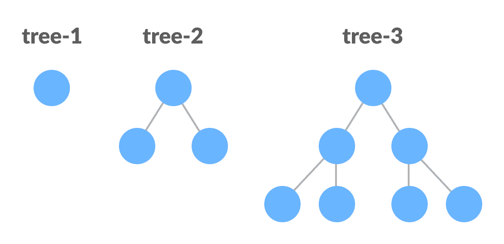

# 完美的二叉树

> 原文： [https://www.programiz.com/dsa/perfect-binary-tree](https://www.programiz.com/dsa/perfect-binary-tree)

#### 在本教程中，您将学习完美的二叉树。 此外，您还将找到一些用于检查 C，C++ ，Java 和 Python 中完美的二叉树的示例。

完美的二叉树是一种二叉树，其中每个内部节点恰好有两个子节点，而所有叶节点都处于同一级别。


Perfect Binary Tree


所有内部节点的度数均为 2。

递归地，可以将完美的二叉树定义为：

1.  如果单个节点没有子节点，则它是高度为`h = 0`的完美二叉树，
2.  如果节点具有`h > 0`，则如果其两个子树的高度均为`h - 1`并且不重叠，则它是理想的二叉树。



Perfect Binary Tree (Recursive Representation)


* * *

## Python，Java 和 C / C++ 示例

以下代码用于检查树是否是完美的二叉树。

[Python](#python-code)[Java](#java-code)[C](#c-code)[C++](#cpp-code)

```
# Checking if a binary tree is a perfect binary tree in Python

class newNode:
    def __init__(self, k):
        self.key = k
        self.right = self.left = None

# Calculate the depth
def calculateDepth(node):
    d = 0
    while (node is not None):
        d += 1
        node = node.left
    return d

# Check if the tree is perfect binary tree
def is_perfect(root, d, level=0):

    # Check if the tree is empty
    if (root is None):
        return True

    # Check the presence of trees
    if (root.left is None and root.right is None):
        return (d == level + 1)

    if (root.left is None or root.right is None):
        return False

    return (is_perfect(root.left, d, level + 1) and
            is_perfect(root.right, d, level + 1))

root = None
root = newNode(1)
root.left = newNode(2)
root.right = newNode(3)
root.left.left = newNode(4)
root.left.right = newNode(5)

if (is_perfect(root, calculateDepth(root))):
    print("The tree is a perfect binary tree")
else:
    print("The tree is not a perfect binary tree")
```

```
// Checking if a binary tree is a perfect binary tree in Java

class PerfectBinaryTree {

  static class Node {
    int key;
    Node left, right;
  }

  // Calculate the depth
  static int depth(Node node) {
    int d = 0;
    while (node != null) {
      d++;
      node = node.left;
    }
    return d;
  }

  // Check if the tree is perfect binary tree
  static boolean is_perfect(Node root, int d, int level) {

    // Check if the tree is empty
    if (root == null)
      return true;

    // If for children
    if (root.left == null && root.right == null)
      return (d == level + 1);

    if (root.left == null || root.right == null)
      return false;

    return is_perfect(root.left, d, level + 1) && is_perfect(root.right, d, level + 1);
  }

  // Wrapper function
  static boolean is_Perfect(Node root) {
    int d = depth(root);
    return is_perfect(root, d, 0);
  }

  // Create a new node
  static Node newNode(int k) {
    Node node = new Node();
    node.key = k;
    node.right = null;
    node.left = null;
    return node;
  }

  public static void main(String args[]) {
    Node root = null;
    root = newNode(1);
    root.left = newNode(2);
    root.right = newNode(3);
    root.left.left = newNode(4);
    root.left.right = newNode(5);

    if (is_Perfect(root) == true)
      System.out.println("The tree is a perfect binary tree");
    else
      System.out.println("The tree is not a perfect binary tree");
  }
}
```

```
// Checking if a binary tree is a perfect binary tree in C

#include <stdbool.h>
#include <stdio.h>
#include <stdlib.h>

struct node {
  int data;
  struct node *left;
  struct node *right;
};

// Creating a new node
struct node *newnode(int data) {
  struct node *node = (struct node *)malloc(sizeof(struct node));
  node->data = data;
  node->left = NULL;
  node->right = NULL;

  return (node);
}

// Calculate the depth
int depth(struct node *node) {
  int d = 0;
  while (node != NULL) {
    d++;
    node = node->left;
  }
  return d;
}

// Check if the tree is perfect
bool is_perfect(struct node *root, int d, int level) {
    // Check if the tree is empty
  if (root == NULL)
    return true;

  // Check the presence of children
  if (root->left == NULL && root->right == NULL)
    return (d == level + 1);

  if (root->left == NULL || root->right == NULL)
    return false;

  return is_perfect(root->left, d, level + 1) &&
       is_perfect(root->right, d, level + 1);
}

// Wrapper function
bool is_Perfect(struct node *root) {
  int d = depth(root);
  return is_perfect(root, d, 0);
}

int main() {
  struct node *root = NULL;
  root = newnode(1);
  root->left = newnode(2);
  root->right = newnode(3);
  root->left->left = newnode(4);
  root->left->right = newnode(5);
  root->right->left = newnode(6);

  if (is_Perfect(root))
    printf("The tree is a perfect binary tree\n");
  else
    printf("The tree is not a perfect binary tree\n");
}
```

```
// Checking if a binary tree is a full binary tree in C++

#include <iostream>
using namespace std;

struct Node {
  int key;
  struct Node *left, *right;
};

// New node creation
struct Node *newNode(char k) {
  struct Node *node = (struct Node *)malloc(sizeof(struct Node));
  node->key = k;
  node->right = node->left = NULL;
  return node;
}

bool isFullBinaryTree(struct Node *root) {
    // Checking for emptiness
  if (root == NULL)
    return true;

  // Checking for the presence of children
  if (root->left == NULL && root->right == NULL)
    return true;

  if ((root->left) && (root->right))
    return (isFullBinaryTree(root->left) && isFullBinaryTree(root->right));

  return false;
}

int main() {
  struct Node *root = NULL;
  root = newNode(1);
  root->left = newNode(2);
  root->right = newNode(3);
  root->left->left = newNode(4);
  root->left->right = newNode(5);
  root->left->left->left = newNode(6);
  root->left->left->right = newNode(7);

  if (isFullBinaryTree(root))
    cout << "The tree is a full binary tree\n";
  else
    cout << "The tree is not a full binary full\n";
}
```

* * *

## 完美二叉树定理

1.  高度为 h 的完美二叉树具有`2<sup>h + 1</sup> – 1`节点。
2.  具有 n 个节点的理想二叉树的高度为`log(n + 1) – 1 = Θ(ln(n))`。
3.  高度为 h 的理想二叉树具有`2<sup>h</sup>`叶节点。
4.  完美二叉树中节点的平均深度为`Θ(ln(n))`。