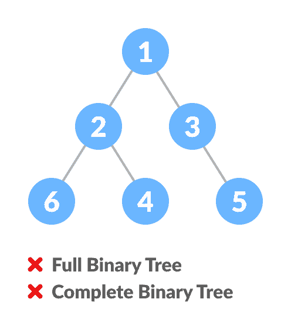
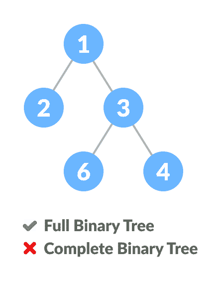
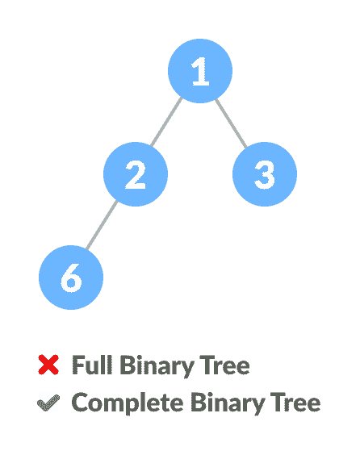
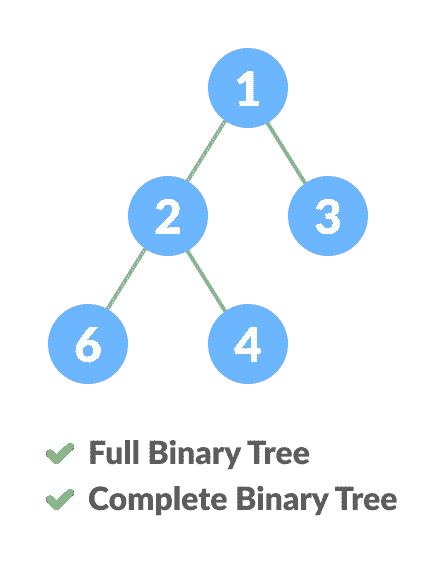
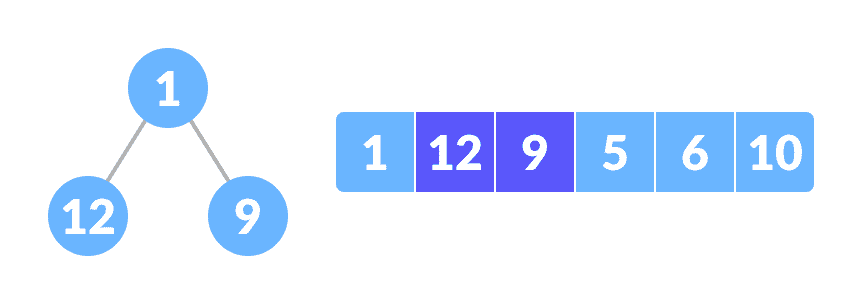
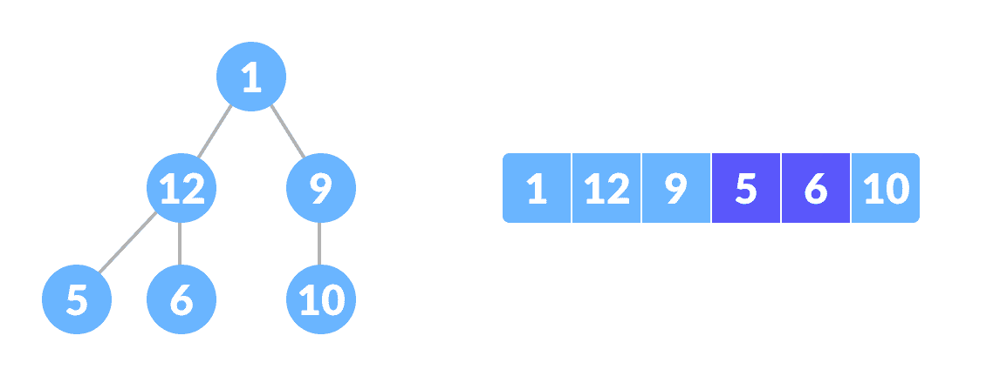

# 完整的二叉树

> 原文： [https://www.programiz.com/dsa/complete-binary-tree](https://www.programiz.com/dsa/complete-binary-tree)

#### 在本教程中，您将学习完整的二叉树及其不同类型。 此外，您还将在 C，C++ ，Java 和 Python 中找到完整的二叉树的工作示例。

完整的二叉树是一棵二叉树，其中所有级别均已完全填充，但最低级别可能会从左侧填充。

完整的二叉树就像完整的二叉树，但有两个主要区别

1.  所有叶子元素都必须向左倾斜。
2.  最后一个叶子元素可能没有正确的同级，即完整的二叉树不必是完整的二叉树。


Complete Binary Tree


* * *

## 完整二叉树 vs 完整二叉树



Comparison between full binary tree and complete binary tree




Comparison between full binary tree and complete binary tree




Comparison between full binary tree and complete binary tree




Comparison between full binary tree and complete binary tree


* * *

## 如何创建完整的二叉树？

1.  选择列表的第一个元素作为根节点。 （级别 I 上的元素数：1）

    

    选择第一个元素作为根

    

2.  将第二个元素作为根节点的左子元素，将第三个元素作为右子元素。 （第 II 级元素的数量：2）

    

    12 个是左侧孩子，9 个是右侧孩子

    

3.  将接下来的两个元素作为第二级左节点的子级。 同样，将接下来的两个元素作为第二层右节点的子元素（第 III 层上的元素数量：4 个）。
4.  不断重复，直到到达最后一个元素。

    

    5 个是左侧孩子，6 个是右侧孩子

    

* * *

## Python，Java 和 C / C++ 示例

[Python](#python-code)[Java](#java-code)[C](#c-code)[C++](#cpp-code)

```
# Checking if a binary tree is a complete binary tree in C

class Node:

    def __init__(self, item):
        self.item = item
        self.left = None
        self.right = None

# Count the number of nodes
def count_nodes(root):
    if root is None:
        return 0
    return (1 + count_nodes(root.left) + count_nodes(root.right))

# Check if the tree is complete binary tree
def is_complete(root, index, numberNodes):

    # Check if the tree is empty
    if root is None:
        return True

    if index >= numberNodes:
        return False

    return (is_complete(root.left, 2 * index + 1, numberNodes)
            and is_complete(root.right, 2 * index + 2, numberNodes))

root = Node(1)
root.left = Node(2)
root.right = Node(3)
root.left.left = Node(4)
root.left.right = Node(5)
root.right.left = Node(6)

node_count = count_nodes(root)
index = 0

if is_complete(root, index, node_count):
    print("The tree is a complete binary tree")
else:
    print("The tree is not a complete binary tree") 
```

```
// Checking if a binary tree is a complete binary tree in Java

// Node creation
class Node {
  int data;
  Node left, right;

  Node(int item) {
    data = item;
    left = right = null;
  }
}

class BinaryTree {
  Node root;

  // Count the number of nodes
  int countNumNodes(Node root) {
    if (root == null)
      return (0);
    return (1 + countNumNodes(root.left) + countNumNodes(root.right));
  }

  // Check for complete binary tree
  boolean checkComplete(Node root, int index, int numberNodes) {

    // Check if the tree is empty
    if (root == null)
      return true;

    if (index >= numberNodes)
      return false;

    return (checkComplete(root.left, 2 * index + 1, numberNodes)
        && checkComplete(root.right, 2 * index + 2, numberNodes));
  }

  public static void main(String args[]) {
    BinaryTree tree = new BinaryTree();

    tree.root = new Node(1);
    tree.root.left = new Node(2);
    tree.root.right = new Node(3);
    tree.root.left.right = new Node(5);
    tree.root.left.left = new Node(4);
    tree.root.right.left = new Node(6);

    int node_count = tree.countNumNodes(tree.root);
    int index = 0;

    if (tree.checkComplete(tree.root, index, node_count))
      System.out.println("The tree is a complete binary tree");
    else
      System.out.println("The tree is not a complete binary tree");
  }
}
```

```
// Checking if a binary tree is a complete binary tree in C

#include <stdbool.h>
#include <stdio.h>
#include <stdlib.h>

struct Node {
  int key;
  struct Node *left, *right;
};

// Node creation
struct Node *newNode(char k) {
  struct Node *node = (struct Node *)malloc(sizeof(struct Node));
  node->key = k;
  node->right = node->left = NULL;
  return node;
}

// Count the number of nodes
int countNumNodes(struct Node *root) {
  if (root == NULL)
    return (0);
  return (1 + countNumNodes(root->left) + countNumNodes(root->right));
}

// Check if the tree is a complete binary tree
bool checkComplete(struct Node *root, int index, int numberNodes) {
  // Check if the tree is complete
  if (root == NULL)
    return true;

  if (index >= numberNodes)
    return false;

  return (checkComplete(root->left, 2 * index + 1, numberNodes) && checkComplete(root->right, 2 * index + 2, numberNodes));
}

int main() {
  struct Node *root = NULL;
  root = newNode(1);
  root->left = newNode(2);
  root->right = newNode(3);
  root->left->left = newNode(4);
  root->left->right = newNode(5);
  root->right->left = newNode(6);

  int node_count = countNumNodes(root);
  int index = 0;

  if (checkComplete(root, index, node_count))
    printf("The tree is a complete binary tree\n");
  else
    printf("The tree is not a complete binary tree\n");
}
```

```
// Checking if a binary tree is a complete binary tree in C++

#include <iostream>

using namespace std;

struct Node {
  int key;
  struct Node *left, *right;
};

// Create node
struct Node *newNode(char k) {
  struct Node *node = (struct Node *)malloc(sizeof(struct Node));
  node->key = k;
  node->right = node->left = NULL;
  return node;
}

// Count the number of nodes
int countNumNodes(struct Node *root) {
  if (root == NULL)
    return (0);
  return (1 + countNumNodes(root->left) + countNumNodes(root->right));
}

// Check if the tree is a complete binary tree
bool checkComplete(struct Node *root, int index, int numberNodes) {

  // Check if the tree is empty
  if (root == NULL)
    return true;

  if (index >= numberNodes)
    return false;

  return (checkComplete(root->left, 2 * index + 1, numberNodes) && checkComplete(root->right, 2 * index + 2, numberNodes));
}

int main() {
  struct Node *root = NULL;
  root = newNode(1);
  root->left = newNode(2);
  root->right = newNode(3);
  root->left->left = newNode(4);
  root->left->right = newNode(5);
  root->right->left = newNode(6);

  int node_count = countNumNodes(root);
  int index = 0;

  if (checkComplete(root, index, node_count))
    cout << "The tree is a complete binary tree\n";
  else
    cout << "The tree is not a complete binary tree\n";
} 
```

* * *

## 数组索引和树元素之间的关系

完整的二叉树具有一个有趣的属性，我们可以用来查找任何节点的子代和父代。

如果数组中任何元素的索引为`i`，则索引`2i+1`中的元素将成为左子元素，而`2i+2`索引中的元素将成为右子元素。 同样，索引为`i`的任何元素的父级都由`(i-1)/2`的下限给出。

让我们测试一下

```
Left child of 1 (index 0)
= element in (2*0+1) index 
= element in 1 index 
= 12

Right child of 1
= element in (2*0+2) index
= element in 2 index 
= 9

Similarly,
Left child of 12 (index 1)
= element in (2*1+1) index
= element in 3 index
= 5

Right child of 12
= element in (2*1+2) index
= element in 4 index
= 6

```

我们还要确认规则是否适用于寻找任何节点的父节点

```
Parent of 9 (position 2) 
= (2-1)/2 
= ½ 
= 0.5
~ 0 index 
= 1

Parent of 12 (position 1) 
= (1-1)/2 
= 0 index 
= 1

```

了解数组索引到树位置的这种映射对于了解[堆数据结构](https://www.programiz.com/dsa/heap-data-structure)的工作方式以及如何用于实现[堆排序](https://www.programiz.com/dsa/heap-sort)至关重要。

* * *

## 完整的二叉树应用

*   基于堆的数据结构
*   [堆排序](https://www.programiz.com/dsa/heap-sort)