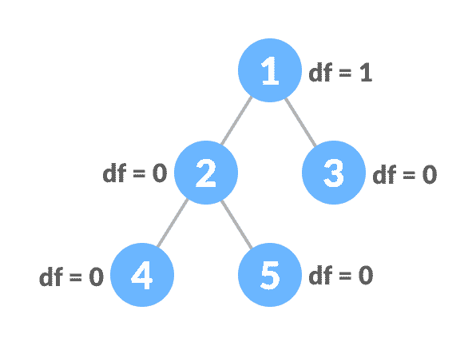
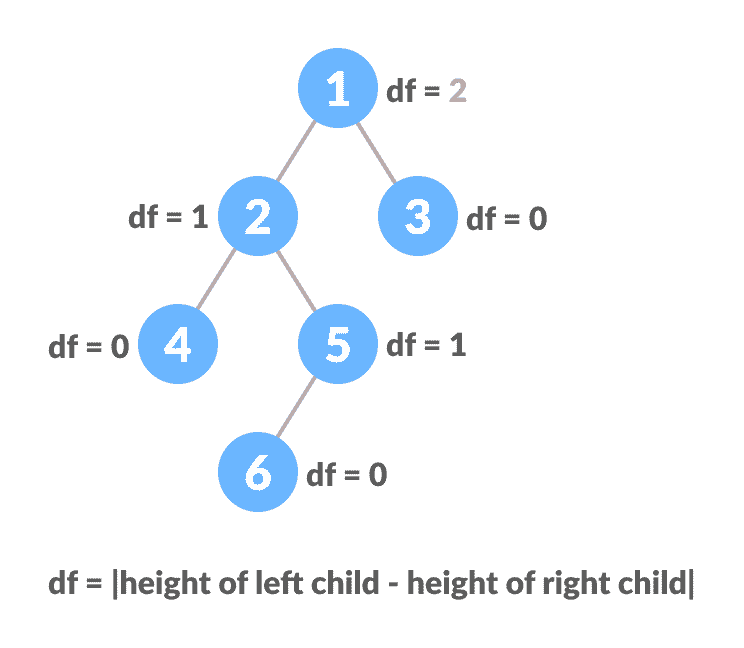

# 平衡二叉树

> 原文： [https://www.programiz.com/dsa/balanced-binary-tree](https://www.programiz.com/dsa/balanced-binary-tree)

#### 在本教程中，您将了解平衡的二叉树及其不同类型。 此外，您还将在 C，C ++，Java 和 Python 中找到平衡二叉树的工作示例。

平衡二叉树（也称为高度平衡二叉树）定义为二叉树，其中任何节点的左和右子树的高度相差不超过 1。

要了解有关树/节点的高度的更多信息，请访问[树数据结构](https://www.programiz.com/dsa/trees)。以下是高度平衡的二叉树的条件：

1.  任何节点的左和右子树之间的差异不超过一个
2.  左子树是平衡的
3.  正确的子树是平衡的



Balanced Binary Tree with depth at each level




Unbalanced Binary Tree with depth at each level


* * *

## Python，Java 和 C / C ++示例

以下代码用于检查树是否高度平衡。

[Python](#python-code)[Java](#java-code)[C](#c-code)[C++](#cpp-code)

```
# Checking if a binary tree is CalculateHeight balanced in Python

# CreateNode creation
class CreateNode:

    def __init__(self, item):
        self.item = item
        self.left = self.right = None

# Calculate height
class CalculateHeight:
    def __init__(self):
        self.CalculateHeight = 0

# Check height balance
def is_height_balanced(root, CalculateHeight):

    left_height = CalculateHeight()
    right_height = CalculateHeight()

    if root is None:
        return True

    l = is_height_balanced(root.left, left_height)
    r = is_height_balanced(root.right, right_height)

    CalculateHeight.CalculateHeight = max(
        left_height.CalculateHeight, right_height.CalculateHeight) + 1

    if abs(left_height.CalculateHeight - right_height.CalculateHeight) <= 1:
        return l and r

    return False

CalculateHeight = CalculateHeight()

root = CreateNode(1)
root.left = CreateNode(2)
root.right = CreateNode(3)
root.left.left = CreateNode(4)
root.left.right = CreateNode(5)

if is_height_balanced(root, CalculateHeight):
    print('The tree is balanced')
else:
    print('The tree is not balanced') 
```

```
// Checking if a binary tree is height balanced in Java

// Node creation
class Node {

  int data;
  Node left, right;

  Node(int d) {
    data = d;
    left = right = null;
  }
}

// Calculate height
class Height {
  int height = 0;
}

class BinaryTree {

  Node root;

  // Check height balance
  boolean checkHeightBalance(Node root, Height height) {

    // Check for emptiness
    if (root == null) {
      height.height = 0;
      return true;
    }

    Height leftHeighteight = new Height(), rightHeighteight = new Height();
    boolean l = checkHeightBalance(root.left, leftHeighteight);
    boolean r = checkHeightBalance(root.right, rightHeighteight);
    int leftHeight = leftHeighteight.height, rightHeight = rightHeighteight.height;

    height.height = (leftHeight > rightHeight ? leftHeight : rightHeight) + 1;

    if ((leftHeight - rightHeight >= 2) || (rightHeight - leftHeight >= 2))
      return false;

    else
      return l && r;
  }

  public static void main(String args[]) {
    Height height = new Height();

    BinaryTree tree = new BinaryTree();
    tree.root = new Node(1);
    tree.root.left = new Node(2);
    tree.root.right = new Node(3);
    tree.root.left.left = new Node(4);
    tree.root.left.right = new Node(5);

    if (tree.checkHeightBalance(tree.root, height))
      System.out.println("The tree is balanced");
    else
      System.out.println("The tree is not balanced");
  }
}
```

```
// Checking if a binary tree is height balanced in C

#include <stdio.h>
#include <stdlib.h>
#define bool int

// Node creation
struct node {
  int item;
  struct node *left;
  struct node *right;
};

// Create a new node
struct node *newNode(int item) {
  struct node *node = (struct node *)malloc(sizeof(struct node));
  node->item = item;
  node->left = NULL;
  node->right = NULL;

  return (node);
}

// Check for height balance
bool checkHeightBalance(struct node *root, int *height) {
  // Check for emptiness
  int leftHeight = 0, rightHeight = 0;
  int l = 0, r = 0;

  if (root == NULL) {
    *height = 0;
    return 1;
  }

  l = checkHeightBalance(root->left, &leftHeight);
  r = checkHeightBalance(root->right, &rightHeight);

  *height = (leftHeight > rightHeight ? leftHeight : rightHeight) + 1;

  if ((leftHeight - rightHeight >= 2) || (rightHeight - leftHeight >= 2))
    return 0;

  else
    return l && r;
}

int main() {
  int height = 0;

  struct node *root = newNode(1);
  root->left = newNode(2);
  root->right = newNode(3);
  root->left->left = newNode(4);
  root->left->right = newNode(5);

  if (checkHeightBalance(root, &height))
    printf("The tree is balanced");
  else
    printf("The tree is not balanced");
}
```

```
// Checking if a binary tree is height balanced in C++

#include <iostream>
using namespace std;

#define bool int

class node {
   public:
  int item;
  node *left;
  node *right;
};

// Create anew node
node *newNode(int item) {
  node *Node = new node();
  Node->item = item;
  Node->left = NULL;
  Node->right = NULL;

  return (Node);
}

// Check height balance
bool checkHeightBalance(node *root, int *height) {
  // Check for emptiness
  int leftHeight = 0, rightHeight = 0;

  int l = 0, r = 0;

  if (root == NULL) {
    *height = 0;
    return 1;
  }

  l = checkHeightBalance(root->left, &leftHeight);
  r = checkHeightBalance(root->right, &rightHeight);

  *height = (leftHeight > rightHeight ? leftHeight : rightHeight) + 1;

  if ((leftHeight - rightHeight >= 2) || (rightHeight - leftHeight >= 2))
    return 0;

  else
    return l && r;
}

int main() {
  int height = 0;

  node *root = newNode(1);
  root->left = newNode(2);
  root->right = newNode(3);
  root->left->left = newNode(4);
  root->left->right = newNode(5);

  if (checkHeightBalance(root, &height))
    cout << "The tree is balanced";
  else
    cout << "The tree is not balanced";
}
```

* * *

## 平衡二叉树应用

*   [AVL 树](https://www.programiz.com/dsa/avl-tree)
*   平衡的[二进制搜索树](https://www.programiz.com/dsa/binary-search-tree)