# AVL 树

> 原文： [https://www.programiz.com/dsa/avl-tree](https://www.programiz.com/dsa/avl-tree)

#### 在本教程中，您将学习什么是 avl 树。 此外，您还将找到在 C，C++ ，Java 和 Python 的 avl 树上执行的各种操作的工作示例。

AVL 树是一种自平衡二叉搜索树，其中每个节点都维护额外的信息，称为平衡因子，其值为 -1、0 或 +1。

AVL 树以其发明者 Georgy Adelson-Velsky 和 Landis 得名。

* * *

## 平衡系数

AVL 树中节点的平衡因子是该节点的左子树的高度和右子树的高度之间的差。

平衡因子=（左子树的高度-右子树的高度）或（右子树的高度-左子树的高度）

Avl 树的自平衡属性由平衡因子保持。 平衡因子的值应始终为 -1、0 或 +1。

平衡 avl 树的示例是：


Avl tree


* * *

## AVL 树上的操作

可以在 AVL 树上执行的各种操作是：

## 旋转 AVL 树中的子树

在旋转操作中，子树的节点位置互换。

轮播有两种类型：

* * *

### 向左旋转

在向左旋转时，右侧节点的排列将转换为左侧节点的排列。

算法

1.  令初始树为：

    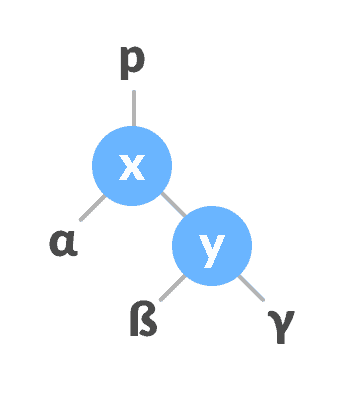

    左旋转

    

2.  如果`y`具有左子树，则将`x`分配为`y`的左子树的父树。

    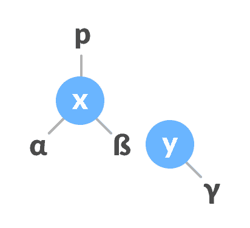

    将`x`分配为`y`的左子树的父级

    

3.  如果`x`的父级是`NULL`，则将`y`作为树的根。
4.  否则，如果`x`是`p`的左子代，则将`y`设为`p`的左子代。
5.  否则，将`y`分配为`p`的右子元素。

    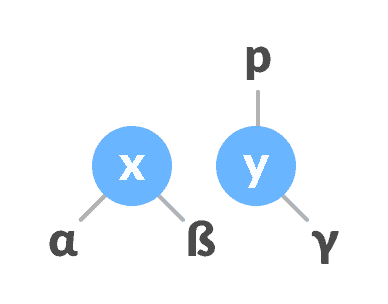

    将`x`的父级更改为`y`的父级

    

6.  将`y`设为`x`的父代。

    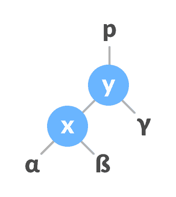

    将`y`指定为`x`的父代。

    

* * *

### 向右旋转

在向左旋转时，左侧节点的排列将转换为右侧节点的排列。

1.  令初始树为：

    

    初始树

    

2.  如果`x`具有右子树，则将`y`分配为`x`的右子树的父树。

    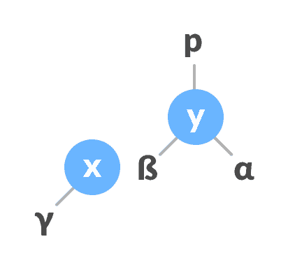

    将`y`分配为`x`

    

    的右子树的父级
3.  如果`y`的父级为`NULL`，则将`x`作为树的根。
4.  否则，如果`y`是其父级`p`的右子，则将`x`作为`p`的右子。
5.  否则，将`x`分配为`p`的左子元素。

    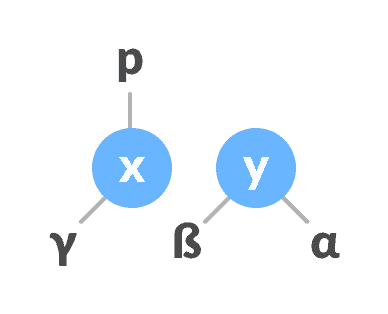

    将`y`的父级指定为`x`的父级。

    

6.  使`x`为`y`的父代。

    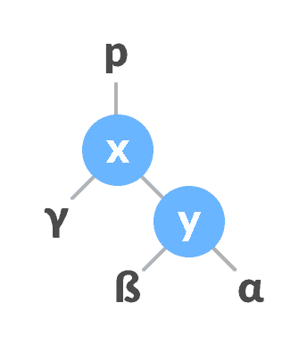

    将`x`分配为`y`的父项

    

* * *

### 左右旋转

在左右旋转时，首先将布置向左移动，然后向右移动。

1.  在`x-y`上向左旋转。

    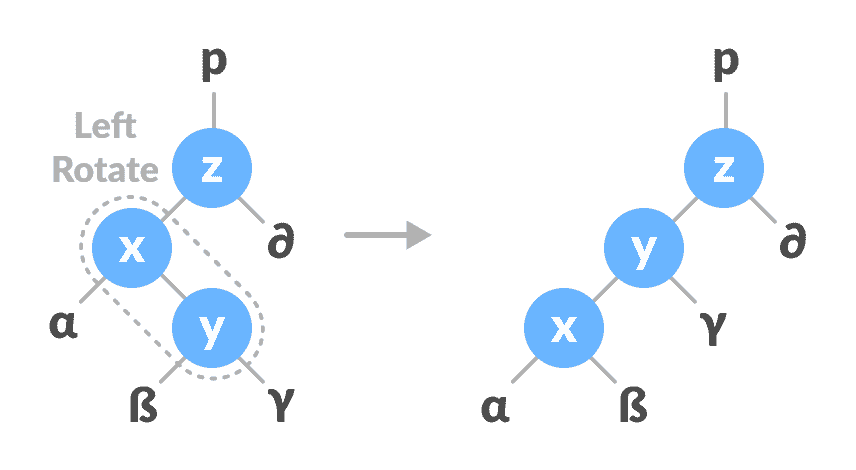

    向左旋转`x-y`

    

2.  在`y-z`上右旋转。

    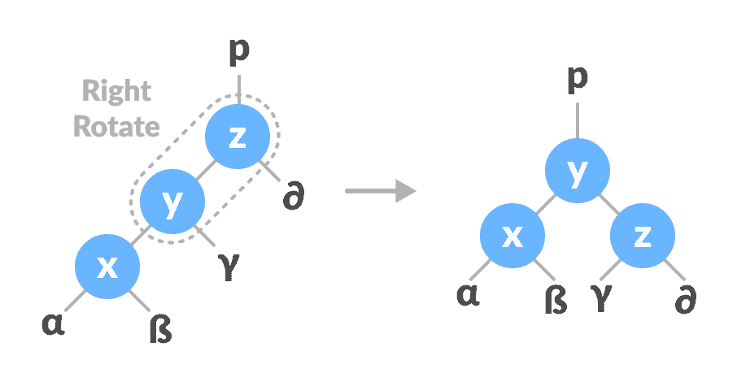

    向右旋转`z-y`

    

在左右旋转时，这些布置首先向右移动，然后向左移动。

1.  在`x-y`上右旋转。

    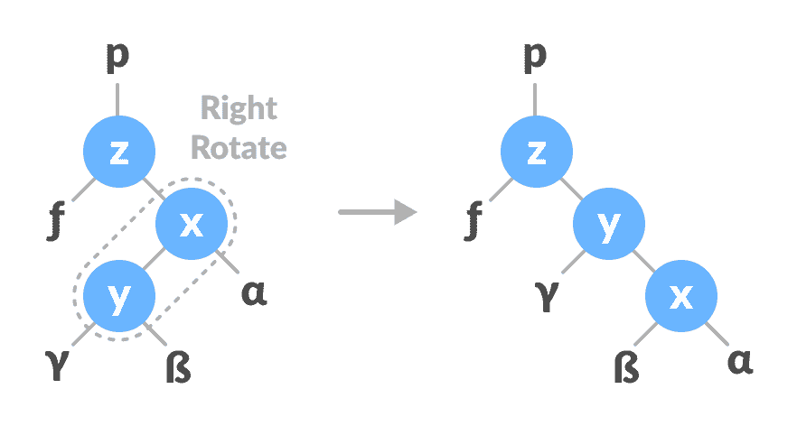

    右旋转`x-y`

    

2.  在`z-y`上向左旋转。

    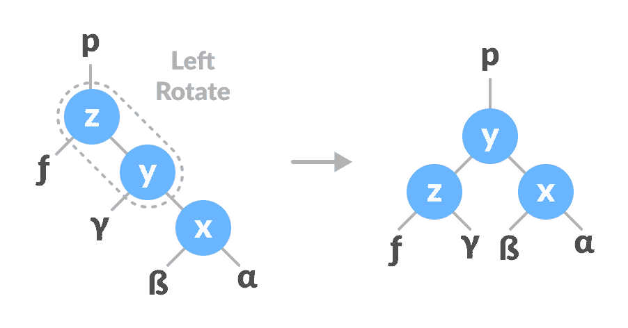

    向左旋转`z-y`

    

* * *

## 插入`newNode`的算法

`newNode`始终作为平衡因子等于 0 的叶节点插入。

1.  令初始树为：

    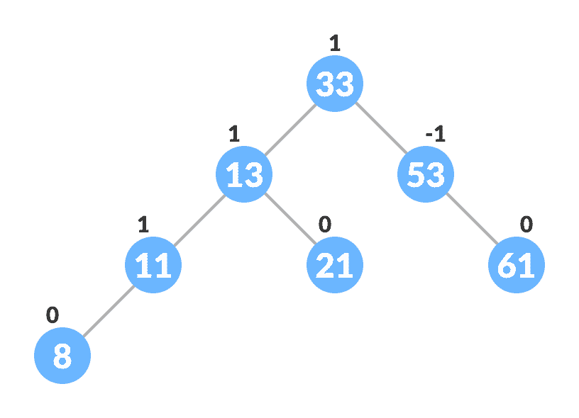

    插入的初始树

    

    令要插入的节点为：

    

    新节点

    

2.  使用以下递归步骤转到相应的叶节点以插入`newNode`。 比较`newKey`与当前树的`rootKey`。
    1.  如果`newKey < rootKey`，则在当前节点的左子树上调用插入算法，直到到达叶节点为止。
    2.  否则，如果`newKey > rootKey`，则在当前节点的右子树上调用插入算法，直到到达叶节点为止。
    3.  否则，返回`leafNode`。

        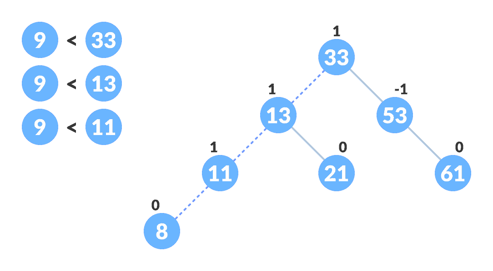

        查找插入`newNode`的位置

        

3.  将通过上述步骤获得的`leafKey`与`newKey`进行比较：
    1.  如果`newKey < leafKey`，则将`newNode`设为`leafNode`的`leftChild`。
    2.  否则，将`newNode`设为`leafNode`的`rightChild`。

        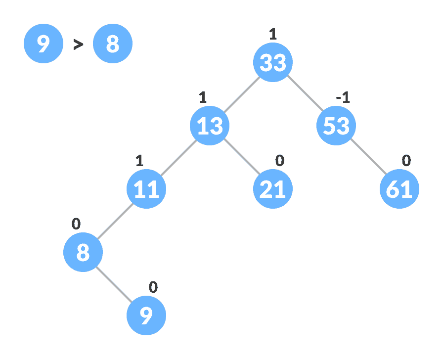

        插入新节点

        

4.  更新节点的`balanceFactor`。

    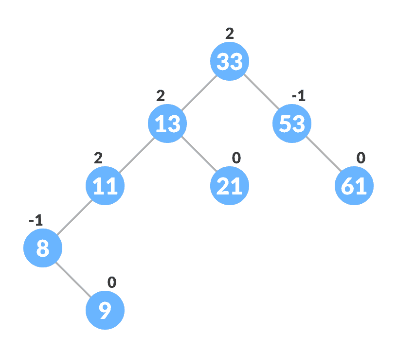

    插入后更新平衡因子

    

5.  如果节点不平衡，请重新平衡该节点。
    1.  如果`balanceFactor > 1`，则表示左侧子树的高度大于右侧子树的高度。 因此，请向右旋转或向左旋转
        1.  如果`newNodeKey < leftChildKey`进行右旋转。
        2.  否则，请左右旋转。

            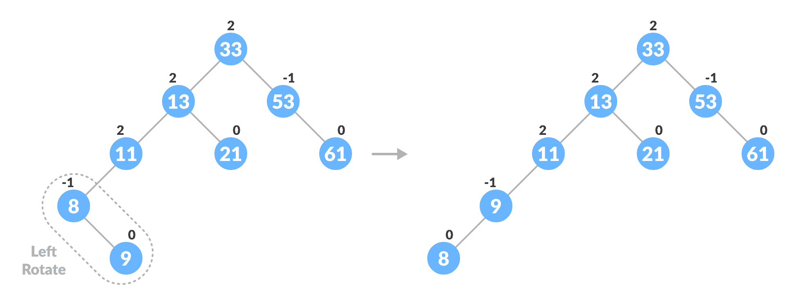

            旋转平衡树

            

            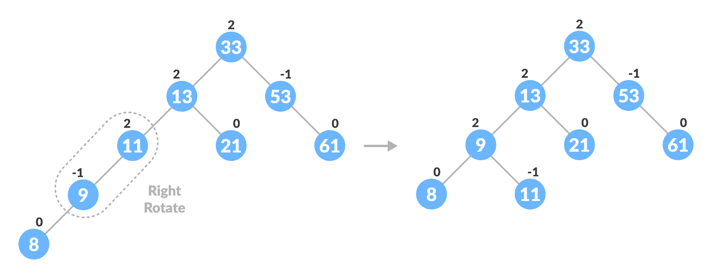

            旋转平衡树

            

    2.  如果`balanceFactor < -1`，则意味着右子树的高度大于左子树的高度。 因此，请向右旋转或向左旋转
        1.  如果`newNodeKey > rightChildKey`进行左旋转。
        2.  否则，请左右旋转
6.  最终的树是：

    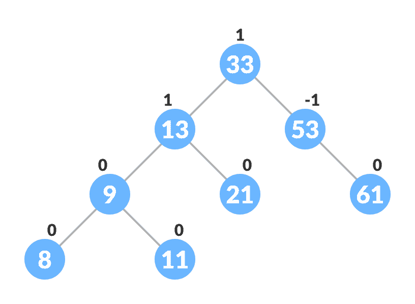

    最终的平衡树

    

* * *

## 删除节点的算法

节点始终被删除为叶节点。 删除节点后，节点的平衡因子将更改。 为了重新平衡平衡系数，执行适当的旋转。

1.  找到`nodeToBeDeleted`（递归用于在下面使用的代码中找到`nodeToBeDeleted`）。

    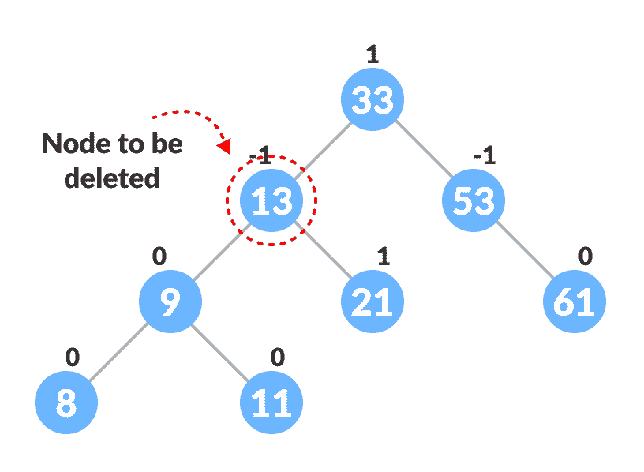

    定位要删除的节点

    

2.  删除节点有以下三种情况：
    1.  如果`nodeToBeDeleted`是叶节点（即没有任何子节点），则删除`nodeToBeDeleted`。
    2.  如果`nodeToBeDeleted`有一个孩子，则用该孩子的内容替换`nodeToBeDeleted`的内容。 移走孩子。
    3.  如果`nodeToBeDeleted`有两个孩子，则找到`nodeToBeDeleted`的有序继承人`w`（即，在右子树中具有键的最小值的节点）。

        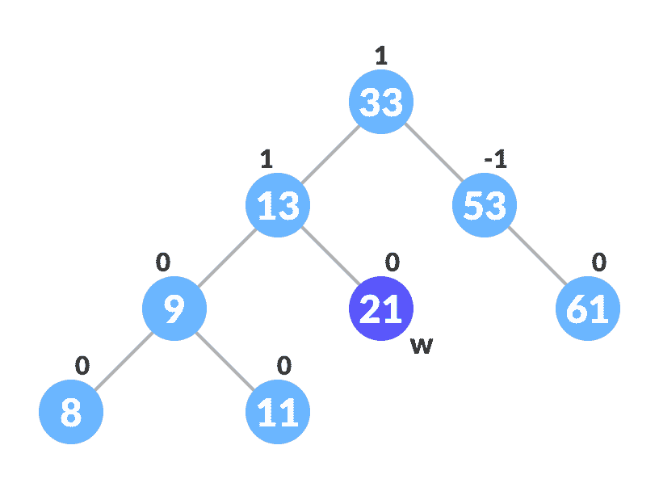

        寻找继任者

        

        1.  将`nodeToBeDeleted`的内容替换为`w`的内容。

            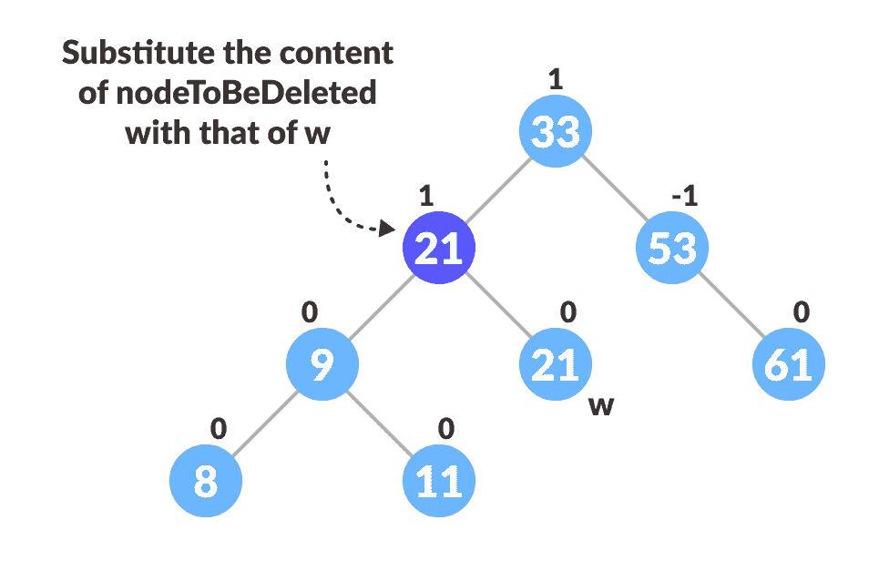

            替换要删除的节点

            

        2.  删除叶节点`w`。

            

            移除

            

3.  更新节点的`balanceFactor`。

    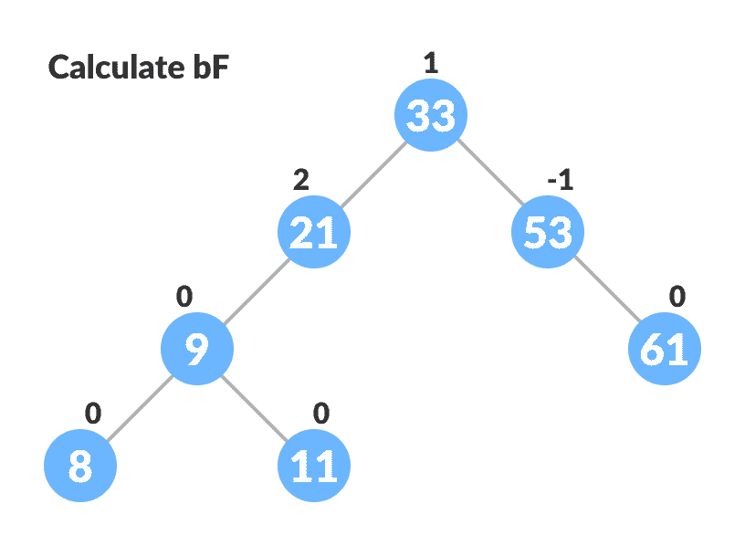

    更新`bf`

    

4.  如果任何节点的平衡因子不等于 -1、0 或 1，则重新平衡树。
    1.  如果`currentNode > balanceFactor`，
        1.  如果`leftChild`的`balanceFactor >= 0`，请向右旋转。

            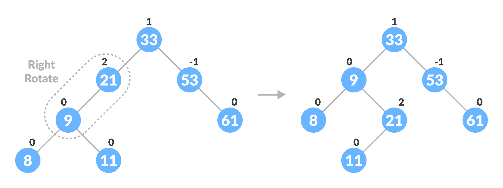

            向右旋转以平衡树

            

        2.  否则做左右旋转。
    2.  如果`currentNode`的`balanceFactor < -1`，
        1.  如果`rightChild`的`balanceFactor = 0`，请向左旋转。
        2.  否则做左右旋转。
5.  最终的树是：

    

    Avl 最终树

    

* * *

## Python，Java 和 C/C++ 示例

[Python](#python-code)[Java](#java-code)[C](#c-code)[C++](#cpp-code)

```
# AVL tree implementation in Python

import sys

# Create a tree node
class TreeNode(object):
    def __init__(self, key):
        self.key = key
        self.left = None
        self.right = None
        self.height = 1

class AVLTree(object):

    # Function to insert a node
    def insert_node(self, root, key):

        # Find the correct location and insert the node
        if not root:
            return TreeNode(key)
        elif key < root.key:
            root.left = self.insert_node(root.left, key)
        else:
            root.right = self.insert_node(root.right, key)

        root.height = 1 + max(self.getHeight(root.left),
                              self.getHeight(root.right))

        # Update the balance factor and balance the tree
        balanceFactor = self.getBalance(root)
        if balanceFactor > 1:
            if key < root.left.key:
                return self.rightRotate(root)
            else:
                root.left = self.leftRotate(root.left)
                return self.rightRotate(root)

        if balanceFactor < -1:
            if key > root.right.key:
                return self.leftRotate(root)
            else:
                root.right = self.rightRotate(root.right)
                return self.leftRotate(root)

        return root

    # Function to delete a node
    def delete_node(self, root, key):

        # Find the node to be deleted and remove it
        if not root:
            return root
        elif key < root.key:
            root.left = self.delete_node(root.left, key)
        elif key > root.key:
            root.right = self.delete_node(root.right, key)
        else:
            if root.left is None:
                temp = root.right
                root = None
                return temp
            elif root.right is None:
                temp = root.left
                root = None
                return temp
            temp = self.getMinValueNode(root.right)
            root.key = temp.key
            root.right = self.delete_node(root.right,
                                          temp.key)
        if root is None:
            return root

        # Update the balance factor of nodes
        root.height = 1 + max(self.getHeight(root.left),
                              self.getHeight(root.right))

        balanceFactor = self.getBalance(root)

        # Balance the tree
        if balanceFactor > 1:
            if self.getBalance(root.left) >= 0:
                return self.rightRotate(root)
            else:
                root.left = self.leftRotate(root.left)
                return self.rightRotate(root)
        if balanceFactor < -1:
            if self.getBalance(root.right) <= 0:
                return self.leftRotate(root)
            else:
                root.right = self.rightRotate(root.right)
                return self.leftRotate(root)
        return root

    # Function to perform left rotation
    def leftRotate(self, z):
        y = z.right
        T2 = y.left
        y.left = z
        z.right = T2
        z.height = 1 + max(self.getHeight(z.left),
                           self.getHeight(z.right))
        y.height = 1 + max(self.getHeight(y.left),
                           self.getHeight(y.right))
        return y

    # Function to perform right rotation
    def rightRotate(self, z):
        y = z.left
        T3 = y.right
        y.right = z
        z.left = T3
        z.height = 1 + max(self.getHeight(z.left),
                           self.getHeight(z.right))
        y.height = 1 + max(self.getHeight(y.left),
                           self.getHeight(y.right))
        return y

    # Get the height of the node
    def getHeight(self, root):
        if not root:
            return 0
        return root.height

    # Get balance factore of the node
    def getBalance(self, root):
        if not root:
            return 0
        return self.getHeight(root.left) - self.getHeight(root.right)

    def getMinValueNode(self, root):
        if root is None or root.left is None:
            return root
        return self.getMinValueNode(root.left)

    def preOrder(self, root):
        if not root:
            return
        print("{0} ".format(root.key), end="")
        self.preOrder(root.left)
        self.preOrder(root.right)

    # Print the tree
    def printHelper(self, currPtr, indent, last):
        if currPtr != None:
            sys.stdout.write(indent)
            if last:
                sys.stdout.write("R----")
                indent += "     "
            else:
                sys.stdout.write("L----")
                indent += "|    "
            print(currPtr.key)
            self.printHelper(currPtr.left, indent, False)
            self.printHelper(currPtr.right, indent, True)

myTree = AVLTree()
root = None
nums = [33, 13, 52, 9, 21, 61, 8, 11]
for num in nums:
    root = myTree.insert_node(root, num)
myTree.printHelper(root, "", True)
key = 13
root = myTree.delete_node(root, key)
print("After Deletion: ")
myTree.printHelper(root, "", True)
```

```
// AVL tree implementation in Java

// Create node
class Node {
  int item, height;
  Node left, right;

  Node(int d) {
    item = d;
    height = 1;
  }
}

// Tree class
class AVLTree {
  Node root;

  int height(Node N) {
    if (N == null)
      return 0;
    return N.height;
  }

  int max(int a, int b) {
    return (a > b) ? a : b;
  }

  Node rightRotate(Node y) {
    Node x = y.left;
    Node T2 = x.right;
    x.right = y;
    y.left = T2;
    y.height = max(height(y.left), height(y.right)) + 1;
    x.height = max(height(x.left), height(x.right)) + 1;
    return x;
  }

  Node leftRotate(Node x) {
    Node y = x.right;
    Node T2 = y.left;
    y.left = x;
    x.right = T2;
    x.height = max(height(x.left), height(x.right)) + 1;
    y.height = max(height(y.left), height(y.right)) + 1;
    return y;
  }

  // Get balance factor of a node
  int getBalanceFactor(Node N) {
    if (N == null)
      return 0;
    return height(N.left) - height(N.right);
  }

  // Insert a node
  Node insertNode(Node node, int item) {

    // Find the position and insert the node
    if (node == null)
      return (new Node(item));
    if (item < node.item)
      node.left = insertNode(node.left, item);
    else if (item > node.item)
      node.right = insertNode(node.right, item);
    else
      return node;

    // Update the balance factor of each node
    // And, balance the tree
    node.height = 1 + max(height(node.left), height(node.right));
    int balanceFactor = getBalanceFactor(node);
    if (balanceFactor > 1) {
      if (item < node.left.item) {
        return rightRotate(node);
      } else if (item > node.left.item) {
        node.left = leftRotate(node.left);
        return rightRotate(node);
      }
    }
    if (balanceFactor < -1) {
      if (item > node.right.item) {
        return leftRotate(node);
      } else if (item < node.right.item) {
        node.left = rightRotate(node.left);
        return leftRotate(node);
      }
    }
    return node;
  }

  Node nodeWithMimumValue(Node node) {
    Node current = node;
    while (current.left != null)
      current = current.left;
    return current;
  }

  // Delete a node
  Node deleteNode(Node root, int item) {

    // Find the node to be deleted and remove it
    if (root == null)
      return root;
    if (item < root.item)
      root.left = deleteNode(root.left, item);
    else if (item > root.item)
      root.right = deleteNode(root.right, item);
    else {
      if ((root.left == null) || (root.right == null)) {
        Node temp = null;
        if (temp == root.left)
          temp = root.right;
        else
          temp = root.left;
        if (temp == null) {
          temp = root;
          root = null;
        } else
          root = temp;
      } else {
        Node temp = nodeWithMimumValue(root.right);
        root.item = temp.item;
        root.right = deleteNode(root.right, temp.item);
      }
    }
    if (root == null)
      return root;

    // Update the balance factor of each node and balance the tree
    root.height = max(height(root.left), height(root.right)) + 1;
    int balanceFactor = getBalanceFactor(root);
    if (balanceFactor > 1) {
      if (getBalanceFactor(root.left) >= 0) {
        return rightRotate(root);
      } else {
        root.left = leftRotate(root.left);
        return rightRotate(root);
      }
    }
    if (balanceFactor < -1) {
      if (getBalanceFactor(root.right) <= 0) {
        return leftRotate(root);
      } else {
        root.right = rightRotate(root.right);
        return leftRotate(root);
      }
    }
    return root;
  }

  void preOrder(Node node) {
    if (node != null) {
      System.out.print(node.item + " ");
      preOrder(node.left);
      preOrder(node.right);
    }
  }

  // Print the tree
  private void printTree(Node currPtr, String indent, boolean last) {
    if (currPtr != null) {
      System.out.print(indent);
      if (last) {
        System.out.print("R----");
        indent += "   ";
      } else {
        System.out.print("L----");
        indent += "|  ";
      }
      System.out.println(currPtr.item);
      printTree(currPtr.left, indent, false);
      printTree(currPtr.right, indent, true);
    }
  }

  // Driver code
  public static void main(String[] args) {
    AVLTree tree = new AVLTree();
    tree.root = tree.insertNode(tree.root, 33);
    tree.root = tree.insertNode(tree.root, 13);
    tree.root = tree.insertNode(tree.root, 53);
    tree.root = tree.insertNode(tree.root, 9);
    tree.root = tree.insertNode(tree.root, 21);
    tree.root = tree.insertNode(tree.root, 61);
    tree.root = tree.insertNode(tree.root, 8);
    tree.root = tree.insertNode(tree.root, 11);
    tree.printTree(tree.root, "", true);
    tree.root = tree.deleteNode(tree.root, 13);
    System.out.println("After Deletion: ");
    tree.printTree(tree.root, "", true);
  }
}
```

```
// AVL tree implementation in C

#include <stdio.h>
#include <stdlib.h>

// Create Node
struct Node {
  int key;
  struct Node *left;
  struct Node *right;
  int height;
};

int max(int a, int b);

// Calculate height
int height(struct Node *N) {
  if (N == NULL)
    return 0;
  return N->height;
}

int max(int a, int b) {
  return (a > b) ? a : b;
}

// Create a node
struct Node *newNode(int key) {
  struct Node *node = (struct Node *)
    malloc(sizeof(struct Node));
  node->key = key;
  node->left = NULL;
  node->right = NULL;
  node->height = 1;
  return (node);
}

// Right rotate
struct Node *rightRotate(struct Node *y) {
  struct Node *x = y->left;
  struct Node *T2 = x->right;
  x->right = y;
  y->left = T2;
  y->height = max(height(y->left), height(y->right)) + 1;
  x->height = max(height(x->left), height(x->right)) + 1;
  return x;
}

// Left Rotate
struct Node *leftRotate(struct Node *x) {
  struct Node *y = x->right;
  struct Node *T2 = y->left;
  y->left = x;
  x->right = T2;
  x->height = max(height(x->left), height(x->right)) + 1;
  y->height = max(height(y->left), height(y->right)) + 1;
  return y;
}

// Get the balance factor
int getBalanceFactor(struct Node *N) {
  if (N == NULL)
    return 0;
  return height(N->left) - height(N->right);
}

// Insert node
struct Node *insertNode(struct Node *node, int key) {
  // Find the correct position to insert the node and insert it
  if (node == NULL)
    return (newNode(key));
  if (key < node->key)
    node->left = insertNode(node->left, key);
  else if (key > node->key)
    node->right = insertNode(node->right, key);
  else
    return node;

  // Update the balance factor of each node and
  // Balance the tree
  node->height = 1 + max(height(node->left),
               height(node->right));
  int balanceFactor = getBalanceFactor(node);
  if (balanceFactor > 1) {
    if (key < node->left->key) {
      return rightRotate(node);
    } else if (key > node->left->key) {
      node->left = leftRotate(node->left);
      return rightRotate(node);
    }
  }
  if (balanceFactor < -1) {
    if (key > node->right->key) {
      return leftRotate(node);
    } else if (key < node->right->key) {
      node->left = rightRotate(node->left);
      return leftRotate(node);
    }
  }
  return node;
}

struct Node *minValueNode(struct Node *node) {
  struct Node *current = node;
  while (current->left != NULL)
    current = current->left;
  return current;
}

// Delete a node
struct Node *deleteNode(struct Node *root, int key) {
  // Find the node and delete it
  if (root == NULL)
    return root;
  if (key < root->key)
    root->left = deleteNode(root->left, key);
  else if (key > root->key)
    root->right = deleteNode(root->right, key);
  else {
    if ((root->left == NULL) || (root->right == NULL)) {
      struct Node *temp = root->left ? root->left : root->right;
      if (temp == NULL) {
        temp = root;
        root = NULL;
      } else
        *root = *temp;

      free(temp);
    } else {
      struct Node *temp = minValueNode(root->right);
      root->key = temp->key;
      root->right = deleteNode(root->right, temp->key);
    }
  }
  if (root == NULL)
    return root;

  // Update the balance factor of each node and
  // balance the tree
  root->height = 1 + max(height(root->left),
               height(root->right));
  int balanceFactor = getBalanceFactor(root);
  if (balanceFactor > 1) {
    if (getBalanceFactor(root->left) >= 0) {
      return rightRotate(root);
    } else {
      root->left = leftRotate(root->left);
      return rightRotate(root);
    }
  }
  if (balanceFactor < -1) {
    if (getBalanceFactor(root->right) <= 0) {
      return leftRotate(root);
    } else {
      root->right = rightRotate(root->right);
      return leftRotate(root);
    }
  }
  return root;
}

// Print the tree
void printPreOrder(struct Node *root) {
  if (root != NULL) {
    printf("%d ", root->key);
    printPreOrder(root->left);
    printPreOrder(root->right);
  }
}

int main() {
  struct Node *root = NULL;
  root = insertNode(root, 33);
  root = insertNode(root, 13);
  root = insertNode(root, 53);
  root = insertNode(root, 9);
  root = insertNode(root, 21);
  root = insertNode(root, 61);
  root = insertNode(root, 8);
  root = insertNode(root, 11);
  printPreOrder(root);
  root = deleteNode(root, 13);
  printf("\nAfter deletion: ");
  printPreOrder(root);
}
```

```
// AVL tree implementation in C++

#include <iostream>
using namespace std;

class Node {
   public:
  int key;
  Node *left;
  Node *right;
  int height;
};

int max(int a, int b);

// Calculate height
int height(Node *N) {
  if (N == NULL)
    return 0;
  return N->height;
}

int max(int a, int b) {
  return (a > b) ? a : b;
}

// New node creation
Node *newNode(int key) {
  Node *node = new Node();
  node->key = key;
  node->left = NULL;
  node->right = NULL;
  node->height = 1;
  return (node);
}

// Rotate right
Node *rightRotate(Node *y) {
  Node *x = y->left;
  Node *T2 = x->right;
  x->right = y;
  y->left = T2;
  y->height = max(height(y->left),
          height(y->right)) +
        1;
  x->height = max(height(x->left),
          height(x->right)) +
        1;
  return x;
}

// Rotate left
Node *leftRotate(Node *x) {
  Node *y = x->right;
  Node *T2 = y->left;
  y->left = x;
  x->right = T2;
  x->height = max(height(x->left),
          height(x->right)) +
        1;
  y->height = max(height(y->left),
          height(y->right)) +
        1;
  return y;
}

// Get the balance factor of each node
int getBalanceFactor(Node *N) {
  if (N == NULL)
    return 0;
  return height(N->left) -
       height(N->right);
}

// Insert a node
Node *insertNode(Node *node, int key) {
  // Find the correct postion and insert the node
  if (node == NULL)
    return (newNode(key));
  if (key < node->key)
    node->left = insertNode(node->left, key);
  else if (key > node->key)
    node->right = insertNode(node->right, key);
  else
    return node;

  // Update the balance factor of each node and
  // balance the tree
  node->height = 1 + max(height(node->left),
               height(node->right));
  int balanceFactor = getBalanceFactor(node);
  if (balanceFactor > 1) {
    if (key < node->left->key) {
      return rightRotate(node);
    } else if (key > node->left->key) {
      node->left = leftRotate(node->left);
      return rightRotate(node);
    }
  }
  if (balanceFactor < -1) {
    if (key > node->right->key) {
      return leftRotate(node);
    } else if (key < node->right->key) {
      node->left = rightRotate(node->left);
      return leftRotate(node);
    }
  }
  return node;
}

// Node with minimum value
Node *nodeWithMimumValue(Node *node) {
  Node *current = node;
  while (current->left != NULL)
    current = current->left;
  return current;
}

// Delete a node
Node *deleteNode(Node *root, int key) {
  // Find the node and delete it
  if (root == NULL)
    return root;
  if (key < root->key)
    root->left = deleteNode(root->left, key);
  else if (key > root->key)
    root->right = deleteNode(root->right, key);
  else {
    if ((root->left == NULL) ||
      (root->right == NULL)) {
      Node *temp = root->left ? root->left : root->right;
      if (temp == NULL) {
        temp = root;
        root = NULL;
      } else
        *root = *temp;
      free(temp);
    } else {
      Node *temp = nodeWithMimumValue(root->right);
      root->key = temp->key;
      root->right = deleteNode(root->right,
                   temp->key);
    }
  }

  if (root == NULL)
    return root;

  // Update the balance factor of each node and
  // balance the tree
  root->height = 1 + max(height(root->left),
               height(root->right));
  int balanceFactor = getBalanceFactor(root);
  if (balanceFactor > 1) {
    if (getBalanceFactor(root->left) >= 0) {
      return rightRotate(root);
    } else {
      root->left = leftRotate(root->left);
      return rightRotate(root);
    }
  }
  if (balanceFactor < -1) {
    if (getBalanceFactor(root->right) <= 0) {
      return leftRotate(root);
    } else {
      root->right = rightRotate(root->right);
      return leftRotate(root);
    }
  }
  return root;
}

// Print the tree
void printTree(Node *root, string indent, bool last) {
  if (root != nullptr) {
    cout << indent;
    if (last) {
      cout << "R----";
      indent += "   ";
    } else {
      cout << "L----";
      indent += "|  ";
    }
    cout << root->key << endl;
    printTree(root->left, indent, false);
    printTree(root->right, indent, true);
  }
}

int main() {
  Node *root = NULL;
  root = insertNode(root, 33);
  root = insertNode(root, 13);
  root = insertNode(root, 53);
  root = insertNode(root, 9);
  root = insertNode(root, 21);
  root = insertNode(root, 61);
  root = insertNode(root, 8);
  root = insertNode(root, 11);
  printTree(root, "", true);
  root = deleteNode(root, 13);
  cout << "After deleting " << endl;
  printTree(root, "", true);
}
```

* * *

## AVL 树上不同操作的复杂度

| **插入** | **删除** | **搜索** |
| --- | --- | --- |
| `O(log n)` | `O(log n)` | `O(log n)` |

* * *

## AVL 树应用

*   用于索引数据库中的大记录
*   用于在大型数据库中搜索