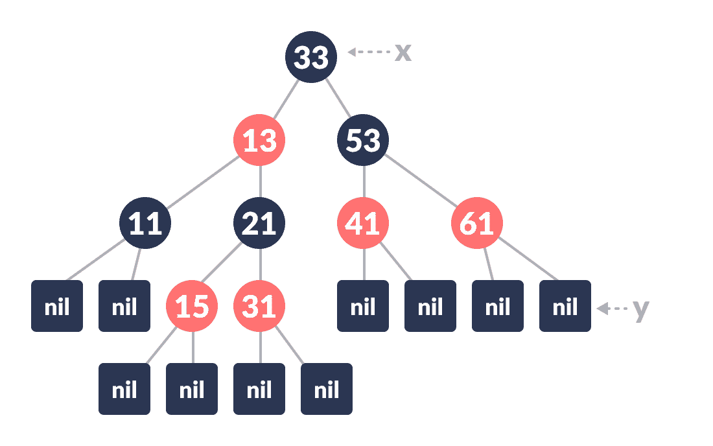
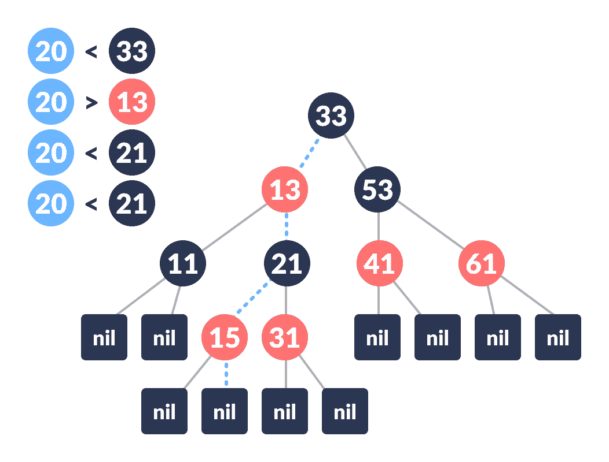
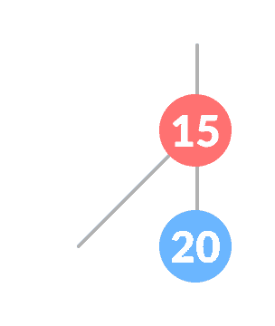
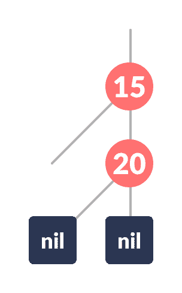
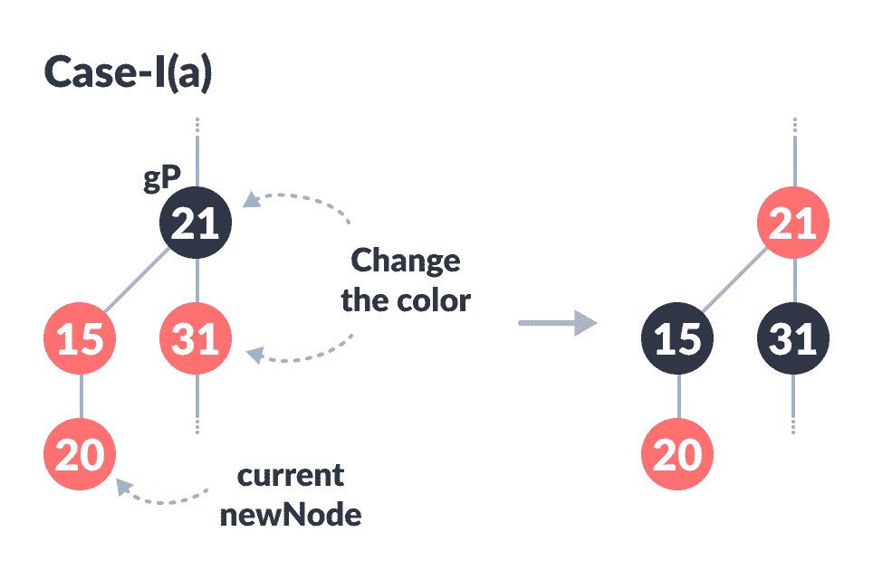
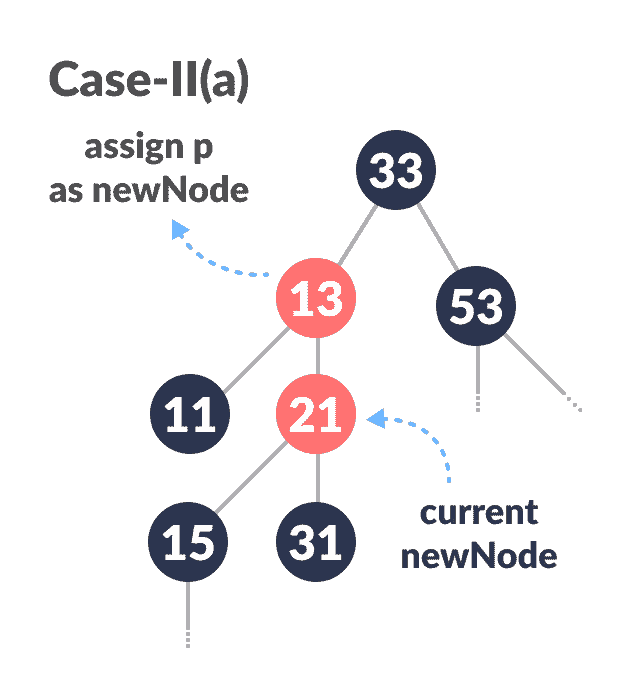
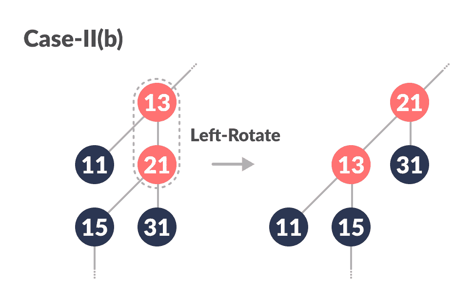
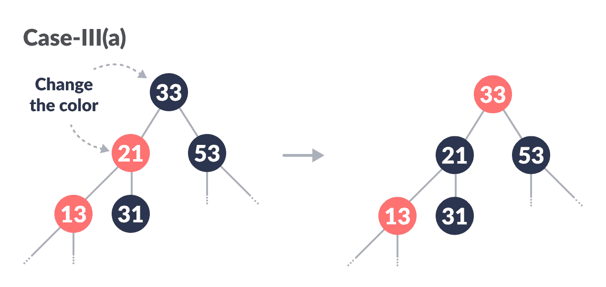
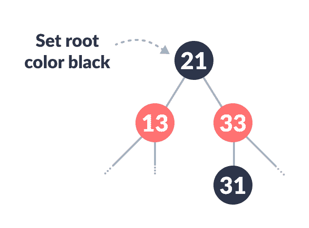
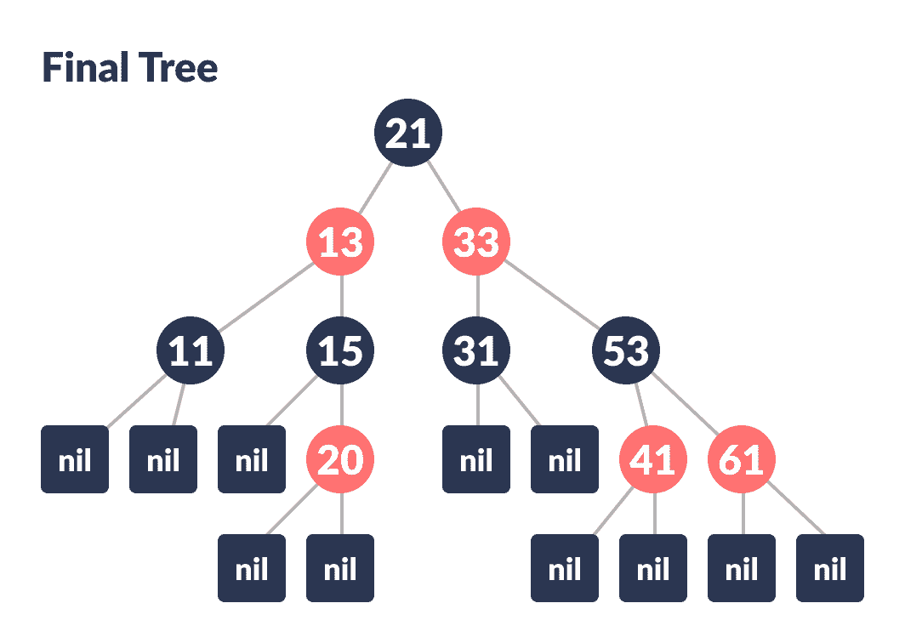

# 插入红黑树

> 原文： [https://www.programiz.com/dsa/insertion-in-a-red-black-tree](https://www.programiz.com/dsa/insertion-in-a-red-black-tree)

#### 在本教程中，您将学习如何将新节点插入到红黑树中。 此外，您还将找到在 C，C++ ，Java 和 Python 的红黑树上执行插入的工作示例。

红黑树是一种自平衡二叉搜索树，其中每个节点都包含一个额外的位，用于表示该节点的颜色，红色还是黑色。

阅读本文之前，请参考[红黑树](/dsa/red-black-tree)上的文章。

插入新节点时，新节点始终作为红色节点插入。 插入新节点后，如果树违反了红黑树的属性，则执行以下操作。

1.  重新着色
2.  回转

* * *

## 插入新节点的算法

按照以下步骤将新元素插入到红黑树中：

1.  `newNode`为：

    

    新节点

    

2.  令`y`为叶子（即`NIL`），`x`为树的根。 新节点将插入下面的树中。

    

    初始树

    

3.  检查树是否为空（即`x`是否为`NIL`）。 如果是，请插入`newNode`作为根节点，并将其着色为黑色。
4.  否则，请重复以下步骤，直到达到叶子（`NIL`）。
    1.  比较`newKey`与`rootKey`。
    2.  如果`newKey`大于`rootKey`，则遍历右侧子树。
    3.  否则，遍历左子树。

        

        指向要在其中插入`newNode`的节点的路径

        

5.  将叶子的父级分配为`newNode`的父级。
6.  如果`leafKey`大于`newKey`，则将`newNode`设为`rightChild`。
7.  否则，将`newNode`设置为`leftChild`。

    

    插入了新节点

    

8.  在左侧分配`NULL`，在`newNode`分配`rightChild`。
9.  为`newNode`分配红色。

    

    将`newNode`的颜色设置为红色，并为子代分配空值

    

10.  调用`InsertFix`算法来维护红黑树的属性（如果违反）。

* * *

**为什么新插入的节点在红黑树中总是红色？**

这是因为插入红色节点不会违反红黑树的`depth`属性。

如果将红色节点附加到红色节点，则会违反该规则，但是比通过违反`depth`属性引入的问题更容易解决此问题。

* * *

## 插入后保持红黑属性的算法

如果插入`newNode`违反了该属性，则此算法用于维护红黑树的属性。

1.  执行以下操作，直到`newNode p`的父代变为红色。
2.  如果`p`是`newNode`的`grandParent gP`的左孩子，请执行以下操作。
    **情况一**：
    1.  如果`newNode`的`gP`的右子级的颜色是红色，则将`gP`的子级的颜色都设置为黑色，将`gP`的颜色都设置为红色。

        

        颜色更改

        

    2.  将`gP`分配给`newNode`。

        

        重新分配`newNode`

        

        **情况 II**：
    3.  （在继续此步骤之前，将检查`while`循环。如果不满足条件，则循环会中断。）
        否则，如果`newNode`是`p`的右子代，则将`p`分配给[ `newNode`。

        

        将`newNode`的父级分配为`newNode`

        

    4.  左旋转`newNode`。

        

        左旋转

        

        **情况 III**：
    5.  （在继续此步骤之前，检查循环。如果不满足条件，则循环中断。）
        将`p`的颜色设置为黑色，将`gP`的颜色设置为红色。

        

        颜色更改

        

    6.  向右旋转`gP`。

        

        右旋

        

3.  否则，请执行以下操作。
    1.  如果`z`的`gP`的左子项的颜色是红色，请将`gP`的子项的颜色都设置为黑色，将`gP`的颜色都设置为红色。
    2.  将`gP`分配给`newNode`。
    3.  否则，如果`newNode`是`p`的左子代，则将`p`分配给`newNode`并向右旋转`newNode`。
    4.  将`p`的颜色设置为黑色，将`gP`的颜色设置为红色。
    5.  左旋转`gP`。
4.  （从`while`循环中退出后执行此步骤。）
    将树的根设置为黑色。

    

    将根的颜色设置为黑色

    

最终的树如下所示：



Final tree


* * *

## Python，Java 和 C/C++ 示例

[Python](#python-code)[Java](#java-code)[C](#c-code)[C++](#cpp-code)

```
# Implementing Red-Black Tree in Python

import sys

# Node creation
class Node():
    def __init__(self, item):
        self.item = item
        self.parent = None
        self.left = None
        self.right = None
        self.color = 1

class RedBlackTree():
    def __init__(self):
        self.TNULL = Node(0)
        self.TNULL.color = 0
        self.TNULL.left = None
        self.TNULL.right = None
        self.root = self.TNULL

    # Preorder
    def pre_order_helper(self, node):
        if node != TNULL:
            sys.stdout.write(node.item + " ")
            self.pre_order_helper(node.left)
            self.pre_order_helper(node.right)

    # Inorder
    def in_order_helper(self, node):
        if node != TNULL:
            self.in_order_helper(node.left)
            sys.stdout.write(node.item + " ")
            self.in_order_helper(node.right)

    # Postorder
    def post_order_helper(self, node):
        if node != TNULL:
            self.post_order_helper(node.left)
            self.post_order_helper(node.right)
            sys.stdout.write(node.item + " ")

    # Search the tree
    def search_tree_helper(self, node, key):
        if node == TNULL or key == node.item:
            return node

        if key < node.item:
            return self.search_tree_helper(node.left, key)
        return self.search_tree_helper(node.right, key)

    # Balance the tree after insertion
    def fix_insert(self, k):
        while k.parent.color == 1:
            if k.parent == k.parent.parent.right:
                u = k.parent.parent.left
                if u.color == 1:
                    u.color = 0
                    k.parent.color = 0
                    k.parent.parent.color = 1
                    k = k.parent.parent
                else:
                    if k == k.parent.left:
                        k = k.parent
                        self.right_rotate(k)
                    k.parent.color = 0
                    k.parent.parent.color = 1
                    self.left_rotate(k.parent.parent)
            else:
                u = k.parent.parent.right

                if u.color == 1:
                    u.color = 0
                    k.parent.color = 0
                    k.parent.parent.color = 1
                    k = k.parent.parent
                else:
                    if k == k.parent.right:
                        k = k.parent
                        self.left_rotate(k)
                    k.parent.color = 0
                    k.parent.parent.color = 1
                    self.right_rotate(k.parent.parent)
            if k == self.root:
                break
        self.root.color = 0

    # Printing the tree
    def __print_helper(self, node, indent, last):
        if node != self.TNULL:
            sys.stdout.write(indent)
            if last:
                sys.stdout.write("R----")
                indent += "     "
            else:
                sys.stdout.write("L----")
                indent += "|    "

            s_color = "RED" if node.color == 1 else "BLACK"
            print(str(node.item) + "(" + s_color + ")")
            self.__print_helper(node.left, indent, False)
            self.__print_helper(node.right, indent, True)

    def preorder(self):
        self.pre_order_helper(self.root)

    def inorder(self):
        self.in_order_helper(self.root)

    def postorder(self):
        self.post_order_helper(self.root)

    def searchTree(self, k):
        return self.search_tree_helper(self.root, k)

    def minimum(self, node):
        while node.left != self.TNULL:
            node = node.left
        return node

    def maximum(self, node):
        while node.right != self.TNULL:
            node = node.right
        return node

    def successor(self, x):
        if x.right != self.TNULL:
            return self.minimum(x.right)

        y = x.parent
        while y != self.TNULL and x == y.right:
            x = y
            y = y.parent
        return y

    def predecessor(self,  x):
        if (x.left != self.TNULL):
            return self.maximum(x.left)

        y = x.parent
        while y != self.TNULL and x == y.left:
            x = y
            y = y.parent

        return y

    def left_rotate(self, x):
        y = x.right
        x.right = y.left
        if y.left != self.TNULL:
            y.left.parent = x

        y.parent = x.parent
        if x.parent == None:
            self.root = y
        elif x == x.parent.left:
            x.parent.left = y
        else:
            x.parent.right = y
        y.left = x
        x.parent = y

    def right_rotate(self, x):
        y = x.left
        x.left = y.right
        if y.right != self.TNULL:
            y.right.parent = x

        y.parent = x.parent
        if x.parent == None:
            self.root = y
        elif x == x.parent.right:
            x.parent.right = y
        else:
            x.parent.left = y
        y.right = x
        x.parent = y

    def insert(self, key):
        node = Node(key)
        node.parent = None
        node.item = key
        node.left = self.TNULL
        node.right = self.TNULL
        node.color = 1

        y = None
        x = self.root

        while x != self.TNULL:
            y = x
            if node.item < x.item:
                x = x.left
            else:
                x = x.right

        node.parent = y
        if y == None:
            self.root = node
        elif node.item < y.item:
            y.left = node
        else:
            y.right = node

        if node.parent == None:
            node.color = 0
            return

        if node.parent.parent == None:
            return

        self.fix_insert(node)

    def get_root(self):
        return self.root

    def print_tree(self):
        self.__print_helper(self.root, "", True)

if __name__ == "__main__":
    bst = RedBlackTree()

    bst.insert(55)
    bst.insert(40)
    bst.insert(65)
    bst.insert(60)
    bst.insert(75)
    bst.insert(57)

    bst.print_tree()
```

```
// Implementing Red-Black Tree in Java

class Node {
  int data;
  Node parent;
  Node left;
  Node right;
  int color;
}

public class RedBlackTree {
  private Node root;
  private Node TNULL;

  // Preorder
  private void preOrderHelper(Node node) {
    if (node != TNULL) {
      System.out.print(node.data + " ");
      preOrderHelper(node.left);
      preOrderHelper(node.right);
    }
  }

  // Inorder
  private void inOrderHelper(Node node) {
    if (node != TNULL) {
      inOrderHelper(node.left);
      System.out.print(node.data + " ");
      inOrderHelper(node.right);
    }
  }

  // Post order
  private void postOrderHelper(Node node) {
    if (node != TNULL) {
      postOrderHelper(node.left);
      postOrderHelper(node.right);
      System.out.print(node.data + " ");
    }
  }

  // Search the tree
  private Node searchTreeHelper(Node node, int key) {
    if (node == TNULL || key == node.data) {
      return node;
    }

    if (key < node.data) {
      return searchTreeHelper(node.left, key);
    }
    return searchTreeHelper(node.right, key);
  }

  // Balance the tree after deletion of a node
  private void fixDelete(Node x) {
    Node s;
    while (x != root && x.color == 0) {
      if (x == x.parent.left) {
        s = x.parent.right;
        if (s.color == 1) {
          s.color = 0;
          x.parent.color = 1;
          leftRotate(x.parent);
          s = x.parent.right;
        }

        if (s.left.color == 0 && s.right.color == 0) {
          s.color = 1;
          x = x.parent;
        } else {
          if (s.right.color == 0) {
            s.left.color = 0;
            s.color = 1;
            rightRotate(s);
            s = x.parent.right;
          }

          s.color = x.parent.color;
          x.parent.color = 0;
          s.right.color = 0;
          leftRotate(x.parent);
          x = root;
        }
      } else {
        s = x.parent.left;
        if (s.color == 1) {
          s.color = 0;
          x.parent.color = 1;
          rightRotate(x.parent);
          s = x.parent.left;
        }

        if (s.right.color == 0 && s.right.color == 0) {
          s.color = 1;
          x = x.parent;
        } else {
          if (s.left.color == 0) {
            s.right.color = 0;
            s.color = 1;
            leftRotate(s);
            s = x.parent.left;
          }

          s.color = x.parent.color;
          x.parent.color = 0;
          s.left.color = 0;
          rightRotate(x.parent);
          x = root;
        }
      }
    }
    x.color = 0;
  }

  private void rbTransplant(Node u, Node v) {
    if (u.parent == null) {
      root = v;
    } else if (u == u.parent.left) {
      u.parent.left = v;
    } else {
      u.parent.right = v;
    }
    v.parent = u.parent;
  }

  // Balance the node after insertion
  private void fixInsert(Node k) {
    Node u;
    while (k.parent.color == 1) {
      if (k.parent == k.parent.parent.right) {
        u = k.parent.parent.left;
        if (u.color == 1) {
          u.color = 0;
          k.parent.color = 0;
          k.parent.parent.color = 1;
          k = k.parent.parent;
        } else {
          if (k == k.parent.left) {
            k = k.parent;
            rightRotate(k);
          }
          k.parent.color = 0;
          k.parent.parent.color = 1;
          leftRotate(k.parent.parent);
        }
      } else {
        u = k.parent.parent.right;

        if (u.color == 1) {
          u.color = 0;
          k.parent.color = 0;
          k.parent.parent.color = 1;
          k = k.parent.parent;
        } else {
          if (k == k.parent.right) {
            k = k.parent;
            leftRotate(k);
          }
          k.parent.color = 0;
          k.parent.parent.color = 1;
          rightRotate(k.parent.parent);
        }
      }
      if (k == root) {
        break;
      }
    }
    root.color = 0;
  }

  private void printHelper(Node root, String indent, boolean last) {
    if (root != TNULL) {
      System.out.print(indent);
      if (last) {
        System.out.print("R----");
        indent += "   ";
      } else {
        System.out.print("L----");
        indent += "|  ";
      }

      String sColor = root.color == 1 ? "RED" : "BLACK";
      System.out.println(root.data + "(" + sColor + ")");
      printHelper(root.left, indent, false);
      printHelper(root.right, indent, true);
    }
  }

  public RedBlackTree() {
    TNULL = new Node();
    TNULL.color = 0;
    TNULL.left = null;
    TNULL.right = null;
    root = TNULL;
  }

  public void preorder() {
    preOrderHelper(this.root);
  }

  public void inorder() {
    inOrderHelper(this.root);
  }

  public void postorder() {
    postOrderHelper(this.root);
  }

  public Node searchTree(int k) {
    return searchTreeHelper(this.root, k);
  }

  public Node minimum(Node node) {
    while (node.left != TNULL) {
      node = node.left;
    }
    return node;
  }

  public Node maximum(Node node) {
    while (node.right != TNULL) {
      node = node.right;
    }
    return node;
  }

  public Node successor(Node x) {
    if (x.right != TNULL) {
      return minimum(x.right);
    }

    Node y = x.parent;
    while (y != TNULL && x == y.right) {
      x = y;
      y = y.parent;
    }
    return y;
  }

  public Node predecessor(Node x) {
    if (x.left != TNULL) {
      return maximum(x.left);
    }

    Node y = x.parent;
    while (y != TNULL && x == y.left) {
      x = y;
      y = y.parent;
    }

    return y;
  }

  public void leftRotate(Node x) {
    Node y = x.right;
    x.right = y.left;
    if (y.left != TNULL) {
      y.left.parent = x;
    }
    y.parent = x.parent;
    if (x.parent == null) {
      this.root = y;
    } else if (x == x.parent.left) {
      x.parent.left = y;
    } else {
      x.parent.right = y;
    }
    y.left = x;
    x.parent = y;
  }

  public void rightRotate(Node x) {
    Node y = x.left;
    x.left = y.right;
    if (y.right != TNULL) {
      y.right.parent = x;
    }
    y.parent = x.parent;
    if (x.parent == null) {
      this.root = y;
    } else if (x == x.parent.right) {
      x.parent.right = y;
    } else {
      x.parent.left = y;
    }
    y.right = x;
    x.parent = y;
  }

  public void insert(int key) {
    Node node = new Node();
    node.parent = null;
    node.data = key;
    node.left = TNULL;
    node.right = TNULL;
    node.color = 1;

    Node y = null;
    Node x = this.root;

    while (x != TNULL) {
      y = x;
      if (node.data < x.data) {
        x = x.left;
      } else {
        x = x.right;
      }
    }

    node.parent = y;
    if (y == null) {
      root = node;
    } else if (node.data < y.data) {
      y.left = node;
    } else {
      y.right = node;
    }

    if (node.parent == null) {
      node.color = 0;
      return;
    }

    if (node.parent.parent == null) {
      return;
    }

    fixInsert(node);
  }

  public Node getRoot() {
    return this.root;
  }

  public void printTree() {
    printHelper(this.root, "", true);
  }

  public static void main(String[] args) {
    RedBlackTree bst = new RedBlackTree();
    bst.insert(55);
    bst.insert(40);
    bst.insert(65);
    bst.insert(60);
    bst.insert(75);
    bst.insert(57);
    bst.printTree();

  }
}
```

```
// Implementing Red-Black Tree in C

#include <stdio.h>
#include <stdlib.h>

enum nodeColor {
  RED,
  BLACK
};

struct rbNode {
  int data, color;
  struct rbNode *link[2];
};

struct rbNode *root = NULL;

// Create a red-black tree
struct rbNode *createNode(int data) {
  struct rbNode *newnode;
  newnode = (struct rbNode *)malloc(sizeof(struct rbNode));
  newnode->data = data;
  newnode->color = RED;
  newnode->link[0] = newnode->link[1] = NULL;
  return newnode;
}

// Insert an node
void insertion(int data) {
  struct rbNode *stack[98], *ptr, *newnode, *xPtr, *yPtr;
  int dir[98], ht = 0, index;
  ptr = root;
  if (!root) {
    root = createNode(data);
    return;
  }

  stack[ht] = root;
  dir[ht++] = 0;
  while (ptr != NULL) {
    if (ptr->data == data) {
      printf("Duplicates Not Allowed!!\n");
      return;
    }
    index = (data - ptr->data) > 0 ? 1 : 0;
    stack[ht] = ptr;
    ptr = ptr->link[index];
    dir[ht++] = index;
  }
  stack[ht - 1]->link[index] = newnode = createNode(data);
  while ((ht >= 3) && (stack[ht - 1]->color == RED)) {
    if (dir[ht - 2] == 0) {
      yPtr = stack[ht - 2]->link[1];
      if (yPtr != NULL && yPtr->color == RED) {
        stack[ht - 2]->color = RED;
        stack[ht - 1]->color = yPtr->color = BLACK;
        ht = ht - 2;
      } else {
        if (dir[ht - 1] == 0) {
          yPtr = stack[ht - 1];
        } else {
          xPtr = stack[ht - 1];
          yPtr = xPtr->link[1];
          xPtr->link[1] = yPtr->link[0];
          yPtr->link[0] = xPtr;
          stack[ht - 2]->link[0] = yPtr;
        }
        xPtr = stack[ht - 2];
        xPtr->color = RED;
        yPtr->color = BLACK;
        xPtr->link[0] = yPtr->link[1];
        yPtr->link[1] = xPtr;
        if (xPtr == root) {
          root = yPtr;
        } else {
          stack[ht - 3]->link[dir[ht - 3]] = yPtr;
        }
        break;
      }
    } else {
      yPtr = stack[ht - 2]->link[0];
      if ((yPtr != NULL) && (yPtr->color == RED)) {
        stack[ht - 2]->color = RED;
        stack[ht - 1]->color = yPtr->color = BLACK;
        ht = ht - 2;
      } else {
        if (dir[ht - 1] == 1) {
          yPtr = stack[ht - 1];
        } else {
          xPtr = stack[ht - 1];
          yPtr = xPtr->link[0];
          xPtr->link[0] = yPtr->link[1];
          yPtr->link[1] = xPtr;
          stack[ht - 2]->link[1] = yPtr;
        }
        xPtr = stack[ht - 2];
        yPtr->color = BLACK;
        xPtr->color = RED;
        xPtr->link[1] = yPtr->link[0];
        yPtr->link[0] = xPtr;
        if (xPtr == root) {
          root = yPtr;
        } else {
          stack[ht - 3]->link[dir[ht - 3]] = yPtr;
        }
        break;
      }
    }
  }
  root->color = BLACK;
}

// Delete a node
void deletion(int data) {
  struct rbNode *stack[98], *ptr, *xPtr, *yPtr;
  struct rbNode *pPtr, *qPtr, *rPtr;
  int dir[98], ht = 0, diff, i;
  enum nodeColor color;

  if (!root) {
    printf("Tree not available\n");
    return;
  }

  ptr = root;
  while (ptr != NULL) {
    if ((data - ptr->data) == 0)
      break;
    diff = (data - ptr->data) > 0 ? 1 : 0;
    stack[ht] = ptr;
    dir[ht++] = diff;
    ptr = ptr->link[diff];
  }

  if (ptr->link[1] == NULL) {
    if ((ptr == root) && (ptr->link[0] == NULL)) {
      free(ptr);
      root = NULL;
    } else if (ptr == root) {
      root = ptr->link[0];
      free(ptr);
    } else {
      stack[ht - 1]->link[dir[ht - 1]] = ptr->link[0];
    }
  } else {
    xPtr = ptr->link[1];
    if (xPtr->link[0] == NULL) {
      xPtr->link[0] = ptr->link[0];
      color = xPtr->color;
      xPtr->color = ptr->color;
      ptr->color = color;

      if (ptr == root) {
        root = xPtr;
      } else {
        stack[ht - 1]->link[dir[ht - 1]] = xPtr;
      }

      dir[ht] = 1;
      stack[ht++] = xPtr;
    } else {
      i = ht++;
      while (1) {
        dir[ht] = 0;
        stack[ht++] = xPtr;
        yPtr = xPtr->link[0];
        if (!yPtr->link[0])
          break;
        xPtr = yPtr;
      }

      dir[i] = 1;
      stack[i] = yPtr;
      if (i > 0)
        stack[i - 1]->link[dir[i - 1]] = yPtr;

      yPtr->link[0] = ptr->link[0];

      xPtr->link[0] = yPtr->link[1];
      yPtr->link[1] = ptr->link[1];

      if (ptr == root) {
        root = yPtr;
      }

      color = yPtr->color;
      yPtr->color = ptr->color;
      ptr->color = color;
    }
  }

  if (ht < 1)
    return;

  if (ptr->color == BLACK) {
    while (1) {
      pPtr = stack[ht - 1]->link[dir[ht - 1]];
      if (pPtr && pPtr->color == RED) {
        pPtr->color = BLACK;
        break;
      }

      if (ht < 2)
        break;

      if (dir[ht - 2] == 0) {
        rPtr = stack[ht - 1]->link[1];

        if (!rPtr)
          break;

        if (rPtr->color == RED) {
          stack[ht - 1]->color = RED;
          rPtr->color = BLACK;
          stack[ht - 1]->link[1] = rPtr->link[0];
          rPtr->link[0] = stack[ht - 1];

          if (stack[ht - 1] == root) {
            root = rPtr;
          } else {
            stack[ht - 2]->link[dir[ht - 2]] = rPtr;
          }
          dir[ht] = 0;
          stack[ht] = stack[ht - 1];
          stack[ht - 1] = rPtr;
          ht++;

          rPtr = stack[ht - 1]->link[1];
        }

        if ((!rPtr->link[0] || rPtr->link[0]->color == BLACK) &&
          (!rPtr->link[1] || rPtr->link[1]->color == BLACK)) {
          rPtr->color = RED;
        } else {
          if (!rPtr->link[1] || rPtr->link[1]->color == BLACK) {
            qPtr = rPtr->link[0];
            rPtr->color = RED;
            qPtr->color = BLACK;
            rPtr->link[0] = qPtr->link[1];
            qPtr->link[1] = rPtr;
            rPtr = stack[ht - 1]->link[1] = qPtr;
          }
          rPtr->color = stack[ht - 1]->color;
          stack[ht - 1]->color = BLACK;
          rPtr->link[1]->color = BLACK;
          stack[ht - 1]->link[1] = rPtr->link[0];
          rPtr->link[0] = stack[ht - 1];
          if (stack[ht - 1] == root) {
            root = rPtr;
          } else {
            stack[ht - 2]->link[dir[ht - 2]] = rPtr;
          }
          break;
        }
      } else {
        rPtr = stack[ht - 1]->link[0];
        if (!rPtr)
          break;

        if (rPtr->color == RED) {
          stack[ht - 1]->color = RED;
          rPtr->color = BLACK;
          stack[ht - 1]->link[0] = rPtr->link[1];
          rPtr->link[1] = stack[ht - 1];

          if (stack[ht - 1] == root) {
            root = rPtr;
          } else {
            stack[ht - 2]->link[dir[ht - 2]] = rPtr;
          }
          dir[ht] = 1;
          stack[ht] = stack[ht - 1];
          stack[ht - 1] = rPtr;
          ht++;

          rPtr = stack[ht - 1]->link[0];
        }
        if ((!rPtr->link[0] || rPtr->link[0]->color == BLACK) &&
          (!rPtr->link[1] || rPtr->link[1]->color == BLACK)) {
          rPtr->color = RED;
        } else {
          if (!rPtr->link[0] || rPtr->link[0]->color == BLACK) {
            qPtr = rPtr->link[1];
            rPtr->color = RED;
            qPtr->color = BLACK;
            rPtr->link[1] = qPtr->link[0];
            qPtr->link[0] = rPtr;
            rPtr = stack[ht - 1]->link[0] = qPtr;
          }
          rPtr->color = stack[ht - 1]->color;
          stack[ht - 1]->color = BLACK;
          rPtr->link[0]->color = BLACK;
          stack[ht - 1]->link[0] = rPtr->link[1];
          rPtr->link[1] = stack[ht - 1];
          if (stack[ht - 1] == root) {
            root = rPtr;
          } else {
            stack[ht - 2]->link[dir[ht - 2]] = rPtr;
          }
          break;
        }
      }
      ht--;
    }
  }
}

// Print the inorder traversal of the tree
void inorderTraversal(struct rbNode *node) {
  if (node) {
    inorderTraversal(node->link[0]);
    printf("%d  ", node->data);
    inorderTraversal(node->link[1]);
  }
  return;
}

// Driver code
int main() {
  int ch, data;
  while (1) {
    printf("1\. Insertion\t2\. Deletion\n");
    printf("3\. Traverse\t4\. Exit");
    printf("\nEnter your choice:");
    scanf("%d", &ch);
    switch (ch) {
      case 1:
        printf("Enter the element to insert:");
        scanf("%d", &data);
        insertion(data);
        break;
      case 2:
        printf("Enter the element to delete:");
        scanf("%d", &data);
        deletion(data);
        break;
      case 3:
        inorderTraversal(root);
        printf("\n");
        break;
      case 4:
        exit(0);
      default:
        printf("Not available\n");
        break;
    }
    printf("\n");
  }
  return 0;
}
```

```
// Implementing Red-Black Tree in C++

#include <iostream>
using namespace std;

struct Node {
  int data;
  Node *parent;
  Node *left;
  Node *right;
  int color;
};

typedef Node *NodePtr;

class RedBlackTree {
   private:
  NodePtr root;
  NodePtr TNULL;

  void initializeNULLNode(NodePtr node, NodePtr parent) {
    node->data = 0;
    node->parent = parent;
    node->left = nullptr;
    node->right = nullptr;
    node->color = 0;
  }

  // Preorder
  void preOrderHelper(NodePtr node) {
    if (node != TNULL) {
      cout << node->data << " ";
      preOrderHelper(node->left);
      preOrderHelper(node->right);
    }
  }

  // Inorder
  void inOrderHelper(NodePtr node) {
    if (node != TNULL) {
      inOrderHelper(node->left);
      cout << node->data << " ";
      inOrderHelper(node->right);
    }
  }

  // Post order
  void postOrderHelper(NodePtr node) {
    if (node != TNULL) {
      postOrderHelper(node->left);
      postOrderHelper(node->right);
      cout << node->data << " ";
    }
  }

  NodePtr searchTreeHelper(NodePtr node, int key) {
    if (node == TNULL || key == node->data) {
      return node;
    }

    if (key < node->data) {
      return searchTreeHelper(node->left, key);
    }
    return searchTreeHelper(node->right, key);
  }

  // For balancing the tree after deletion
  void deleteFix(NodePtr x) {
    NodePtr s;
    while (x != root && x->color == 0) {
      if (x == x->parent->left) {
        s = x->parent->right;
        if (s->color == 1) {
          s->color = 0;
          x->parent->color = 1;
          leftRotate(x->parent);
          s = x->parent->right;
        }

        if (s->left->color == 0 && s->right->color == 0) {
          s->color = 1;
          x = x->parent;
        } else {
          if (s->right->color == 0) {
            s->left->color = 0;
            s->color = 1;
            rightRotate(s);
            s = x->parent->right;
          }

          s->color = x->parent->color;
          x->parent->color = 0;
          s->right->color = 0;
          leftRotate(x->parent);
          x = root;
        }
      } else {
        s = x->parent->left;
        if (s->color == 1) {
          s->color = 0;
          x->parent->color = 1;
          rightRotate(x->parent);
          s = x->parent->left;
        }

        if (s->right->color == 0 && s->right->color == 0) {
          s->color = 1;
          x = x->parent;
        } else {
          if (s->left->color == 0) {
            s->right->color = 0;
            s->color = 1;
            leftRotate(s);
            s = x->parent->left;
          }

          s->color = x->parent->color;
          x->parent->color = 0;
          s->left->color = 0;
          rightRotate(x->parent);
          x = root;
        }
      }
    }
    x->color = 0;
  }

  void rbTransplant(NodePtr u, NodePtr v) {
    if (u->parent == nullptr) {
      root = v;
    } else if (u == u->parent->left) {
      u->parent->left = v;
    } else {
      u->parent->right = v;
    }
    v->parent = u->parent;
  }

  void deleteNodeHelper(NodePtr node, int key) {
    NodePtr z = TNULL;
    NodePtr x, y;
    while (node != TNULL) {
      if (node->data == key) {
        z = node;
      }

      if (node->data <= key) {
        node = node->right;
      } else {
        node = node->left;
      }
    }

    if (z == TNULL) {
      cout << "Key not found in the tree" << endl;
      return;
    }

    y = z;
    int y_original_color = y->color;
    if (z->left == TNULL) {
      x = z->right;
      rbTransplant(z, z->right);
    } else if (z->right == TNULL) {
      x = z->left;
      rbTransplant(z, z->left);
    } else {
      y = minimum(z->right);
      y_original_color = y->color;
      x = y->right;
      if (y->parent == z) {
        x->parent = y;
      } else {
        rbTransplant(y, y->right);
        y->right = z->right;
        y->right->parent = y;
      }

      rbTransplant(z, y);
      y->left = z->left;
      y->left->parent = y;
      y->color = z->color;
    }
    delete z;
    if (y_original_color == 0) {
      deleteFix(x);
    }
  }

  // For balancing the tree after insertion
  void insertFix(NodePtr k) {
    NodePtr u;
    while (k->parent->color == 1) {
      if (k->parent == k->parent->parent->right) {
        u = k->parent->parent->left;
        if (u->color == 1) {
          u->color = 0;
          k->parent->color = 0;
          k->parent->parent->color = 1;
          k = k->parent->parent;
        } else {
          if (k == k->parent->left) {
            k = k->parent;
            rightRotate(k);
          }
          k->parent->color = 0;
          k->parent->parent->color = 1;
          leftRotate(k->parent->parent);
        }
      } else {
        u = k->parent->parent->right;

        if (u->color == 1) {
          u->color = 0;
          k->parent->color = 0;
          k->parent->parent->color = 1;
          k = k->parent->parent;
        } else {
          if (k == k->parent->right) {
            k = k->parent;
            leftRotate(k);
          }
          k->parent->color = 0;
          k->parent->parent->color = 1;
          rightRotate(k->parent->parent);
        }
      }
      if (k == root) {
        break;
      }
    }
    root->color = 0;
  }

  void printHelper(NodePtr root, string indent, bool last) {
    if (root != TNULL) {
      cout << indent;
      if (last) {
        cout << "R----";
        indent += "   ";
      } else {
        cout << "L----";
        indent += "|  ";
      }

      string sColor = root->color ? "RED" : "BLACK";
      cout << root->data << "(" << sColor << ")" << endl;
      printHelper(root->left, indent, false);
      printHelper(root->right, indent, true);
    }
  }

   public:
  RedBlackTree() {
    TNULL = new Node;
    TNULL->color = 0;
    TNULL->left = nullptr;
    TNULL->right = nullptr;
    root = TNULL;
  }

  void preorder() {
    preOrderHelper(this->root);
  }

  void inorder() {
    inOrderHelper(this->root);
  }

  void postorder() {
    postOrderHelper(this->root);
  }

  NodePtr searchTree(int k) {
    return searchTreeHelper(this->root, k);
  }

  NodePtr minimum(NodePtr node) {
    while (node->left != TNULL) {
      node = node->left;
    }
    return node;
  }

  NodePtr maximum(NodePtr node) {
    while (node->right != TNULL) {
      node = node->right;
    }
    return node;
  }

  NodePtr successor(NodePtr x) {
    if (x->right != TNULL) {
      return minimum(x->right);
    }

    NodePtr y = x->parent;
    while (y != TNULL && x == y->right) {
      x = y;
      y = y->parent;
    }
    return y;
  }

  NodePtr predecessor(NodePtr x) {
    if (x->left != TNULL) {
      return maximum(x->left);
    }

    NodePtr y = x->parent;
    while (y != TNULL && x == y->left) {
      x = y;
      y = y->parent;
    }

    return y;
  }

  void leftRotate(NodePtr x) {
    NodePtr y = x->right;
    x->right = y->left;
    if (y->left != TNULL) {
      y->left->parent = x;
    }
    y->parent = x->parent;
    if (x->parent == nullptr) {
      this->root = y;
    } else if (x == x->parent->left) {
      x->parent->left = y;
    } else {
      x->parent->right = y;
    }
    y->left = x;
    x->parent = y;
  }

  void rightRotate(NodePtr x) {
    NodePtr y = x->left;
    x->left = y->right;
    if (y->right != TNULL) {
      y->right->parent = x;
    }
    y->parent = x->parent;
    if (x->parent == nullptr) {
      this->root = y;
    } else if (x == x->parent->right) {
      x->parent->right = y;
    } else {
      x->parent->left = y;
    }
    y->right = x;
    x->parent = y;
  }

  // Inserting a node
  void insert(int key) {
    NodePtr node = new Node;
    node->parent = nullptr;
    node->data = key;
    node->left = TNULL;
    node->right = TNULL;
    node->color = 1;

    NodePtr y = nullptr;
    NodePtr x = this->root;

    while (x != TNULL) {
      y = x;
      if (node->data < x->data) {
        x = x->left;
      } else {
        x = x->right;
      }
    }

    node->parent = y;
    if (y == nullptr) {
      root = node;
    } else if (node->data < y->data) {
      y->left = node;
    } else {
      y->right = node;
    }

    if (node->parent == nullptr) {
      node->color = 0;
      return;
    }

    if (node->parent->parent == nullptr) {
      return;
    }

    insertFix(node);
  }

  NodePtr getRoot() {
    return this->root;
  }

  void deleteNode(int data) {
    deleteNodeHelper(this->root, data);
  }

  void printTree() {
    if (root) {
      printHelper(this->root, "", true);
    }
  }
};

int main() {
  RedBlackTree bst;
  bst.insert(55);
  bst.insert(40);
  bst.insert(65);
  bst.insert(60);
  bst.insert(75);
  bst.insert(57);

  bst.printTree();
  cout << endl
     << "After deleting" << endl;
  bst.deleteNode(40);
  bst.printTree();
}
```