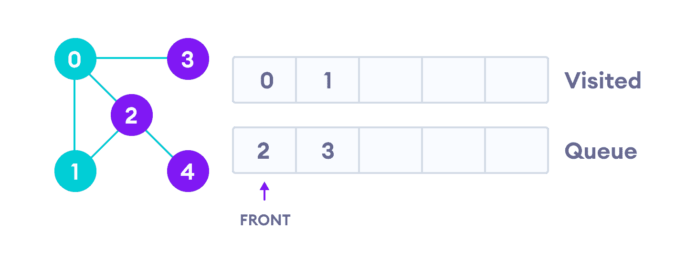
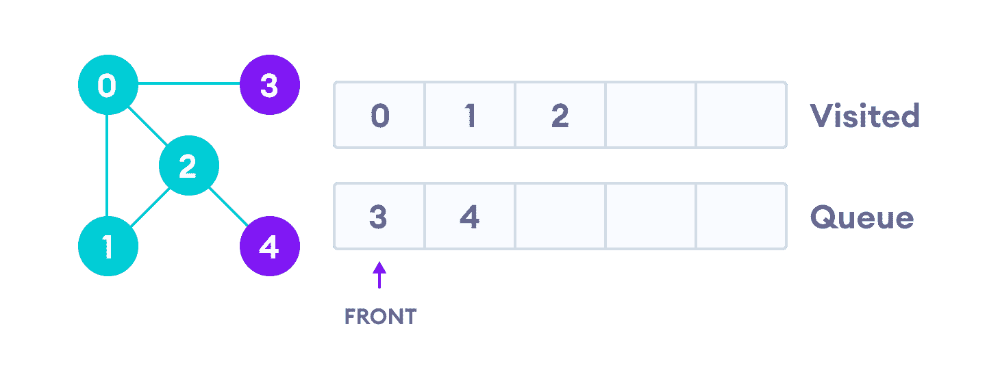
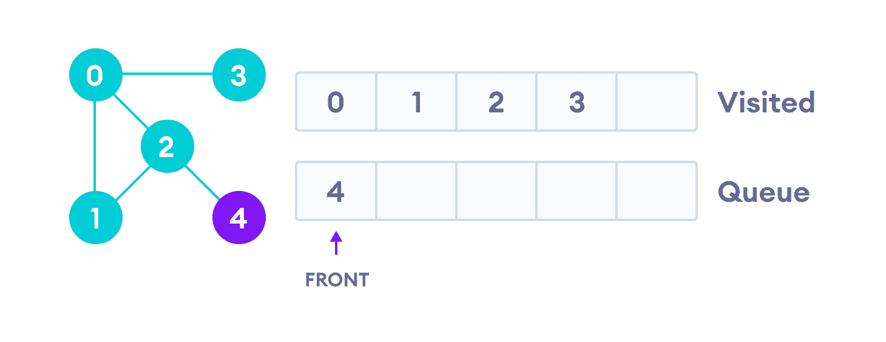
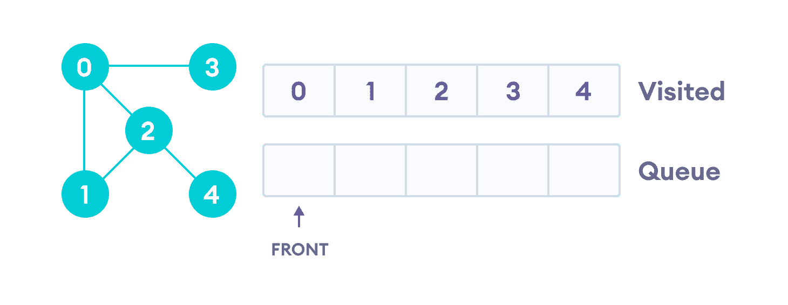

# BFS 算法

> 原文： [https://www.programiz.com/dsa/graph-bfs](https://www.programiz.com/dsa/graph-bfs)

#### 在本教程中，您将学习广度优先搜索算法。 此外，您还将在 C，C++ ，Java 和 Python 中找到 bfs 算法的工作示例。

遍历是指访问图的所有节点。 广度优先遍历或广度优先搜索是一种用于搜索图形或树数据结构的所有顶点的递归算法。

* * *

## BFS 算法

标准的 BFS 实现将图形的每个顶点分为以下两类之一：

1.  已访问
2.  未访问

该算法的目的是将每个顶点标记为已访问，同时避免循环。

该算法的工作原理如下：

1.  首先将图形的任意一个顶点放在队列的后面。
2.  将队列的最前面的项目添加到访问列表中。
3.  创建该顶点的相邻节点的列表。 将不在访问列表中的访问者添加到队列的后面。
4.  继续重复步骤 2 和 3，直到队列为空。

该图可能具有两个不同的断开部分，因此为了确保覆盖每个顶点，我们还可以在每个节点上运行 BFS 算法

* * *

## BFS 示例

让我们来看一个广度优先搜索算法的示例。 我们使用具有 5 个顶点的无向图。


Undirected graph with 5 vertices


我们从顶点 0 开始，BFS 算法首先将其放置在`Visited`列表中，然后将其所有相邻顶点放置在栈中。


Visit start vertex and add its adjacent vertices to queue


接下来，我们访问队列最前面的元素，即 1 并转到其相邻节点。 由于已经访问过 0，因此我们访问 2。



访问起始节点 0 的第一个邻居，即 1


顶点 2 在 4 中有一个未访问的相邻顶点，因此我们将其添加到队列的后面并访问 3，它位于队列的前面。



Visit 2 which was added to queue earlier to add its neighbours




4 remains in the queue


由于只有 3 个相邻节点（即 0）已被访问，因此队列中仅剩下 4 个。 我们参观它。



Visit last remaining item in stack to check if it has unvisited neighbours


由于队列为空，因此我们已经完成了图的深度优先遍历。

* * *

## BFS 伪代码

```
create a queue Q 
mark v as visited and put v into Q 
while Q is non-empty 
    remove the head u of Q 
    mark and enqueue all (unvisited) neighbours of u
```

* * *

## Python，Java 和 C/C++ 示例

广度优先搜索算法的代码示例如下。 代码已经简化，因此我们可以专注于算法而不是其他细节。


```
# BFS algorithm in Python

import collections

# BFS algorithm
def bfs(graph, root):

    visited, queue = set(), collections.deque([root])
    visited.add(root)

    while queue:

        # Dequeue a vertex from queue
        vertex = queue.popleft()
        print(str(vertex) + " ", end="")

        # If not visited, mark it as visited, and
        # enqueue it
        for neighbour in graph[vertex]:
            if neighbour not in visited:
                visited.add(neighbour)
                queue.append(neighbour)

if __name__ == '__main__':
    graph = {0: [1, 2], 1: [2], 2: [3], 3: [1, 2]}
    print("Following is Breadth First Traversal: ")
    bfs(graph, 0) 
```

```
// BFS algorithm in Java

import java.util.*;

public class Graph {
  private int V;
  private LinkedList<Integer> adj[];

  // Create a graph
  Graph(int v) {
    V = v;
    adj = new LinkedList[v];
    for (int i = 0; i < v; ++i)
      adj[i] = new LinkedList();
  }

  // Add edges to the graph
  void addEdge(int v, int w) {
    adj[v].add(w);
  }

  // BFS algorithm
  void BFS(int s) {

    boolean visited[] = new boolean[V];

    LinkedList<Integer> queue = new LinkedList();

    visited[s] = true;
    queue.add(s);

    while (queue.size() != 0) {
      s = queue.poll();
      System.out.print(s + " ");

      Iterator<Integer> i = adj[s].listIterator();
      while (i.hasNext()) {
        int n = i.next();
        if (!visited[n]) {
          visited[n] = true;
          queue.add(n);
        }
      }
    }
  }

  public static void main(String args[]) {
    Graph g = new Graph(4);

    g.addEdge(0, 1);
    g.addEdge(0, 2);
    g.addEdge(1, 2);
    g.addEdge(2, 0);
    g.addEdge(2, 3);
    g.addEdge(3, 3);

    System.out.println("Following is Breadth First Traversal " + "(starting from vertex 2)");

    g.BFS(2);
  }
}
```

```
// BFS algorithm in C

#include <stdio.h>
#include <stdlib.h>
#define SIZE 40

struct queue {
  int items[SIZE];
  int front;
  int rear;
};

struct queue* createQueue();
void enqueue(struct queue* q, int);
int dequeue(struct queue* q);
void display(struct queue* q);
int isEmpty(struct queue* q);
void printQueue(struct queue* q);

struct node {
  int vertex;
  struct node* next;
};

struct node* createNode(int);

struct Graph {
  int numVertices;
  struct node** adjLists;
  int* visited;
};

// BFS algorithm
void bfs(struct Graph* graph, int startVertex) {
  struct queue* q = createQueue();

  graph->visited[startVertex] = 1;
  enqueue(q, startVertex);

  while (!isEmpty(q)) {
    printQueue(q);
    int currentVertex = dequeue(q);
    printf("Visited %d\n", currentVertex);

    struct node* temp = graph->adjLists[currentVertex];

    while (temp) {
      int adjVertex = temp->vertex;

      if (graph->visited[adjVertex] == 0) {
        graph->visited[adjVertex] = 1;
        enqueue(q, adjVertex);
      }
      temp = temp->next;
    }
  }
}

// Creating a node
struct node* createNode(int v) {
  struct node* newNode = malloc(sizeof(struct node));
  newNode->vertex = v;
  newNode->next = NULL;
  return newNode;
}

// Creating a graph
struct Graph* createGraph(int vertices) {
  struct Graph* graph = malloc(sizeof(struct Graph));
  graph->numVertices = vertices;

  graph->adjLists = malloc(vertices * sizeof(struct node*));
  graph->visited = malloc(vertices * sizeof(int));

  int i;
  for (i = 0; i < vertices; i++) {
    graph->adjLists[i] = NULL;
    graph->visited[i] = 0;
  }

  return graph;
}

// Add edge
void addEdge(struct Graph* graph, int src, int dest) {
  // Add edge from src to dest
  struct node* newNode = createNode(dest);
  newNode->next = graph->adjLists[src];
  graph->adjLists[src] = newNode;

  // Add edge from dest to src
  newNode = createNode(src);
  newNode->next = graph->adjLists[dest];
  graph->adjLists[dest] = newNode;
}

// Create a queue
struct queue* createQueue() {
  struct queue* q = malloc(sizeof(struct queue));
  q->front = -1;
  q->rear = -1;
  return q;
}

// Check if the queue is empty
int isEmpty(struct queue* q) {
  if (q->rear == -1)
    return 1;
  else
    return 0;
}

// Adding elements into queue
void enqueue(struct queue* q, int value) {
  if (q->rear == SIZE - 1)
    printf("\nQueue is Full!!");
  else {
    if (q->front == -1)
      q->front = 0;
    q->rear++;
    q->items[q->rear] = value;
  }
}

// Removing elements from queue
int dequeue(struct queue* q) {
  int item;
  if (isEmpty(q)) {
    printf("Queue is empty");
    item = -1;
  } else {
    item = q->items[q->front];
    q->front++;
    if (q->front > q->rear) {
      printf("Resetting queue ");
      q->front = q->rear = -1;
    }
  }
  return item;
}

// Print the queue
void printQueue(struct queue* q) {
  int i = q->front;

  if (isEmpty(q)) {
    printf("Queue is empty");
  } else {
    printf("\nQueue contains \n");
    for (i = q->front; i < q->rear + 1; i++) {
      printf("%d ", q->items[i]);
    }
  }
}

int main() {
  struct Graph* graph = createGraph(6);
  addEdge(graph, 0, 1);
  addEdge(graph, 0, 2);
  addEdge(graph, 1, 2);
  addEdge(graph, 1, 4);
  addEdge(graph, 1, 3);
  addEdge(graph, 2, 4);
  addEdge(graph, 3, 4);

  bfs(graph, 0);

  return 0;
}
```

```
// BFS algorithm in C++

#include <iostream>
#include <list>

using namespace std;

class Graph {
  int numVertices;
  list<int>* adjLists;
  bool* visited;

   public:
  Graph(int vertices);
  void addEdge(int src, int dest);
  void BFS(int startVertex);
};

// Create a graph with given vertices,
// and maintain an adjacency list
Graph::Graph(int vertices) {
  numVertices = vertices;
  adjLists = new list<int>[vertices];
}

// Add edges to the graph
void Graph::addEdge(int src, int dest) {
  adjLists[src].push_back(dest);
  adjLists[dest].push_back(src);
}

// BFS algorithm
void Graph::BFS(int startVertex) {
  visited = new bool[numVertices];
  for (int i = 0; i < numVertices; i++)
    visited[i] = false;

  list<int> queue;

  visited[startVertex] = true;
  queue.push_back(startVertex);

  list<int>::iterator i;

  while (!queue.empty()) {
    int currVertex = queue.front();
    cout << "Visited " << currVertex << " ";
    queue.pop_front();

    for (i = adjLists[currVertex].begin(); i != adjLists[currVertex].end(); ++i) {
      int adjVertex = *i;
      if (!visited[adjVertex]) {
        visited[adjVertex] = true;
        queue.push_back(adjVertex);
      }
    }
  }
}

int main() {
  Graph g(4);
  g.addEdge(0, 1);
  g.addEdge(0, 2);
  g.addEdge(1, 2);
  g.addEdge(2, 0);
  g.addEdge(2, 3);
  g.addEdge(3, 3);

  g.BFS(2);

  return 0;
}
```

* * *

## BFS 算法复杂度

BFS 算法的时间复杂度以`O(V + E)`的形式表示，其中`V`是节点数，`E`是边数。

该算法的空间复杂度为`O(V)`。

* * *

## BFS 算法应用

1.  通过搜索索引建立索引
2.  用于 GPS 导航
3.  路径查找算法
4.  在 Ford-Fulkerson 算法中查找网络中的最大流量
5.  无向图中的循环检测
6.  在[最小生成树](/dsa/spanning-tree-and-minimum-spanning-tree)中