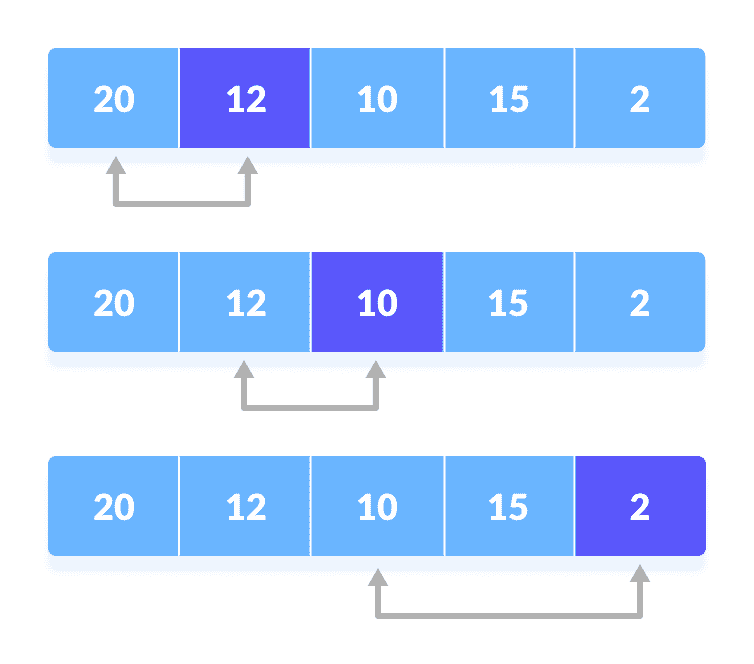
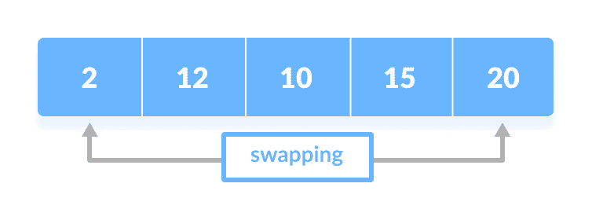
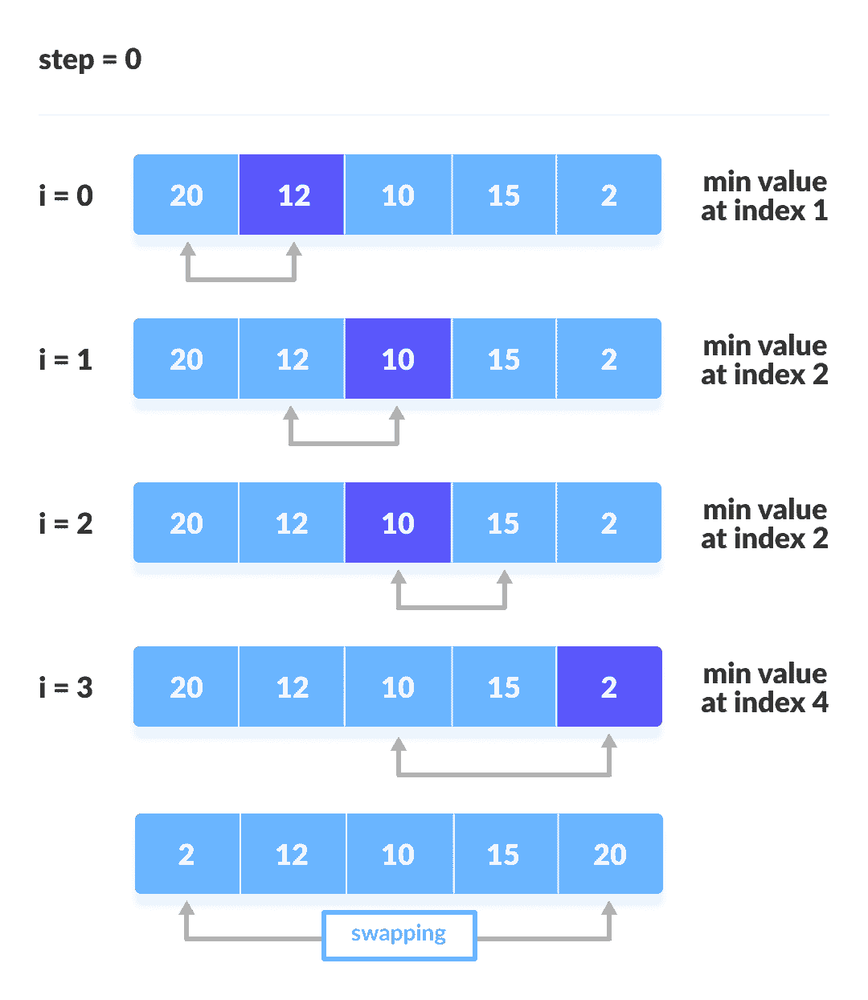
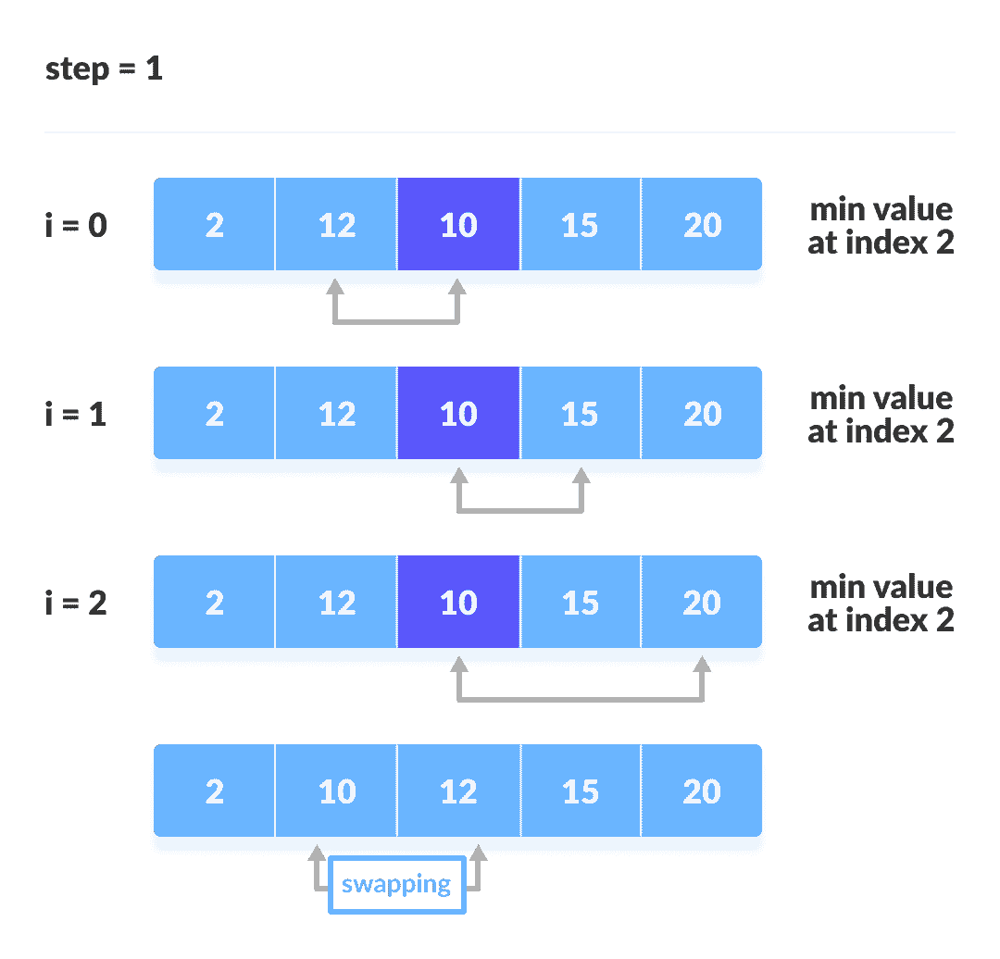
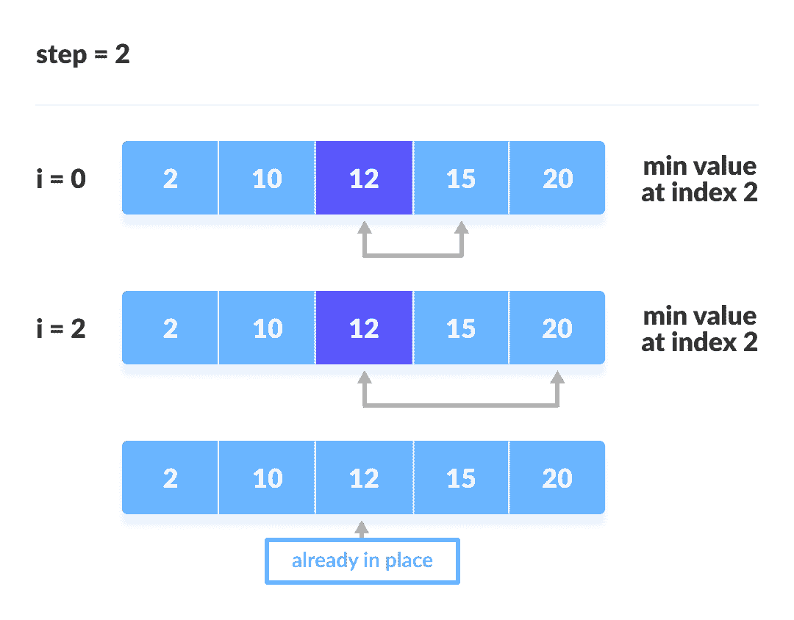
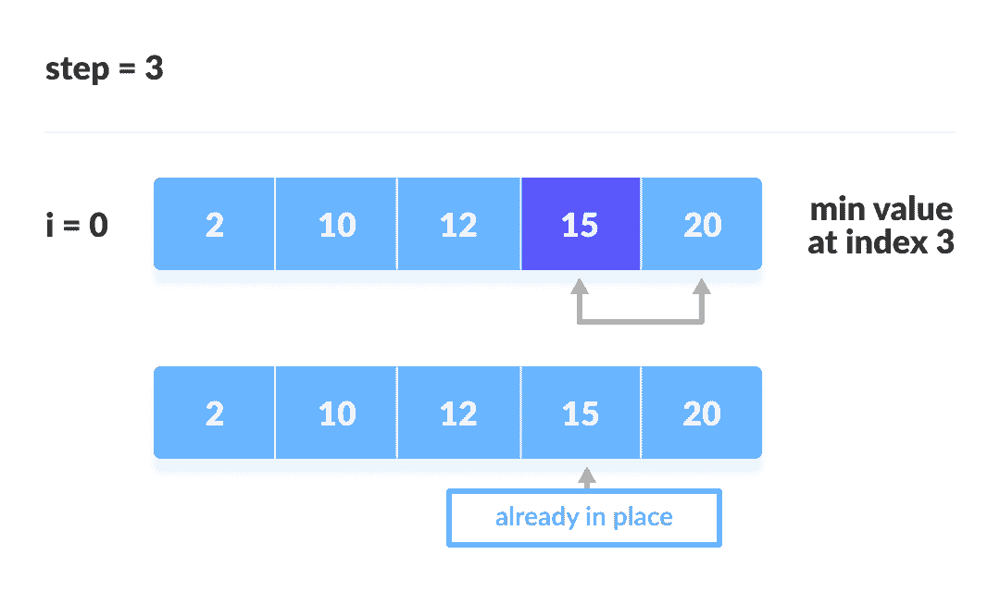

# 选择排序算法

> 原文： [https://www.programiz.com/dsa/selection-sort](https://www.programiz.com/dsa/selection-sort)

#### 在本教程中，您将学习选择排序的工作方式。 此外，您还将找到使用 C，C++ ，Java 和 Python 进行选择排序的工作示例。

选择排序是一种算法，它在每次迭代中从未排序列表中选择最小的元素，并将该元素放在未排序列表的开头。

* * *

## 选择排序如何工作？

1.  将第一个元素设置为`minimum`。

    

    选择第一个元素作为最小值

    

2.  将`minimum`与第二个元素进行比较。 如果第二个元素小于`minimum`，则将第二个元素指定为`minimum`。

    将`minimum`与第三个元素进行比较。 同样，如果第三个元素较小，则将`minimum`分配给第三个元素，否则不执行任何操作。 该过程一直进行到最后一个元素。

    

    将其余元素的最小值进行比较

    

3.  每次迭代后，`minimum`都放在未排序列表的前面。

    

    以最少的

    

    交换第一个
4.  对于每次迭代，索引从第一个未排序元素开始。 重复步骤 1 到 3，直到所有元素都放置在正确的位置。

    

    第一次迭代

    

    

    第二次迭代

    

    

    第三次迭代

    

    [

    

    第四次迭代

    

* * *

## 选择排序算法

```
selectionSort(array, size)
  repeat (size - 1) times
  set the first unsorted element as the minimum
  for each of the unsorted elements
    if element < currentMinimum
      set element as new minimum
  swap minimum with first unsorted position
end selectionSort

```

* * *

## Python，Java 和 C/C++ 示例

[Python](#python-code)[Java](#java-code)[C](#c-code)[C++](#cpp-code)

```
# Selection sort in Python

def selectionSort(array, size):

    for step in range(size):
        min_idx = step

        for i in range(step + 1, size):

            # to sort in descending order, change > to < in this line
            # select the minimum element in each loop
            if array[i] < array[min_idx]:
                min_idx = i

        # put min at the correct position
        (array[step], array[min_idx]) = (array[min_idx], array[step])

data = [-2, 45, 0, 11, -9]
size = len(data)
selectionSort(data, size)
print('Sorted Array in Ascending Order:')
print(data)
```

```
// Selection sort in Java

import java.util.Arrays;

class SelectionSort {
  void selectionSort(int array[]) {
    int size = array.length;

    for (int step = 0; step < size - 1; step++) {
      int min_idx = step;

      for (int i = step + 1; i < size; i++) {

        // To sort in descending order, change > to < in this line.
        // Select the minimum element in each loop.
        if (array[i] < array[min_idx]) {
          min_idx = i;
        }
      }

      // put min at the correct position
      int temp = array[step];
      array[step] = array[min_idx];
      array[min_idx] = temp;
    }
  }

  // driver code
  public static void main(String args[]) {
    int[] data = { 20, 12, 10, 15, 2 };
    SelectionSort ss = new SelectionSort();
    ss.selectionSort(data);
    System.out.println("Sorted Array in Ascending Order: ");
    System.out.println(Arrays.toString(data));
  }
}
```

```
// Selection sort in C

#include <stdio.h>

// function to swap the the position of two elements
void swap(int *a, int *b) {
  int temp = *a;
  *a = *b;
  *b = temp;
}

void selectionSort(int array[], int size) {
  for (int step = 0; step < size - 1; step++) {
    int min_idx = step;
    for (int i = step + 1; i < size; i++) {

      // To sort in descending order, change > to < in this line.
      // Select the minimum element in each loop.
      if (array[i] < array[min_idx])
        min_idx = i;
    }

    // put min at the correct position
    swap(&array[min_idx], &array[step]);
  }
}

// function to print an array
void printArray(int array[], int size) {
  for (int i = 0; i < size; ++i) {
    printf("%d  ", array[i]);
  }
  printf("\n");
}

// driver code
int main() {
  int data[] = {20, 12, 10, 15, 2};
  int size = sizeof(data) / sizeof(data[0]);
  selectionSort(data, size);
  printf("Sorted array in Acsending Order:\n");
  printArray(data, size);
}
```

```
// Selection sort in C++

#include <iostream>
using namespace std;

// function to swap the the position of two elements
void swap(int *a, int *b) {
  int temp = *a;
  *a = *b;
  *b = temp;
}

// function to print an array
void printArray(int array[], int size) {
  for (int i = 0; i < size; i++) {
    cout << array[i] << " ";
  }
  cout << endl;
}

void selectionSort(int array[], int size) {
  for (int step = 0; step < size - 1; step++) {
    int min_idx = step;
    for (int i = step + 1; i < size; i++) {

      // To sort in descending order, change > to < in this line.
      // Select the minimum element in each loop.
      if (array[i] < array[min_idx])
        min_idx = i;
    }

    // put min at the correct position
    swap(&array[min_idx], &array[step]);
  }
}

// driver code
int main() {
  int data[] = {20, 12, 10, 15, 2};
  int size = sizeof(data) / sizeof(data[0]);
  selectionSort(data, size);
  cout << "Sorted array in Acsending Order:\n";
  printArray(data, size);
}
```

* * *

## 复杂

| 周期 | 比较数 |
| 第一 | （`n-1`） |
| 第二 | （`n-2`） |
| 第三 | （`n-3`） |
| ... | ... |
| 最后 | 1 |

比较数：`(n - 1) + (n - 2) + (n - 3) + ..... + 1 = n(n - 1) / 2`几乎等于`n^2`。

**复杂度** = `O(n^2)`

同样，我们可以通过简单地观察循环数来分析复杂性。 有 2 个循环，因此复杂度为`n*n = n^2`。

**时间复杂度**：

*   **最坏情况的复杂度**： `O(n^2)`
    如果我们要以升序排序，而数组是以降序排序，那么会发生最坏情况。
*   **最佳情况复杂度**： `O(n^2)`
    在对数组进行排序时会发生
*   **平均情况复杂度**： `O(n^2)`
    当数组的元素处于混乱顺序（既不升也不降）时，会发生这种情况。

选择排序的时间复杂度在所有情况下都是相同的。 在每一步中，您都必须找到最小的元素并将其放在正确的位置。 直到没有到达数组的末尾，才知道最小元素。

**空间复杂度**：

空间复杂度为`O(1)`，因为使用了额外的变量`temp`。

* * *

## 选择排序应用

在以下情况下使用选择排序：

*   一个小清单要排序
*   交换成本无所谓
*   必须对所有要素进行检查
*   写入存储器的成本就像闪存一样重要（与冒泡排序的`O(n^2)`相比，写入/交换的次数为`O(n)`）