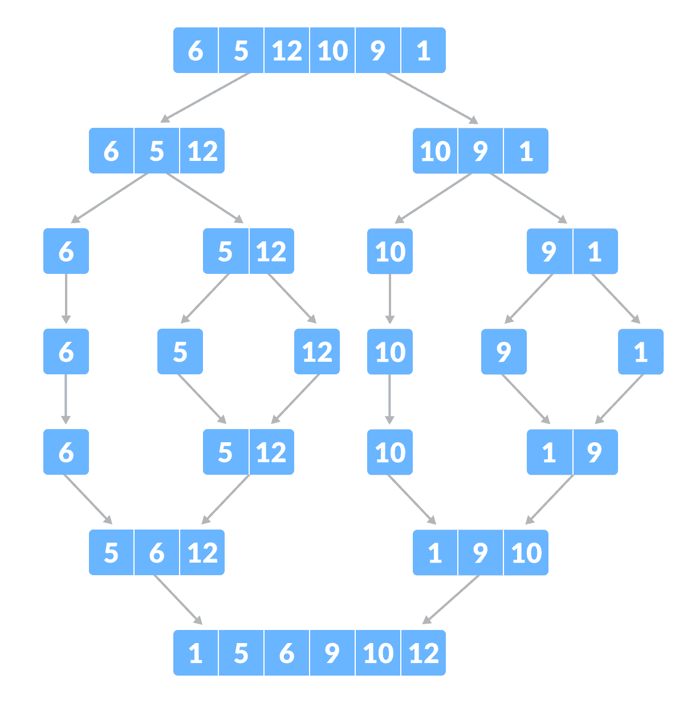
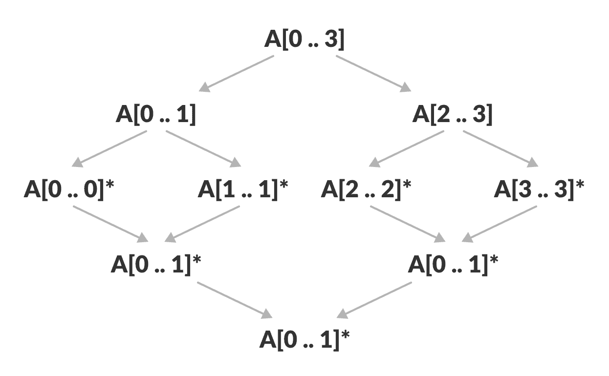
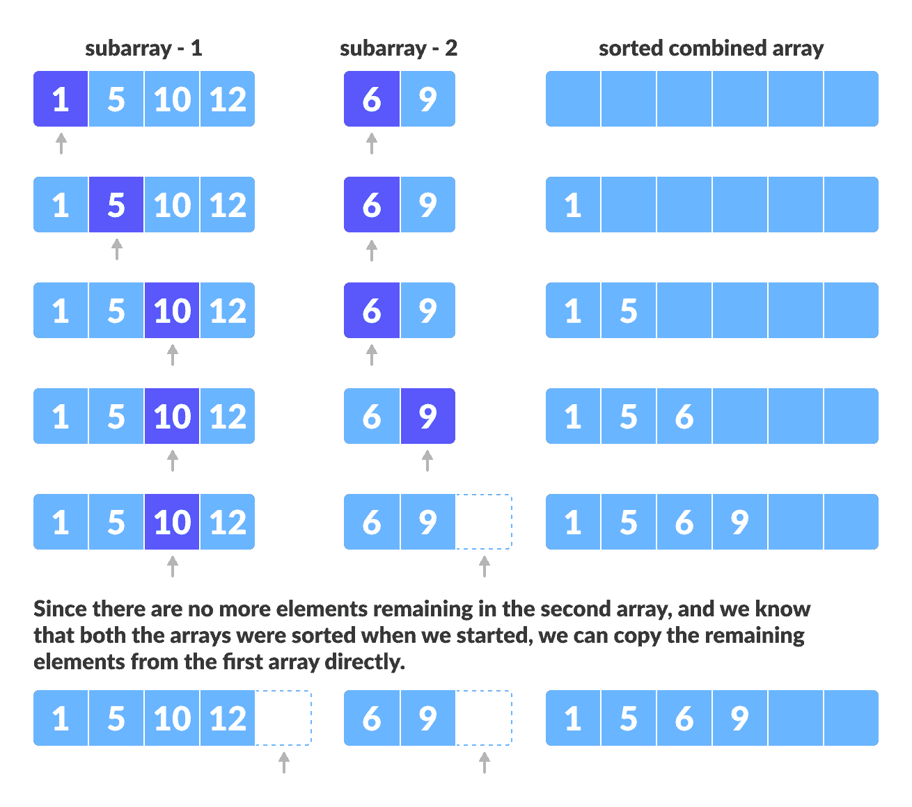
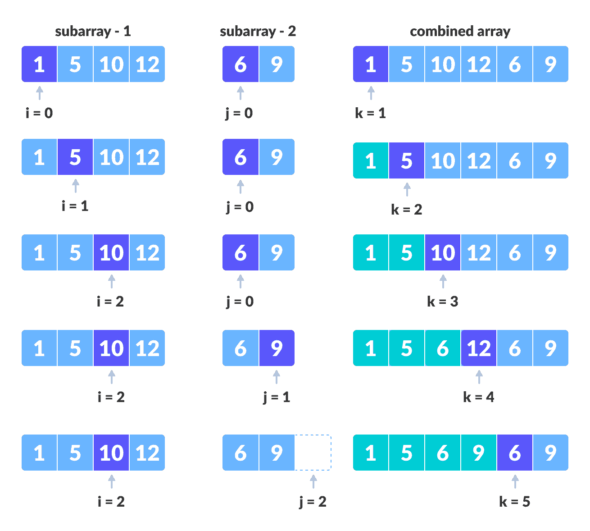
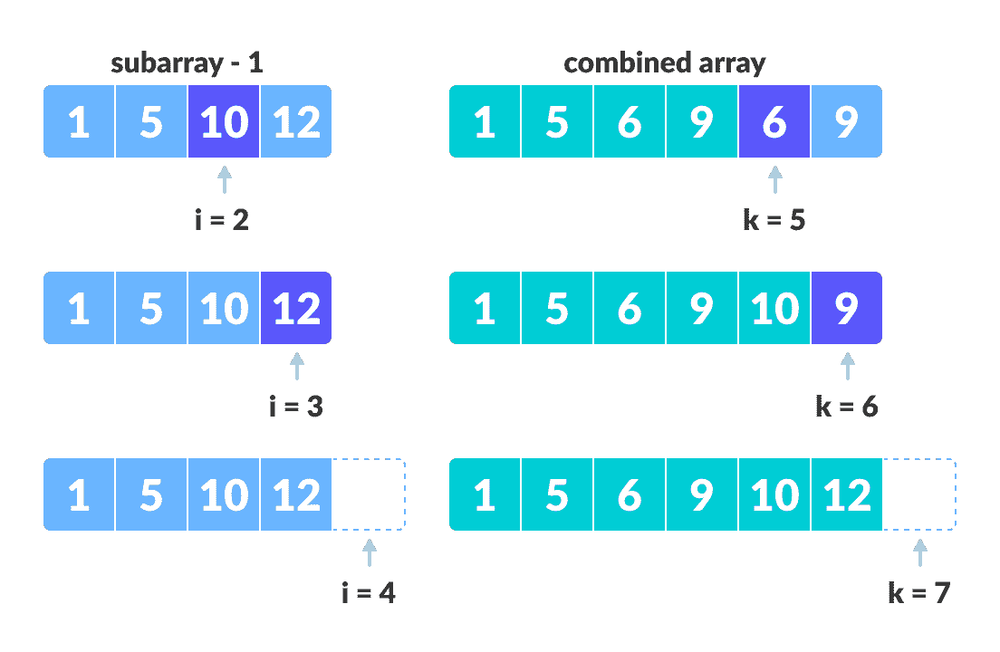
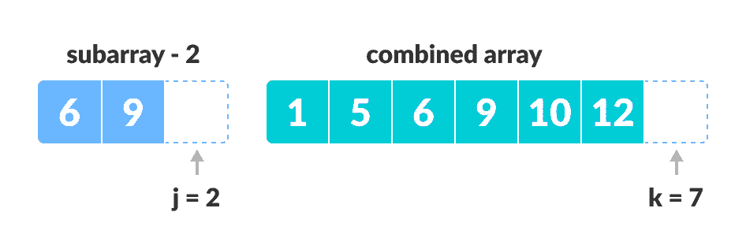

# 归并排序算法

> 原文： [https://www.programiz.com/dsa/merge-sort](https://www.programiz.com/dsa/merge-sort)

#### 在本教程中，您将学习归并排序。 此外，您还将找到合并类别 C，C++ ，Java 和 Python 的工作示例。

归并排序是计算机编程中的一种“分治”算法。 它是最流行的排序算法之一，也是建立对构建递归算法的信心的一种好方法。



Merge Sort example


* * *

## 分治策略

使用[分治技术](/dsa/divide-and-conquer)，我们将一个问题分为多个子问题。 准备好每个子问题的解决方案后，我们将这些子问题的结果“组合”起来以解决主要问题。

假设我们必须对数组`A`进行排序。 一个子问题将是对该数组的一个子节进行排序，该子节开始于索引`p`，结束于索引`r`，表示为`A[p..r]`。

**划分**
如果`q`是`p`和`r`之间的中点，则我们可以将子数组`A[p..r]`分成两个数组`A[p..q]`和`A[q + 1..r]`。

**解决**
在解决步骤中，我们尝试对两个子数组`A[p..q]`和`A[q + 1..r]`进行排序 。 如果尚未达到基本情况，则再次划分这两个子数组，然后尝试对它们进行排序。

**合并**
当解决步骤到达基本步骤时，我们得到`A[p..r]`数组的两个排序的子数组`A[p..q]`和`A[q + 1..r]`，我们通过从两个排序的子数组`A[p]`创建一个排序的数组`A[p..r]`来组合结果`A[p..q]`和`A[q + 1..r]`。

* * *

## 归并排序算法

归并排序函数将数组重复分成两半，直到我们达到对大小为 1 的子数组（即`p == r`）执行归并排序的阶段。

之后，合并功能开始起作用，并将排序后的数组合并为更大的数组，直到合并整个数组。

```
MergeSort(A, p, r):
    if p > r 
        return
    q = (p+r)/2
    mergeSort(A, p, q)
    mergeSort(A, q+1, r)
    merge(A, p, q, r)
```

要对整个数组进行排序，我们需要调用`MergeSort(A, 0, length(A)-1)`。

如下图所示，归并排序算法将数组递归地分成两半，直到我们得到具有 1 个元素的数组的基本情况。 之后，合并功能将拾取排序后的子数组并将其合并以逐渐对整个数组进行排序。



Merge sort in action


### 合并步骤

每个递归算法都依赖于基本情况以及将基本情况的结果进行组合的能力。 归并排序没有什么不同。 您猜对了，归并排序算法最重要的部分是合并步骤。

合并步骤是解决合并两个排序列表（数组）以构建一个大排序列表（数组）这一简单问题的解决方案。

该算法维护三个指针，一个用于两个数组中的每个，另一个用于维护最终排序后的数组的当前索引。

```
Have we reached the end of any of the arrays?
    No:
        Compare current elements of both arrays 
        Copy smaller element into sorted array
        Move pointer of element containing smaller element
    Yes:
        Copy all remaining elements of non-empty array
```



Merge step


* * *

## 编写合并算法代码

我们上面描述的合并步骤和用于归并排序的步骤之间的明显区别是，我们仅对连续的子数组执行合并功能。

这就是为什么我们只需要数组，第一个位置，第一个子数组的最后一个索引（我们可以计算第二个子数组的第一个索引）和第二个子数组的最后一个索引的原因。

我们的任务是合并两个子数组`A[p..q]`和`A[q + 1..r]`，以创建排序数组`A[p..r]`。 因此，函数的输入为`A`，`p`，`q`和`r`

合并功能的工作方式如下：

1.  创建子数组`L ← A[p..q]`和`M←A[q + 1..r]`的副本。
2.  创建三个指针`i`，`j`和`k`
    1.  `i`维持`L`的当前索引，从 1 开始
    2.  `j`维持`M`的当前索引，从 1 开始
    3.  `k`维持`A[p..q]`的当前索引，从`p`开始。
3.  直到我们到达`L`或`M`的末尾，再从`L`和`M`中选择较大的元素，然后将它们放在`A[p..q]`的正确位置
4.  当我们用尽`L`或`M`中的元素时，请拾取其余元素，然后放入`A[p..q]`

在代码中，这看起来像：

```
// Merge two subarrays L and M into arr
void merge(int arr[], int p, int q, int r) {

    // Create L ← A[p..q] and M ← A[q+1..r]
    int n1 = q - p + 1;
    int n2 = r - q;

    int L[n1], M[n2];

    for (int i = 0; i < n1; i++)
        L[i] = arr[p + i];
    for (int j = 0; j < n2; j++)
        M[j] = arr[q + 1 + j];

    // Maintain current index of sub-arrays and main array
    int i, j, k;
    i = 0;
    j = 0;
    k = p;

    // Until we reach either end of either L or M, pick larger among
    // elements L and M and place them in the correct position at A[p..r]
    while (i < n1 && j < n2) {
        if (L[i] <= M[j]) {
            arr[k] = L[i];
            i++;
        } else {
            arr[k] = M[j];
            j++;
        }
        k++;
    }

    // When we run out of elements in either L or M,
    // pick up the remaining elements and put in A[p..r]
    while (i < n1) {
        arr[k] = L[i];
        i++;
        k++;
    }

    while (j < n2) {
        arr[k] = M[j];
        j++;
        k++;
    }
}
```

* * *

## `Merge()`函数逐步解释

这个函数发生了很多事情，所以让我们举个例子来看一下它是如何工作的。

和往常一样，一张图片说出一千个单词。


Merging two consecutive subarrays of array


数组`A[0..5]`包含两个分类的子数组`A[0..3]`和`A[4..5]`。 让我们看看`merge`函数如何合并两个数组。

```
void merge(int arr[], int p, int q, int r) {
// Here, p = 0, q = 4, r = 5 (size of array)
```

### 步骤 1：创建要排序的子数组的重复副本

```
 // Create L ← A[p..q] and M ← A[q+1..r]
    int n1 = q - p + 1 = 3 - 0 + 1 = 4;
    int n2 = r - q = 5 - 3 = 2;

    int L[4], M[2];

    for (int i = 0; i < 4; i++)
        L[i] = arr[p + i];
        // L[0,1,2,3] = A[0,1,2,3] = [1,5,10,12]

    for (int j = 0; j < 2; j++)
        M[j] = arr[q + 1 + j];
        // M[0,1,2,3] = A[4,5] = [6,9]
```


Create copies of subarrays for merging


### 步骤 2：维护子数组和主数组的当前索引

```
 int i, j, k;
    i = 0; 
    j = 0; 
    k = p; 
```


Maintain indices of copies of sub array and main array


### 步骤 3：直到我们到达`L`或`M`的尽头，在元素`L`和`M`中选择更大的一个，并将其放置`A[p..r]`的正确位置

```
 while (i < n1 && j < n2) { 
        if (L[i] <= M[j]) { 
            arr[k] = L[i]; i++; 
        } 
        else { 
            arr[k] = M[j]; 
            j++; 
        } 
        k++; 
    }
```



Comparing individual elements of sorted subarrays until we reach end of one


### 步骤 4：当我们用完`L`或`M`中的元素时，请拾取剩余的元素并放入`A[p..r]`

```
 // We exited the earlier loop because j < n2 doesn't hold
    while (i < n1)
    {
        arr[k] = L[i];
        i++;
        k++;
    }
```



Copy the remaining elements from the first array to main subarray


```
 // We exited the earlier loop because i < n1 doesn't hold  
    while (j < n2)
    {
        arr[k] = M[j];
        j++;
        k++;
    }
}
```



Copy remaining elements of second array to main subarray


如果`M`的大小大于`L`，则需要此步骤。

在合并功能的末尾，对子数组`A[p..r]`进行排序。

* * *

## Python，Java 和 C/C++ 示例

[Python](#python-code)[Java](#java-code)[C](#c-code)[C++](#cpp-code)

```
# MergeSort in Python

def mergeSort(array):
    if len(array) > 1:

        #  r is the point where the array is divided into two subarrays
        r = len(array)//2
        L = array[:r]
        M = array[r:]

        # Sort the two halves
        mergeSort(L)
        mergeSort(M)

        i = j = k = 0

        # Until we reach either end of either L or M, pick larger among
        # elements L and M and place them in the correct position at A[p..r]
        while i < len(L) and j < len(M):
            if L[i] < M[j]:
                array[k] = L[i]
                i += 1
            else:
                array[k] = M[j]
                j += 1
            k += 1

        # When we run out of elements in either L or M,
        # pick up the remaining elements and put in A[p..r]
        while i < len(L):
            array[k] = L[i]
            i += 1
            k += 1

        while j < len(M):
            array[k] = M[j]
            j += 1
            k += 1

# Print the array
def printList(array):
    for i in range(len(array)):
        print(array[i], end=" ")
    print()

# Driver program
if __name__ == '__main__':
    array = [6, 5, 12, 10, 9, 1]

    mergeSort(array)

    print("Sorted array is: ")
    printList(array) 
```

```
// Merge sort in Java

class MergeSort {

  // Merge two subarrays L and M into arr
  void merge(int arr[], int p, int q, int r) {

    // Create L ← A[p..q] and M ← A[q+1..r]
    int n1 = q - p + 1;
    int n2 = r - q;

    int L[] = new int[n1];
    int M[] = new int[n2];

    for (int i = 0; i < n1; i++)
      L[i] = arr[p + i];
    for (int j = 0; j < n2; j++)
      M[j] = arr[q + 1 + j];

    // Maintain current index of sub-arrays and main array
    int i, j, k;
    i = 0;
    j = 0;
    k = p;

    // Until we reach either end of either L or M, pick larger among
    // elements L and M and place them in the correct position at A[p..r]
    while (i < n1 && j < n2) {
      if (L[i] <= M[j]) {
        arr[k] = L[i];
        i++;
      } else {
        arr[k] = M[j];
        j++;
      }
      k++;
    }

    // When we run out of elements in either L or M,
    // pick up the remaining elements and put in A[p..r]
    while (i < n1) {
      arr[k] = L[i];
      i++;
      k++;
    }

    while (j < n2) {
      arr[k] = M[j];
      j++;
      k++;
    }
  }

  // Divide the array into two subarrays, sort them and merge them
  void mergeSort(int arr[], int l, int r) {
    if (l < r) {

      // m is the point where the array is divided into two subarrays
      int m = (l + r) / 2;

      mergeSort(arr, l, m);
      mergeSort(arr, m + 1, r);

      // Merge the sorted subarrays
      merge(arr, l, m, r);
    }
  }

  // Print the array
  static void printArray(int arr[]) {
    int n = arr.length;
    for (int i = 0; i < n; ++i)
      System.out.print(arr[i] + " ");
    System.out.println();
  }

  // Driver program
  public static void main(String args[]) {
    int arr[] = { 6, 5, 12, 10, 9, 1 };

    MergeSort ob = new MergeSort();
    ob.mergeSort(arr, 0, arr.length - 1);

    System.out.println("Sorted array:");
    printArray(arr);
  }
}
```

```
// Merge sort in C

#include <stdio.h>

// Merge two subarrays L and M into arr
void merge(int arr[], int p, int q, int r) {

  // Create L ← A[p..q] and M ← A[q+1..r]
  int n1 = q - p + 1;
  int n2 = r - q;

  int L[n1], M[n2];

  for (int i = 0; i < n1; i++)
    L[i] = arr[p + i];
  for (int j = 0; j < n2; j++)
    M[j] = arr[q + 1 + j];

  // Maintain current index of sub-arrays and main array
  int i, j, k;
  i = 0;
  j = 0;
  k = p;

  // Until we reach either end of either L or M, pick larger among
  // elements L and M and place them in the correct position at A[p..r]
  while (i < n1 && j < n2) {
    if (L[i] <= M[j]) {
      arr[k] = L[i];
      i++;
    } else {
      arr[k] = M[j];
      j++;
    }
    k++;
  }

  // When we run out of elements in either L or M,
  // pick up the remaining elements and put in A[p..r]
  while (i < n1) {
    arr[k] = L[i];
    i++;
    k++;
  }

  while (j < n2) {
    arr[k] = M[j];
    j++;
    k++;
  }
}

// Divide the array into two subarrays, sort them and merge them
void mergeSort(int arr[], int l, int r) {
  if (l < r) {

    // m is the point where the array is divided into two subarrays
    int m = l + (r - l) / 2;

    mergeSort(arr, l, m);
    mergeSort(arr, m + 1, r);

    // Merge the sorted subarrays
    merge(arr, l, m, r);
  }
}

// Print the array
void printArray(int arr[], int size) {
  for (int i = 0; i < size; i++)
    printf("%d ", arr[i]);
  printf("\n");
}

// Driver program
int main() {
  int arr[] = {6, 5, 12, 10, 9, 1};
  int size = sizeof(arr) / sizeof(arr[0]);

  mergeSort(arr, 0, size - 1);

  printf("Sorted array: \n");
  printArray(arr, size);
}
```

```
// Merge sort in C++

#include <iostream>
using namespace std;

// Merge two subarrays L and M into arr
void merge(int arr[], int p, int q, int r) {

  // Create L ← A[p..q] and M ← A[q+1..r]
  int n1 = q - p + 1;
  int n2 = r - q;

  int L[n1], M[n2];

  for (int i = 0; i < n1; i++)
    L[i] = arr[p + i];
  for (int j = 0; j < n2; j++)
    M[j] = arr[q + 1 + j];

  // Maintain current index of sub-arrays and main array
  int i, j, k;
  i = 0;
  j = 0;
  k = p;

  // Until we reach either end of either L or M, pick larger among
  // elements L and M and place them in the correct position at A[p..r]
  while (i < n1 && j < n2) {
    if (L[i] <= M[j]) {
      arr[k] = L[i];
      i++;
    } else {
      arr[k] = M[j];
      j++;
    }
    k++;
  }

  // When we run out of elements in either L or M,
  // pick up the remaining elements and put in A[p..r]
  while (i < n1) {
    arr[k] = L[i];
    i++;
    k++;
  }

  while (j < n2) {
    arr[k] = M[j];
    j++;
    k++;
  }
}

// Divide the array into two subarrays, sort them and merge them
void mergeSort(int arr[], int l, int r) {
  if (l < r) {
    // m is the point where the array is divided into two subarrays
    int m = l + (r - l) / 2;

    mergeSort(arr, l, m);
    mergeSort(arr, m + 1, r);

    // Merge the sorted subarrays
    merge(arr, l, m, r);
  }
}

// Print the array
void printArray(int arr[], int size) {
  for (int i = 0; i < size; i++)
    cout << arr[i] << " ";
  cout << endl;
}

// Driver program
int main() {
  int arr[] = {6, 5, 12, 10, 9, 1};
  int size = sizeof(arr) / sizeof(arr[0]);

  mergeSort(arr, 0, size - 1);

  cout << "Sorted array: \n";
  printArray(arr, size);
  return 0;
}
```

* * *

## 归并排序复杂度

### 时间复杂度

最佳情况复杂度：`O(n * log n)`

最坏情况的复杂度：`O(n * log n)`

平均情况复杂度：`O(n * log n)`

### 空间复杂度

归并排序的空间复杂度为`O(n)`。

* * *

## 归并排序应用程序

*   倒数问题
*   外部分类
*   电子商务应用