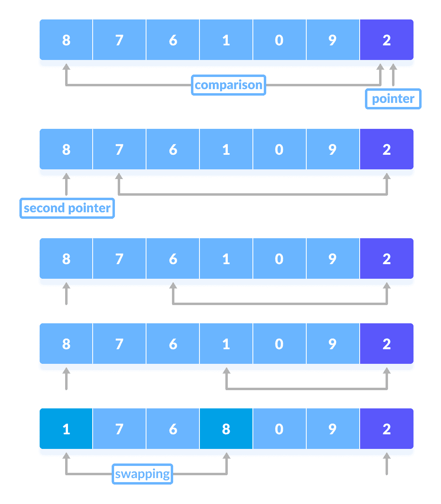
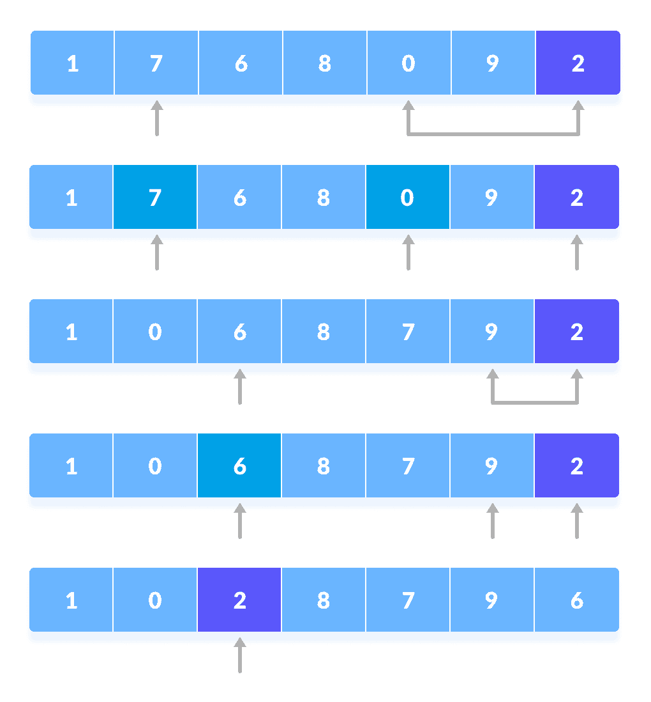
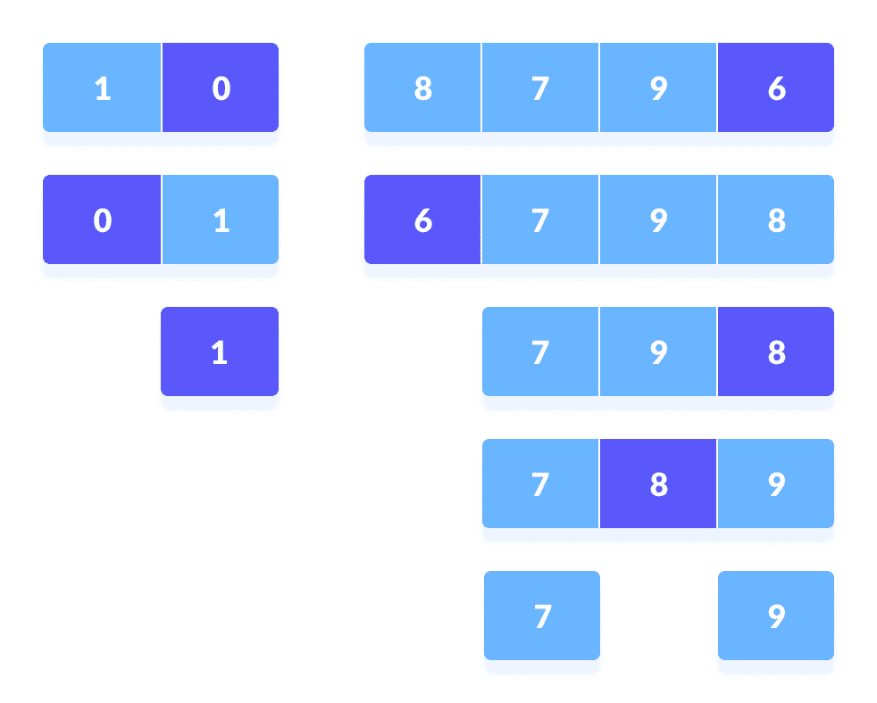
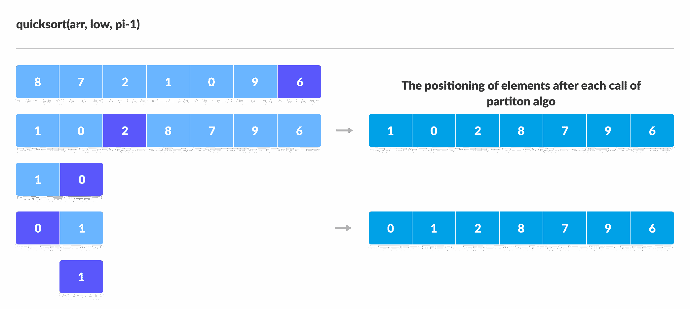
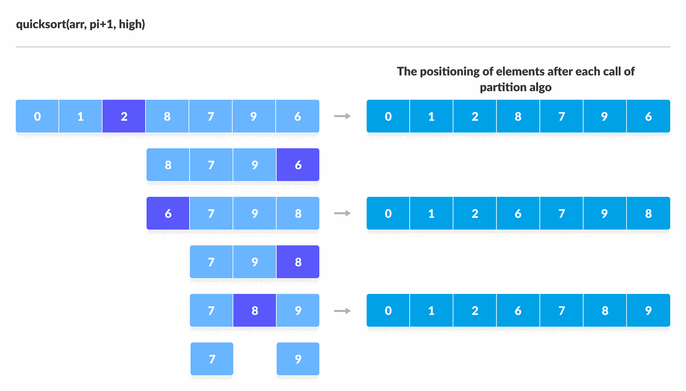

# 快速排序算法

> 原文： [https://www.programiz.com/dsa/quick-sort](https://www.programiz.com/dsa/quick-sort)

#### 在本教程中，您将学习快速排序的工作原理。 此外，您还将找到 C，C++  Python 和 Java 中 quicksort 的工作示例。

Quicksort 是一种基于分而治之方法的算法，其中将数组拆分为子数组，然后递归调用这些子数组以对元素进行排序。

* * *

## QuickSort 如何工作？

1.  从数组中选择枢轴元素。 您可以从数组中选择任何元素作为枢轴元素。
    在这里，我们将数组的最右边（即最后一个元素）作为枢轴元素。

    

    选择枢轴元素

    

2.  小于枢轴元素的元素放在左侧，大于枢轴元素的元素放在右侧。

    

    将所有较小的元素放在枢轴元素

    

    的左侧，将较大的元素放在右侧。
    1.  指针固定在枢轴元件上。 将枢轴元素与从第一个索引开始的元素进行比较。 如果达到大于枢轴元素的元素，则为该元素设置第二个指针。
    2.  现在，将枢轴元素与其他元素（第三个指针）进行比较。 如果到达的元素小于枢轴元素，则将较小的元素替换为较早找到的较大的元素。

        

        枢轴元素与其他元素的比较

        

    3.  该过程一直进行到到达倒数第二个元素为止。
        最后，将枢轴元素与第二个指针交换。

        

        与第二个指针

        

        交换枢轴元素
3.  再次分别为左子部分和右子部分选择了枢轴元素。 在这些子部件中，枢轴元件放置在正确的位置。 然后，重复步骤 2。

    

    在每一半中选择枢轴元素，然后使用递归

    

    将其放置在正确的位置
4.  将子部分再次划分为较小的子部分，直到每个子部分由单个元素形成。
5.  至此，该数组已经排序。

* * *

**Quicksort 使用递归对子部分进行排序。**

在[分治法](/dsa/divide-and-conquer)的基础上，快速排序算法可以解释为：

*   **划分**
    将数组划分为以枢轴为分割点的子部分。 小于枢轴的元素放置在枢轴的左侧，大于枢轴的元素放置在右侧。
*   **征服**
    左子部分和右子部分再次通过选择枢轴元素进行划分。 这可以通过将子部分递归传递到算法中来实现。
*   **合并**
    此步骤在快速排序中不起作用。 该数组已在征服步骤的末尾排序。

您可以在以下插图的帮助下了解快速排序的工作方式。



Sorting the elements on the left of pivot using recursion




Sorting the elements on the right of pivot using recursion


* * *

## 快速排序算法

```
quickSort(array, leftmostIndex, rightmostIndex)
  if (leftmostIndex < rightmostIndex)
    pivotIndex <- partition(array,leftmostIndex, rightmostIndex)
    quickSort(array, leftmostIndex, pivotIndex)
    quickSort(array, pivotIndex + 1, rightmostIndex)

partition(array, leftmostIndex, rightmostIndex)
  set rightmostIndex as pivotIndex
  storeIndex <- leftmostIndex - 1
  for i <- leftmostIndex + 1 to rightmostIndex
  if element[i] < pivotElement
    swap element[i] and element[storeIndex]
    storeIndex++
  swap pivotElement and element[storeIndex+1]
return storeIndex + 1
```

* * *

## Python，Java 和 C/C++ 示例

[Python](#python-code)[Java](#java-code)[C](#c-code)[C+](#cpp-code)

```
# Quick sort in Python

# Function to partition the array on the basis of pivot element
def partition(array, low, high):

    # Select the pivot element
    pivot = array[high]
    i = low - 1

    # Put the elements smaller than pivot on the left and greater 
    #than pivot on the right of pivot
    for j in range(low, high):
        if array[j] <= pivot:
            i = i + 1
            (array[i], array[j]) = (array[j], array[i])

    (array[i + 1], array[high]) = (array[high], array[i + 1])

    return i + 1

def quickSort(array, low, high):
    if low < high:

        # Select pivot position and put all the elements smaller 
        # than pivot on left and greater than pivot on right
        pi = partition(array, low, high)

        # Sort the elements on the left of pivot
        quickSort(array, low, pi - 1)

        # Sort the elements on the right of pivot
        quickSort(array, pi + 1, high)

data = [8, 7, 2, 1, 0, 9, 6]
size = len(data)
quickSort(data, 0, size - 1)
print('Sorted Array in Ascending Order:')
print(data)
```

```
// Quick sort in Java

import java.util.Arrays;

class QuickSort {

  // Function to partition the array on the basis of pivot element
  int partition(int array[], int low, int high) {

    // Select the pivot element
    int pivot = array[high];
    int i = (low - 1);

    // Put the elements smaller than pivot on the left and 
    // greater than pivot on the right of pivot
    for (int j = low; j < high; j++) {
      if (array[j] <= pivot) {
        i++;
        int temp = array[i];
        array[i] = array[j];
        array[j] = temp;
      }
    }
    int temp = array[i + 1];
    array[i + 1] = array[high];
    array[high] = temp;
    return (i + 1);
  }

  void quickSort(int array[], int low, int high) {
    if (low < high) {

      // Select pivot position and put all the elements smaller 
      // than pivot on left and greater than pivot on right
      int pi = partition(array, low, high);

      // Sort the elements on the left of pivot
      quickSort(array, low, pi - 1);

      // Sort the elements on the right of pivot
      quickSort(array, pi + 1, high);
    }
  }

  // Driver code
  public static void main(String args[]) {
    int[] data = { 8, 7, 2, 1, 0, 9, 6 };
    int size = data.length;
    QuickSort qs = new QuickSort();
    qs.quickSort(data, 0, size - 1);
    System.out.println("Sorted Array in Ascending Order: ");
    System.out.println(Arrays.toString(data));
  }
}
```

```
// Quick sort in C

#include <stdio.h>

// Function to swap position of elements
void swap(int *a, int *b) {
  int t = *a;
  *a = *b;
  *b = t;
}

// Function to partition the array on the basis of pivot element
int partition(int array[], int low, int high) {

  // Select the pivot element
  int pivot = array[high];
  int i = (low - 1);

  // Put the elements smaller than pivot on the left 
  // and greater than pivot on the right of pivot
  for (int j = low; j < high; j++) {
    if (array[j] <= pivot) {
      i++;
      swap(&array[i], &array[j]);
    }
  }

  swap(&array[i + 1], &array[high]);
  return (i + 1);
}

void quickSort(int array[], int low, int high) {
  if (low < high) {

    // Select pivot position and put all the elements smaller 
    // than pivot on left and greater than pivot on right
    int pi = partition(array, low, high);

    // Sort the elements on the left of pivot
    quickSort(array, low, pi - 1);

    // Sort the elements on the right of pivot
    quickSort(array, pi + 1, high);
  }
}

// Function to print eklements of an array
void printArray(int array[], int size) {
  for (int i = 0; i < size; ++i) {
    printf("%d  ", array[i]);
  }
  printf("\n");
}

// Driver code
int main() {
  int data[] = {8, 7, 2, 1, 0, 9, 6};
  int n = sizeof(data) / sizeof(data[0]);
  quickSort(data, 0, n - 1);
  printf("Sorted array in ascending order: \n");
  printArray(data, n);
}
```

```
// Quick sort in C++

#include <iostream>
using namespace std;

// Function to swap position of elements
void swap(int *a, int *b) {
  int t = *a;
  *a = *b;
  *b = t;
}

// Function to print eklements of an array
void printArray(int array[], int size) {
  int i;
  for (i = 0; i < size; i++)
    cout << array[i] << " ";
  cout << endl;
}

// Function to partition the array on the basis of pivot element
int partition(int array[], int low, int high) {
  // Select the pivot element
  int pivot = array[high];
  int i = (low - 1);

  // Put the elements smaller than pivot on the left 
  // and greater than pivot on the right of pivot
  for (int j = low; j < high; j++) {
    if (array[j] <= pivot) {
      i++;
      swap(&array[i], &array[j]);
    }
  }
  printArray(array, 7);
  cout << "........\n";
  swap(&array[i + 1], &array[high]);
  return (i + 1);
}

void quickSort(int array[], int low, int high) {
  if (low < high) {
    // Select pivot position and put all the elements smaller 
    // than pivot on left and greater than pivot on right
    int pi = partition(array, low, high);

    // Sort the elements on the left of pivot
    quickSort(array, low, pi - 1);

    // Sort the elements on the right of pivot
    quickSort(array, pi + 1, high);
  }
}

// Driver code
int main() {
  int data[] = {8, 7, 6, 1, 0, 9, 2};
  int n = sizeof(data) / sizeof(data[0]);
  quickSort(data, 0, n - 1);
  cout << "Sorted array in ascending order: \n";
  printArray(data, n);
}
```

* * *

## 快速排序的复杂性

**时间复杂度**

*   **最坏情况的复杂性[Big-O]** ：`O(n<sup>2</sup>)`
    当拾取的枢轴元素为最大或最小元素时，会发生这种情况。
    这种情况导致枢轴元素位于已排序数组的最末端的情况。 一个子数组始终为空，而另一个子数组包含`n - 1`元素。 因此，仅在此子阵列上调用 quicksort。
    但是，快速排序算法对于分散的数据透视表具有更好的性能。

*   **最佳情况复杂度[大Ω]** ：`O(n*log n)`
    当枢轴元素始终是中间元素或靠近中间元素时，会发生这种情况。
*   **平均病例复杂度[大θ]** ：`O(n*log n)`
    当不出现上述条件时发生。

**空间复杂度**

quicksort 的空间复杂度为`O(log n)`。

* * *

## Quicksort 应用

快速排序在以下情况下实施

*   编程语言适合递归
*   时间复杂度很重要
*   空间复杂性很重要