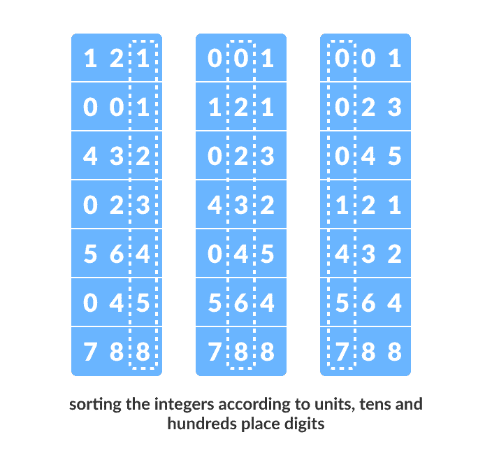
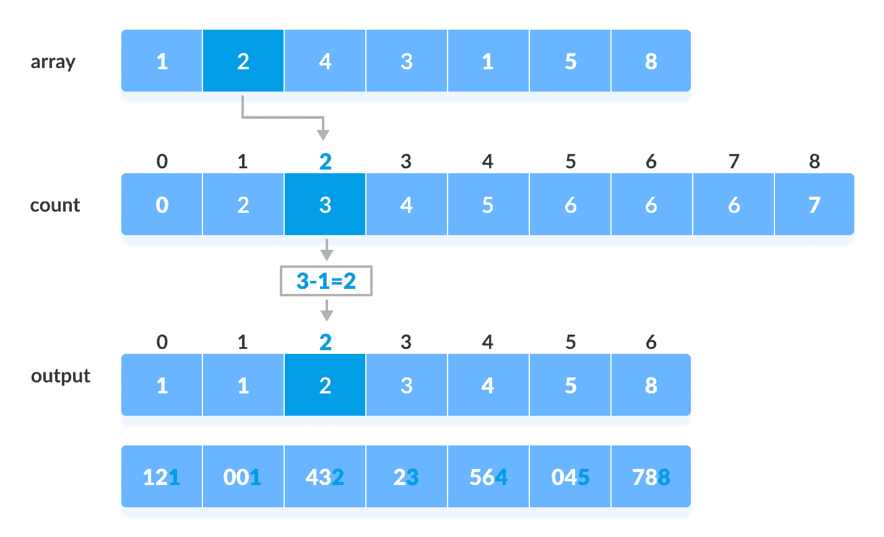

# 基数排序算法

> 原文： [https://www.programiz.com/dsa/radix-sort](https://www.programiz.com/dsa/radix-sort)

#### 在本教程中，您将学习基数排序的工作原理。 此外，您还将找到 C，C++ ，Java 和 Python 中基数排序的工作示例。

基数排序是一种排序技术，它通过首先对相同**位置值**的各个数字进行分组来对元素进行排序。 然后，根据元素的升序/降序对元素进行排序。

假设我们有 8 个元素组成的数组。 首先，我们将基于单位位置的值对元素进行排序。 然后，我们将根据第十位的值对元素进行排序。 这个过程一直持续到最后一个重要位置。

令初始数组为`[121, 432, 564, 23, 1, 45, 788]`。 如下图所示，根据基数排序。



Working of Radix Sort


在阅读本文之前，请先阅读[计数排序](/dsa/counting-sort)，因为计数排序用作基数排序的中间排序。

* * *

## 基数排序如何工作？

1.  找到数组中最大的元素，即`max`。 令`X`为`max`中的位数。 计算`X`是因为我们必须遍历所有元素的所有重要位置。

    在此数组`[121, 432, 564, 23, 1, 45, 788]`中，我们拥有最大的数字 788。它具有 3 位数字。 因此，循环应上升到数百个位置（3 次）。
2.  现在，一个接一个地走过每个重要的地方。

    使用任何稳定的排序技术在每个重要位置对数字进行排序。 我们为此使用了计数排序。

    根据单位位置数字（`X=0`）对元素进行排序。

    

    使用计数排序对基于单位位置的元素进行排序

    

3.  现在，基于十位数字对元素进行排序。

    

    根据十位对元素进行排序

    

4.  最后，根据数百位数字对元素进行排序。

    

    根据数百个位置对元素进行排序

    

* * *

## 基数排序算法

```
radixSort(array)
  d <- maximum number of digits in the largest element
  create d buckets of size 0-9
  for i <- 0 to d
    sort the elements according to ith place digits using countingSort

countingSort(array, d)
  max <- find largest element among dth place elements
  initialize count array with all zeros
  for j <- 0 to size
    find the total count of each unique digit in dth place of elements and
    store the count at jth index in count array
  for i <- 1 to max
    find the cumulative sum and store it in count array itself
  for j <- size down to 1
    restore the elements to array
    decrease count of each element restored by 1
```

* * *

## Python，Java 和 C / C++ 示例

[Python](#python-code)[Java](#java-code)[C](#c-code)[C++](#cpp-code)

```
# Radix sort in Python

# Using counting sort to sort the elements in the basis of significant places
def countingSort(array, place):
    size = len(array)
    output = [0] * size
    count = [0] * 10

    # Calculate count of elements
    for i in range(0, size):
        index = array[i] // place
        count[index % 10] += 1

    # Calculate cummulative count
    for i in range(1, 10):
        count[i] += count[i - 1]

    # Place the elements in sorted order
    i = size - 1
    while i >= 0:
        index = array[i] // place
        output[count[index % 10] - 1] = array[i]
        count[index % 10] -= 1
        i -= 1

    for i in range(0, size):
        array[i] = output[i]

# Main function to implement radix sort
def radixSort(array):
    # Get maximum element
    max_element = max(array)

    # Apply counting sort to sort elements based on place value.
    place = 1
    while max_element // place > 0:
        countingSort(array, place)
        place *= 10

data = [121, 432, 564, 23, 1, 45, 788]
radixSort(data)
print(data) 
```

```
// Radix Sort in Java Programming

import java.util.Arrays;

class RadixSort {

  // Using counting sort to sort the elements in the basis of significant places
  void countingSort(int array[], int size, int place) {
    int[] output = new int[size + 1];
    int max = array[0];
    for (int i = 1; i < size; i++) {
      if (array[i] > max)
        max = array[i];
    }
    int[] count = new int[max + 1];

    for (int i = 0; i < max; ++i)
      count[i] = 0;

    // Calculate count of elements
    for (int i = 0; i < size; i++)
      count[(array[i] / place) % 10]++;

    // Calculate cummulative count
    for (int i = 1; i < 10; i++)
      count[i] += count[i - 1];

    // Place the elements in sorted order
    for (int i = size - 1; i >= 0; i--) {
      output[count[(array[i] / place) % 10] - 1] = array[i];
      count[(array[i] / place) % 10]--;
    }

    for (int i = 0; i < size; i++)
      array[i] = output[i];
  }

  // Function to get the largest element from an array
  int getMax(int array[], int n) {
    int max = array[0];
    for (int i = 1; i < n; i++)
      if (array[i] > max)
        max = array[i];
    return max;
  }

  // Main function to implement radix sort
  void radixSort(int array[], int size) {
    // Get maximum element
    int max = getMax(array, size);

    // Apply counting sort to sort elements based on place value.
    for (int place = 1; max / place > 0; place *= 10)
      countingSort(array, size, place);
  }

  // Driver code
  public static void main(String args[]) {
    int[] data = { 121, 432, 564, 23, 1, 45, 788 };
    int size = data.length;
    RadixSort rs = new RadixSort();
    rs.radixSort(data, size);
    System.out.println("Sorted Array in Ascending Order: ");
    System.out.println(Arrays.toString(data));
  }
}
```

```
// Radix Sort in C Programming

#include <stdio.h>

// Function to get the largest element from an array
int getMax(int array[], int n) {
  int max = array[0];
  for (int i = 1; i < n; i++)
    if (array[i] > max)
      max = array[i];
  return max;
}

// Using counting sort to sort the elements in the basis of significant places
void countingSort(int array[], int size, int place) {
  int output[size + 1];
  int max = (array[0] / place) % 10;

  for (int i = 1; i < size; i++) {
    if (((array[i] / place) % 10) > max)
      max = array[i];
  }
  int count[max + 1];

  for (int i = 0; i < max; ++i)
    count[i] = 0;

  // Calculate count of elements
  for (int i = 0; i < size; i++)
    count[(array[i] / place) % 10]++;

  // Calculate cummulative count
  for (int i = 1; i < 10; i++)
    count[i] += count[i - 1];

  // Place the elements in sorted order
  for (int i = size - 1; i >= 0; i--) {
    output[count[(array[i] / place) % 10] - 1] = array[i];
    count[(array[i] / place) % 10]--;
  }

  for (int i = 0; i < size; i++)
    array[i] = output[i];
}

// Main function to implement radix sort
void radixsort(int array[], int size) {
  // Get maximum element
  int max = getMax(array, size);

  // Apply counting sort to sort elements based on place value.
  for (int place = 1; max / place > 0; place *= 10)
    countingSort(array, size, place);
}

// Print an array
void printArray(int array[], int size) {
  for (int i = 0; i < size; ++i) {
    printf("%d  ", array[i]);
  }
  printf("\n");
}

// Driver code
int main() {
  int array[] = {121, 432, 564, 23, 1, 45, 788};
  int n = sizeof(array) / sizeof(array[0]);
  radixsort(array, n);
  printArray(array, n);
}
```

```
// Radix Sort in C++ Programming

#include <iostream>
using namespace std;

// Function to get the largest element from an array
int getMax(int array[], int n) {
  int max = array[0];
  for (int i = 1; i < n; i++)
    if (array[i] > max)
      max = array[i];
  return max;
}

// Using counting sort to sort the elements in the basis of significant places
void countingSort(int array[], int size, int place) {
  const int max = 10;
  int output[size];
  int count[max];

  for (int i = 0; i < max; ++i)
    count[i] = 0;

  // Calculate count of elements
  for (int i = 0; i < size; i++)
    count[(array[i] / place) % 10]++;

  // Calculate cummulative count
  for (int i = 1; i < max; i++)
    count[i] += count[i - 1];

  // Place the elements in sorted order
  for (int i = size - 1; i >= 0; i--) {
    output[count[(array[i] / place) % 10] - 1] = array[i];
    count[(array[i] / place) % 10]--;
  }

  for (int i = 0; i < size; i++)
    array[i] = output[i];
}

// Main function to implement radix sort
void radixsort(int array[], int size) {
  // Get maximum element
  int max = getMax(array, size);

  // Apply counting sort to sort elements based on place value.
  for (int place = 1; max / place > 0; place *= 10)
    countingSort(array, size, place);
}

// Print an array
void printArray(int array[], int size) {
  int i;
  for (i = 0; i < size; i++)
    cout << array[i] << " ";
  cout << endl;
}

// Driver code
int main() {
  int array[] = {121, 432, 564, 23, 1, 45, 788};
  int n = sizeof(array) / sizeof(array[0]);
  radixsort(array, n);
  printArray(array, n);
}
```

* * *

## 复杂

由于基数排序是一种非比较算法，因此它比比较排序算法具有优势。

对于使用计数排序作为中间稳定排序的基数排序，时间复杂度为`O(d(n+k))`。

此处，`d`是数字循环，`O(n+k)`是计数排序的时间复杂度。

因此，基数排序具有线性时间复杂度，该复杂度优于比较排序算法的`O(nlog n)`。

如果我们使用非常大的数字或其他基数（例如 32 位和 64 位数字），那么它可以在线性时间内执行，但是中间排序会占用很大的空间。

这使得基数排序空间效率低下。 这就是为什么在软件库中不使用这种排序的原因。

* * *

## 基数排序应用

基数排序在

*   制作后缀数组时使用 DC3 算法（Kärkkäinen-Sanders-Burkhardt）。
*   大范围数字的地方。