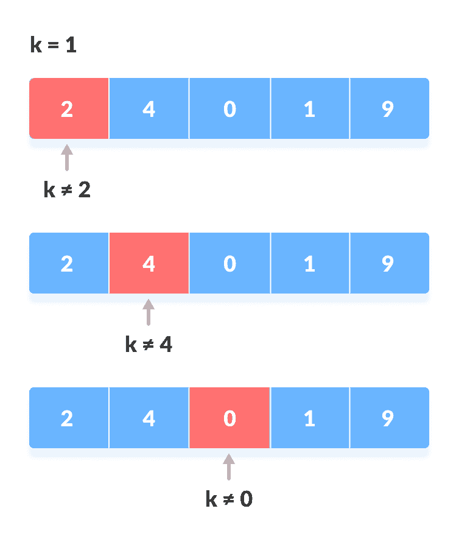
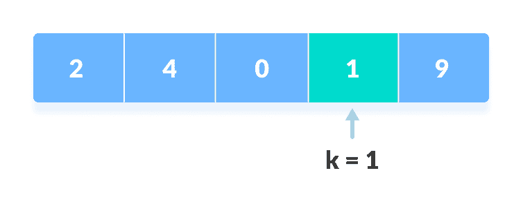

# 线性搜寻

> 原文： [https://www.programiz.com/dsa/linear-search](https://www.programiz.com/dsa/linear-search)

#### 在本教程中，您将学习线性搜索。 此外，您还将找到线性搜索 C，C++ ，Java 和 Python 的工作示例。

线性搜索是最简单的搜索算法，可以按顺序搜索列表中的元素。 我们从一端开始，检查每个元素，直到找不到所需的元素。

* * *

## 线性搜索如何工作？

按照以下步骤在下面的列表中搜索元素`k = 1`。


Array to be searched for


1.  从第一个元素开始，将`k`与每个元素`x`进行比较。

    

    与每个元素比较

    

2.  如果为`x == k`，则返回索引。 找到

    

    元素

    

3.  否则，返回`未找到`。

* * *

## 线性搜索算法

```
LinearSearch(array, key)
  for each item in the array
    if item == value
      return its index
```

* * *

## Python，Java 和 C/C++ 示例

[Python](#python-code)[Java](#java-code)[C](#c-code)[C++](#cpp-code)

```
# Linear Search in Python

def linearSearch(array, n, x):

    # Going through array sequencially
    for i in range(0, n):
        if (array[i] == x):
            return i
    return -1

array = [2, 4, 0, 1, 9]
x = 1
n = len(array)
result = linearSearch(array, n, x)
if(result == -1):
    print("Element not found")
else:
    print("Element found at index: ", result)
```

```
// Linear Search in Java

class LinearSearch {
  public static int linearSearch(int array[], int x) {
  int n = array.length;

  // Going through array sequencially
  for (int i = 0; i < n; i++) {
    if (array[i] == x)
    return i;
  }
  return -1;
  }

  public static void main(String args[]) {
  int array[] = { 2, 4, 0, 1, 9 };
  int x = 1;

  int result = linearSearch(array, x);

  if (result == -1)
    System.out.print("Element not found");
  else
    System.out.print("Element found at index: " + result);
  }
}
```

```
// Linear Search in C

#include <stdio.h>

int search(int array[], int n, int x) {

  // Going through array sequencially
  for (int i = 0; i < n; i++)
    if (array[i] == x)
      return i;
  return -1;
}

int main() {
  int array[] = {2, 4, 0, 1, 9};
  int x = 1;
  int n = sizeof(array) / sizeof(array[0]);

  int result = search(array, n, x);

  (result == -1) ? printf("Element not found") : printf("Element found at index: %d", result);
}
```

```
// Linear Search in C++

#include <iostream>
using namespace std;

int search(int array[], int n, int x) {

  // Going through array sequencially
  for (int i = 0; i < n; i++)
    if (array[i] == x)
      return i;
  return -1;
}

int main() {
  int array[] = {2, 4, 0, 1, 9};
  int x = 1;
  int n = sizeof(array) / sizeof(array[0]);

  int result = search(array, n, x);

  (result == -1) ? cout << "Element not found" : cout << "Element found at index: " << result;
}
```

* * *

## 线性搜索的复杂度

**时间复杂度**： `O(n)`

**空间复杂度**： `O(1)`

* * *

## 线性搜索应用

1.  用于较小数组中的搜索操作（`< 100`个项目）。