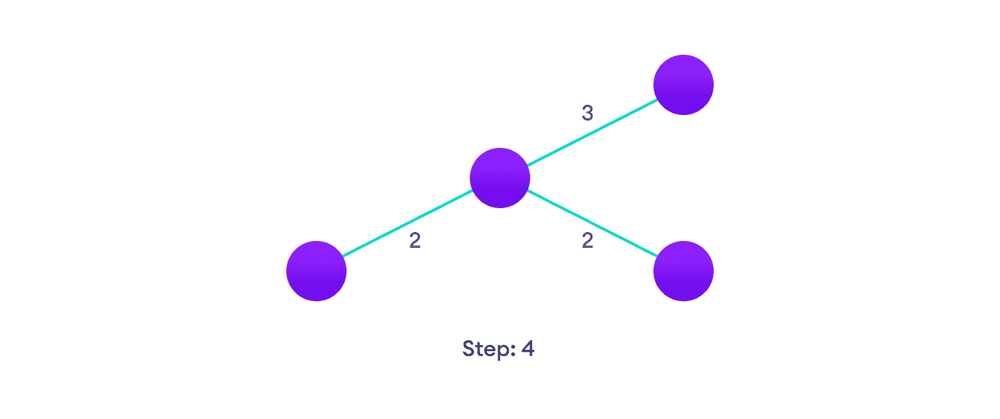
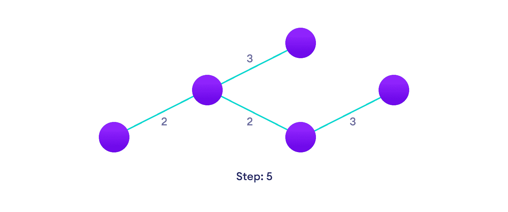
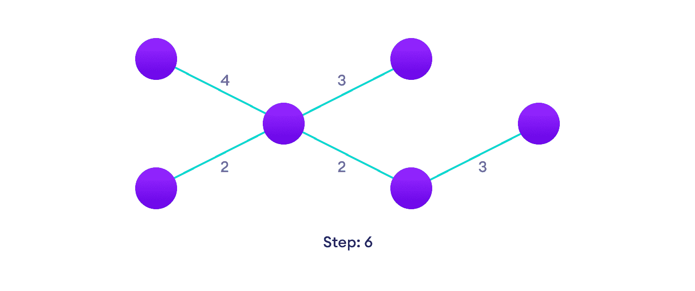

# 克鲁斯卡尔算法

> 原文： [https://www.programiz.com/dsa/kruskal-algorithm](https://www.programiz.com/dsa/kruskal-algorithm)

#### 在本教程中，您将学习 Kruskal 的算法如何工作。 此外，您还将找到 C，C++ ，Java 和 Python 中 Kruskal 算法的工作示例。

Kruskal 算法是一种[最小生成树](/dsa/spanning-tree-and-minimum-spanning-tree#minimum-spanning)算法，该算法将图形作为输入，并找到该图形的边子集，

*   形成包括每个顶点的树
*   在可以从图中形成的所有树中具有最小的权重总和

* * *

## Kruskal 算法如何工作

它属于称为[贪婪算法](http://www.personal.kent.edu/~rmuhamma/Algorithms/MyAlgorithms/Greedy/greedyIntro.htm)的一类算法，该算法可以找到局部最优值，以期找到全局最优值。

我们从权重最低的边开始，不断增加边直到达到目标。

实现 Kruskal 算法的步骤如下：

1.  从小到大排序所有边
2.  选取权重最低的边并将其添加到生成树。 如果添加边创建了一个循环，则拒绝该边。
3.  继续添加边，直到我们到达所有顶点。

* * *

## Kruskal 算法的示例


Start with a weighted graph


Choose the edge with the least weight, if there are more than 1, choose anyone


Choose the next shortest edge and add it




Choose the next shortest edge that doesn't create a cycle and add it




Choose the next shortest edge that doesn't create a cycle and add it




Repeat until you have a spanning tree


* * *

## Kruskal 算法伪代码

任何最小生成树算法都围绕检查是否添加边创建循环来进行。

最常见的查找方法是称为 [UnionFind](https://www.cs.duke.edu/courses/cps100e/fall09/notes/UnionFind.pdf) 的算法。 Union-Find 算法将顶点划分为簇，并允许我们检查两个顶点是否属于同一簇，从而确定是否添加边会创建一个循环。

```
KRUSKAL(G):
A = ∅
For each vertex v ∈ G.V:
    MAKE-SET(v)
For each edge (u, v) ∈ G.E ordered by increasing order by weight(u, v):
    if FIND-SET(u) ≠ FIND-SET(v):       
    A = A ∪ {(u, v)}
    UNION(u, v)
return A
```

* * *

## Python，Java 和 C/C++ 示例

[Python](#python-code)[Java](#java-code)[C](#c-code)[C++](#cpp-code)

```
# Kruskal's algorithm in Python

class Graph:
    def __init__(self, vertices):
        self.V = vertices
        self.graph = []

    def add_edge(self, u, v, w):
        self.graph.append([u, v, w])

    # Search function

    def find(self, parent, i):
        if parent[i] == i:
            return i
        return self.find(parent, parent[i])

    def apply_union(self, parent, rank, x, y):
        xroot = self.find(parent, x)
        yroot = self.find(parent, y)
        if rank[xroot] < rank[yroot]:
            parent[xroot] = yroot
        elif rank[xroot] > rank[yroot]:
            parent[yroot] = xroot
        else:
            parent[yroot] = xroot
            rank[xroot] += 1

    #  Applying Kruskal algorithm
    def kruskal_algo(self):
        result = []
        i, e = 0, 0
        self.graph = sorted(self.graph, key=lambda item: item[2])
        parent = []
        rank = []
        for node in range(self.V):
            parent.append(node)
            rank.append(0)
        while e < self.V - 1:
            u, v, w = self.graph[i]
            i = i + 1
            x = self.find(parent, u)
            y = self.find(parent, v)
            if x != y:
                e = e + 1
                result.append([u, v, w])
                self.apply_union(parent, rank, x, y)
        for u, v, weight in result:
            print("%d - %d: %d" % (u, v, weight))

g = Graph(6)
g.add_edge(0, 1, 4)
g.add_edge(0, 2, 4)
g.add_edge(1, 2, 2)
g.add_edge(1, 0, 4)
g.add_edge(2, 0, 4)
g.add_edge(2, 1, 2)
g.add_edge(2, 3, 3)
g.add_edge(2, 5, 2)
g.add_edge(2, 4, 4)
g.add_edge(3, 2, 3)
g.add_edge(3, 4, 3)
g.add_edge(4, 2, 4)
g.add_edge(4, 3, 3)
g.add_edge(5, 2, 2)
g.add_edge(5, 4, 3)
g.kruskal_algo()
```

```
// Kruskal's algorithm in Java

import java.util.*;

class Graph {
  class Edge implements Comparable<Edge> {
    int src, dest, weight;

    public int compareTo(Edge compareEdge) {
      return this.weight - compareEdge.weight;
    }
  };

  // Union
  class subset {
    int parent, rank;
  };

  int vertices, edges;
  Edge edge[];

  // Graph creation
  Graph(int v, int e) {
    vertices = v;
    edges = e;
    edge = new Edge[edges];
    for (int i = 0; i < e; ++i)
      edge[i] = new Edge();
  }

  int find(subset subsets[], int i) {
    if (subsets[i].parent != i)
      subsets[i].parent = find(subsets, subsets[i].parent);
    return subsets[i].parent;
  }

  void Union(subset subsets[], int x, int y) {
    int xroot = find(subsets, x);
    int yroot = find(subsets, y);

    if (subsets[xroot].rank < subsets[yroot].rank)
      subsets[xroot].parent = yroot;
    else if (subsets[xroot].rank > subsets[yroot].rank)
      subsets[yroot].parent = xroot;
    else {
      subsets[yroot].parent = xroot;
      subsets[xroot].rank++;
    }
  }

  // Applying Krushkal Algorithm
  void KruskalAlgo() {
    Edge result[] = new Edge[vertices];
    int e = 0;
    int i = 0;
    for (i = 0; i < vertices; ++i)
      result[i] = new Edge();

    // Sorting the edges
    Arrays.sort(edge);
    subset subsets[] = new subset[vertices];
    for (i = 0; i < vertices; ++i)
      subsets[i] = new subset();

    for (int v = 0; v < vertices; ++v) {
      subsets[v].parent = v;
      subsets[v].rank = 0;
    }
    i = 0;
    while (e < vertices - 1) {
      Edge next_edge = new Edge();
      next_edge = edge[i++];
      int x = find(subsets, next_edge.src);
      int y = find(subsets, next_edge.dest);
      if (x != y) {
        result[e++] = next_edge;
        Union(subsets, x, y);
      }
    }
    for (i = 0; i < e; ++i)
      System.out.println(result[i].src + " - " + result[i].dest + ": " + result[i].weight);
  }

  public static void main(String[] args) {
    int vertices = 6; // Number of vertices
    int edges = 8; // Number of edges
    Graph G = new Graph(vertices, edges);

    G.edge[0].src = 0;
    G.edge[0].dest = 1;
    G.edge[0].weight = 4;

    G.edge[1].src = 0;
    G.edge[1].dest = 2;
    G.edge[1].weight = 4;

    G.edge[2].src = 1;
    G.edge[2].dest = 2;
    G.edge[2].weight = 2;

    G.edge[3].src = 2;
    G.edge[3].dest = 3;
    G.edge[3].weight = 3;

    G.edge[4].src = 2;
    G.edge[4].dest = 5;
    G.edge[4].weight = 2;

    G.edge[5].src = 2;
    G.edge[5].dest = 4;
    G.edge[5].weight = 4;

    G.edge[6].src = 3;
    G.edge[6].dest = 4;
    G.edge[6].weight = 3;

    G.edge[7].src = 5;
    G.edge[7].dest = 4;
    G.edge[7].weight = 3;
    G.KruskalAlgo();
  }
}
```

```
// Kruskal's algorithm in C

#include <stdio.h>

#define MAX 30

typedef struct edge {
  int u, v, w;
} edge;

typedef struct edge_list {
  edge data[MAX];
  int n;
} edge_list;

edge_list elist;

int Graph[MAX][MAX], n;
edge_list spanlist;

void kruskalAlgo();
int find(int belongs[], int vertexno);
void applyUnion(int belongs[], int c1, int c2);
void sort();
void print();

// Applying Krushkal Algo
void kruskalAlgo() {
  int belongs[MAX], i, j, cno1, cno2;
  elist.n = 0;

  for (i = 1; i < n; i++)
    for (j = 0; j < i; j++) {
      if (Graph[i][j] != 0) {
        elist.data[elist.n].u = i;
        elist.data[elist.n].v = j;
        elist.data[elist.n].w = Graph[i][j];
        elist.n++;
      }
    }

  sort();

  for (i = 0; i < n; i++)
    belongs[i] = i;

  spanlist.n = 0;

  for (i = 0; i < elist.n; i++) {
    cno1 = find(belongs, elist.data[i].u);
    cno2 = find(belongs, elist.data[i].v);

    if (cno1 != cno2) {
      spanlist.data[spanlist.n] = elist.data[i];
      spanlist.n = spanlist.n + 1;
      applyUnion(belongs, cno1, cno2);
    }
  }
}

int find(int belongs[], int vertexno) {
  return (belongs[vertexno]);
}

void applyUnion(int belongs[], int c1, int c2) {
  int i;

  for (i = 0; i < n; i++)
    if (belongs[i] == c2)
      belongs[i] = c1;
}

// Sorting algo
void sort() {
  int i, j;
  edge temp;

  for (i = 1; i < elist.n; i++)
    for (j = 0; j < elist.n - 1; j++)
      if (elist.data[j].w > elist.data[j + 1].w) {
        temp = elist.data[j];
        elist.data[j] = elist.data[j + 1];
        elist.data[j + 1] = temp;
      }
}

// Printing the result
void print() {
  int i, cost = 0;

  for (i = 0; i < spanlist.n; i++) {
    printf("\n%d - %d : %d", spanlist.data[i].u, spanlist.data[i].v, spanlist.data[i].w);
    cost = cost + spanlist.data[i].w;
  }

  printf("\nSpanning tree cost: %d", cost);
}

int main() {
  int i, j, total_cost;

  n = 6;

  Graph[0][0] = 0;
  Graph[0][1] = 4;
  Graph[0][2] = 4;
  Graph[0][3] = 0;
  Graph[0][4] = 0;
  Graph[0][5] = 0;
  Graph[0][6] = 0;

  Graph[1][0] = 4;
  Graph[1][1] = 0;
  Graph[1][2] = 2;
  Graph[1][3] = 0;
  Graph[1][4] = 0;
  Graph[1][5] = 0;
  Graph[1][6] = 0;

  Graph[2][0] = 4;
  Graph[2][1] = 2;
  Graph[2][2] = 0;
  Graph[2][3] = 3;
  Graph[2][4] = 4;
  Graph[2][5] = 0;
  Graph[2][6] = 0;

  Graph[3][0] = 0;
  Graph[3][1] = 0;
  Graph[3][2] = 3;
  Graph[3][3] = 0;
  Graph[3][4] = 3;
  Graph[3][5] = 0;
  Graph[3][6] = 0;

  Graph[4][0] = 0;
  Graph[4][1] = 0;
  Graph[4][2] = 4;
  Graph[4][3] = 3;
  Graph[4][4] = 0;
  Graph[4][5] = 0;
  Graph[4][6] = 0;

  Graph[5][0] = 0;
  Graph[5][1] = 0;
  Graph[5][2] = 2;
  Graph[5][3] = 0;
  Graph[5][4] = 3;
  Graph[5][5] = 0;
  Graph[5][6] = 0;

  kruskalAlgo();
  print();
}
```

```
// Kruskal's algorithm in C++

#include <algorithm>
#include <iostream>
#include <vector>
using namespace std;

#define edge pair<int, int>

class Graph {
   private:
  vector<pair<int, edge> > G;  // graph
  vector<pair<int, edge> > T;  // mst
  int *parent;
  int V;  // number of vertices/nodes in graph
   public:
  Graph(int V);
  void AddWeightedEdge(int u, int v, int w);
  int find_set(int i);
  void union_set(int u, int v);
  void kruskal();
  void print();
};
Graph::Graph(int V) {
  parent = new int[V];

  //i 0 1 2 3 4 5
  //parent[i] 0 1 2 3 4 5
  for (int i = 0; i < V; i++)
    parent[i] = i;

  G.clear();
  T.clear();
}
void Graph::AddWeightedEdge(int u, int v, int w) {
  G.push_back(make_pair(w, edge(u, v)));
}
int Graph::find_set(int i) {
  // If i is the parent of itself
  if (i == parent[i])
    return i;
  else
    // Else if i is not the parent of itself
    // Then i is not the representative of his set,
    // so we recursively call Find on its parent
    return find_set(parent[i]);
}

void Graph::union_set(int u, int v) {
  parent[u] = parent[v];
}
void Graph::kruskal() {
  int i, uRep, vRep;
  sort(G.begin(), G.end());  // increasing weight
  for (i = 0; i < G.size(); i++) {
    uRep = find_set(G[i].second.first);
    vRep = find_set(G[i].second.second);
    if (uRep != vRep) {
      T.push_back(G[i]);  // add to tree
      union_set(uRep, vRep);
    }
  }
}
void Graph::print() {
  cout << "Edge :"
     << " Weight" << endl;
  for (int i = 0; i < T.size(); i++) {
    cout << T[i].second.first << " - " << T[i].second.second << " : "
       << T[i].first;
    cout << endl;
  }
}
int main() {
  Graph g(6);
  g.AddWeightedEdge(0, 1, 4);
  g.AddWeightedEdge(0, 2, 4);
  g.AddWeightedEdge(1, 2, 2);
  g.AddWeightedEdge(1, 0, 4);
  g.AddWeightedEdge(2, 0, 4);
  g.AddWeightedEdge(2, 1, 2);
  g.AddWeightedEdge(2, 3, 3);
  g.AddWeightedEdge(2, 5, 2);
  g.AddWeightedEdge(2, 4, 4);
  g.AddWeightedEdge(3, 2, 3);
  g.AddWeightedEdge(3, 4, 3);
  g.AddWeightedEdge(4, 2, 4);
  g.AddWeightedEdge(4, 3, 3);
  g.AddWeightedEdge(5, 2, 2);
  g.AddWeightedEdge(5, 4, 3);
  g.kruskal();
  g.print();
  return 0;
}
```

* * *

## Kruskal vs Prim 算法

[Prim 算法](/dsa/prim-algorithm)是另一种流行的最小生成树算法，它使用不同的逻辑来查找图的 MST。 Prim 的算法不是从边开始，而是从顶点开始，并不断添加树中没有的权重最低的边，直到所有顶点都被覆盖为止。

* * *

## 克鲁斯卡尔算法的复杂度

Kruskal 算法的时间复杂度为：`O(E log E)`。

* * *

## 克鲁斯卡尔算法的应用

*   为了布置电线
*   在计算机网络中（LAN 连接）