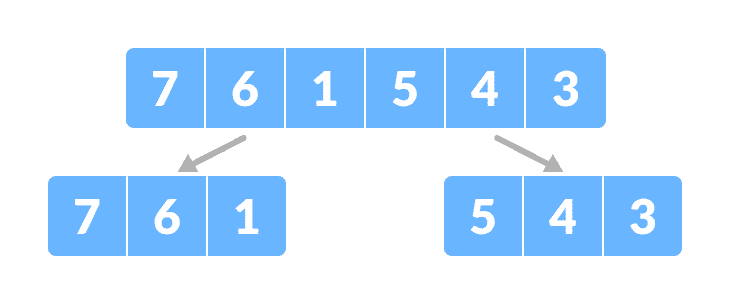
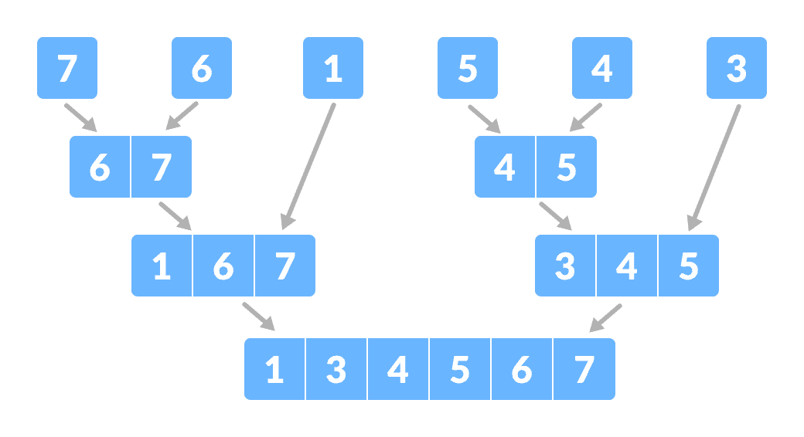

# 分治算法

> 原文： [https://www.programiz.com/dsa/divide-and-conquer](https://www.programiz.com/dsa/divide-and-conquer)

#### 在本教程中，您将学习分治算法的工作原理。 此外，您将发现分治方法与其他解决递归问题的方法之间的比较。

**分治算法**是一种通过以下方法解决较大问题的策略

1.  将问题分解为较小的子问题
2.  解决子问题，以及
3.  合并它们以获得所需的输出。

要使用分治算法，请使用**递归**。 了解不同编程语言中的递归：

*   [Java 中的递归](https://www.programiz.com/java-programming/recursion)
*   [Python 中的递归](https://www.programiz.com/python-programming/recursion)
*   [C++ 中的递归](https://www.programiz.com/cpp-programming/recursion)

* * *

## 分治算法如何工作？

涉及的步骤如下：

1.  **划分**：使用递归将给定问题划分为子问题。
2.  **解决**：递归解决较小的子问题。 如果子问题足够小，则直接解决。
3.  **组合**：组合子问题的解决方案，这是递归过程的一部分，以获取实际问题的解决方案。

让我们借助示例来理解这个概念。

在这里，我们将使用分治的方法对数组进行排序（即[归并排序](https://www.programiz.com/dsa/merge-sort)）。

1.  假设给定数组为：

    

    归并排序数组

    

2.  **将数组分为两半。**

    

    将数组分为两个子部分。

    

    再次将每个子部分递归地分为两半，直到得到单个元素。

    

    将数组分成较小的子部分

    

3.  现在，以排序的方式组合各个元素。 在这里，**解决**和**组合**步骤并排进行。

    

    合并子部分

    

* * *

## 复杂

分治法的复杂度是使用[主定理](https://www.programiz.com/dsa/master-theorem)计算的。

```
T(n) = aT(n/b) + f(n),
where,
n = size of input
a = number of subproblems in the recursion
n/b = size of each subproblem. All subproblems are assumed to have the same size.
f(n) = cost of the work done outside the recursive call, which includes the cost of dividing the problem and cost of merging the solutions

```

让我们举一个例子来发现递归问题的时间复杂度。

对于归并排序，等式可以写成：

```
T(n) = aT(n/b) + f(n)
     = 2T(n/2) + O(n)
Where, 
a = 2 (each time, a problem is divided into 2 subproblems)
n/b = n/2 (size of each sub problem is half of the input)
f(n) = time taken to divide the problem and merging the subproblems
T(n/2) = O(n log n) (To understand this, please refer to the master theorem.)

Now, T(n) = 2T(n log n) + O(n)
          ≈ O(n log n)

```

* * *

## 分治 vs 动态方法

分治的方法将问题分为较小的子问题，这些子问题可以递归进一步解决。 每个子问题的结果都不存储以供将来参考，而在动态方法中，每个子问题的结果均存储以供将来参考。

当同一子问题无法多次解决时，请使用分治的方法。 当将来要多次使用子问题的结果时，请使用动态方法。

让我们通过一个例子来理解这一点。 假设我们试图找到斐波那契数列。 然后，

**分治的方法**：

```
fib(n)
    If n < 2, return 1
    Else , return f(n - 1) + f(n -2)

```

**动态方法**：

```
mem = [ ]
fib(n)
    If n in mem: return mem[n] 
    else,     
        If n < 2, f = 1
        else , f = f(n - 1) + f(n -2)
        mem[n] = f
        return f

```

在动态方法中，`内存`存储每个子问题的结果。

* * *

## 分治算法的优势

*   使用朴素方法将两个矩阵相乘的复杂度为`O(n^3)`，而使用分治法（即 Strassen 矩阵乘法）的复杂度为`O(n^2.8074)`。 这种方法还简化了诸如河内塔之类的其他问题。
*   这种方法适用于多处理系统。
*   它有效地利用了内存缓存。

* * *

## 分治法

*   [二分搜索](https://www.programiz.com/dsa/binary-search)
*   [归并排序](https://www.programiz.com/dsa/merge-sort)
*   [快速排序](https://www.programiz.com/dsa/quick-sort)
*   Strassen 的矩阵乘法
*   唐津算法