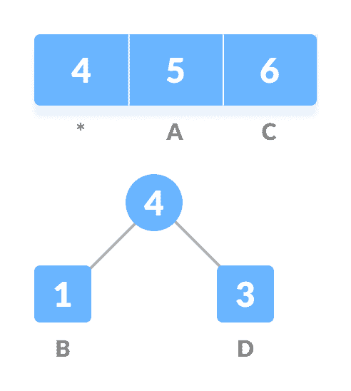
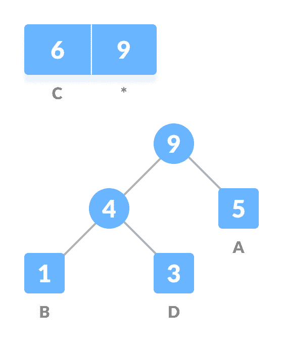
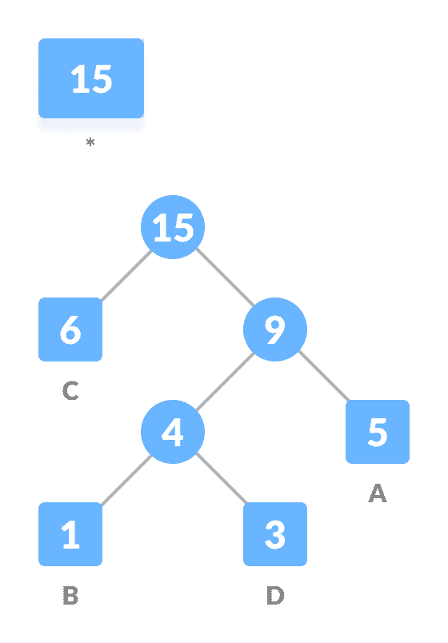
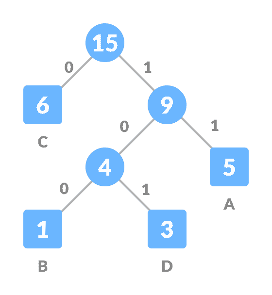

# 霍夫曼编码

> 原文： [https://www.programiz.com/dsa/huffman-coding](https://www.programiz.com/dsa/huffman-coding)

#### 在本教程中，您将学习霍夫曼编码的工作原理。 此外，您还将找到使用 C，C ++，Java 和 Python 进行霍夫曼编码的工作示例。

霍夫曼编码是一种压缩数据以减小其大小而又不丢失任何细节的技术。 它最早由 David Huffman 开发。

霍夫曼编码通常可用于压缩其中经常出现字符的数据。

* * *

## 哈夫曼编码的工作原理？

假设下面的字符串要通过网络发送。


Initial string


每个字符占用 8 位。 上面的字符串中总共有 15 个字符。 因此，总共需要`8 * 15 = 120`位来发送此字符串。

使用霍夫曼编码技术，我们可以将字符串压缩为较小的大小。

霍夫曼编码首先使用字符的频率创建一棵树，然后为每个字符生成代码。

一旦数据被编码，就必须被解码。 解码是使用同一棵树完成的。

霍夫曼编码使用**前缀代码**的概念，可以防止解码过程中出现歧义。 与字符关联的代码不应出现在任何其他代码的前缀中。 上面创建的树有助于维护属性。

霍夫曼编码是通过以下步骤完成的。

1.  计算字符串中每个字符的频率。

    

    字符串的频率

    

2.  按频率升序对字符进行排序。 这些存储在优先级队列 `Q` 中。

    

    根据频率

    

    排序的字符
3.  使每个唯一字符作为叶节点。
4.  创建一个空节点 `z` 。 将最小频率分配给 z 的左子代，并将第二个最小频率分配给 `z` 的右代。 将 `z` 的值设置为上述两个最小频率的总和。

    

    取得最小数的总和

    

5.  从 `Q` 中删除这两个最小频率，并将总和添加到频率列表中（*表示上图中的内部节点）。
6.  将节点 `z` 插入树中。
7.  对所有字符重复步骤 3 到 5。

    

    对所有字符重复步骤 3 至 5。

    

    Â

    

    对所有字符重复步骤 3 至 5。

    

8.  对于每个非叶节点，将 0 分配给左边缘，将 1 分配给右边缘。

    

    将 0 分配给左边缘，将 1 分配给右边缘

    

为了通过网络发送上面的字符串，我们必须发送树以及上面的压缩代码。 总大小如下表所示。

| 字符 | 频率 | 码 | 尺寸 |
| 一个 | 5 | 11 | 5*2 = 10 |
| 乙 | 1 | 100 | 1*3 = 3 |
| C | 6 | 0 | 6*1 = 6 |
| d | 3 | 101 | 3*3 = 9 |
| 4 * 8 = 32 位 | 15 位 |   | 28 位 |

如果不进行编码，则字符串的总大小为 120 位。 编码后，大小减小为`32 + 15 + 28 = 75`。

* * *

## 解码代码

为了解码代码，我们可以获取代码并遍历树以找到字符。

假设要解码 101，我们可以如下图所示从根开始遍历。


Decoding


* * *

## 霍夫曼编码算法

```
create a priority queue Q consisting of each unique character.
sort then in ascending order of their frequencies.
for all the unique characters:
    create a newNode
    extract minimum value from Q and assign it to leftChild of newNode
    extract minimum value from Q and assign it to rightChild of newNode
    calculate the sum of these two minimum values and assign it to the value of newNode
    insert this newNode into the tree
return rootNode
```

* * *

## Python，Java 和 C / C ++示例

[Python](#python-code)[Java](#java-code)[C](#c-code)[C++](#cpp-code)

```
# Huffman Coding in python

string = 'BCAADDDCCACACAC'

# Creating tree nodes
class NodeTree(object):

    def __init__(self, left=None, right=None):
        self.left = left
        self.right = right

    def children(self):
        return (self.left, self.right)

    def nodes(self):
        return (self.left, self.right)

    def __str__(self):
        return '%s_%s' % (self.left, self.right)

# Main function implementing huffman coding
def huffman_code_tree(node, left=True, binString=''):
    if type(node) is str:
        return {node: binString}
    (l, r) = node.children()
    d = dict()
    d.update(huffman_code_tree(l, True, binString + '0'))
    d.update(huffman_code_tree(r, False, binString + '1'))
    return d

# Calculating frequency
freq = {}
for c in string:
    if c in freq:
        freq[c] += 1
    else:
        freq[c] = 1

freq = sorted(freq.items(), key=lambda x: x[1], reverse=True)

nodes = freq

while len(nodes) > 1:
    (key1, c1) = nodes[-1]
    (key2, c2) = nodes[-2]
    nodes = nodes[:-2]
    node = NodeTree(key1, key2)
    nodes.append((node, c1 + c2))

    nodes = sorted(nodes, key=lambda x: x[1], reverse=True)

huffmanCode = huffman_code_tree(nodes[0][0])

print(' Char | Huffman code ')
print('----------------------')
for (char, frequency) in freq:
    print(' %-4r |%12s' % (char, huffmanCode[char]))
```

```
// Huffman Coding in Java

import java.util.PriorityQueue;
import java.util.Comparator;

class HuffmanNode {
  int item;
  char c;
  HuffmanNode left;
  HuffmanNode right;
}

// For comparing the nodes
class ImplementComparator implements Comparator<HuffmanNode> {
  public int compare(HuffmanNode x, HuffmanNode y) {
    return x.item - y.item;
  }
}

// IMplementing the huffman algorithm
public class Huffman {
  public static void printCode(HuffmanNode root, String s) {
    if (root.left == null && root.right == null && Character.isLetter(root.c)) {

      System.out.println(root.c + "   |  " + s);

      return;
    }
    printCode(root.left, s + "0");
    printCode(root.right, s + "1");
  }

  public static void main(String[] args) {

    int n = 4;
    char[] charArray = { 'A', 'B', 'C', 'D' };
    int[] charfreq = { 5, 1, 6, 3 };

    PriorityQueue<HuffmanNode> q = new PriorityQueue<HuffmanNode>(n, new ImplementComparator());

    for (int i = 0; i < n; i++) {
      HuffmanNode hn = new HuffmanNode();

      hn.c = charArray[i];
      hn.item = charfreq[i];

      hn.left = null;
      hn.right = null;

      q.add(hn);
    }

    HuffmanNode root = null;

    while (q.size() > 1) {

      HuffmanNode x = q.peek();
      q.poll();

      HuffmanNode y = q.peek();
      q.poll();

      HuffmanNode f = new HuffmanNode();

      f.item = x.item + y.item;
      f.c = '-';
      f.left = x;
      f.right = y;
      root = f;

      q.add(f);
    }
    System.out.println(" Char | Huffman code ");
    System.out.println("--------------------");
    printCode(root, "");
  }
}
```

```
// Huffman Coding in C

#include <stdio.h>
#include <stdlib.h>

#define MAX_TREE_HT 50

struct MinHNode {
  char item;
  unsigned freq;
  struct MinHNode *left, *right;
};

struct MinHeap {
  unsigned size;
  unsigned capacity;
  struct MinHNode **array;
};

// Create nodes
struct MinHNode *newNode(char item, unsigned freq) {
  struct MinHNode *temp = (struct MinHNode *)malloc(sizeof(struct MinHNode));

  temp->left = temp->right = NULL;
  temp->item = item;
  temp->freq = freq;

  return temp;
}

// Create min heap
struct MinHeap *createMinH(unsigned capacity) {
  struct MinHeap *minHeap = (struct MinHeap *)malloc(sizeof(struct MinHeap));

  minHeap->size = 0;

  minHeap->capacity = capacity;

  minHeap->array = (struct MinHNode **)malloc(minHeap->capacity * sizeof(struct MinHNode *));
  return minHeap;
}

// Function to swap
void swapMinHNode(struct MinHNode **a, struct MinHNode **b) {
  struct MinHNode *t = *a;
  *a = *b;
  *b = t;
}

// Heapify
void minHeapify(struct MinHeap *minHeap, int idx) {
  int smallest = idx;
  int left = 2 * idx + 1;
  int right = 2 * idx + 2;

  if (left < minHeap->size && minHeap->array[left]->freq < minHeap->array[smallest]->freq)
    smallest = left;

  if (right < minHeap->size && minHeap->array[right]->freq < minHeap->array[smallest]->freq)
    smallest = right;

  if (smallest != idx) {
    swapMinHNode(&minHeap->array[smallest], &minHeap->array[idx]);
    minHeapify(minHeap, smallest);
  }
}

// Check if size if 1
int checkSizeOne(struct MinHeap *minHeap) {
  return (minHeap->size == 1);
}

// Extract min
struct MinHNode *extractMin(struct MinHeap *minHeap) {
  struct MinHNode *temp = minHeap->array[0];
  minHeap->array[0] = minHeap->array[minHeap->size - 1];

  --minHeap->size;
  minHeapify(minHeap, 0);

  return temp;
}

// Insertion function
void insertMinHeap(struct MinHeap *minHeap, struct MinHNode *minHeapNode) {
  ++minHeap->size;
  int i = minHeap->size - 1;

  while (i && minHeapNode->freq < minHeap->array[(i - 1) / 2]->freq) {
    minHeap->array[i] = minHeap->array[(i - 1) / 2];
    i = (i - 1) / 2;
  }
  minHeap->array[i] = minHeapNode;
}

void buildMinHeap(struct MinHeap *minHeap) {
  int n = minHeap->size - 1;
  int i;

  for (i = (n - 1) / 2; i >= 0; --i)
    minHeapify(minHeap, i);
}

int isLeaf(struct MinHNode *root) {
  return !(root->left) && !(root->right);
}

struct MinHeap *createAndBuildMinHeap(char item[], int freq[], int size) {
  struct MinHeap *minHeap = createMinH(size);

  for (int i = 0; i < size; ++i)
    minHeap->array[i] = newNode(item[i], freq[i]);

  minHeap->size = size;
  buildMinHeap(minHeap);

  return minHeap;
}

struct MinHNode *buildHuffmanTree(char item[], int freq[], int size) {
  struct MinHNode *left, *right, *top;
  struct MinHeap *minHeap = createAndBuildMinHeap(item, freq, size);

  while (!checkSizeOne(minHeap)) {
    left = extractMin(minHeap);
    right = extractMin(minHeap);

    top = newNode('$', left->freq + right->freq);

    top->left = left;
    top->right = right;

    insertMinHeap(minHeap, top);
  }
  return extractMin(minHeap);
}

void printHCodes(struct MinHNode *root, int arr[], int top) {
  if (root->left) {
    arr[top] = 0;
    printHCodes(root->left, arr, top + 1);
  }
  if (root->right) {
    arr[top] = 1;
    printHCodes(root->right, arr, top + 1);
  }
  if (isLeaf(root)) {
    printf("  %c   | ", root->item);
    printArray(arr, top);
  }
}

// Wrapper function
void HuffmanCodes(char item[], int freq[], int size) {
  struct MinHNode *root = buildHuffmanTree(item, freq, size);

  int arr[MAX_TREE_HT], top = 0;

  printHCodes(root, arr, top);
}

// Print the array
void printArray(int arr[], int n) {
  int i;
  for (i = 0; i < n; ++i)
    printf("%d", arr[i]);

  printf("\n");
}

int main() {
  char arr[] = {'A', 'B', 'C', 'D'};
  int freq[] = {5, 1, 6, 3};

  int size = sizeof(arr) / sizeof(arr[0]);

  printf(" Char | Huffman code ");
  printf("\n--------------------\n");

  HuffmanCodes(arr, freq, size);
}
```

```
// Huffman Coding in C++

#include <iostream>
using namespace std;

#define MAX_TREE_HT 50

struct MinHNode {
  unsigned freq;
  char item;
  struct MinHNode *left, *right;
};

struct MinH {
  unsigned size;
  unsigned capacity;
  struct MinHNode **array;
};

// Creating Huffman tree node
struct MinHNode *newNode(char item, unsigned freq) {
  struct MinHNode *temp = (struct MinHNode *)malloc(sizeof(struct MinHNode));

  temp->left = temp->right = NULL;
  temp->item = item;
  temp->freq = freq;

  return temp;
}

// Create min heap using given capacity
struct MinH *createMinH(unsigned capacity) {
  struct MinH *minHeap = (struct MinH *)malloc(sizeof(struct MinH));
  minHeap->size = 0;
  minHeap->capacity = capacity;
  minHeap->array = (struct MinHNode **)malloc(minHeap->capacity * sizeof(struct MinHNode *));
  return minHeap;
}

// Swap function
void swapMinHNode(struct MinHNode **a, struct MinHNode **b) {
  struct MinHNode *t = *a;
  *a = *b;
  *b = t;
}

// Heapify
void minHeapify(struct MinH *minHeap, int idx) {
  int smallest = idx;
  int left = 2 * idx + 1;
  int right = 2 * idx + 2;

  if (left < minHeap->size && minHeap->array[left]->freq < minHeap->array[smallest]->freq)
    smallest = left;

  if (right < minHeap->size && minHeap->array[right]->freq < minHeap->array[smallest]->freq)
    smallest = right;

  if (smallest != idx) {
    swapMinHNode(&minHeap->array[smallest],
           &minHeap->array[idx]);
    minHeapify(minHeap, smallest);
  }
}

// Check if size if 1
int checkSizeOne(struct MinH *minHeap) {
  return (minHeap->size == 1);
}

// Extract the min
struct MinHNode *extractMin(struct MinH *minHeap) {
  struct MinHNode *temp = minHeap->array[0];
  minHeap->array[0] = minHeap->array[minHeap->size - 1];

  --minHeap->size;
  minHeapify(minHeap, 0);

  return temp;
}

// Insertion
void insertMinHeap(struct MinH *minHeap, struct MinHNode *minHeapNode) {
  ++minHeap->size;
  int i = minHeap->size - 1;

  while (i && minHeapNode->freq < minHeap->array[(i - 1) / 2]->freq) {
    minHeap->array[i] = minHeap->array[(i - 1) / 2];
    i = (i - 1) / 2;
  }

  minHeap->array[i] = minHeapNode;
}

// BUild min heap
void buildMinHeap(struct MinH *minHeap) {
  int n = minHeap->size - 1;
  int i;

  for (i = (n - 1) / 2; i >= 0; --i)
    minHeapify(minHeap, i);
}

int isLeaf(struct MinHNode *root) {
  return !(root->left) && !(root->right);
}

struct MinH *createAndBuildMinHeap(char item[], int freq[], int size) {
  struct MinH *minHeap = createMinH(size);

  for (int i = 0; i < size; ++i)
    minHeap->array[i] = newNode(item[i], freq[i]);

  minHeap->size = size;
  buildMinHeap(minHeap);

  return minHeap;
}

struct MinHNode *buildHfTree(char item[], int freq[], int size) {
  struct MinHNode *left, *right, *top;
  struct MinH *minHeap = createAndBuildMinHeap(item, freq, size);

  while (!checkSizeOne(minHeap)) {
    left = extractMin(minHeap);
    right = extractMin(minHeap);

    top = newNode('$', left->freq + right->freq);

    top->left = left;
    top->right = right;

    insertMinHeap(minHeap, top);
  }
  return extractMin(minHeap);
}
void printHCodes(struct MinHNode *root, int arr[], int top) {
  if (root->left) {
    arr[top] = 0;
    printHCodes(root->left, arr, top + 1);
  }

  if (root->right) {
    arr[top] = 1;
    printHCodes(root->right, arr, top + 1);
  }
  if (isLeaf(root)) {
    cout << root->item << "  | ";
    printArray(arr, top);
  }
}

// Wrapper function
void HuffmanCodes(char item[], int freq[], int size) {
  struct MinHNode *root = buildHfTree(item, freq, size);

  int arr[MAX_TREE_HT], top = 0;

  printHCodes(root, arr, top);
}

// Print the array
void printArray(int arr[], int n) {
  int i;
  for (i = 0; i < n; ++i)
    cout << arr[i];

  cout << "\n";
}

int main() {
  char arr[] = {'A', 'B', 'C', 'D'};
  int freq[] = {5, 1, 6, 3};

  int size = sizeof(arr) / sizeof(arr[0]);

  cout << "Char | Huffman code ";
  cout << "\n----------------------\n";
  HuffmanCodes(arr, freq, size);
}
```

* * *

## 霍夫曼编码复杂度

基于每个唯一字符的频率进行编码的时间复杂度为`O(nlog n)`。

从优先级队列中提取最小频率发生`2*(n-1)`次，其复杂度为`O(log n)`。 因此，总体复杂度为`O(nlog n)`。

* * *

## 霍夫曼编码应用

*   霍夫曼编码用于常规压缩格式，例如 GZIP，BZIP2，PKZIP 等。
*   用于文本和传真传输。