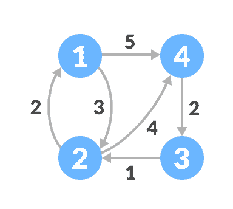
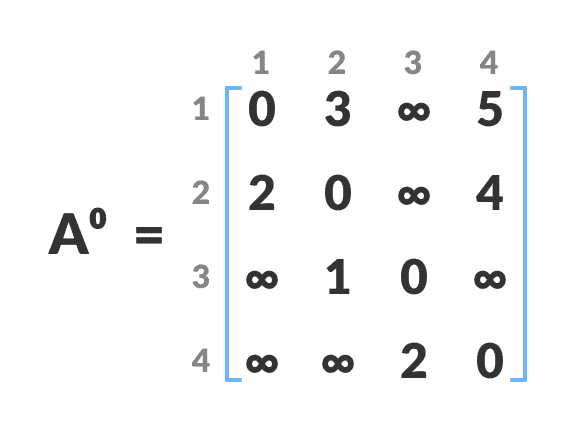
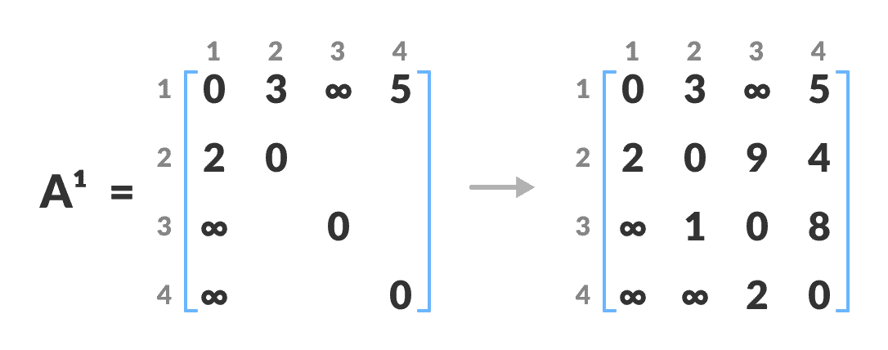
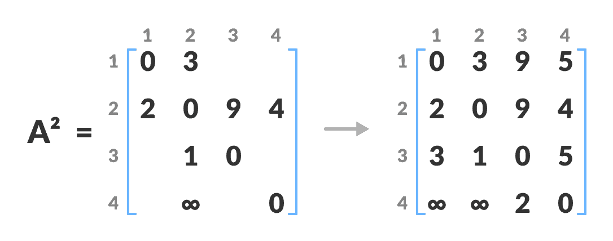
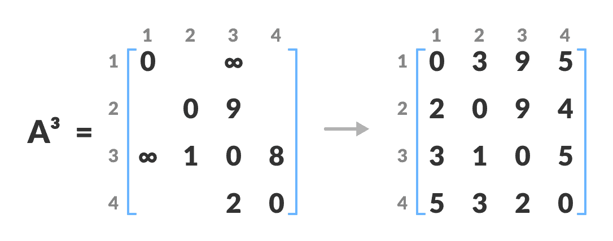
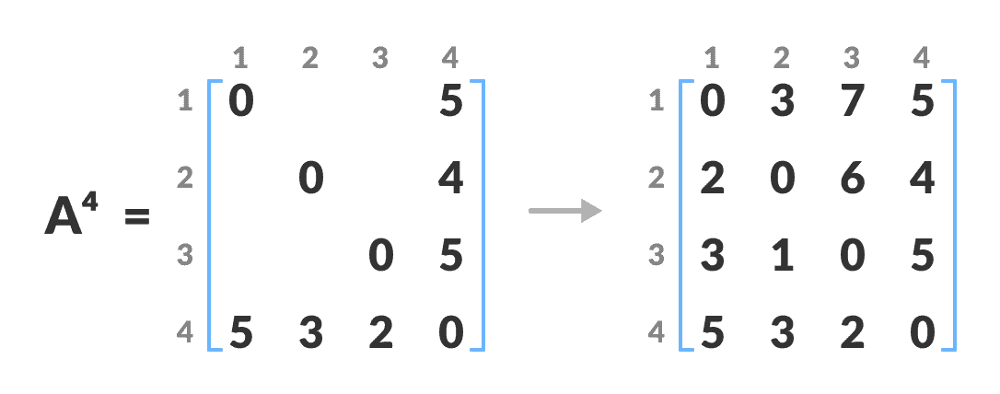

# Floyd-Warshall 算法

> 原文： [https://www.programiz.com/dsa/floyd-warshall-algorithm](https://www.programiz.com/dsa/floyd-warshall-algorithm)

#### 在本教程中，您将学习 floyd-warshall 算法的工作原理。 此外，您还将找到 C，C++ ，Java 和 Python 中的 floyd-warshall 算法的工作示例。

Floyd-Warshall 算法是一种用于找到加权图中所有顶点对之间的最短路径的算法。 该算法适用于有向和无向加权图。 但是，它不适用于周期为负的图（周期中边的总和为负）。

加权图是其中每个边都有与之关联的数值的图。

Floyd-Warhshall 算法也称为 Floyd 算法，Roy-Floyd 算法，Roy-Warshall 算法或 WFI 算法。

该算法遵循[动态编程](/dsa/dynamic-programming)方法来找到最短路径。

* * *

## Floyd-Warshall 算法如何工作？

让给定的图形为：



Initial graph


请按照以下步骤查找所有顶点对之间的最短路径。

1.  创建大小为`n*n`的矩阵`A^1`，其中`n`是顶点数。 行和列的索引分别为`i`和`j`。`i`和`j`是图形的顶点。

    每个单元格`A[i][j]`填充了从第`i`个顶点到第`j`个顶点的距离。 如果没有从第`i`个顶点到第`j`个顶点的路径，则该单元将保留为无穷大。

    

    用第`i`个顶点与第`j`个顶点之间的距离填充每个单元格

    

2.  现在，使用矩阵`A^0`创建一个矩阵`A^1`。 第一列和第一行中的元素保持原样。 其余单元格按以下方式填充。

    令`k`为从源到目标的最短路径中的中间顶点。 在此步骤中，`k`是第一个顶点。`A[i][j]`填充有`(A[i][k] + A[k][j]) if (A[i][j] > A[i][k] + A[k][j])`。

    也就是说，如果从源到目的地的直接距离大于通过顶点`k`的路径，则单元格将填充`A[i][k] + A[k][j]`。

    在此步骤中，`k`为顶点 1。我们计算通过此顶点`k`从源顶点到目标顶点的距离。

    

    计算通过此顶点`k`从源顶点到目的顶点的距离

    

    例如：对于`A^1[2, 4]`，从顶点 2 到 4 的直接距离是 4 并且从顶点 2 到 4 到顶点（即从顶点 2 到 1 和从顶点 1 到 4）的距离之和为 7。由于`4 < 7`，`A^0[2, 4]`用 4 填充。
3.  类似地，使用`A^3`创建`A^2`。 第二列和第二行中的元素保持原样。

    在此步骤中，`k`是第二个顶点（即顶点 2）。 其余步骤与**步骤 2** 中的步骤相同。

    

    计算通过此顶点 2 从源顶点到目标顶点的距离

    

4.  同样，还创建了`A^3`和`A^4`。

    

    计算通过此顶点从源顶点到目标顶点的距离

    

    。

    

    计算通过定点 4 从源顶点到目标顶点的距离。

    

5.  `A^4`给出每对顶点之间的最短路径。

* * *

## Floyd-Warshall 算法

```
n = no of vertices
A = matrix of dimension n*n
for k = 1 to n
    for i = 1 to n
        for j = 1 to n
            Ak[i, j] = min (Ak-1[i, j], Ak-1[i, k] + Ak-1[k, j])
return A
```

* * *

## Python，Java 和 C/C++ 示例

[Python](#python-code)[Java](#java-code)[C](#c-code)[C++](#cpp-code)

```
# Floyd Warshall Algorithm in python

# The number of vertices
nV = 4

INF = 999

# Algorithm implementation
def floyd_warshall(G):
    distance = list(map(lambda i: list(map(lambda j: j, i)), G))

    # Adding vertices individually
    for k in range(nV):
        for i in range(nV):
            for j in range(nV):
                distance[i][j] = min(distance[i][j], distance[i][k] + distance[k][j])
    print_solution(distance)

# Printing the solution
def print_solution(distance):
    for i in range(nV):
        for j in range(nV):
            if(distance[i][j] == INF):
                print("INF", end=" ")
            else:
                print(distance[i][j], end="  ")
        print(" ")

G = [[0, 3, INF, 5],
         [2, 0, INF, 4],
         [INF, 1, 0, INF],
         [INF, INF, 2, 0]]
floyd_warshall(G)
```

```
// Floyd Warshall Algorithm in Java

class FloydWarshall {
  final static int INF = 9999, nV = 4;

  // Implementing floyd warshall algorithm
  void floydWarshall(int graph[][]) {
    int matrix[][] = new int[nV][nV];
    int i, j, k;

    for (i = 0; i < nV; i++)
      for (j = 0; j < nV; j++)
        matrix[i][j] = graph[i][j];

    // Adding vertices individually
    for (k = 0; k < nV; k++) {
      for (i = 0; i < nV; i++) {
        for (j = 0; j < nV; j++) {
          if (matrix[i][k] + matrix[k][j] < matrix[i][j])
            matrix[i][j] = matrix[i][k] + matrix[k][j];
        }
      }
    }
    printMatrix(matrix);
  }

  void printMatrix(int matrix[][]) {
    for (int i = 0; i < nV; ++i) {
      for (int j = 0; j < nV; ++j) {
        if (matrix[i][j] == INF)
          System.out.print("INF ");
        else
          System.out.print(matrix[i][j] + "  ");
      }
      System.out.println();
    }
  }

  public static void main(String[] args) {
    int graph[][] = { { 0, 3, INF, 5 }, { 2, 0, INF, 4 }, { INF, 1, 0, INF }, { INF, INF, 2, 0 } };
    FloydWarshall a = new FloydWarshall();
    a.floydWarshall(graph);
  }
}
```

```
// Floyd-Warshall Algorithm in C

#include <stdio.h>

// defining the number of vertices
#define nV 4

#define INF 999

void printMatrix(int matrix[][nV]);

// Implementing floyd warshall algorithm
void floydWarshall(int graph[][nV]) {
  int matrix[nV][nV], i, j, k;

  for (i = 0; i < nV; i++)
    for (j = 0; j < nV; j++)
      matrix[i][j] = graph[i][j];

  // Adding vertices individually
  for (k = 0; k < nV; k++) {
    for (i = 0; i < nV; i++) {
      for (j = 0; j < nV; j++) {
        if (matrix[i][k] + matrix[k][j] < matrix[i][j])
          matrix[i][j] = matrix[i][k] + matrix[k][j];
      }
    }
  }
  printMatrix(matrix);
}

void printMatrix(int matrix[][nV]) {
  for (int i = 0; i < nV; i++) {
    for (int j = 0; j < nV; j++) {
      if (matrix[i][j] == INF)
        printf("%4s", "INF");
      else
        printf("%4d", matrix[i][j]);
    }
    printf("\n");
  }
}

int main() {
  int graph[nV][nV] = {{0, 3, INF, 5},
             {2, 0, INF, 4},
             {INF, 1, 0, INF},
             {INF, INF, 2, 0}};
  floydWarshall(graph);
}
```

```
// Floyd-Warshall Algorithm in C++

#include <iostream>
using namespace std;

// defining the number of vertices
#define nV 4

#define INF 999

void printMatrix(int matrix[][nV]);

// Implementing floyd warshall algorithm
void floydWarshall(int graph[][nV]) {
  int matrix[nV][nV], i, j, k;

  for (i = 0; i < nV; i++)
    for (j = 0; j < nV; j++)
      matrix[i][j] = graph[i][j];

  // Adding vertices individually
  for (k = 0; k < nV; k++) {
    for (i = 0; i < nV; i++) {
      for (j = 0; j < nV; j++) {
        if (matrix[i][k] + matrix[k][j] < matrix[i][j])
          matrix[i][j] = matrix[i][k] + matrix[k][j];
      }
    }
  }
  printMatrix(matrix);
}

void printMatrix(int matrix[][nV]) {
  for (int i = 0; i < nV; i++) {
    for (int j = 0; j < nV; j++) {
      if (matrix[i][j] == INF)
        printf("%4s", "INF");
      else
        printf("%4d", matrix[i][j]);
    }
    printf("\n");
  }
}

int main() {
  int graph[nV][nV] = {{0, 3, INF, 5},
             {2, 0, INF, 4},
             {INF, 1, 0, INF},
             {INF, INF, 2, 0}};
  floydWarshall(graph);
}
```

* * *

## Floyd Warshall 算法复杂度

### 时间复杂度

有三个循环。 每个循环具有恒定的复杂度。 因此，Floyd-Warshall 算法的时间复杂度为`O(n^3)`。

### 空间复杂度

Floyd-Warshall 算法的空间复杂度为`O(n^2)`。

* * *

## Floyd Warshall 算法应用

*   找到有向图的最短路径
*   查找有向图的传递闭包
*   查找实矩阵的逆
*   测试无向图是否是二分图