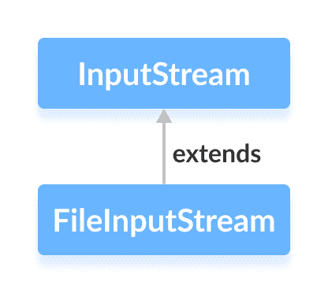

# Java FileInputStream 类

> 原文： [https://www.programiz.com/java-programming/fileinputstream](https://www.programiz.com/java-programming/fileinputstream)

#### 在本教程中，我们将借助示例学习 Java FileInputStream 及其方法。

`java.io`包的`FileInputStream`类可用于从文件中读取数据（以字节为单位）。

它扩展了`InputStream`抽象类。



在学习`FileInputStream`之前，请确保了解 [Java 文件](/java-programming/file "Java Files")。

* * *

## 创建一个 FileInputStream

为了创建文件输入流，我们必须首先导入`java.io.FileInputStream`包。 导入包后，就可以使用 Java 创建文件输入流。

**1.使用文件**的路径

```java
FileInputStream input = new FileInputStream(stringPath); 
```

在这里，我们创建了一个输入流，该输入流将链接到`路径`指定的文件。

**2.使用文件**的对象

```java
FileInputStream input = new FileInputStream(File fileObject); 
```

在这里，我们创建了一个输入流，该输入流将链接到`fileObject`指定的文件。

* * *

## FileInputStream 的方法

`FileInputStream`类提供了`InputStream`类中存在的不同方法的实现。

### read（）方法

*   `read()`-从文件中读取一个字节
*   `read(byte[] array)`-从文件中读取字节并将其存储在指定的数组中
*   `read(byte[] array, int start, int length)`-从文件中读取等于`长度`的字节数，并从位置`开始`开始存储在指定的数组中

假设我们有一个名为 **input.txt** 的文件，其内容如下。

```java
This is a line of text inside the file. 
```

让我们尝试使用`FileInputStream`读取此文件。

```java
import java.io.FileInputStream;

public class Main {

  public static void main(String args[]) {

     try {
        FileInputStream input = new FileInputStream("input.txt");

        System.out.println("Data in the file: ");

        // Reads the first byte
        int i = input.read();

       while(i != -1) {
           System.out.print((char)i);

           // Reads next byte from the file
           i = input.read();
        }
        input.close();
     }

     catch(Exception e) {
        e.getStackTrace();
     }
  }
} 
```

**输出**

```java
Data in the file:
This is a line of text inside the file. 
```

在上面的示例中，我们创建了一个名为`input`的文件输入流。 输入流与 **input.txt** 文件链接。

```java
FileInputStream input = new FileInputStream("input.txt"); 
```

为了从文件中读取数据，我们在 while 循环中使用了`read()`方法。

* * *

### available（）方法

要获得可用字节数，我们可以使用`available()`方法。 例如，

```java
import java.io.FileInputStream;

public class Main {

   public static void main(String args[]) {

      try {
         // Suppose, the input.txt file contains the following text
         // This is a line of text inside the file.
         FileInputStream input = new FileInputStream("input.txt");

         // Returns the number of available bytes
         System.out.println("Available bytes at the beginning: " + input.available());

         // Reads 3 bytes from the file
         input.read();
         input.read();
         input.read();

         // Returns the number of available bytes
         System.out.println("Available bytes at the end: " + input.available());

         input.close();
      }

      catch (Exception e) {
         e.getStackTrace();
      }
   }
} 
```

**输出**：

```java
Available bytes at the beginning: 39
Available bytes at the end: 36 
```

在上面的示例中，

1.  我们首先使用`available()`方法检查文件输入流中的可用字节数。
2.  然后，我们已使用`read()`方法 3 次从文件输入流中读取 3 个字节。
3.  现在，在读取字节之后，我们再次检查了可用字节。 这次，可用字节减少了 3。

* * *

### skip（）方法

要丢弃并跳过指定的字节数，可以使用`skip()`方法。 例如，

```java
import java.io.FileInputStream;

public class Main {

   public static void main(String args[]) {

      try {
         // Suppose, the input.txt file contains the following text
         // This is a line of text inside the file.
         FileInputStream input = new FileInputStream("input.txt");

         // Skips the 5 bytes
         input.skip(5);
         System.out.println("Input stream after skipping 5 bytes:");

         // Reads the first byte
         int i = input.read();
         while (i != -1) {
            System.out.print((char) i);

            // Reads next byte from the file
            i = input.read();
         }

         // close() method
         input.close();
      }
      catch (Exception e) {
         e.getStackTrace();
      }
   }
} 
```

**输出**：

```java
Input Stream after skipping 5 bytes:
is a line of text inside the file. 
```

在上面的示例中，我们使用`skip()`方法从文件输入流中跳过 5 个字节的数据。 因此，不会从输入流中读取代表文本**“ This”** 的字节。

* * *

### close（）方法

要关闭文件输入流，可以使用`close()`方法。 调用`close()`方法后，我们将无法使用输入流读取数据。

在以上所有示例中，我们都使用`close()`方法关闭文件输入流。

* * *

## FileInputStream 的其他方法

| 方法 | 内容描述 |
| `finalize()` | 确保调用`close()`方法 |
| `getChannel()` | 返回与输入流关联的`FileChannel`的对象 |
| `getFD()` | 返回与输入流关联的文件描述符 |
| `mark()` | 标记输入流中已读取数据的位置 |
| `reset()` | 将控件返回到输入流中设置了标记的点 |

要了解更多信息，请访问 [Java FileInputStream（官方 Java 文档）](https://docs.oracle.com/javase/7/docs/api/java/io/FileInputStream.html "Java FileInputStream (official Java documentation)")。