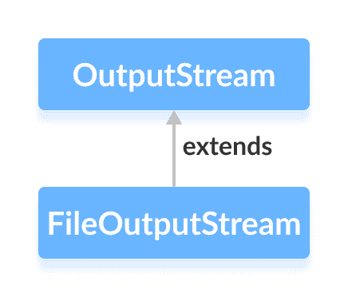

# Java `FileOutputStream`类

> 原文： [https://www.programiz.com/java-programming/fileoutputstream](https://www.programiz.com/java-programming/fileoutputstream)

#### 在本教程中，我们将借助示例学习 Java `FileOutputStream`及其方法。

`java.io`包的`FileOutputStream`类可用于将数据（以字节为单位）写入文件。

它扩展了`OutputStream`抽象类。



在学习`FileOutputStream`之前，请确保了解 [Java 文件](/java-programming/file "Java Files")。

* * *

## 创建一个`FileOutputStream`

为了创建文件输出流，我们必须首先导入`java.io.FileOutputStream`包。 导入包后，就可以使用 Java 创建文件输出流。

**1.使用文件**的路径

```java
// Including the boolean parameter
FileOutputStream output = new FileOutputStream(String path, boolean value);

// Not including the boolean parameter
FileOutputStream output = new FileOutputStream(String path); 
```

在这里，我们创建了一个输出流，该输出流将链接到`path`指定的文件。

另外，`value`是可选的布尔参数。 如果将其设置为`true`，则新数据将附加到文件中现有数据的末尾。 否则，新数据将覆盖文件中的现有数据。

**2.使用文件**的对象

```java
FileOutputStream output = new FileOutputStream(File fileObject); 
```

在这里，我们创建了一个输出流，该输出流将链接到`fileObject`指定的文件。

* * *

## `FileOutputStream`的方法

`FileOutputStream`类提供了`OutputStream`类中存在的不同方法的实现。

### `write()`方法

*   `write()`-将单个字节写入文件输出流
*   `write(byte[] array)`-将指定数组中的字节写入输出流
*   `write(byte[] array, int start, int length)`-从位置`start`开始，将等于`length`的字节数写入数组的输出流中

### 示例：`FileOutputStream`将数据写入文件

```java
import java.io.FileOutputStream;

public class Main {
    public static void main(String[] args) {

        String data = "This is a line of text inside the file.";

        try {
            FileOutputStream output = new FileOutputStream("output.txt");

            byte[] array = data.getBytes();

            // Writes byte to the file
            output.write(array);

            output.close();
        }

        catch(Exception e) {
            e.getStackTrace();
        }
    }
} 
```

在上面的示例中，我们创建了一个名为`output`的文件输出流。 文件输出流与文件 **output.txt** 链接。

```java
FileOutputStream output = new FileOutputStream("output.txt"); 
```

要将数据写入文件，我们使用了`write()`方法。

在这里，当我们运行程序时， **output.txt** 文件填充了以下内容。

```java
This is a line of text inside the file. 
```

**注意**：程序中使用的`getBytes()`方法将字符串转换为字节数组。

* * *

### `flush()`方法

要清除输出流，可以使用`flush()`方法。 此方法强制输出流将所有数据写入目标。 例如，

```java
import java.io.FileOutputStream;
import java.io.IOException;

public class Main {
    public static void main(String[] args) throws IOException {

        FileOutputStream out = null;
        String data = "This is demo of flush method";

        try {
            out = new FileOutputStream(" flush.txt");

            // Using write() method
            out.write(data.getBytes());

            // Using the flush() method
            out.flush();
            out.close();
        }
        catch(Exception e) {
            e.getStackTrace();
        }
    }
} 
```

当我们运行程序时，文件 **flush.txt** 充满了由字符串`data`表示的文本。

* * *

### `close()`方法

要关闭文件输出流，可以使用`close()`方法。 一旦调用该方法，就不能使用`FileOutputStream`的方法。

* * *

## `FileOutputStream`的其他方法

| 方法 | 内容描述 |
| `finalize()` | 确保调用`close()`方法 |
| `getChannel()` | 返回与输出流关联的`FileChannel`的对象 |
| `getFD()` | 返回与输出流关联的文件描述符 |

要了解更多信息，请访问 [Java `FileOutputStream`（Java 官方文档）](https://docs.oracle.com/javase/7/docs/api/java/io/FileOutputStream.html#write(int) "Java FileOutputStream (official Java documentation)")。