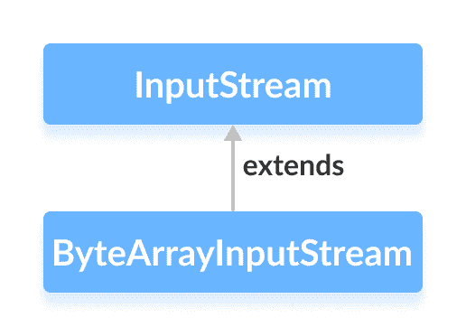

# Java ByteArrayInputStream 类

> 原文： [https://www.programiz.com/java-programming/bytearrayinputstream](https://www.programiz.com/java-programming/bytearrayinputstream)

#### 在本教程中，我们将借助示例学习 Java ByteArrayInputStream 及其方法。

`java.io`程序包的`ByteArrayInputStream`类可用于读取输入数据数组（以字节为单位）。

它扩展了`InputStream`抽象类。



**注意**：在`ByteArrayInputStream`中，使用字节数组创建输入流。 它包括一个内部数组，用于存储该特定字节数组的数据。

* * *

## 创建一个 ByteArrayInputStream

为了创建字节数组输入流，我们必须首先导入`java.io.ByteArrayInputStream`包。 导入包后，就可以创建输入流。

```java
// Creates a ByteArrayInputStream that reads entire array
ByteArrayInputStream input = new ByteArrayInputStream(byte[] arr); 
```

在这里，我们创建了一个输入流，该输入流从`arr`数组读取整个数据。 但是，我们也可以创建仅从数组读取一些数据的输入流。

```java
// Creates a ByteArrayInputStream that reads a portion of array
ByteArrayInputStream input = new ByteArrayInputStream(byte[] arr, int start, int length); 
```

此处，输入流从`起始`位置开始，从数组中读取等于`长度`的字节数。

* * *

## ByteArrayInputStream 的方法

`ByteArrayInputStream`类提供了`InputStream`类中存在的不同方法的实现。

### read（）方法

*   `read()`-从输入流中存在的数组中读取单个字节
*   `read(byte[] array)`-从输入流中读取字节并将其存储在指定的数组中
*   `read(byte[] array, int start, int length)`-从流中读取等于`长度`的字节数，并从位置`开始`开始存储在指定的数组中

### 示例：ByteArrayInputStream 读取数据

```java
import java.io.ByteArrayInputStream;

public class Main {
  public static void main(String[] args) {

    // Creates an array of byte
    byte[] array = {1, 2, 3, 4};

    try {
      ByteArrayInputStream input = new ByteArrayInputStream(array);

      System.out.print("The bytes read from the input stream: ");

      for(int i= 0; i < array.length; i++) {

        // Reads the bytes
        int data = input.read();
        System.out.print(data + ", ");
      }
      input.close();
    }

    catch(Exception e) {
      e.getStackTrace();
    }
  }
} 
```

**输出**

```java
The bytes read from the input stream: 1, 2, 3, 4, 
```

在上面的示例中，我们创建了一个名为`input`的字节数组输入流。

```java
ByteArrayInputStream input = new ByteArrayInputStream(array); 
```

在此，输入流包括来自指定数组的所有数据。 为了从输入流中读取数据，我们使用了`read()`方法。

* * *

### available（）方法

要获取输入流中可用字节的数量，我们可以使用`available()`方法。 例如，

```java
import java.io.ByteArrayInputStream;

public class Main {

  public static void main(String args[]) {

    // Creates an array of bytes
    byte[] array = { 1, 2, 3, 4 };

    try {
      ByteArrayInputStream input = new ByteArrayInputStream(array);

      // Returns the available number of bytes
      System.out.println("Available bytes at the beginning: " + input.available());

      // Reads 2 bytes from the input stream
      input.read();
      input.read();

      // Returns the available number of bytes
      System.out.println("Available bytes at the end: " + input.available());

      input.close();
    }

    catch (Exception e) {
      e.getStackTrace();
    }
  }
} 
```

**Output**

```java
Available bytes at the beginning: 4
Available bytes at the end: 2 
```

在上面的示例中，

1.  我们已经使用`available()`方法检查输入流中的可用字节数。
2.  然后，我们使用`read()`方法 2 次，从输入流中读取 2 个字节。
3.  现在，在读取 2 个字节后，我们检查了可用字节。 这次，可用字节减少了 2。

* * *

### skip（）方法

要丢弃并跳过指定的字节数，可以使用`skip()`方法。 例如，

```java
import java.io.ByteArrayInputStream;

public class Main {

  public static void main(String args[]) {

    // Create an array of bytes
    byte[] array = { 1, 2, 3, 4 };
    try {
      ByteArrayInputStream input = new ByteArrayInputStream(array);

      // Using the skip() method
      input.skip(2);
      System.out.print("Input stream after skipping 2 bytes: ");

      int data = input.read();
      while (data != -1) {
        System.out.print(data + ", ");
        data = input.read();
      }

      // close() method
      input.close();
    }

    catch (Exception e) {
      e.getStackTrace();
    }
  }
} 
```

**Output**

```java
Input stream after skipping 2 bytes: 3, 4, 
```

在上面的示例中，我们使用 `skip（）`方法从输入流中跳过 2 个字节的数据。 因此，不会从输入流中读取 `1` 和 `2` 。

* * *

### close（）方法

要关闭输入流，可以使用`close()`方法。

但是，`close()`方法在`ByteArrayInputStream`类中无效。 即使调用了`close()`方法，我们也可以使用此类的方法。

* * *

## ByteArrayInputStream 的其他方法

| 方法 | 内容描述 |
| `finalize()` | 确保调用`close()`方法 |
| `mark()` | 标记输入流中已读取数据的位置 |
| `reset()` | 将控件返回到输入流中设置了标记的点 |
| `markSupported()` | 检查输入流是否支持`mark()`和`reset()` |

要了解更多信息，请访问 [Java ByteArrayInputStream（Java 官方文档）](https://docs.oracle.com/javase/7/docs/api/java/io/ByteArrayInputStream.html "Java ByteArrayInputStream (official Java documentation)")。