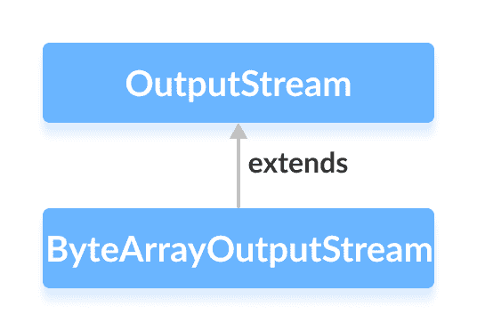

# Java ByteArrayOutputStream 类

> 原文： [https://www.programiz.com/java-programming/bytearrayoutputstream](https://www.programiz.com/java-programming/bytearrayoutputstream)

#### 在本教程中，我们将借助示例学习 Java ByteArrayOutputStream 及其方法。

`java.io`包的`ByteArrayOutputStream`类可用于写入输出数据数组（以字节为单位）。

它扩展了`OutputStream`抽象类。



**注意**：在`ByteArrayOutputStream`中维护一个内部字节数组来存储数据。

* * *

## 创建一个 ByteArrayOutputStream

为了创建字节数组输出流，我们必须首先导入`java.io.ByteArrayOutputStream`包。 导入包后，就可以创建输出流。

```java
// Creates a ByteArrayOutputStream with default size
ByteArrayOutputStream out = new ByteArrayOutputStream(); 
```

在这里，我们创建了一个输出流，它将数据写入默认大小为 32 个字节的字节数组中。 但是，我们可以更改数组的默认大小。

```java
// Creating a ByteArrayOutputStream with specified size
ByteArrayOutputStream out = new ByteArrayOutputStream(int size); 
```

在此，`大小`指定数组的长度。

* * *

## ByteArrayOutputStream 的方法

`ByteArrayOutputStream`类提供`OutputStream`类中存在的不同方法的实现。

### write（）方法

*   `write(int byte)`-将指定的字节写入输出流
*   `write(byte[] array)`-将指定数组中的字节写入输出流
*   `write(byte[] arr, int start, int length)`-从位置`开始`开始，将等于`长度`的字节数写入数组的输出流中
*   `writeTo(ByteArrayOutputStream out1)`-将当前输出流的整个数据写入指定的输出流

### 示例：ByteArrayOutputStream 写入数据

```java
import java.io.ByteArrayOutputStream;

class Main {
  public static void main(String[] args) {

    String data = "This is a line of text inside the string.";

    try {
      // Creates an output stream
      ByteArrayOutputStream out = new ByteArrayOutputStream();
      byte[] array = data.getBytes();

      // Writes data to the output stream
      out.write(array);

      // Retrieves data from the output stream in string format
      String streamData = out.toString();
      System.out.println("Output stream: " + streamData);

      out.close();
    }

    catch(Exception e) {
      e.getStackTrace();
    }
  }
} 
```

**输出**

```java
Output stream: This is a line of text inside the string. 
```

在上面的示例中，我们创建了一个名为`output`的字节数组输出流。

```java
ByteArrayOutputStream output = new ByteArrayOutputStream(); 
```

要将数据写入输出流，我们使用了`write()`方法。

**注意**：程序中使用的`getBytes()`方法将字符串转换为字节数组。

* * *

### 从 ByteArrayOutputStream 访问数据

*   `toByteArray()`-返回输出流中存在的数组
*   `toString()`-以字符串形式返回输出流的全部数据

例如，

```java
import java.io.ByteArrayOutputStream;

class Main {
  public static void main(String[] args) {
    String data = "This is data.";

    try {
      // Creates an output stream
      ByteArrayOutputStream out = new ByteArrayOutputStream();

      // Writes data to the output stream
      out.write(data.getBytes());

      // Returns an array of bytes
      byte[] byteData = out.toByteArray();
      System.out.print("Data using toByteArray(): ");
      for(int i=0; i<byteData.length; i++) {
        System.out.print((char)byteData[i]);
      }

      // Returns a string
      String stringData = out.toString();
      System.out.println("\nData using toString(): " + stringData);

      out.close();
    }

    catch(Exception e) {
      e.getStackTrace();
    }
  }
} 
```

**Output**

```java
Data using toByteArray(): This is data.
Data using toString(): This is data. 
```

在上面的示例中，我们创建了一个字节数组来存储`toByteArray()`方法返回的数据。

然后，我们使用了 for 循环来访问数组中的每个字节。 在此，使用类型转换将每个字节转换为相应的字符。

* * *

### close（）方法

要关闭输出流，可以使用`close()`方法。

但是，`close()`方法在`ByteArrayOutputStream`类中无效。 即使调用了`close()`方法，我们也可以使用此类的方法。

* * *

## ByteArrayOutputStream 的其他方法

| 方法 | 内容描述 |
| `size()` | 返回输出流中数组的大小 |
| `flush()` | 清除输出流 |

要了解更多信息，请访问 [Java ByteArrayOutputStream（Java 官方文档）](https://docs.oracle.com/javase/7/docs/api/java/io/ByteArrayOutputStream.html "Java ByteArrayOutputStream (official Java documentation)")。