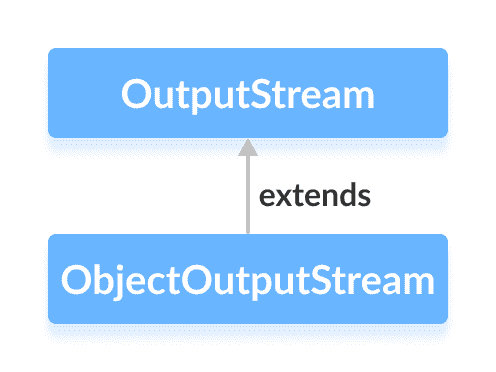

# Java ObjectOutputStream 类

> 原文： [https://www.programiz.com/java-programming/objectoutputstream](https://www.programiz.com/java-programming/objectoutputstream)

#### 在本教程中，我们将借助示例学习 Java ObjectOutputStream 及其方法。

`java.io`程序包的`ObjectOutputStream`类可用于写入可由`ObjectInputStream`读取的对象。

它扩展了`OutputStream`抽象类。



* * *

## ObjectOutputStream 的工作

基本上，`ObjectOutputStream`使用类名和对象值对 Java 对象进行编码。 并且，因此生成相应的流。 此过程称为序列化。

这些转换后的流可以存储在文件中，并且可以在网络之间传输。

**注意**：`ObjectOutputStream`类仅写入实现`Serializable`接口的对象。 这是因为对象在写入流时需要序列化

* * *

## 创建一个 ObjectOutputStream

为了创建对象输出流，我们必须首先导入`java.io.ObjectOutputStream`包。 导入包后，就可以创建输出流。

```java
// Creates a FileOutputStream where objects from ObjectOutputStream are written
FileOutputStream fileStream = new FileOutputStream(String file);

// Creates the ObjectOutputStream
ObjectOutputStream objStream = new ObjectOutputStream(fileStream); 
```

在上面的示例中，我们创建了一个名为 `objStream` 的对象输出流，该对象输出流与名为 `fileStream` 的文件输出流链接在一起。

* * *

## ObjectOutputStream 的方法

`ObjectOutputStream`类提供了`OutputStream`类中存在的不同方法的实现。

## write（）方法

*   `write()`-将字节数据写入输出流
*   `writeBoolean()`-以布尔形式写入数据
*   `writeChar()`-以字符形式写入数据
*   `writeInt()`-以整数形式写入数据
*   `writeObject()`-将对象写入输出流

* * *

### 示例 1：Java ObjectOutputStream

让我们看看如何使用`ObjectOutputStream`将对象存储在文件中，以及如何使用`ObjectInputStream`从文件中读取这些对象

```java
import java.io.FileInputStream;
import java.io.FileOutputStream;
import java.io.ObjectInputStream;
import java.io.ObjectOutputStream;

class Main {
    public static void main(String[] args) {

        int data1 = 5;
        String data2 = "This is programiz";

        try {

            FileOutputStream file = new FileOutputStream("file.txt");

            // Creates an ObjectOutputStream
            ObjectOutputStream output = new ObjectOutputStream(file);

            // writes objects to output stream
            output.writeInt(data1);
            output.writeObject(data2);

            // Reads data using the ObjectInputStream
            FileInputStream fileStream = new FileInputStream("file.txt");
            ObjectInputStream objStream = new ObjectInputStream(fileStream);

            System.out.println("Integer data :" + objStream.readInt());
            System.out.println("String data: " + objStream.readObject());

            output.close();
            objStream.close();
        }

        catch (Exception e) {
            e.getStackTrace();
        }
    }
} 
```

**输出**

```java
Integer data: 5
String data: This is programiz 
```

在上面的示例中，我们使用`readInt()`方法和`readObject()`方法从文件中读取整数数据和对象数据。

在这里，我们使用`ObjectOutputStream`将数据写入文件。 然后，我们使用`ObjectInputStream`从文件中读取数据。

* * *

### 示例 2：Java ObjectOutputStream

再举一个例子

```java
import java.io.FileInputStream;
import java.io.FileOutputStream;
import java.io.ObjectInputStream;
import java.io.ObjectOutputStream;
import java.io.Serializable;

class Dog implements Serializable {

    String name;
    String breed;

    public Dog(String name, String breed) {
        this.name = name;
        this.breed = breed;
    }
}

class Main {
    public static void main(String[] args) {

        // Creates an object of Dog class
        Dog dog1 = new Dog("Tyson", "Labrador");

        try {
            FileOutputStream fileOut = new FileOutputStream("file.txt");

            // Creates an ObjectOutputStream
            ObjectOutputStream objOut = new ObjectOutputStream(fileOut);

            // Writes objects to the output stream
            objOut.writeObject(dog1);

            // Reads the object
            FileInputStream fileIn = new FileInputStream("file.txt");
            ObjectInputStream objIn = new ObjectInputStream(fileIn);

            // Reads the objects
            Dog newDog = (Dog) objIn.readObject();

            System.out.println("Dog Name: " + newDog.name);
            System.out.println("Dog Breed: " + newDog.breed);

            objOut.close();
            objIn.close();
        }

        catch (Exception e) {
            e.getStackTrace();
        }
    }
} 
```

**Output**

```java
Dog Name: Tyson
Dog Breed: Labrador 
```

在上面的示例中，我们创建了

*   `ObjectOutputStream`命名为 `objOut` ，使用`FileOutputStream`命名为 `fileOut`
*   `ObjectInputStream`名为 `objIn` ，使用 `fileIn` 命名。
*   `Dog` 类的对象 `dog1` 。

在这里，我们然后使用对象输出流将对象写入文件。 并且，对象输入流从文件中读取对象。

**注意**： `Dog` 类实现`Serializable`接口。 这是因为`ObjectOutputStream`只写可以序列化到输出流的对象。

* * *

## ObjectOutputStream 的其他方法

| 方法 | 内容描述 |
| `flush()` | 清除输出流中的所有数据 |
| `drain()` | 将所有缓冲的数据放入输出流 |
| `close()` | 关闭输出流 |

要了解更多信息，请访问 [Java ObjectOutputStream（官方 Java 文档）](https://docs.oracle.com/javase/7/docs/api/java/io/ObjectOutputStream.html# "Java ObjectOutputStream (official Java documentation)")。