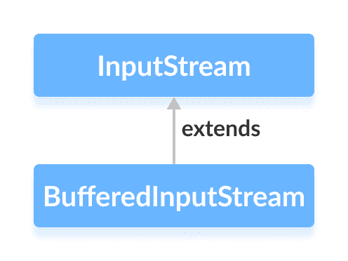

# Java `BufferedInputStream`类

> 原文： [https://www.programiz.com/java-programming/bufferedinputstream](https://www.programiz.com/java-programming/bufferedinputstream)

#### 在本教程中，我们将借助示例学习 Java `BufferedInputStream`及其方法。

`java.io`包的`BufferedInputStream`类与其他输入流一起使用，可以更有效地读取数据（以字节为单位）。

它扩展了`InputStream`抽象类。



* * *

## `BufferedInputStream`的工作

`BufferedInputStream`维护 8192 字节的内部**缓冲区**。

在`BufferedInputStream`中进行读取操作期间，将从磁盘读取一部分字节并将其存储在内部缓冲区中。 并从内部缓冲区中逐个读取字节。

因此，减少了与磁盘的通信次数。 这就是为什么使用`BufferedInputStream`读取字节更快的原因。

* * *

## 创建一个`BufferedInputStream`

为了创建一个`BufferedInputStream`，我们必须首先导入`java.io.BufferedInputStream`包。 导入包后，便可以在此处创建输入流。

```java
// Creates a FileInputStream
FileInputStream file = new FileInputStream(String path);

// Creates a BufferedInputStream
BufferedInputStream buffer = new BufferInputStream(file); 
```

在上面的示例中，我们使用名为`的文件`创建了名为`缓冲区`的`BufferdInputStream`。

在此，内部缓冲区的默认大小为 8192 字节。 但是，我们也可以指定内部缓冲区的大小。

```java
// Creates a BufferedInputStream with specified size internal buffer
BufferedInputStream buffer = new BufferInputStream(file, int size); 
```

`缓冲区`将有助于更快地从文件中读取字节。

* * *

## `BufferedInputStream`的方法

`BufferedInputStream`类提供了`InputStream`类中存在的不同方法的实现。

### `read()`方法

*   `read()`-从输入流中读取一个字节
*   `read(byte[] arr)`-从流中读取字节并将其存储在指定的数组中
*   `read(byte[] arr, int start, int length)`-从流中读取等于`length`的字节数，并从位置`start`开始存储在指定的数组中

假设我们有一个名为 **input.txt** 的文件，其内容如下。

```java
This is a line of text inside the file. 
```

让我们尝试使用`BufferedInputStream`读取文件。

```java
import java.io.BufferedInputStream;
import java.io.FileInputStream;

class Main {
    public static void main(String[] args) {
        try {

            // Creates a FileInputStream
            FileInputStream file = new FileInputStream("input.txt");

            // Creates a BufferedInputStream
            BufferedInputStream input = new BufferedInputStream(file);

            // Reads first byte from file
            int i = input .read();

            while (i != -1) {
                System.out.print((char) i);

                // Reads next byte from the file
                i = input.read();
            }
            input.close();
        }

        catch (Exception e) {
            e.getStackTrace();
        }
    }
} 
```

**输出**

```java
This is a line of text inside the file. 
```

在上面的示例中，我们创建了一个名为`buffer`和`FileInputStream`的缓冲输入流。 输入流与文件 **input.txt** 链接。

```java
FileInputStream file = new FileInputStream("input.txt");
BufferedInputStream buffer = new BufferedInputStream(file); 
```

在这里，我们已使用`read()`方法从缓冲读取器的内部缓冲区读取字节数组。

* * *

### `available()`方法

要获取输入流中可用字节的数量，我们可以使用`available()`方法。 例如，

```java
import java.io.FileInputStream;
import java.io.BufferedInputStream;

public class Main {

   public static void main(String args[]) {

      try {

         // Suppose, the input.txt file contains the following text
         // This is a line of text inside the file.
         FileInputStream file = new FileInputStream("input.txt");

         // Creates a BufferedInputStream
         BufferedInputStream buffer = new BufferedInputStream(file);

         // Returns the available number of bytes
         System.out.println("Available bytes at the beginning: " + buffer.available());

         // Reads bytes from the file
         buffer.read();
         buffer.read();
         buffer.read();

         // Returns the available number of bytes
         System.out.println("Available bytes at the end: " + buffer.available());

         buffer.close();
      }

      catch (Exception e) {
         e.getStackTrace();
      }
   }
} 
```

**输出**：

```java
Available bytes at the beginning: 39
Available bytes at the end: 36 
```

在上面的示例中，

1.  我们首先使用`available()`方法检查输入流中的可用字节数。
2.  然后，我们已使用`read()`方法 3 次从输入流中读取 3 个字节。
3.  现在，在读取字节之后，我们再次检查了可用字节。 这次，可用字节减少了 3。

* * *

### `skip()`方法

要丢弃并跳过指定的字节数，可以使用`skip()`方法。 例如，

```java
import java.io.FileInputStream;
import java.io.BufferedInputStream;

public class Main {

   public static void main(String args[]) {

      try {
         // Suppose, the input.txt file contains the following text
         // This is a line of text inside the file.
         FileInputStream file = new FileInputStream("input.txt");

         // Creates a BufferedInputStream
         BufferedInputStream buffer = new BufferedInputStream(file);

         // Skips the 5 bytes
         buffer.skip(5);
         System.out.println("Input stream after skipping 5 bytes:");

         // Reads the first byte from input stream
         int i = buffer.read();
         while (i != -1) {
            System.out.print((char) i);

            // Reads next byte from the input stream
            i = buffer.read();
         }

         // Closes the input stream
         buffer.close();
      }

      catch (Exception e) {
         e.getStackTrace();
      }
   }
} 
```

**输出**：

```java
Input stream after skipping 5 bytes: is a line of text inside the file. 
```

在上面的示例中，我们使用`skip()`方法从文件输入流中跳过 5 个字节。 因此，从输入流中跳过字节`'T'`，`'h'`，`'i'`，`'s'`和`' '`。

* * *

### `close()`方法

要关闭缓冲的输入流，可以使用`close()`方法。 调用`close()`方法后，我们将无法使用输入流读取数据。

* * *

## `BufferedInputStream`的其他方法

| 方法 | 内容描述 |
| `mark()` | 标记输入流中已读取数据的位置 |
| `reset()` | 将控件返回到输入流中设置了标记的点 |

要了解更多信息，请访问 [Java `BufferdInputStream`（官方 Java 文档）](https://docs.oracle.com/javase/7/docs/api/java/io/BufferedInputStream.html "Java BufferdInputStream (official Java documentation)")。