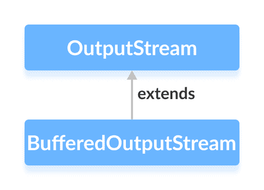

# Java `BufferedOutputStream`类

> 原文： [https://www.programiz.com/java-programming/bufferedoutputstream](https://www.programiz.com/java-programming/bufferedoutputstream)

#### 在本教程中，我们将借助示例学习 Java `BufferedOutputStream`及其方法。

`java.io`包的`BufferedOutputStream`类与其他输出流一起使用，可以更有效地写入数据（以字节为单位）。

它扩展了`OutputStream`抽象类。



* * *

## `BufferedOutputStream`的工作原理

`BufferedOutputStream`维护 8192 字节的内部**缓冲区**。

在写操作期间，字节被写入内部缓冲区而不是磁盘。 一旦缓冲区被填充或流关闭，整个缓冲区将被写入磁盘。

因此，减少了与磁盘的通信次数。 这就是为什么使用`BufferedOutputStream`写入字节更快的原因。

* * *

## 创建一个`BufferedOutputStream`

为了创建一个`BufferedOutputStream`，我们必须首先导入`java.io.BufferedOutputStream`包。 导入包后，就可以创建输出流了。

```java
// Creates a FileOutputStream
FileOutputStream file = new FileOutputStream(String path);

// Creates a BufferedOutputStream
BufferedOutputStream buffer = new BufferOutputStream(file); 
```

在上面的示例中，我们使用名为`file`创建了名为`buffer`的`BufferdOutputStream`。

在此，内部缓冲区的默认大小为 8192 字节。 但是，我们也可以指定内部缓冲区的大小。

```java
// Creates a BufferedOutputStream with specified size internal buffer
BufferedOutputStream buffer = new BufferOutputStream(file, int size); 
```

`buffer`将有助于更快地将字节写入文件。

* * *

## `BufferedOutputStream`的方法

`BufferedOutputStream`类为`OutputStream`类中的不同方法提供了实现。

### `write()`方法

*   `write()` - 将单个字节写入输出流的内部缓冲区
*   `write(byte[] array)` - 将指定数组中的字节写入输出流
*   `write(byte[] arr, int start, int length)` - 从位置`start`开始，将等于`length`的字节数写入数组的输出流中

### 示例：`BufferedOutputStream`将数据写入文件

```java
import java.io.FileOutputStream;
import java.io.BufferedOutputStream;

public class Main {
    public static void main(String[] args) {

        String data = "This is a line of text inside the file";

        try {
            // Creates a FileOutputStream
            FileOutputStream file = new FileOutputStream("output.txt");

            // Creates a BufferedOutputStream
            BufferedOutputStream output = new BufferedOutputStream(file);

            byte[] array = data.getBytes();

            // Writes data to the output stream
            output.write(array);
            output.close();
        }

        catch (Exception e) {
            e.getStackTrace();
        }
    }
} 
```

在上面的示例中，我们创建了一个名为`output`和`FileOutputStream`的缓冲输出流。 输出流与文件`output.txt`链接。

```java
FileOutputStream file = new FileOutputStream("output.txt");
BufferedOutputStream output = new BufferedOutputStream(file); 
```

要将数据写入文件，我们使用了`write()`方法。

在这里，当我们运行程序时，`output.txt`文件填充了以下内容。

```java
This is a line of text inside the file. 
```

**注意**：程序中使用的`getBytes()`方法将字符串转换为字节数组。

* * *

## `flush()`方法

要清除内部缓冲区，我们可以使用`flush()`方法。 此方法强制输出流将缓冲区中存在的所有数据写入目标文件。 例如，

```java
import java.io.FileOutputStream;
import java.io.BufferedOutputStream;

public class Main {
    public static void main(String[] args) {

        String data = "This is a demo of the flush method";

        try {
            // Creates a FileOutputStream
            FileOutputStream file = new FileOutputStream(" flush.txt");

            // Creates a BufferedOutputStream
            BufferedOutputStream buffer = new BufferedOutputStream(file);

            // Writes data to the output stream
            buffer.write(data.getBytes());

            // Flushes data to the destination
            buffer.flush();
            System.out.println("Data is flushed to the file.");
            buffer.close();
        }

        catch(Exception e) {
            e.getStackTrace();
        }
    }
} 
```

**输出**

```java
Data is flushed to the file. 
```

当我们运行程序时，文件`flush.txt`充满了由字符串`data`表示的文本。

* * *

### `close()`方法

要关闭缓冲的输出流，我们可以使用`close()`方法。 一旦调用了该方法，就无法使用输出流写入数据。

要了解更多信息，请访问 [Java `BufferedOutputStream`（官方 Java 文档）](https://docs.oracle.com/javase/7/docs/api/java/io/BufferedOutputStream.html "Java BufferedOutputStream (official Java documentation)")。