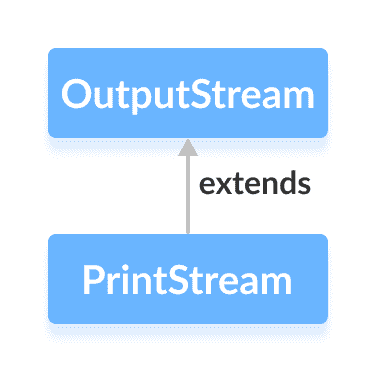

# Java PrintStream 类

> 原文： [https://www.programiz.com/java-programming/printstream](https://www.programiz.com/java-programming/printstream)

#### 在本教程中，我们将在示例的帮助下学习 Java PrintStream 类及其 print（）和 printf（）方法。

`java.io`包的`PrintStream`类可用于以通常可读的形式（文本）而不是字节写入输出数据。

它扩展了抽象类`OutputStream`。



* * *

## PrintStream 的工作

与其他输出流不同，`PrintStream`将原始数据（整数，字符）转换为文本格式而不是字节。 然后，它将格式化的数据写入输出流。

而且，`PrintStream`类不会引发任何输入/输出异常。 相反，我们需要使用`checkError()`方法来查找其中的任何错误。

**注意**：`PrintStream`类还具有自动刷新功能。 这意味着它将在以下情况之一下强制输出流将所有数据写入目标：

*   如果在打印流中写入了换行符`\n`
*   如果调用`println()`方法
*   如果在打印流中写入了字节数组

* * *

## 创建一个 PrintStream

为了创建一个`PrintStream`，我们必须首先导入`java.io.PrintStream`包。 导入包后，便可以在此处创建打印流。

**1.使用其他输出流**

```java
// Creates a FileOutputStream
FileOutputStream file = new FileOutputStream(String file);

// Creates a PrintStream
PrintStream output = new PrintStream(file, autoFlush); 
```

这里，

*   我们创建了一个打印流，它将格式化的数据写入由`FileOutputStream`表示的文件中
*   `autoFlush` 是一个可选的布尔参数，用于指定是否执行自动刷新

**2.使用文件名**

```java
 // Creates a PrintStream
PrintStream output = new PrintStream(String file, boolean autoFlush); 
```

Here,

*   我们创建了一个打印流，它将格式化的数据写入指定的文件
*   `autoFlush` 是一个可选的布尔参数，用于指定是否执行自动刷新

**注意**：在两种情况下，`PrintStream`都使用某些默认字符编码将数据写入文件。 但是，我们也可以指定字符编码（ **UTF8** 或 **UTF16** ）。

```java
// Creates a PrintStream using some character encoding
PrintStream output = new PrintStream(String file, boolean autoFlush, Charset cs); 
```

在这里，我们使用`Charset`类指定字符编码。 要了解更多信息，请访问 [Java Charset（Java 官方文档）](https://docs.oracle.com/javase/7/docs/api/java/nio/charset/Charset.html)。

* * *

## PrintStream 的方法

`PrintStream`类提供了各种方法，使我们可以将数据打印到输出。

### print（）方法

*   `print()`-将指定的数据打印到输出流
*   `println()`-将数据以及末尾的换行符打印到输出流

* * *

### 示例：带有 System 类的 print（）方法

```java
class Main {
    public static void main(String[] args) {

        String data = "Hello World.";
        System.out.print(data);
    }
} 
```

**输出**

```java
Hello World. 
```

在上面的示例中，我们尚未创建打印流。 但是，我们可以使用`PrintStream`类的`print()`方法。

您可能想知道这怎么可能。 好吧，让我解释一下这里发生了什么。

注意这一行，

```java
System.out.print(data); 
```

Here,

*   `System`是负责执行标准输入/输出操作的最终类
*   `out`是在`System`类中声明的`PrintStream`类型的类变量

现在，由于`out`是`PrintStream`类型的，因此我们可以使用它来调用`PrintStream`类的所有方法。

### 示例：带有 PrintStream 类的 print（）方法

```java
import java.io.PrintStream;

class Main {
    public static void main(String[] args) {

        String data = "This is a text inside the file.";

        try {
            PrintStream output = new PrintStream("output.txt");

            output.print(data);
            output.close();
        }
        catch(Exception e) {
            e.getStackTrace();
        }
    }
} 
```

在上面的示例中，我们创建了一个名为`输出`的打印流。 打印流与 **output.txt** 文件链接。

```java
PrintStream output = new PrintStream("output.txt"); 
```

要将数据打印到文件，我们使用了`print()`方法。

在这里，当我们运行程序时， **output.txt** 文件填充了以下内容。

```java
This is a text inside the file. 
```

* * *

### printf（）方法

`printf()`方法可用于打印格式化的字符串。 它包含 2 个参数：格式化的字符串和参数。 例如，

```java
printf("I am %d years old", 25); 
```

Here,

*   我％d 岁，是格式化字符串
*   ％d 是格式化字符串中的整数数据
*   25 是一个论点

格式化的字符串包括文本和数据。 并且，参数替换了格式化字符串中的数据。

因此，**％d** 被 **25** 取代。

### 示例：使用 PrintStream 的 printf（）方法

```java
import java.io.PrintStream;

class Main {
    public static void main(String[] args) {

        try {
            PrintStream output = new PrintStream("output.txt");

            int age = 25;

            output.printf("I am %d years old.", age);
            output.close();
        }
        catch(Exception e) {
            e.getStackTrace();
        }
    }
} 
```

在上面的示例中，我们创建了一个名为`输出`的打印流。 打印流与文件 **output.txt** 链接。

```java
PrintStream output = new PrintStream("output.txt"); 
```

要将格式化的文本打印到文件中，我们使用了`printf()`方法。

Here, when we run the program, the **output.txt** file is filled with the following content.

```java
I am 25 years old. 
```

* * *

## PrintStream 的其他方法

| 方法 | 内容描述 |
| `close()` | 关闭打印流 |
| `checkError()` | 检查流中是否有错误，并返回布尔结果 |
| `append()` | 将指定的数据附加到流 |

要了解更多信息，请访问 [Java PrintStream（官方 Java 文档）](https://docs.oracle.com/en/java/javase/11/docs/api/java.base/java/io/PrintStream.html "Java PrintStream (official Java documentation)")。