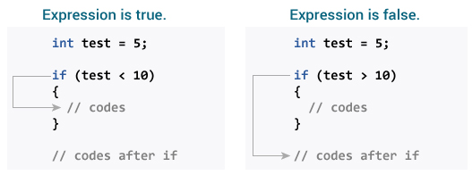
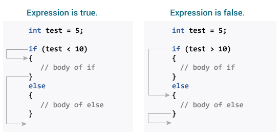

# Java `if`，`if...else`语句

> 原文： [https://www.programiz.com/java-programming/if-else-statement](https://www.programiz.com/java-programming/if-else-statement)

#### 在本教程中，您将在示例的帮助下了解使用 Java `if`和`if...else`语句的 Java 中的控制流语句。

在计算机编程中，通常需要根据指定条件是`true`还是`false`（仅在运行时才知道）执行代码的特定部分。 在这种情况下，将使用控制流语句。

* * *

## Java `if`（`if`）语句

在 Java 中，`if`语句的语法为：

```java
 if (expression) {
    // statements
} 
```

此处`expression`是布尔表达式。 布尔表达式返回`true`或`false`。

*   如果表达式的计算结果为`true`，则将执行`if`主体内的语句（括号内的语句）
*   如果表达式的计算结果为`false`，则将跳过`if`主体内部的语句

* * *

### 语句如何工作？



Working of Java if statement


* * *

### 示例 1：Java `if`语句

```java
class IfStatement {
    public static void main(String[] args) {

        int number = 10;

        // checks if number is greater than 0
        if (number > 0) {
            System.out.println("The number is positive.");
        }
        System.out.println("This statement is always executed.");
    }
} 
```

**输出**：

```java
 The number is positive.
This statement is always executed. 
```

在上面的示例中，我们有一个名为`number`的变量。 这里，测试表达式检查`number`是否大于`0`（`number > 0`）。

由于`number`大于`0`。 因此，测试表达式的求值结果为`true`。 因此，将执行`if`主体内部的代码。

现在，将`number`的值更改为负整数。 假设 -5。

```java
int number = -5; 
```

如果使用新的`number`值运行上述程序，则输出将是：

```java
This statement is always executed. 
```

在此，`number`的值小于`0`。 因此，测试表达式`number > 0`求值为`false`。 因此，执行`if`的主体。

要了解有关测试表达式的更多信息，请访问 [Java 关系运算符](/java-programming/operators#equality-relational "Java Relational Operator")和 [Java 逻辑运算符](/java-programming/operators#logical "Java Logical Operators")。

* * *

## Java `if...else`（`if-else`）语句

如果将测试表达式求值为`true`，则`if`语句将执行代码的特定部分。 但是，如果将测试表达式求值为`false`，则它什么也不做。

在这种情况下，我们可以使用可选的`else`块。 如果将测试表达式求值为`false`，则将执行`else`块体内的语句。 在 Java 中，这称为`if-else`语句。

`if-else`语句的语法为：

```java
if (expression) {
   // codes
}
else {
  // some other code
} 
```

在这里，如果测试表达式为`true`，我们的程序将执行一个任务（如果在块中，则在任务内部），如果测试表达式为`false`，则将执行另一项任务（在`else`块中，在任务内部）。

* * *

### `if...else`语句如何工作？



Working of Java if-else statements


* * *

### 示例 2：Java `if else`语句

```java
class IfElse {
    public static void main(String[] args) {    	
        int number = 10;

        // checks if number is greater than 0	 
        if (number > 0) {
            System.out.println("The number is positive.");
        }
        else {
            System.out.println("The number is not positive.");
        }

        System.out.println("This statement is always executed.");
    }
} 
```

**输出**：:

```java
The number is positive.
This statement is always executed. 
```

在上面的示例中，我们有一个名为`number`变量。 这里，测试表达式检查`number`是否大于`0`（`number > 0`）。

由于`number`的值为`10`，因此测试表达式的值为`true`。 因此，将执行`if`主体内部的代码。

现在，将`number`的值更改为负整数。 假设`-5`。

```java
int number = -5; 
```

如果使用新的`number`值运行程序，则输出为：

```java
The number is not positive.
This statement is always executed. 
```

在此，`number`的值为`-5`。 因此，测试表达式的求值结果为`false`。 因此，将执行`else`主体内部的代码。

* * *

## Java `if..else..if`语句

在 Java 中，我们有一个`if...else...if`梯形图，可用于执行多个其他块之间的一个代码块。

```java
if (expression1) {
   // codes
}
else if(expression2) {
   // codes
}
else if (expression3) {
   // codes
}
.
.
else {
   // codes
} 
```

在这里，`if`语句从上到下执行。 一旦测试表达式为`true`，就会执行`if`语句主体内部的代码。 然后，程序控制跳到`if-else-if`梯形图之外。

如果所有测试表达式均为`false`，则执行`else`主体内部的代码。

* * *

### 示例 3：Java `if..else..if`语句

```java
class Ladder {
    public static void main(String[] args) {   

        int number = 0;

        // checks if number is greater than 0	 
        if (number > 0) {
            System.out.println("The number is positive.");
        }

        // checks if number is less than 0
        else if (number < 0) {
            System.out.println("The number is negative.");
        }
        else {
            System.out.println("The number is 0.");
        } 
    }
} 
```

**输出**：:

```java
The number is 0. 
```

在上面的示例中，我们正在检查`number`是正数，负数还是零。 在这里，我们有两个测试表达式：

*   `number > 0`-检查`number`是否大于`0`
*   `number < 0`-检查`number`是否小于`0`

在此，`number`的值为`0`。 因此，两个测试表达式的求值结果均为`false`。 因此，将执行`else`主体内部的语句。

* * *

## Java 嵌套`if..else`语句

在 Java 中，也可以在`if..else`语句中包含`if..else`语句。 它称为嵌套`if...else`语句。

这是一个查找 3 个数字中最大的一个的程序：

### 示例 4：嵌套`if...else`语句

```java
class Number {
    public static void main(String[] args) {

        // declaring double type variables
        Double n1 = -1.0, n2 = 4.5, n3 = -5.3, largestNumber;

        // checks if n1 is greater than or equal to n2
        if (n1 >= n2) {

            // if...else statement inside the if block
            // checks if n1 is greater than or equal to n3
            if (n1 >= n3) {
                largestNumber = n1;
            }

            else {
                largestNumber = n3;
            }
        }
        else {

            // if..else statement inside else block
            // checks if n2 is greater than or equal to n3
            if (n2 >= n3) {
                largestNumber = n2;
            }

            else {
                largestNumber = n3;
            }
        }

        System.out.println("The largest number is " + largestNumber);
    }
} 
```

**输出**：:

```java
The largest number is 4.5 
```

**注意**：在上面的程序中，我们自己分配了变量的值来简化此操作。 但是，在实际应用中，这些值可能来自用户输入数据，日志文件，表单提交等。

Java 提供了一个称为**三元运算符**的特殊运算符，它是`if..else`语句的**一种简写形式**。 要了解三元运算符，请访问 [Java 三元运算符](/java-programming/ternary-operator "Java Ternary Operator")。