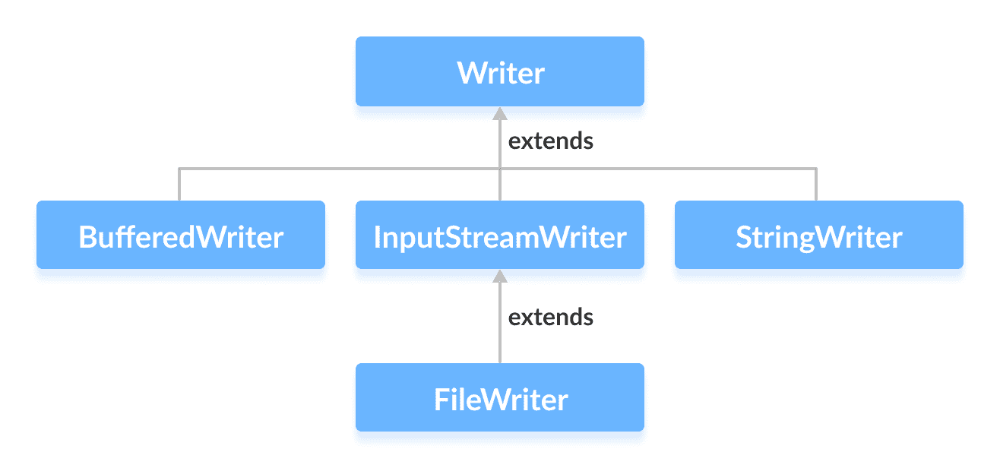

# Java `Writer`类

> 原文： [https://www.programiz.com/java-programming/writer](https://www.programiz.com/java-programming/writer)

#### 在本教程中，我们将通过一个示例学习 Java `Writer`，其子类及其方法。

`java.io`包的`Writer`类是代表字符流的抽象超类。

由于`Writer`是抽象类，因此它本身没有用。 但是，其子类可用于写入数据。

* * *

## `Writer`的子类

为了使用`Writer`的功能，我们可以使用其子类。 他们之中有一些是：

*   [`BufferedWriter`](https://www.programiz.com/java-programming/bufferedwriter)
*   [`OutputStreamWriter`](https://www.programiz.com/java-programming/outputstreamwriter)
*   [`FileWriter`](https://www.programiz.com/java-programming/filewriter)
*   [`StringWriter`](https://www.programiz.com/java-programming/stringwriter)



在下一个教程中，我们将学习所有这些子类。

* * *

## 创建`Writer`

为了创建一个`Writer`，我们必须首先导入`java.io.Writer`包。 导入包后，就可以创建编写器。

```java
// Creates a Writer
Writer output = new FileWriter(); 
```

在这里，我们使用`FileWriter`类创建了一个名为`output`的`writer`。 这是因为`Writer`是抽象类。 因此，我们无法创建`Writer`的对象。

**注意**：我们也可以从`Writer`类的其他子类创建`Writer`。

* * *

## `Writer`的方法

`Writer`类提供了由其子类实现的不同方法。 以下是一些方法：

*   `write(char[] array)`-将指定数组中的字符写入输出流
*   `write(String data)`-将指定的字符串写入编写器
*   `append(char c)`-将指定字符插入当前编写器
*   `flush()`-强制将写入器中存在的所有数据写入相应的目的地
*   `close()`-关闭作者

* * *

## 示例：使用`FileWriter`的`Writer`

这是我们如何使用`FileWriter`类实现`Writer`的方法。

```java
import java.io.FileWriter;
import java.io.Writer;

public class Main {

    public static void main(String args[]) {

        String data = "This is the data in the output file";

        try {
            // Creates a Writer using FileWriter
            Writer output = new FileWriter("output.txt");

            // Writes string to the file
            output.write(data);

            // Closes the writer
            output.close();
        }

        catch (Exception e) {
            e.getStackTrace();
        }
    }
} 
```

在上面的示例中，我们使用`FileWriter`类创建了一个编写器。 编写器与文件`output.txt`链接。

```java
Writer output = new FileWriter("output.txt"); 
```

要将数据写入 **output.txt** 文件，我们已经实现了这些方法。

```java
output.write();      // To write data to the file
output.close();      // To close the writer 
```

当我们运行该程序时， **output.txt** 文件将填充以下内容。

```java
This is a line of text inside the file. 
```

要了解更多信息，请访问 [Java `Writer`（Java 官方文档）](https://docs.oracle.com/javase/7/docs/api/java/io/Writer.html "Java Writer (official Java documentation)")。