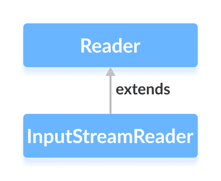

# Java `InputStreamReader`类

> 原文： [https://www.programiz.com/java-programming/inputstreamreader](https://www.programiz.com/java-programming/inputstreamreader)

#### 在本教程中，我们将借助示例学习 Java `InputStreamReader`及其方法。

`java.io`包的`InputStreamReader`类可用于将字节数据转换为字符数据。

它扩展了抽象类`Reader`。



`InputStreamReader`类可与其他输入流一起使用。 它也被称为字节流和字符流之间的桥梁。 这是因为`InputStreamReader`从输入流中读取字节作为字符。

例如，某些字符需要 2 个字节才能存储在存储器中。 要读取此类数据，我们可以使用输入流读取器，该读取器一起读取 2 个字节并将其转换为相应的字符。

* * *

## 创建一个`InputStreamReader`

为了创建一个`InputStreamReader`，我们必须首先导入`java.io.InputStreamReader`包。 导入包后，就可以在这里创建输入流读取器。

```java
// Creates an InputStream
FileInputStream file = new FileInputStream(String path);

// Creates an InputStreamReader
InputStreamReader input = new InputStreamReader(file); 
```

在上面的示例中，我们创建了一个名为`输入`的`InputStreamReader`以及名为`文件`的`FileInputStream`。

在这里，文件中的数据使用某些默认字符编码存储。

但是，我们也可以在文件中指定字符编码的类型（ **UTF8** 或 **UTF16** ）。

```java
// Creates an InputStreamReader specifying the character encoding
InputStreamReader input = new InputStreamReader(file, Charset cs); 
```

在这里，我们使用了`Charset`类来指定文件中的字符编码。

* * *

## `InputStreamReader`的方法

`InputStreamReader`类提供了`Reader`类中存在的不同方法的实现。

### `read()`方法

*   `read()`-从读取器读取单个字符
*   `read(char[] array)`-从读取器读取字符并将其存储在指定的数组中
*   `read(char[] array, int start, int length)`-从读取器中读取等于`length`的字符数，并从`start`开始存储在指定的数组中

例如，假设我们有一个名为`input.txt`的文件，其内容如下。

```java
This is a line of text inside the file. 
```

让我们尝试使用`InputStreamReader`读取此文件。

```java
import java.io.InputStreamReader;
import java.io.FileInputStream;

class Main {
  public static void main(String[] args) {

    // Creates an array of character
    char[] array = new char[100];

    try {
      // Creates a FileInputStream
      FileInputStream file = new FileInputStream("input.txt");

      // Creates an InputStreamReader
      InputStreamReader input = new InputStreamReader(file);

      // Reads characters from the file
      input.read(array);
      System.out.println("Data in the stream:");
      System.out.println(array);

      // Closes the reader
      input.close();
    }

    catch(Exception e) {
      e.getStackTrace();
    }
  }
} 
```

**输出**

```java
Data in the stream:
This is a line of text inside the file. 
```

在上面的示例中，我们使用文件输入流创建了一个输入流读取器。 输入流读取器与文件 **input.txt** 链接。

```java
 FileInputStream file = new FileInputStream("input.txt");
 InputStreamReader input = new InputStreamReader(file); 
```

要从文件中读取字符，我们使用了`read()`方法。

* * *

## `getEncoding()`方法

`getEncoding()`方法可用于获取用于在输入流中存储数据的编码类型。 例如，

```java
import java.io.InputStreamReader;
import java.nio.charset.Charset;
import java.io.FileInputStream;

class Main {
  public static void main(String[] args) {

    try {
      // Creates a FileInputStream
      FileInputStream file = new FileInputStream("input.txt");

      // Creates an InputStreamReader with default encoding
      InputStreamReader input1 = new InputStreamReader(file);

      // Creates an InputStreamReader specifying the encoding
      InputStreamReader input2 = new InputStreamReader(file, Charset.forName("UTF8"));

      // Returns the character encoding of the input stream
      System.out.println("Character encoding of input1: " + input1.getEncoding());
      System.out.println("Character encoding of input2: " + input2.getEncoding());

      // Closes the reader
      input1.close();
      input2.close();
    }

    catch(Exception e) {
      e.getStackTrace();
    }
  }
} 
```

**输出**：

```java
The character encoding of input1: Cp1252
The character encoding of input2: UTF8 
```

在上面的示例中，我们创建了两个输入流读取器，分别名为`input1`和`input2`。

*   `input1`未指定字符编码。 因此，`getEncoding()`方法返回默认字符编码的规范名称。
*   `input2`指定字符编码 **UTF8** 。 因此，`getEncoding()`方法返回指定的字符编码。

**注意**：我们已经使用`Charset.forName()`方法来指定字符编码的类型。 要了解更多信息，请访问 [Java `Charset`（Java 官方文档）](https://docs.oracle.com/javase/7/docs/api/java/nio/charset/Charset.html "Java Charset (official Java documentation)")。

* * *

### `close()`方法

要关闭输入流读取器，我们可以使用`close()`方法。 调用`close()`方法后，我们将无法使用读取器读取数据。

* * *

## `InputStreamReader`的其他方法

| 方法 | 描述 |
| `ready()` | 检查流是否准备好被读取 |
| `mark()` | 标记流中已读取数据的位置 |
| `reset()` | 将控件返回到流中设置标记的点 |

要了解更多信息，请访问 [Java `InputStreamReader`（官方 Java 文档）](https://docs.oracle.com/javase/7/docs/api/java/io/InputStreamReader.html "Java InputStreamReader (official Java documentation)")。