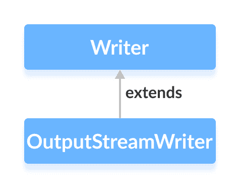

# Java `OutputStreamWriter`类

> 原文： [https://www.programiz.com/java-programming/outputstreamwriter](https://www.programiz.com/java-programming/outputstreamwriter)

#### 在本教程中，我们将借助示例学习 Java `OutputStreamWriter`及其方法。

`java.io`包的`OutputStreamWriter`类可用于将字符形式的数据转换为字节形式的数据。

它扩展了抽象类`Writer`。



`OutputStreamWriter`类可与其他输出流一起使用。 它也被称为字节流和字符流之间的桥梁。 这是因为`OutputStreamWriter`将其字符转换为字节。

例如，某些字符需要 2 个字节才能存储在存储器中。 要写入此类数据，我们可以使用输出流写入器，该输出流写入器将字符转换为相应的字节并将字节存储在一起。

* * *

## 创建一个`OutputStreamWriter`

为了创建一个`OutputStreamWriter`，我们必须首先导入`java.io.OutputStreamWriter`包。 导入包后，就可以创建输出流写入器。

```java
// Creates an OutputStream
FileOutputStream file = new FileOutputStream(String path);

// Creates an OutputStreamWriter
OutputStreamWriter output = new OutputStreamWriter(file); 
```

在上面的示例中，我们创建了一个名为`OutputStreamWriter`的输出以及`FileOutputStream`命名的文件。

在这里，我们使用默认的字符编码将字符写入输出流。

但是，我们可以指定用于写入数据的字符编码类型（**UTF8** 或 **UTF16**）。

```java
// Creates an OutputStreamWriter specifying the character encoding
OutputStreamWriter output = new OutputStreamWriter(file, Charset cs); 
```

在这里，我们使用`Charset`类指定字符编码的类型。

* * *

## `OutputStreamWriter`的方法

`OutputStreamWriter`类提供了`Writer`类中存在的不同方法的实现。

### `write()`方法

*   `write()` - 向编写者写入一个字符
*   `write(char[] array)` - 将指定数组中的字符写入写入器
*   `write(String data)` - 将指定的字符串写入写入器

* * *

### 示例：`OutputStreamWriter`将数据写入文件

```java
import java.io.FileOutputStream;
import java.io.OutputStreamWriter;

public class Main {

  public static void main(String args[]) {

    String data = "This is a line of text inside the file.";

    try {
      // Creates a FileOutputStream
      FileOutputStream file = new FileOutputStream("output.txt");

      // Creates an OutputStreamWriter
      OutputStreamWriter output = new OutputStreamWriter(file);

      // Writes string to the file
      output.write(data);

      // Closes the writer
      output.close();
    }

    catch (Exception e) {
      e.getStackTrace();
    }
  }
} 
```

在上面的示例中，我们使用文件输出流创建了一个输出流读取器。 输出流读取器与`output.txt`文件链接。

```java
FileOutputStream file = new FileOutputStream("output.txt");
OutputStreamWriter output = new OutputStreamWriter(file); 
```

要将数据写入文件，我们使用了`write()`方法。

在这里，当我们运行程序时，`output.txt`文件填充了以下内容。

```java
This is a line of text inside the file. 
```

* * *

## `getEncoding()`方法

`getEncoding()`方法可用于获取用于将数据写入输出流的编码类型。 例如，

```java
import java.io.OutputStreamWriter;
import java.nio.charset.Charset;
import java.io.FileOutputStream;

class Main {
  public static void main(String[] args) {

    try {
      // Creates an output stream
      FileOutputStream file = new FileOutputStream("output.txt");

      // Creates an output stream reader with default encoding
      OutputStreamWriter output1 = new OutputStreamWriter(file);

      // Creates an output stream reader specifying the encoding
      OutputStreamWriter output2 = new OutputStreamWriter(file, Charset.forName("UTF8"));

      // Returns the character encoding of the output stream
      System.out.println("Character encoding of output1: " + output1.getEncoding());
      System.out.println("Character encoding of output2: " + output2.getEncoding());

      // Closes the reader
      output1.close();
      output2.close();
    }

    catch(Exception e) {
      e.getStackTrace();
    }
  }
} 
```

**输出**

```java
The character encoding of output1: Cp1252
The character encoding of output2: UTF8 
```

在上面的示例中，我们创建了两个输出流写入器，分别名为`output1`和`output2`。

*   `output1`未指定字符编码。 因此，`getEncoding()`方法返回默认字符编码。
*   `output2`指定字符编码 **UTF8**。 因此，`getEncoding()`方法返回指定的字符编码。

**注意**：我们已经使用`Charset.forName()`方法来指定字符编码的类型。 要了解更多信息，请访问 [Java `Charset`（Java 官方文档）](https://docs.oracle.com/javase/7/docs/api/java/nio/charset/Charset.html "Java Charset (official Java documentation)")。

* * *

## `close()`方法

要关闭输出流写入器，我们可以使用`close()`方法。 调用`close()`方法后，我们将无法使用写入器来写入数据。

* * *

## `OutputStreamWriter`其他方法

| 方法 | 描述 |
| --- | --- |
| `flush()` | 强制将写入器中存在的所有数据写入相应的目的地 |
| `append()` | 将指定字符插入当前写入器 |

要了解更多信息，请访问 [Java `OutputStreamWriter`（Java 官方文档）](https://docs.oracle.com/javase/7/docs/api/java/io/OutputStreamWriter.html "Java OutputStreamWriter (official Java documentation)")。