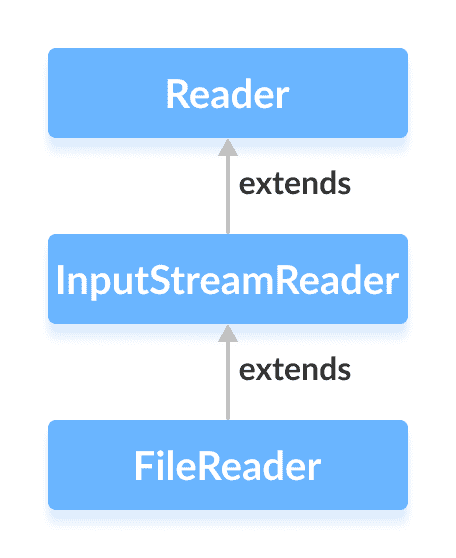

# Java `FileReader`类

> 原文： [https://www.programiz.com/java-programming/filereader](https://www.programiz.com/java-programming/filereader)

#### 在本教程中，我们将借助示例学习 Java `FileReader`及其方法。

`java.io`包的`FileReader`类可用于从文件中读取数据（以字符为单位）。

它扩展了`InputSreamReader`类。



在学习`FileReader`之前，请确保您了解 [Java 文件](/java-programming/files "Java Files ")。

* * *

## 创建一个`FileReader`

为了创建文件读取器，我们必须首先导入`java.io.FileReader`包。 导入包后，就可以创建文件读取器。

**1.使用文件名**

```java
FileReader input = new FileReader(String name); 
```

在这里，我们创建了一个文件读取器，该文件读取器将链接到`名称`指定的文件。

**2.使用文件**的对象

```java
FileReader input = new FileReader(File fileObj); 
```

在这里，我们创建了一个文件读取器，该文件读取器将链接到文件对象指定的文件。

在上面的示例中，文件中的数据使用某些默认字符编码存储。

但是，由于 Java 11，我们也可以在文件中指定字符编码的类型（**UTF-8** 或 **UTF-16**）。

```java
FileReader input = new FileReader(String file, Charset cs); 
```

在这里，我们使用`Charset`类指定文件读取器的字符编码。

* * *

## `FileReader`的方法

`FileReader`类提供了`Reader`类中存在的不同方法的实现。

### `read()`方法

*   `read()`-从读取器读取单个字符
*   `read(char[] array)`-从读取器读取字符并将其存储在指定的数组中
*   `read(char[] array, int start, int length)`-从读取器中读取等于`length`的字符数，并从位置`start`开始存储在指定的数组中

例如，假设我们有一个名为 **input.txt** 的文件，其内容如下。

```java
This is a line of text inside the file. 
```

让我们尝试使用`FileReader`读取文件。

```java
import java.io.FileReader;

class Main {
  public static void main(String[] args) {

    // Creates an array of character
    char[] array = new char[100];

    try {
      // Creates a reader using the FileReader
      FileReader input = new FileReader("input.txt");

      // Reads characters
      input.read(array);
      System.out.println("Data in the file: ");
      System.out.println(array);

      // Closes the reader
      input.close();
    }

    catch(Exception e) {
      e.getStackTrace();
    }
  }
} 
```

**输出**

```java
Data in the file:
This is a line of text inside the file. 
```

在上面的示例中，我们创建了一个名为`输入`的文件读取器。 文件读取器与文件 **input.txt** 链接。

```java
FileInputStream input = new FileInputStream("input.txt"); 
```

为了从文件中读取数据，我们使用了`read()`方法。

* * *

## `getEncoding()`方法

`getEncoding()`方法可用于获取用于在文件中存储数据的编码类型。 例如，

```java
import java.io.FileReader;
import java.nio.charset.Charset;

class Main {
  public static void main(String[] args) {

    try {
      // Creates a FileReader with default encoding
      FileReader input1 = new FileReader("input.txt");

      // Creates a FileReader specifying the encoding
      FileReader input2 = new FileReader("input.txt", Charset.forName("UTF8"));

      // Returns the character encoding of the file reader
      System.out.println("Character encoding of input1: " + input1.getEncoding());
      System.out.println("Character encoding of input2: " + input2.getEncoding());

      // Closes the reader
      input1.close();
      input2.close();
    }

    catch(Exception e) {
      e.getStackTrace();
    }
  }
} 
```

**输出**：

```java
The character encoding of input1: Cp1252
The character encoding of input2: UTF8 
```

在上面的示例中，我们创建了 2 个文件读取器，分别名为`input1`和`input2`。

*   `input1`未指定字符编码。 因此，`getEncoding()`方法返回默认字符编码。
*   `input2`指定字符编码 **UTF8** 。 因此，`getEncoding()`方法返回指定的字符编码。

**注意**：我们已经使用`Charset.forName()`方法来指定字符编码的类型。 要了解更多信息，请访问 [Java `Charset`（Java 官方文档）](https://docs.oracle.com/javase/7/docs/api/java/nio/charset/Charset.html "Java Charset (official Java documentation)")。

* * *

### `close()`方法

要关闭文件读取器，我们可以使用`close()`方法。 调用`close()`方法后，我们将无法使用读取器读取数据。

* * *

## `FileReader`的其他方法

| 方法 | 描述 |
| `ready()` | 检查文件读取器是否准备好阅读 |
| `mark()` | 标记文件读取器中已读取数据的位置 |
| `reset()` | 将控件返回到读取器中设置标记的位置 |

要了解更多信息，请访问 [Java `FileReader`（Java 官方文档）](https://docs.oracle.com/en/java/javase/11/docs/api/java.base/java/io/FileReader.html "Java FileReader (official Java documentation)")。