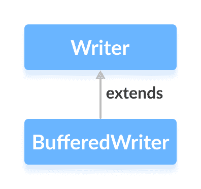

# Java `BufferedWriter`类

> 原文： [https://www.programiz.com/java-programming/bufferedwriter](https://www.programiz.com/java-programming/bufferedwriter)

#### 在本教程中，我们将借助示例学习 Java `BufferedWriter`及其方法。

`java.io`包的`BufferedWriter`类可与其他编写器一起使用，以更有效地写入数据（以字符为单位）。

它扩展了抽象类`Writer`。



* * *

## `BufferedWriter`的工作

`BufferedWriter`维护内部**缓冲区，该缓冲区为 8192 个字符**。

在写操作期间，字符将被写入内部缓冲区而不是磁盘。 一旦缓冲区被填充或写入器被关闭，缓冲区中的所有字符将被写入磁盘。

因此，减少了与磁盘的通信次数。 这就是使用`BufferedWriter`可以更快地写入字符的原因。

* * *

## 创建一个`BufferedWriter`

为了创建一个`BufferedWriter`，我们必须首先导入`java.io.BufferedWriter`包。 导入包后，就可以创建缓冲的编写器了。

```java
// Creates a FileWriter
FileWriter file = new FileWriter(String name);

// Creates a BufferedWriter
BufferedWriter buffer = new BufferedWriter(file); 
```

在上面的示例中，我们使用名为`的文件`创建了名为`缓冲区`的`BufferedWriter`。

此处，`BufferedWriter`的内部缓冲区的默认大小为 8192 个字符。 但是，我们也可以指定内部缓冲区的大小。

```java
// Creates a BufferedWriter with specified size internal buffer
BufferedWriter buffer = new BufferedWriter(file, int size); 
```

缓冲区将有助于更有效地将字符写入文件。

* * *

## `BufferedWriter`的方法

`BufferedWriter`类提供了`Writer`中存在的不同方法的实现。

### `write()`方法

*   `write()`-将单个字符写入编写器的内部缓冲区
*   `write(char[] array)`-将指定数组中的字符写入编写器
*   `write(String data)`-将指定的字符串写入编写器

* * *

### 示例：将数据写入文件的`BufferedWriter`

```java
import java.io.FileWriter;
import java.io.BufferedWriter;

public class Main {

  public static void main(String args[]) {

    String data = "This is the data in the output file";

    try {
      // Creates a FileWriter
      FileWriter file = new FileWriter("output.txt");

      // Creates a BufferedWriter
      BufferedWriter output = new BufferedWriter(file);

      // Writes the string to the file
      output.write(data);

      // Closes the writer
      output.close();
    }

    catch (Exception e) {
      e.getStackTrace();
    }
  }
} 
```

在上面的示例中，我们创建了一个名为`输出`和`FileWriter`的缓冲写入器。 缓冲的编写器与 **output.txt** 文件链接。

```java
FileWriter file = new FileWriter("output.txt");
BufferedWriter output = new BufferedWriter(file); 
```

要将数据写入文件，我们使用了`write()`方法。

在这里，当我们运行程序时， **output.txt** 文件填充了以下内容。

```java
This is a line of text inside the file. 
```

* * *

### `flush()`方法

要清除内部缓冲区，我们可以使用`flush()`方法。 此方法强制编写器将缓冲区中存在的所有数据写入目标文件。

例如，假设我们有一个名为 **output.txt** 的空文件。

```java
import java.io.FileWriter;
import java.io.BufferedWriter;

public class Main {
  public static void main(String[] args) {

    String data = "This is a demo of the flush method";

    try {
      // Creates a FileWriter
      FileWriter file = new FileWriter(" flush.txt");

      // Creates a BufferedWriter
      BufferedWriter output = new BufferedWriter(file);

      // Writes data to the file
      output.write(data);

      // Flushes data to the destination
      output.flush();
      System.out.println("Data is flushed to the file.");

      output.close();
    }

    catch(Exception e) {
      e.getStackTrace();
    }
  }
} 
```

**输出**

```java
Data is flushed to the file. 
```

当我们运行程序时，文件`output.txt`充满了由字符串`data`表示的文本。

* * *

### `close()`方法

要关闭缓冲的写入器，我们可以使用`close()`方法。 调用`close()`方法后，我们将无法使用 writer 来写入数据。

* * *

## `BufferedWriter`的其他方法

| 方法 | 描述 |
| `newLine()` | 向作者插入新行 |
| `append()` | 将指定字符插入当前作者 |

要了解更多信息，请访问 [Java `BufferedWriter`（Java 官方文档）](https://docs.oracle.com/en/java/javase/11/docs/api/java.base/java/io/BufferedWriter.html "Java BufferedWriter (official Java documentation)")。