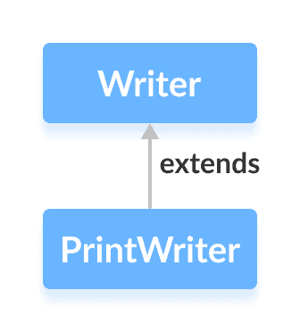

# Java `PrintWriter`类

> 原文： [https://www.programiz.com/java-programming/printwriter](https://www.programiz.com/java-programming/printwriter)

#### 在本教程中，我们将借助示例学习 Java `PrintWriter`及其`print()`和`printf()`方法。

`java.io`包的`PrintWriter`类可用于以通常可读的形式（文本）写入输出数据。

它扩展了抽象类`Writer`。



* * *

## `PrintWriter`的工作

与其他作者不同，`PrintWriter`将原始数据（`int`，`float`，`char`等）转换为文本格式。 然后，它将格式化的数据写入写入器。

另外，`PrintWriter`类不会引发任何输入/输出异常。 相反，我们需要使用`checkError()`方法来查找其中的任何错误。

**注意**：`PrintWriter`类还具有自动刷新功能。 这意味着，如果调用了`println()`或`printf()`方法之一，它将迫使编写器将所有数据写入目标。

* * *

## 创建一个`PrintWriter`

为了创建打印作者，我们必须首先导入`java.io.PrintWriter`包。 导入包后，就可以创建打印`Writer`了。

**1.使用其他编写器**

```java
// Creates a FileWriter
FileWriter file = new FileWriter("output.txt");

// Creates a PrintWriter
PrintWriter output = new PrintWriter(file, autoFlush); 
```

这里，

*   我们已经创建了一个打印书写器，它将数据写入`FileWriter`表示的文件中
*   `autoFlush`是一个可选参数，用于指定是否执行自动刷新

**2.使用其他输出流**

```java
// Creates a FileOutputStream
FileOutputStream file = new FileOutputStream("output.txt");

// Creates a PrintWriter
PrintWriter output = new PrintWriter(file, autoFlush); 
```

Here,

*   我们已经创建了一个打印书写器，它将数据写入`FileOutputStream`表示的文件中
*   `autoFlush`是一个可选参数，用于指定是否执行自动刷新

**3.使用文件名**

```java
// Creates a PrintWriter
PrintWriter output = new PrintWriter(String file, boolean autoFlush); 
```

Here,

*   我们已经创建了一个打印`Writer`，它将数据写入指定的文件
*   `autoFlush`是一个可选的布尔参数，指定是执行自动刷新还是不执行

**注意**：在上述所有情况下，`PrintWriter`使用某种默认的字符编码将数据写入文件。 但是，我们也可以指定字符编码（**UTF8** 或 **UTF16**）。

```java
// Creates a PrintWriter using some character encoding
PrintWriter output = new PrintWriter(String file, boolean autoFlush, Charset cs); 
```

在这里，我们使用`Charset`类指定字符编码。 要了解更多信息，请访问 [Java Charset（Java 官方文档）](https://docs.oracle.com/javase/7/docs/api/java/nio/charset/Charset.html "Java Charset (official Java documentation)")。

* * *

## `PrintWriter`的方法

`PrintWriter`类提供了各种方法，使我们可以将数据打印到输出。

### `print()`方法

*   `print()`-将指定的数据打印到写入器
*   `println()`-将数据以及结尾的换行符打印到写入器

例如，

```java
import java.io.PrintWriter;

class Main {
  public static void main(String[] args) {

    String data = "This is a text inside the file.";

    try {
      PrintWriter output = new PrintWriter("output.txt");

      output.print(data);
      output.close();
    }
    catch(Exception e) {
      e.getStackTrace();
    }
  }
} 
```

在上面的示例中，我们创建了一个名为`output`的打印编写器。 该打印`Writer`与文件`output.txt`链接。

```java
PrintWriter output = new PrintWriter("output.txt"); 
```

要将数据打印到文件，我们使用了`print()`方法。

在这里，当我们运行程序时，`output.txt`文件填充了以下内容。

```java
This is a text inside the file. 
```

* * *

### `printf()`方法

`printf()`方法可用于打印格式化的字符串。 它包含 2 个参数：格式化的字符串和参数。 例如，

```java
printf("I am %d years old", 25); 
```

Here,

*   我`%d`岁，是格式化字符串
*   `%d`是格式化字符串中的整数数据
*   25 是一个参数

格式化的字符串包括文本和数据。 并且，参数替换了格式化字符串中的数据。

因此，`%d`被 **25** 取代。

* * *

### 示例：使用`PrintWriter`的`printf()`方法

```java
import java.io.PrintWriter;

class Main {
  public static void main(String[] args) {

    try {
      PrintWriter output = new PrintWriter("output.txt");

      int age = 25;

      output.printf("I am %d years old.", age);
      output.close();
    }
    catch(Exception e) {
      e.getStackTrace();
    }
  }
} 
```

在上面的示例中，我们创建了一个名为`output`的打印编写器。 打印`Writer`与文件`output.txt`链接。

```java
PrintWriter output = new PrintWriter("output.txt"); 
```

要将格式化的文本打印到文件中，我们使用了`printf()`方法。

Here when we run the program, the`output.txt`file is filled with the following content.

```java
I am 25 years old. 
```

* * *

## `PrintWriter`的其他方法

| 方法 | 描述 |
| `close()` | 关闭印刷`Writer` |
| `checkError()` | 检查编写器中是否有错误，并返回布尔结果 |
| `append()` | 将指定的数据附加到编写器 |

要了解更多信息，请访问 [Java `PrintWriter`（Java 官方文档）](https://docs.oracle.com/en/java/javase/11/docs/api/java.base/java/io/PrintWriter.html "Java PrintWriter (official Java documentation)")。