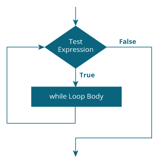
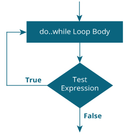

# Java while 和 do ... while 循环

> 原文： [https://www.programiz.com/java-programming/do-while-loop](https://www.programiz.com/java-programming/do-while-loop)

#### 在本教程中，我们将借助示例学习如何在 Java 中使用 while 和 do while 循环，并且还将学习 Loop 在计算机编程中的工作方式

在计算机编程中，循环用于重复特定的代码块，直到满足特定条件（测试表达式为`false`）为止。 例如，

想象一下，我们需要在屏幕上打印一个句子 50 次。 好吧，我们可以通过使用 print 语句 50 次（不使用循环）来做到这一点。 您需要打印一百万次句子怎么样？ 您需要使用循环。 使用循环，我们可以只编写一次 print 语句，然后运行任意次数。

这只是一个简单的示例，显示了循环在计算机编程中的重要性。 Java 中有 3 种类型的循环：[循环](/java-programming/for-loop)，`while`循环和`do-while`循环。

* * *

## Java while 循环

Java 中`while`循环的语法为：

```java
while (testExpression) {
    // codes inside the body of while loop
}
```

### while 循环如何工作？

在以上语法中，括号内的**测试**表达式是布尔表达式。 如果测试表达式的计算结果为`true`，

*   while 循环内的语句被执行。
*   然后，再次评估测试表达式。

该过程一直进行到测试表达式被评估为`false`为止。 如果将测试表达式评估为`false`，

*   `while`循环终止。

* * *

### While 循环流程图

<figure>

<figcaption>Working of while Loop</figcaption>

</figure>

* * *

### 示例 1：while 循环

```java
// Program to print line 10 times

class Loop {
    public static void main(String[] args) {

        int i = 1;

        while (i <= 10) {
            System.out.println("Line " + i);
            ++i;
        }
    }
}
```

**输出**：

```java
Line 1
Line 2
Line 3
Line 4
Line 5
Line 6
Line 7
Line 8
Line 9
Line 10
```

在上面的示例中，我们有一个测试表达式（`i <= 10`）。 它检查 `i` 的值是否小于或等于 10。

在这里，最初 `i` 的值为 1。因此，测试表达式首次求值为`true`。 因此，将执行`while`循环内的 print 语句。

在`while`循环中注意以下语句

```java
 ++i;
```

该语句在每次迭代中将 `i` 的值增加 1。 经过 10 次迭代后， `i` 的值为 11。然后，测试表达式（`i <= 10`）求值为`false`，`while`循环终止。

要了解有关测试表达式及其评估方式的更多信息，请访问 [Java Relational Operator](/java-programming/operators#equality-relational) 和 [Java Logical Operator](/java-programming/operators#logical) 。

* * *

### 示例 2：Java while 循环

```java
// Program to find the sum of natural numbers from 1 to 100.

class AssignmentOperator {
    public static void main(String[] args) {

        int sum = 0, i = 100;

        while (i != 0) {
            sum += i;     // sum = sum + i;
            --i;
        }

        System.out.println("Sum = " + sum);
    }
}
```

**Output**:

```java
Sum = 5050
```

这里，我们有两个变量`和`和 `i` ，其初始值分别为 0 和 100。

在`while`循环的每次迭代中，

*   `总和`变量被分配了值：`sum + i`
*   `i` 的值减少 1

循环继续进行，直到 `i` 的值等于 0。为实现更好的可视化效果，

```java
1st iteration: i = 100, sum = 0+100 = 100, and  --i = 99
2nd iteration: i = 99, sum = 100+99 = 199, and --i = 98
3rd iteration: i = 98, sum = 199+98 = 297, and --i = 97
... .. ...
... .. ...
99th iteration: i = 2, sum = 5047+2 = 5049, and --i = 1
100th iteration: i = 1, sum = 5049+1 = 5050, and --i = 0
```

* * *

## Java 做... while 循环

`do...while`循环类似于`while`循环，但有一个按键差异。 在检查测试表达式之前，`do...while`循环的主体将执行一次。

这是`do...while`循环的语法。

```java
do {
   // codes inside body of do while loop
} while (testExpression);
```

* * *

### ... while 循环如何工作？

`do...while`循环的主体执行一次（在检查测试表达式之前）。 只有这样，才检查测试表达式。

如果将测试表达式评估为`true`，则执行循环体内的代码，然后再次评估测试表达式。 这个过程一直进行到测试表达式被评估为`false`为止。

当测试表达式为`false`时，`do..while`循环终止。

* * *

### do ... while 循环流程图

<figure>

<figcaption>Working of do...while Loop</figcaption>

</figure>

* * *

### 示例 3：do ... while 循环

下面的程序计算用户输入的数字总和，直到用户输入 0。

为了接受用户的输入，我们使用了`Scanner`对象。 要了解有关`Scanner`的更多信息，请访问 [Java Scanner](/java-programming/scanner) 。

```java
import java.util.Scanner;

class Sum {
    public static void main(String[] args) {

        Double number, sum = 0.0;
        // creates an object of Scanner class
        Scanner input = new Scanner(System.in);

        do {

            // takes input from the user
            System.out.print("Enter a number: ");
            number = input.nextDouble();
            sum += number;
        } while (number != 0.0);  // test expression

        System.out.println("Sum = " + sum);
    }
}
```

**Output**:

```java
Enter a number: 2.5
Enter a number: 23.3
Enter a number: -4.2
Enter a number: 3.4
Enter a number: 0
Sum = 25.0
```

* * *

### 无限 while 循环

在使用循环时，我们应始终小心。 这是因为，如果我们错误地设置了测试表达式以使其永远不会为假，则`while`和`do...while`循环将永远运行。

这称为无限`while`和`do...while`循环。 例如，

```java
// Infinite while loop
while (true) {
   // body of while loop
}
```

再举一个例子

```java
// Infinite while loop
int i = 100;
while (i == 100) {
   System.out.print("Hey!");
}
```

无限`do...while`循环的工作方式与`while`循环类似。