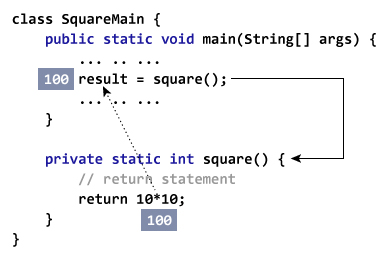
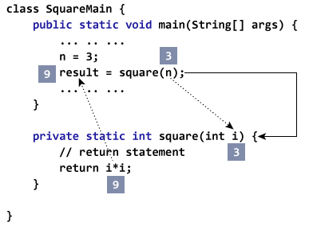

# Java 方法

> 原文： [https://www.programiz.com/java-programming/methods](https://www.programiz.com/java-programming/methods)

#### 在本教程中，您将借助示例学习 Java 方法，如何定义方法以及如何在 Java 程序中使用方法。

## 什么是方法？

在数学中，我们可能已经研究过函数。 例如，`f(x) = x<sup>2</sup>`是返回`x`平方值的函数。

```java
If x = 2, then f(2) = 4
If x = 3, f(3) = 9
and so on.
```

同样，在计算机编程中，功能是执行特定任务的代码块。

在面向对象的编程中，该方法是用于功能的术语。 方法绑定到类，并且它们定义类的行为。

在学习方法之前，请确保了解 [Java 类和对象](/java-programming/class-objects "Java Class and Objects")。

* * *

## Java 方法的类型

根据用户定义的方法还是标准库中可用的方法，Java 中有两种类型的方法：

*   标准库方法
*   用户定义的方法

* * *

## 标准库方法

标准库方法是 Java 中的内置方法，可以随时使用。 这些标准库与 Java 类库（JCL）一起提供，并带有 JVM 和 JRE 在 Java 存档（`*.jar`）文件中。

例如，

*   `print()`是`java.io.PrintSteam`的方法。`print("...")`方法将字符串打印在引号内。
*   `sqrt()`是`Math`类的方法。 它返回数字的平方根。

这是一个工作示例：

```java
public class Main {
    public static void main(String[] args) {

        // using the sqrt() method
        System.out.print("Square root of 4 is: " + Math.sqrt(4));
    }
}
```

**输出**：

```java
Square root of 4 is: 2.0
```

* * *

## 用户定义的方法

我们还可以创建自己选择的方法来执行某些任务。 这种方法称为用户定义方法。

### 如何创建用户定义的方法？

这是我们如何用 Java 创建方法的方法：

```java
public static void myMethod() {
    System.out.println("My Function called");
}
```

在这里，我们创建了一个名为`myMethod()`的方法。 我们可以看到我们在方法名称之前使用了`public`，`static`和`void`。

*   `public`-访问修饰符。 这意味着可以从任何地方访问该方法。 要了解更多信息，请访问 [Java 访问修饰符](/java-programming/access-modifiers "Java Access Modifier")
*   `static`-这意味着可以在没有任何对象的情况下访问该方法。 要了解更多信息，请访问 [Java 静态关键字](/java-programming/static-keyword "Java static Keyword")。
*   `void`-这意味着该方法不返回任何值。 我们将在本教程的后面部分进一步了解此内容。

这是我们如何创建方法的简单示例。 但是，Java 中方法定义的完整语法为：

```java
modifier static returnType nameOfMethod (parameters) {
    // method body
}
```

这里，

*   **修饰符**-它定义访问方法是公共方法，私有方法等。
*   **静态**-如果使用`static`关键字，则可以在不创建对象的情况下对其进行访问。

    例如，标准[数学类](https://docs.oracle.com/javase/8/docs/api/java/lang/Math.html "Math class")的`sqrt()`方法是静态的。 因此，我们可以直接调用`Math.sqrt()`，而无需创建`Math`类的实例。
*   **returnType** -它指定方法返回的值的类型。例如，如果某个方法具有`int`返回类型，则它返回一个整数值。

    一种方法可以返回本机​​数据类型（`int`，`float`，`double`等），本机对象（`String`，`Map`，`List`等）或任何其他 内置和用户定义的对象。

    如果该方法未返回值，则其返回类型为`void`。
*   **nameOfMethod** -它是[标识符](/java-programming/keywords-identifiers#identifiers "Java Identifier")，用于引用程序中的特定方法。

    我们可以给方法起任何名字。 但是，以它执行的任务命名是更常规的做法。 例如，`calculateArea()`，`display()`等。

*   **参数（自变量）**-这些是传递给方法的值。 我们可以将任意数量的参数传递给方法。
*   **方法主体**-它包括用于执行某些任务的编程语句。 方法主体包含在花括号`{ }`中。

* * *

## 如何调用 Java 方法？

现在我们知道了如何定义方法，我们需要学习使用它们。 为此，我们必须调用该方法。 这是如何做

```java
myMethod();
```

该语句调用先前声明的`myMethod()`方法。


Working of the method call in Java


1.  在执行程序代码时，它在代码中遇到`myFunction();`。
2.  然后执行分支到`myFunction()`方法，并在该方法体内执行代码。
3.  在执行方法主体之后，程序将返回到原始状态，并在方法调用之后执行下一条语句。

* * *

## 示例：Java 方法

让我们看看如何在 Java 程序中使用方法。

```java
class Main {

    public static void main(String[] args) {
        System.out.println("About to encounter a method.");

        // method call
        myMethod();

        System.out.println("Method was executed successfully!");
    }

    // method definition
    private static void myMethod(){
        System.out.println("Printing from inside myMethod()!");
    }
}
```

**Output**:

```java
About to encounter a method.
Printing from inside myMethod().
Method was executed successfully!
```

在上面的程序中，我们有一个名为`myMethod()`的方法。 该方法不接受任何参数。 同样，该方法的返回类型为`void`（意味着不返回任何值）。

在此，方法为`static`。 因此，我们在未创建类的对象的情况下调用了该方法。

再来看一个例子

```java
class Main {

    public static void main(String[] args) {

        // create object of the Output class
        Output obj = new Output();
        System.out.println("About to encounter a method.");

        // calling myMethod() of Output class
        obj.myMethod();

        System.out.println("Method was executed successfully!");
    }
}

class Output {

    // public: this method can be called from outside the class
    public void myMethod() {
        System.out.println("Printing from inside myMethod().");
    }
}
```

**Output**:

```java
About to encounter a method.
Printing from inside myMethod().
Method was executed successfully!
```

在上面的示例中，我们创建了一个名为`myMethod()`的方法。 该方法位于名为`Output`的类中。

由于该方法不是`static`，因此使用类的对象`obj`进行调用。

```java
obj.myMethod();
```

* * *

## 方法参数和返回值

如前所述，Java 方法可以具有零个或多个参数。 并且，它也可能返回一些值。

### 示例：方法返回值

让我们以返回值的方法为例。

```java
class SquareMain {
    public static void main(String[] args) {
        int result;

        // call the method and store returned value
        result = square(); 
        System.out.println("Squared value of 10 is: " + result);
    }

    public static int square() {
        // return statement
        return 10 * 10;
    }
}
```

**Output**:

```java
Squared value of 10 is: 100
```

在上面的程序中，我们创建了一个名为`square()`的方法。 此方法不接受任何参数，并返回值`10 *10`。

在这里，我们将方法的返回类型称为`int`。 因此，该方法应始终返回整数值。



Representation of a method returning a value


如我们所见，此方法的范围是有限的，因为它总是返回相同的值。 现在，让我们修改上面的代码片段，以使它始终返回传递给该方法的任何整数的平方值，而不是始终返回平方值 10。

* * *

### 示例：方法接受参数并返回值

```java
public class Main {

    public static void main(String[] args) {
        int result, n;

        n = 3;
        result = square(n);
        System.out.println("Square of 3 is: " + result);

        n = 4;
        result = square(n); 
        System.out.println("Square of 4 is: " + result);
    }

    // method 
    static int square(int i) {
        return i * i;
    }
}
```

**Output**:

```java
Squared value of 3 is: 9
Squared value of 4 is: 16
```

这里，`square(`）方法接受参数`i`并返回`i`的平方。 返回的值存储在变量`结果`中。



Passing arguments and returning a value from a method in Java


如果我们传递任何其他数据类型而不是`int`，则编译器将引发错误。 这是因为 Java 是一种强类型语言。

在方法调用期间传递给`getSquare()`方法的参数`n`被称为实际参数。

```java
result = getSquare(n);
```

方法定义接受的参数`i`被称为形式参数。 形式参数的类型必须显式键入。

```java
public static int square(int i) {...}
```

我们还可以使用逗号将多个参数传递给 Java 方法。 例如，

```java
public class Main {

    // method definition
    public static int getIntegerSum (int i, int j) {
        return i + j;
    }

    // method definition
    public static int multiplyInteger (int x, int y) {
        return x * y;
    }

    public static void main(String[] args) {

        // calling methods
        System.out.println("10 + 20 = " + getIntegerSum(10, 20));
        System.out.println("20 x 40 = " + multiplyInteger(20, 40));
    }
}
```

**Output**:

```java
10 + 20 = 30
20 x 40 = 800
```

**注意**：实际参数和形式参数的数据类型应匹配，即，第一个实际参数的数据类型应与第一个形式参数的类型匹配。 同样，第二个实际参数的类型必须与第二个形式参数的类型匹配，依此类推。

* * *

## 使用方法的优点是什么？

1.主要优点是**代码可重用性**。 我们可以编写一次方法，然后多次使用。 我们不必每次都覆盖整个代码。 可以将其视为“一次编写，多次重用”。 例如，

```java
public class Main {

    // method defined
    private static int getSquare(int x){
        return x * x;
    }

    public static void main(String[] args) {
        for (int i = 1; i <= 5; i++) {

            // method call
            int result = getSquare(i);
            System.out.println("Square of " + i + " is: " + result);
        }
    }
}
```

**Output**:

```java
Square of 1 is: 1
Square of 2 is: 4
Square of 3 is: 9
Square of 4 is: 16
Square of 5 is: 25
```

在上面的程序中，我们创建了名为`getSquare()`的方法来计算数字的平方。 在这里，使用相同的方法来计算小于 6 的数字的平方。

因此，我们一次又一次地使用相同的方法。

2.方法使代码**更具可读性，并且**更易于调试。 例如，`getSquare()`方法非常易读，以至于我们可以知道此方法将计算数字的平方。