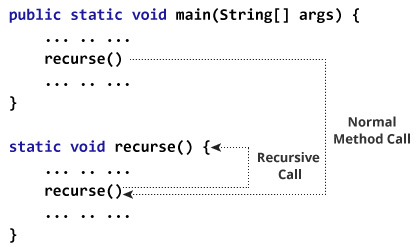
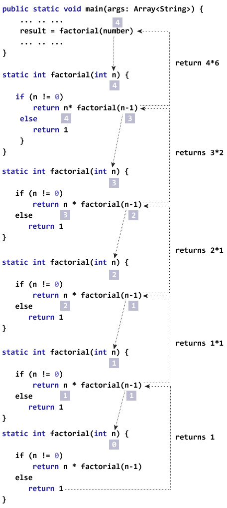

# Java 递归

> 原文： [https://www.programiz.com/java-programming/recursion](https://www.programiz.com/java-programming/recursion)

#### 在本教程中，您将学习 Java 递归函数及其优缺点。

在 Java 中，调用自身的[方法](/java-programming/methods "Java Methods")被称为递归方法。 并且，此过程称为递归。

一个物理世界的例子是放置两个相互面对的平行反射镜。 它们之间的任何对象都将递归地反映出来。

* * *

### 递归如何工作？



Working of Java Recursion


在上面的示例中，我们从`main`方法内部调用了`recurse()`方法。 （正常方法调用）。 并且，在`recurse()`方法内部，我们再次调用相同的`recurse`方法。 这是一个递归调用。

为了停止递归调用，我们需要在方法内部提供一些条件。 否则，该方法将被无限调用。

因此，我们使用[`if...else`语句](/java-programming/if-else-statement "Java if...else")（或类似方法）来终止方法内部的递归调用。

* * *

## 示例：使用递归的阶乘

```java
class Factorial {

    static int factorial( int n ) {
        if (n != 0)  // termination condition
            return n * factorial(n-1); // recursive call
        else
            return 1;
    }

    public static void main(String[] args) {
        int number = 4, result;
        result = factorial(number);
        System.out.println(number + " factorial = " + result);
    }
}
```

**输出**：

```java
4 factorial = 24
```

在上面的示例中，我们有一个名为`factorial()`的方法。 从`main()`方法中调用`factorial()`。`number`变量作为参数传递。

在这里，请注意以下声明：

```java
return n * factorial(n-1);
```

`factorial()`方法正在调用自身。 最初，`factorial()`内部的 n 值为 4。 在下一个递归调用期间，将 3 传递给`factorial()`方法。 该过程一直持续到`n`等于 0。

当`n`等于 0 时，`if`语句返回`false`，因此返回 1。 最后，累积的结果将传递给`main()`方法。

* * *

## 析因程序的工作

下图将使您更好地了解如何使用递归执行阶乘程序。



Factorial Program using Recursion


* * *

## 递归的优缺点

进行递归调用时，将在栈上分配新的变量存储位置。 随着每个递归调用的返回，旧的变量和参数将从栈中删除。 因此，递归通常使用更多的内存，并且通常很慢。

另一方面，递归解决方案要简单得多，并且花费更少的时间来编写，调试和维护。

推荐阅读：[递归的优缺点是什么？](https://stackoverflow.com/questions/5250733/what-are-the-advantages-and-disadvantages-of-recursion)