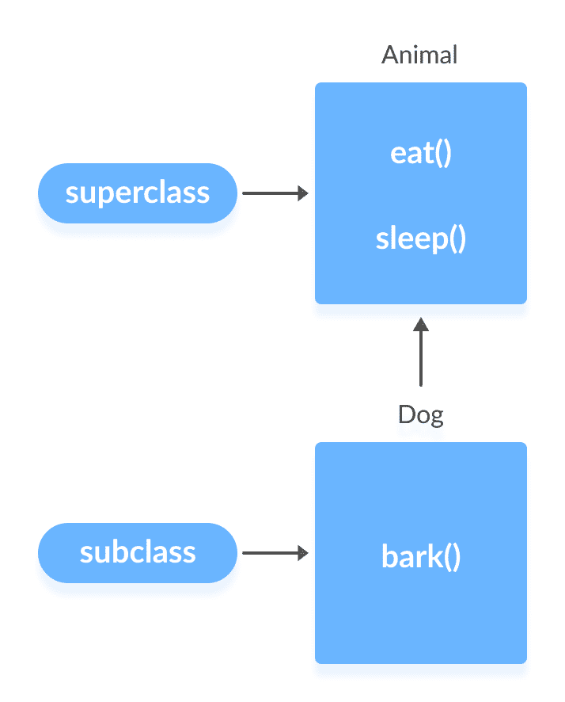
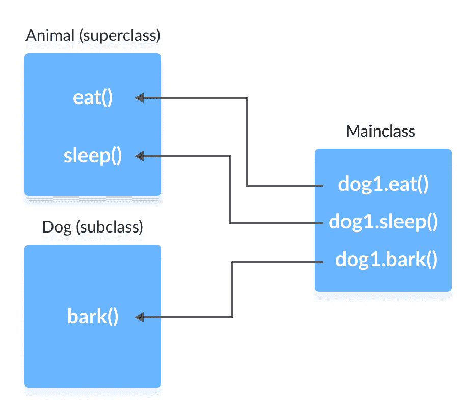

# Java 继承

> 原文： [https://www.programiz.com/java-programming/inheritance](https://www.programiz.com/java-programming/inheritance)

#### 在本教程中，我们将借助示例学习 Java 中的继承。

继承是 OOP（面向对象编程）的关键功能之一，它使我们能够从现有类中定义一个新类。 例如，

```java
class Animal
{
    // eat() method
    // sleep() method
}
class Dog extends Animal
{
    // bark() method
} 
```

在 Java 中，我们使用`extends`关键字从类继承。 在这里，我们从`Animal`类继承了`Dog`类。

`Animal`是超类（父类或基类），`Dog`是子类（子类或派生类）。 子类继承超类的字段和方法。



* * *

## IS-A 关系

继承是 **is-a** 关系。 仅当两个类之间存在 **is-a** 关系时才使用继承。

这里有些例子：

*   汽车就是车辆。
*   橙色是一种水果。
*   外科医生是医生。
*   狗是动物。

* * *

### 示例 1：Java 继承

```java
class Animal {

   public void eat() {
      System.out.println("I can eat");
   }

   public void sleep() {
      System.out.println("I can sleep");
   }
}

class Dog extends Animal {
   public void bark() {
      System.out.println("I can bark");
   }
}

class Main {
   public static void main(String[] args) {

      Dog dog1 = new Dog();

      dog1.eat();
      dog1.sleep();

      dog1.bark();
   }
} 
```

**输出**

```java
I can eat
I can sleep
I can bark 
```

在这里，我们从超类`Animal`继承了子类`Dog`。`Dog`类继承了`Animal`类的方法`eat()`和`sleep()`。

因此，`Dog`类的对象可以访问`Dog`类和`Animal`类的成员。



* * *

## 受保护的关键字

在先前的教程中，我们了解了`private`和`public`访问修饰符。

*   `private`成员只能在班级内访问
*   `public`成员可以从任何地方访问

您还可以分配方法和字段`protected`。 受保护的成员可以访问

*   从班级内部
*   在其子类中
*   在同一包装内

这是可以访问访问修饰符的摘要。

|   | 类 | 包 | 子类 | 全局 |
| --- | --- | --- | --- | --- |
| `public` | Yes | Yes | Yes | Yes |
| `private` | Yes | No | No | No |
| `protected` | Yes | Yes | Yes | No |

* * *

### 示例 2：受保护的关键字

```java
class Animal {
   protected String type;
   private String color;

   public void eat() {
      System.out.println("I can eat");
   }

   public void sleep() {
      System.out.println("I can sleep");
   }

   public String getColor(){
      return color;
   }

   public void setColor(String col){
      color = col;
   }
}

class Dog extends Animal {
   public void displayInfo(String c){
      System.out.println("I am a " + type);
      System.out.println("My color is " + c);
   }
   public void bark() {
      System.out.println("I can bark");
   }
}

class Main {
   public static void main(String[] args) {

      Dog dog1 = new Dog();
      dog1.eat();
      dog1.sleep();
      dog1.bark();

      dog1.type = "mammal";
      dog1.setColor("black");
      dog1.displayInfo(dog1.getColor()); 
   }
} 
```

**输出**：

```java
I can eat
I can sleep
I can bark
I am a mammal
My color is black 
```

在此，`Animal`类内部的`type`字段受到保护。 我们已经使用`Main`类访问了此字段，

```java
dog1.type = "mammal";
```

可能是因为`Animal`和`Main`类都在同一包（同一文件）中。

* * *

## Java 方法覆盖

从上面的示例中，我们知道子类的对象也可以访问其超类的方法。

**如果在超类和子类中定义了相同的方法，会发生什么？**

好吧，在这种情况下，子类中的方法将覆盖超类中的方法。 例如，

### 示例 3：方法覆盖示例

```java
class Animal {
   protected String type = "animal";

   public void eat() {
      System.out.println("I can eat");
   }

   public void sleep() {
      System.out.println("I can sleep");
   }
}

class Dog extends Animal {

   @Override
   public void eat() {
      System.out.println("I eat dog food");
   }

   public void bark() {
      System.out.println("I can bark");
   }
}

class Main {
   public static void main(String[] args) {

      Dog dog1 = new Dog();
      dog1.eat();
      dog1.sleep();
      dog1.bark();
   }
} 
```

**输出**：

```java
I eat dog food
I can sleep
I can bark 
```

在此，`eat()`存在于超类`Animal`和子类`Dog`中。 我们创建了子类`Dog`的对象`dog1`。

当我们使用`dog1`对象调用`eat()`时，将调用`Dog`内部的方法，而不会调用相同的超类方法。 这称为方法覆盖。

在上面的程序中，我们使用了`@Override`注解来告诉编译器我们正在覆盖方法。 但是，这不是强制性的。 在下一个教程中，我们将详细了解[方法覆盖](/java-programming/method-overriding "Java Method Overriding")。

如果需要从其子类中调用`Animal`的`eat()`方法，则可以使用`super`关键字。

### 示例 4：`super`关键字

```java
class Animal {
   public Animal() {
     System.out.println("I am an Animal");
   }

   public void eat() {
     System.out.println("I can eat");
   }
}

class Dog extends Animal {
   public Dog(){
      super();
      System.out.println("I am a dog");
   }

  @Override
  public void eat() {
     super.eat();
     System.out.println("I eat dog food");
  }

   public void bark() {
      System.out.println("I can bark");
   }
}

class Main {
   public static void main(String[] args) {
      Dog dog1 = new Dog();

      dog1.eat();
      dog1.bark();
   }
} 
```

**输出**：

```java
I am an Animal
I am a dog
I can eat
I eat dog food
I can bark 
```

在这里，我们使用`super`关键字使用`super()`调用构造器。 此外，我们使用`super.eat()`调用了`Animal`超类的`eat()`方法。

请注意，在调用构造器和方法时，`super`的用法有所不同。 要了解更多信息，请访问 [Java `super`关键字](/java-programming/super-keyword "Java super Keyword") **。**

* * *

## 继承类型

继承有五种类型。

*   **单一继承** - 类`B`仅从类`A`扩展。
*   **多级继承** - 类`B`从类`A`扩展而来； 然后`C`类从`B`类扩展。
*   **层次继承** - 类`A`充当类`B`，`C`和`D`的超类。
*   **多重继承** - 类`C`从接口`A`和`B`扩展。
*   **混合继承** - 两种或更多种继承的混合。

Java 不支持通过类的多重继承和混合继承。 但是，我们可以通过接口在 Java 中实现多重继承。 我们将在后面的章节中了解接口。

* * *

## 为什么要使用继承？

*   最重要的用途是代码的可重用性。 父类中存在的代码无需在子类中再次编写。
*   通过方法覆盖实现运行时多态。 在后面的章节中，我们将学习有关多态的更多信息。