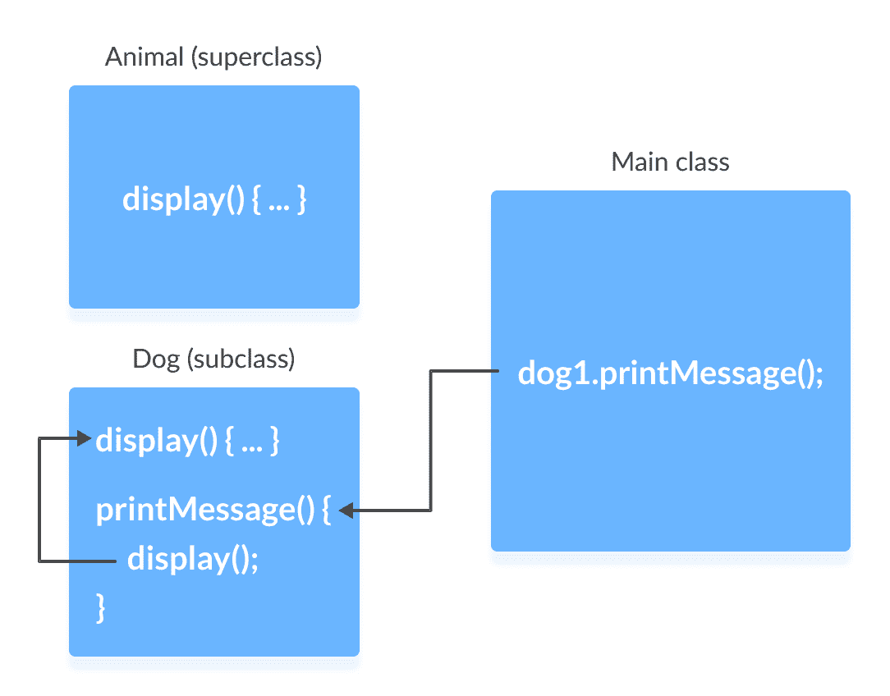
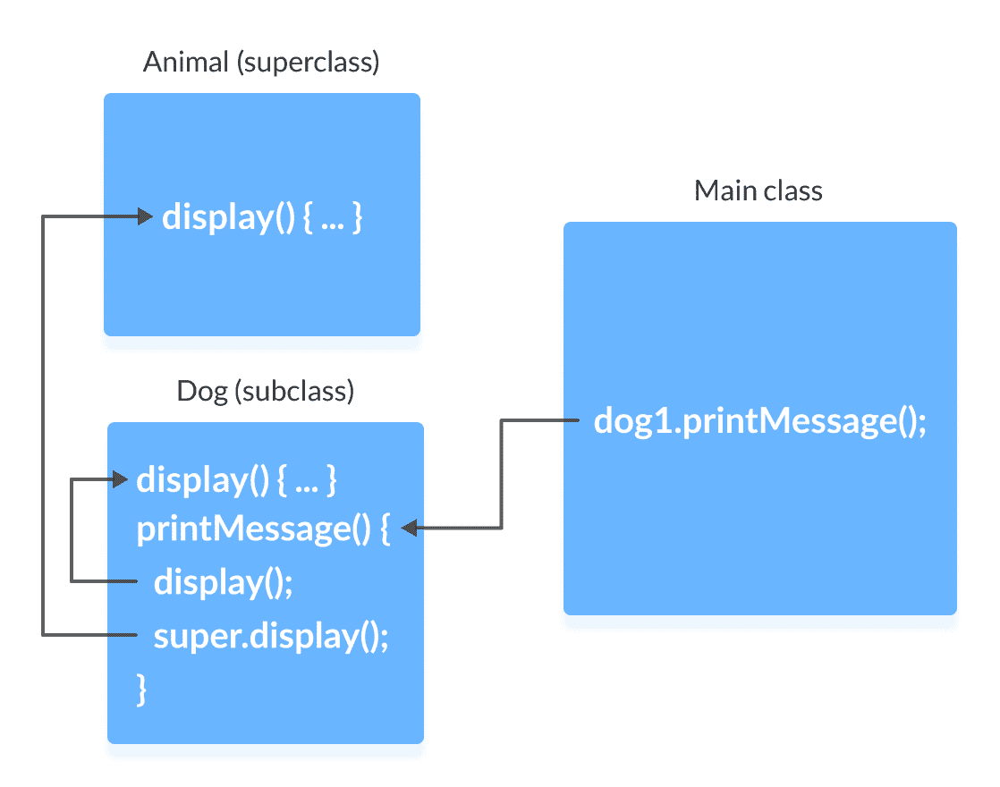
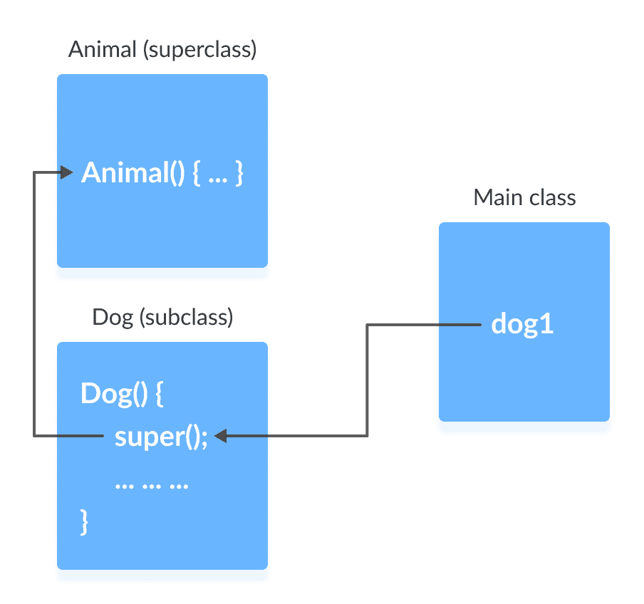
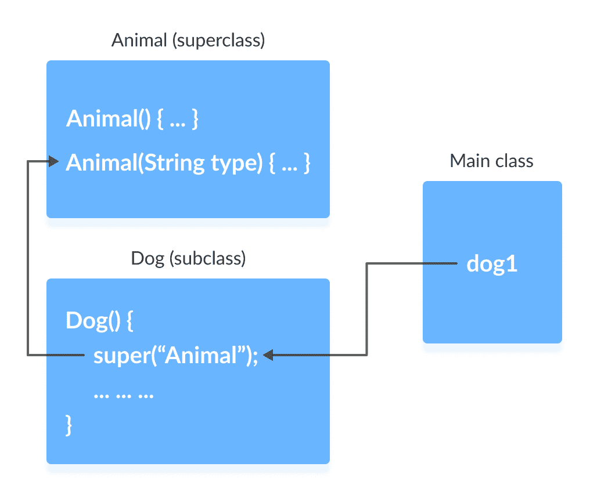

# Java `super`

> 原文： [https://www.programiz.com/java-programming/super-keyword](https://www.programiz.com/java-programming/super-keyword)

#### 在本教程中，我们将借助示例学习 Java 中的`super`关键字。

Java 中的`super`关键字在子类中用于访问超类成员（属性，构造器和方法）。

在学习`super`关键字之前，请确保了解 [Java 继承](/java-programming/inheritance "Java inheritance")。

* * *

## `super`关键字的用途

1.  调用在子类中覆盖的超类的方法。
2.  如果超类和子类都具有相同名称的属性，则访问超类的属性（字段）。
3.  从子类构造器中显式调用超类无参（默认）或参数化构造器。

让我们了解其中的每种用法。

* * *

## 1.超类的访问覆盖方法

如果在超类和子类中都定义了相同名称的方法，则子类中的方法将覆盖超类中的方法。 这称为[方法覆盖](/java-programming/method-overriding "Java Method Overriding")的方法。

### 示例 1：方法覆盖

```java
class Animal {

  // overridden method
  public void display(){
    System.out.println("I am an animal");
  }
}

class Dog extends Animal {

  // overriding method
  @Override
  public void display(){
    System.out.println("I am a dog");
  }

  public void printMessage(){
    display();
  }
}

class Main {
  public static void main(String[] args) {
    Dog dog1 = new Dog();
    dog1.printMessage();
  }
} 
```

**输出**

```java
I am a dog 
```

在此示例中，通过使`Dog`类的对象`dog1`，我们可以调用其方法`printMessage()`，该方法然后执行`display()`语句。

由于在两个类中都定义了`display()`，因此`Dog`子类的方法将覆盖`Animal`超类的方法。 因此，将调用子类的`display()`。



**如果必须调用超类的覆盖方法怎么办？**

如果需要调用超类`Animal`的覆盖方法`display()`，则使用`super.display()`。

### 示例 2：超级调用超类方法

```java
class Animal {

  // overridden method
  public void display(){
    System.out.println("I am an animal");
  }
}

class Dog extends Animal {

  // overriding method
  @Override
  public void display(){
    System.out.println("I am a dog");
  }

  public void printMessage(){

    // this calls overriding method
    display();

    // this calls overridden method
    super.display();
  }
}

class Main {
  public static void main(String[] args) {
    Dog dog1 = new Dog();
    dog1.printMessage();
  }
} 
```

**Output**

```java
I am a dog
I am an animal 
```

在这里，上述程序是如何工作的。



* * *

## 2.超类的访问属性

超类和子类可以具有相同名称的属性。 我们使用`super`关键字访问超类的属性。

### 示例 3：访问超类属性

```java
class Animal {
  protected String type="animal";
}

class Dog extends Animal {
  public String type="mammal";

  public void printType() {
    System.out.println("I am a " + type);
    System.out.println("I am an " + super.type);
  }
}

class Main {
  public static void main(String[] args) {
    Dog dog1 = new Dog();
    dog1.printType();
  }
} 
```

**输出**：

```java
I am a mammal
I am an animal 
```

在此示例中，我们在超类`Animal`和子类`Dog`中都定义了相同的实例字段`type`。

然后，我们创建了`Dog`类的对象`dog1`。 然后，使用该对象调用`printType()`方法。

在`printType()`函数内，

*   `type`是指子类`Dog`的属性。
*   `super.type`是超类`Animal`的属性。

因此，`System.out.println("I am a " + type);`打印`I am a mammal`。 而且，`System.out.println("I am an " + super.type);`打印`I am an animal`。

* * *

## 3.使用`super()`访问超类构造器

众所周知，创建类的对象时，将自动调用其默认构造器。

要从子类构造器中显式调用超类构造器，我们使用`super()`。 这是`super`关键字的一种特殊形式。

`super()`仅可在子类构造器中使用，并且必须是第一条语句。

### 示例 4：使用`super()`

```java
class Animal {

  // default or no-arg constructor of class Animal
  Animal() {
    System.out.println("I am an animal");
  }
}

class Dog extends Animal {

  // default or no-arg constructor of class Dog
  Dog() {

    // calling default constructor of the superclass
    super();

    System.out.println("I am a dog");
  }
}

class Main {
  public static void main(String[] args) {
    Dog dog1 = new Dog();
  }
} 
```

**输出**

```java
I am an animal
I am a dog 
```

在这里，当创建`Dog`类的对象`dog1`时，它将自动调用该类的默认或无参数构造器。

在子类构造器中，`super()`语句调用超类的构造器并在其中执行该语句。 因此，我们得到输出<samp>我是动物</samp>。



然后，程序流返回到子类构造器，并执行其余的语句。 因此，将打印<samp>我是狗</samp>。

但是，不是必须使用`super()`。 即使在子类构造器中未使用`super()`，编译器也会隐式调用超类的默认构造器。

**那么，如果编译器自动调用`super()`，为什么还要使用冗余代码？**

如果必须从子类构造器中调用超类的**参数化构造器（带有参数的构造器）**，则是必需的。

参数化的`super()`必须始终是子类的构造器主体中的第一条语句，否则，将出现编译错误。

### 示例 5：使用`super()`调用参数化构造方法

```java
class Animal {

  // default or no-arg constructor
  Animal() {
    System.out.println("I am an animal");
  }

  // parameterized constructor
  Animal(String type) {
    System.out.println("Type: "+type);
  }
}

class Dog extends Animal {

  // default constructor
  Dog() {

    // calling parameterized constructor of the superclass
    super("Animal");

    System.out.println("I am a dog");
  }
}

class Main {
  public static void main(String[] args) {
    Dog dog1 = new Dog();
  }
} 
```

**Output**

```java
Type: Animal
I am a dog 
```

编译器可以自动调用无参构造器。 但是，它不能调用参数化的构造器。

如果必须调用参数化的构造器，则需要在子类构造器中显式定义它。



请注意，在上面的示例中，我们显式调用了参数化构造器`super("Animal")`。 在这种情况下，编译器不会调用超类的默认构造器。